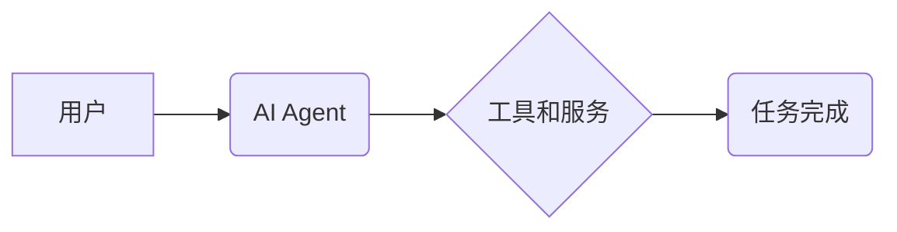

> AI Agent,大模型应用,工具调用,API接口,自动化,流程化,效率提升

## 1. 背景介绍

在人工智能领域蓬勃发展的今天，大模型已经展现出强大的能力，能够处理复杂的任务，生成高质量的文本、图像和代码。然而，仅仅拥有强大的模型能力还不够，我们需要将这些能力转化为实际应用，为用户提供有价值的服务。

这时，AI Agent就应运而生。AI Agent是一种能够自主执行任务的智能代理，它可以根据用户的指令或环境变化，调用各种工具和服务，完成复杂的业务流程。

## 2. 核心概念与联系

**2.1 AI Agent**

AI Agent是一种能够感知环境、做出决策并执行行动的智能体。它可以是软件程序、机器人或其他形式的智能系统。

**2.2 工具调用**

工具调用是AI Agent的核心能力之一，它允许Agent访问和利用外部工具和服务，扩展自身的功能。

**2.3 API接口**

API接口（Application Programming Interface）是软件系统之间通信的标准接口。通过API接口，AI Agent可以与各种工具和服务进行交互，调用其功能。

**2.4 流程化**

流程化是指将任务分解成一系列步骤，并定义每个步骤的执行逻辑。AI Agent可以通过流程化的方式，将复杂的业务流程分解成可执行的步骤，并调用相应的工具完成每个步骤。

**2.5 自动化**

自动化是指通过程序或脚本自动执行任务，减少人工干预。AI Agent可以通过工具调用和流程化，实现对任务的自动化执行，提高效率。

**2.6 架构图**



## 3. 核心算法原理 & 具体操作步骤

**3.1 算法原理概述**

AI Agent调用工具的算法原理主要基于以下几个方面：

* **任务分解:** 将复杂的业务任务分解成一系列可执行的步骤。
* **工具识别:** 识别需要调用的工具和服务。
* **API调用:** 使用API接口调用工具和服务的功能。
* **结果处理:** 处理工具返回的结果，并根据结果执行后续步骤。

**3.2 算法步骤详解**

1. **任务接收:** AI Agent接收用户的指令或环境变化的通知。
2. **任务分解:** 将任务分解成一系列步骤，并为每个步骤指定相应的工具和服务。
3. **工具识别:** 根据任务步骤，识别需要调用的工具和服务。
4. **API调用:** 使用API接口调用工具和服务的相应功能，并传递必要的参数。
5. **结果处理:** 处理工具返回的结果，并根据结果执行后续步骤。
6. **反馈机制:** 将任务执行结果反馈给用户，并根据用户反馈进行调整和优化。

**3.3 算法优缺点**

**优点:**

* **扩展性强:** 可以调用各种工具和服务，扩展AI Agent的功能。
* **自动化程度高:** 可以实现对任务的自动化执行，提高效率。
* **可定制性强:** 可以根据不同的任务需求，定制不同的工具调用流程。

**缺点:**

* **依赖外部工具:** AI Agent的性能和功能依赖于外部工具的质量和稳定性。
* **接口兼容性问题:** 不同的工具和服务可能使用不同的API接口，需要进行适配。
* **安全风险:** 调用外部工具可能会带来安全风险，需要进行安全防护。

**3.4 算法应用领域**

* **自动化办公:** 自动化邮件发送、文档处理、数据分析等任务。
* **客户服务:** 自动化客服机器人，提供24小时在线服务。
* **软件开发:** 自动化代码生成、测试、部署等任务。
* **数据科学:** 自动化数据采集、清洗、分析等任务。

## 4. 数学模型和公式 & 详细讲解 & 举例说明

**4.1 数学模型构建**

我们可以使用状态机模型来描述AI Agent的工具调用过程。

* 状态: 表示AI Agent当前执行的任务状态。
* 事件: 表示AI Agent接收到的外部事件，例如用户指令、环境变化等。
* 转移: 表示AI Agent根据事件改变状态的规则。
* 行动: 表示AI Agent执行的具体操作，例如调用工具、发送消息等。

**4.2 公式推导过程**

状态转移公式:

```
S(t+1) = f(S(t), E(t))
```

其中:

* S(t) 表示AI Agent在时间t的当前状态。
* E(t) 表示AI Agent在时间t接收到的事件。
* f() 表示状态转移函数，根据当前状态和事件，决定AI Agent下一个状态。

**4.3 案例分析与讲解**

例如，一个AI Agent用于自动回复邮件。

* 状态: 等待邮件、处理邮件、发送回复。
* 事件: 接收新邮件、邮件处理完成。
* 转移: 
    * 等待邮件 -> 处理邮件: 接收新邮件事件触发。
    * 处理邮件 -> 发送回复: 邮件处理完成事件触发。
* 行动: 
    * 处理邮件: 调用邮件解析工具，提取邮件内容。
    * 发送回复: 调用邮件发送工具，发送回复邮件。

## 5. 项目实践：代码实例和详细解释说明

**5.1 开发环境搭建**

* Python 3.x
* pip 安装必要的库，例如requests、json等。

**5.2 源代码详细实现**

```python
import requests

def call_api(url, params):
    """调用API接口"""
    response = requests.get(url, params=params)
    response.raise_for_status()  # 检查请求是否成功
    return response.json()

def process_email(email_content):
    """处理邮件内容"""
    # 使用自然语言处理工具解析邮件内容
    # ...
    return reply_text

def send_email(to_address, subject, body):
    """发送邮件回复"""
    # 使用邮件发送工具发送邮件
    # ...

def main():
    # 接收新邮件事件
    new_email_event()
    # 处理邮件内容
    reply_text = process_email(email_content)
    # 发送邮件回复
    send_email(to_address, subject, reply_text)

if __name__ == "__main__":
    main()
```

**5.3 代码解读与分析**

* `call_api()` 函数用于调用API接口，传入URL和参数，返回API返回的JSON数据。
* `process_email()` 函数用于处理邮件内容，可以调用自然语言处理工具进行解析，生成回复文本。
* `send_email()` 函数用于发送邮件回复，可以调用邮件发送工具发送邮件。
* `main()` 函数是程序入口，接收新邮件事件，调用其他函数处理邮件内容并发送回复。

**5.4 运行结果展示**

当程序运行时，会监听新邮件事件，收到新邮件后，会自动调用`process_email()`函数处理邮件内容，并调用`send_email()`函数发送回复邮件。

## 6. 实际应用场景

**6.1 自动化办公**

AI Agent可以自动处理邮件、文档、数据等办公任务，提高工作效率。例如，可以自动回复邮件、生成会议纪要、整理数据报表等。

**6.2 客户服务**

AI Agent可以作为客服机器人，提供24小时在线服务，解答用户问题，处理简单的客户请求。例如，可以回答常见问题、预约服务、处理订单等。

**6.3 软件开发**

AI Agent可以自动化软件开发流程，例如代码生成、测试、部署等。例如，可以根据需求自动生成代码模板、自动执行单元测试、自动部署代码到服务器等。

**6.4 未来应用展望**

随着大模型和AI技术的不断发展，AI Agent的应用场景将会更加广泛，例如：

* **个性化学习:** AI Agent可以根据用户的学习进度和需求，自动推荐学习资源，提供个性化学习辅导。
* **智能家居:** AI Agent可以控制智能家居设备，例如灯光、空调、音响等，提供更加智能化的家居体验。
* **医疗辅助:** AI Agent可以辅助医生诊断疾病、制定治疗方案，提高医疗效率和准确性。

## 7. 工具和资源推荐

**7.1 学习资源推荐**

* **书籍:**
    * 《Reinforcement Learning: An Introduction》
    * 《Artificial Intelligence: A Modern Approach》
* **在线课程:**
    * Coursera: Reinforcement Learning Specialization
    * Udacity: AI Programming with Python

**7.2 开发工具推荐**

* **Python:** 广泛使用的编程语言，适合开发AI Agent。
* **TensorFlow:** 深度学习框架，可以用于训练大模型。
* **PyTorch:** 深度学习框架，与TensorFlow类似。
* **OpenAI API:** 提供各种大模型API，可以方便地调用大模型功能。

**7.3 相关论文推荐**

* **《Attention Is All You Need》**
* **《BERT: Pre-training of Deep Bidirectional Transformers for Language Understanding》**
* **《GPT-3: Language Models are Few-Shot Learners》**

## 8. 总结：未来发展趋势与挑战

**8.1 研究成果总结**

AI Agent技术已经取得了显著的进展，能够完成越来越复杂的任务，并应用于越来越多的领域。

**8.2 未来发展趋势**

* **更强大的模型:** 大模型的不断发展将为AI Agent提供更强大的能力。
* **更智能的决策:** AI Agent的决策能力将更加智能，能够更好地理解用户需求和环境变化。
* **更广泛的应用:** AI Agent的应用场景将更加广泛，渗透到生活的各个方面。

**8.3 面临的挑战**

* **安全风险:** AI Agent的调用工具可能会带来安全风险，需要加强安全防护。
* **伦理问题:** AI Agent的决策可能会涉及伦理问题，需要进行伦理规范的制定和监管。
* **可解释性:** AI Agent的决策过程可能难以解释，需要提高AI Agent的可解释性。

**8.4 研究展望**

未来，AI Agent技术将继续发展，朝着更智能、更安全、更可解释的方向发展。


## 9. 附录：常见问题与解答

**9.1 如何选择合适的工具？**

选择合适的工具需要根据具体的任务需求和场景进行考虑。可以参考工具的文档、评价和案例，选择功能强大、稳定可靠的工具。

**9.2 如何处理工具调用失败的情况？**

在工具调用过程中，可能会出现失败的情况，例如网络连接问题、API接口错误等。需要设计相应的错误处理机制，例如重试调用、记录错误日志、通知管理员等。

**9.3 如何保证AI Agent的安全性？**

需要采取多种措施保证AI Agent的安全性，例如：

* 使用安全的API接口和认证机制。
* 对用户输入进行过滤和验证。
* 定期更新工具和系统，修复安全漏洞。
* 进行安全测试和渗透测试。


作者：禅与计算机程序设计艺术 / Zen and the Art of Computer Programming 
<end_of_turn>