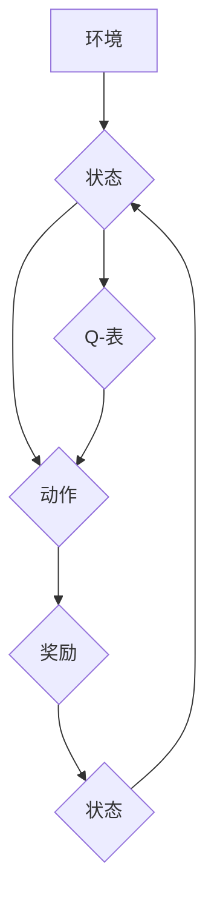

> Q-learning, 强化学习, 算法原理, 数学模型, 代码实现, 应用场景

## 1. 背景介绍

在人工智能领域，强化学习 (Reinforcement Learning, RL) 作为一种模仿人类学习方式的算法，近年来取得了显著进展，并在机器人控制、游戏 AI、推荐系统等领域展现出强大的应用潜力。其中，Q-learning 作为 RL 的经典算法之一，以其简单易懂、易于实现的特点，成为了研究和应用的热点。

Q-learning 算法的核心思想是通过学习一个 Q 表 (Q-table)，该表记录了在每个状态下采取每个动作的期望回报。通过不断地与环境交互，更新 Q 表中的值，最终学习出最优策略，使智能体在环境中获得最大的累积回报。

## 2. 核心概念与联系

**2.1 核心概念**

* **状态 (State):** 智能体所处的环境状况，例如游戏中的棋盘位置、机器人手臂的姿态等。
* **动作 (Action):** 智能体可以采取的行动，例如在游戏中移动棋子、机器人手臂伸缩等。
* **奖励 (Reward):** 智能体在采取某个动作后获得的反馈，可以是正向奖励 (例如完成任务) 或负向奖励 (例如碰撞障碍物)。
* **策略 (Policy):** 智能体在不同状态下选择动作的规则，可以是确定性策略 (deterministic policy) 或随机策略 (stochastic policy)。
* **价值函数 (Value Function):** 评估智能体在特定状态下采取特定动作的长期回报的能力。

**2.2 核心算法架构**



**2.3 核心概念联系**

Q-learning 算法的核心是学习一个 Q 表，该表记录了在每个状态下采取每个动作的期望回报。智能体通过与环境交互，不断更新 Q 表中的值，最终学习出最优策略，使智能体在环境中获得最大的累积回报。

## 3. 核心算法原理 & 具体操作步骤

**3.1 算法原理概述**

Q-learning 算法基于动态规划的思想，通过迭代更新 Q 表中的值，学习出最优策略。其核心思想是：

* 在每个状态下，选择动作的期望回报等于该动作对应的 Q 值。
* Q 值的更新规则是基于 Bellman 方程，即 Q 值等于当前 Q 值加上学习率 (learning rate) 乘以奖励加上折扣因子 (discount factor) 乘以下一个状态的 Q 值。

**3.2 算法步骤详解**

1. 初始化 Q 表，将所有 Q 值设置为 0。
2. 选择一个初始状态。
3. 在当前状态下，根据策略选择一个动作。
4. 执行动作，观察环境的反馈，获得奖励和下一个状态。
5. 更新 Q 值：

```
Q(s, a) = Q(s, a) + α * [r + γ * max(Q(s', a')) - Q(s, a)]
```

其中：

* Q(s, a) 是当前状态 s 下采取动作 a 的 Q 值。
* α 是学习率，控制着 Q 值更新的幅度。
* r 是获得的奖励。
* γ 是折扣因子，控制着未来回报的权重。
* s' 是下一个状态。
* a' 是下一个状态下采取的动作，选择最大 Q 值对应的动作。

6. 重复步骤 3-5，直到 Q 表收敛或达到预设的迭代次数。

**3.3 算法优缺点**

**优点:**

* 简单易懂，易于实现。
* 可以应用于离散状态和动作空间的强化学习问题。
* 能够学习出最优策略。

**缺点:**

* 随着状态和动作空间的增加，Q 表的规模会指数级增长，导致计算复杂度高。
* 对于连续状态和动作空间的问题，Q-learning 难以直接应用。

**3.4 算法应用领域**

Q-learning 算法在以下领域具有广泛的应用：

* **游戏 AI:** 训练游戏 AI 策略，例如 AlphaGo、DeepMind 的 Atari 游戏 AI。
* **机器人控制:** 训练机器人执行复杂任务，例如导航、抓取、组装等。
* **推荐系统:** 建立用户个性化推荐系统，例如电影推荐、商品推荐等。
* **医疗诊断:** 辅助医生进行疾病诊断，例如根据患者症状预测疾病类型。

## 4. 数学模型和公式 & 详细讲解 & 举例说明

**4.1 数学模型构建**

Q-learning 算法的核心数学模型是 Q 值函数，它定义了智能体在特定状态下采取特定动作的期望回报。

**4.2 公式推导过程**

Q 值函数的更新规则是基于 Bellman 方程，其推导过程如下：

```
Q(s, a) = Q(s, a) + α * [r + γ * max(Q(s', a')) - Q(s, a)]
```

其中：

* Q(s, a) 是当前状态 s 下采取动作 a 的 Q 值。
* α 是学习率，控制着 Q 值更新的幅度。
* r 是获得的奖励。
* γ 是折扣因子，控制着未来回报的权重。
* s' 是下一个状态。
* a' 是下一个状态下采取的动作，选择最大 Q 值对应的动作。

**4.3 案例分析与讲解**

假设一个智能体在玩一个简单的游戏，游戏中有两个状态 (s1, s2) 和两个动作 (a1, a2)。

* 状态 s1: 智能体在游戏起点。
* 状态 s2: 智能体到达游戏终点。
* 动作 a1: 向右移动。
* 动作 a2: 向左移动。

初始 Q 值为：

* Q(s1, a1) = 0
* Q(s1, a2) = 0
* Q(s2, a1) = 0
* Q(s2, a2) = 0

智能体从状态 s1 开始，采取动作 a1，获得奖励 r = 1，进入状态 s2。

根据 Q 值更新规则，更新 Q 值：

* Q(s1, a1) = 0 + α * [1 + γ * max(Q(s2, a1), Q(s2, a2)) - 0]

假设学习率 α = 0.1，折扣因子 γ = 0.9，则 Q(s1, a1) 更新为：

* Q(s1, a1) = 0.1 * [1 + 0.9 * max(0, 0)] = 0.1

重复上述过程，智能体不断与环境交互，更新 Q 值，最终学习出最优策略，例如始终采取动作 a1，从起点到达终点。

## 5. 项目实践：代码实例和详细解释说明

**5.1 开发环境搭建**

* Python 3.x
* NumPy
* Matplotlib

**5.2 源代码详细实现**

```python
import numpy as np

# 定义环境
class Environment:
    def __init__(self):
        self.state = 0

    def step(self, action):
        if action == 0:  # 向右移动
            self.state = 1
            reward = 1
        else:  # 向左移动
            self.state = 0
            reward = -1
        return self.state, reward

# 定义 Q-learning 算法
class QLearning:
    def __init__(self, learning_rate=0.1, discount_factor=0.9, epsilon=0.1):
        self.learning_rate = learning_rate
        self.discount_factor = discount_factor
        self.epsilon = epsilon
        self.q_table = np.zeros((2, 2))

    def choose_action(self, state):
        if np.random.uniform(0, 1) < self.epsilon:
            return np.random.choice(2)
        else:
            return np.argmax(self.q_table[state, :])

    def update_q_table(self, state, action, reward, next_state):
        self.q_table[state, action] += self.learning_rate * (
            reward + self.discount_factor * np.max(self.q_table[next_state, :]) - self.q_table[state, action]
        )

# 主程序
if __name__ == "__main__":
    env = Environment()
    agent = QLearning()

    for episode in range(1000):
        state = env.state
        while state != 1:
            action = agent.choose_action(state)
            next_state, reward = env.step(action)
            agent.update_q_table(state, action, reward, next_state)
            state = next_state

    print("Q-table:")
    print(agent.q_table)
```

**5.3 代码解读与分析**

* `Environment` 类定义了游戏环境，包括状态和动作。
* `QLearning` 类实现了 Q-learning 算法，包括 Q 值表、学习率、折扣因子和探索率。
* `choose_action` 方法根据 epsilon-greedy 策略选择动作。
* `update_q_table` 方法根据 Bellman 方程更新 Q 值表。
* 主程序模拟了智能体与环境交互的过程，并打印最终的 Q 值表。

**5.4 运行结果展示**

运行代码后，会输出 Q 值表，其中 Q 值代表了在每个状态下采取每个动作的期望回报。

## 6. 实际应用场景

**6.1 游戏 AI**

Q-learning 算法被广泛应用于游戏 AI 的训练，例如 AlphaGo、DeepMind 的 Atari 游戏 AI。

**6.2 机器人控制**

Q-learning 算法可以训练机器人执行复杂任务，例如导航、抓取、组装等。

**6.3 推荐系统**

Q-learning 算法可以用于建立用户个性化推荐系统，例如电影推荐、商品推荐等。

**6.4 医疗诊断**

Q-learning 算法可以辅助医生进行疾病诊断，例如根据患者症状预测疾病类型。

**6.5 未来应用展望**

随着人工智能技术的不断发展，Q-learning 算法将在更多领域得到应用，例如自动驾驶、金融交易、自然语言处理等。

## 7. 工具和资源推荐

**7.1 学习资源推荐**

* **书籍:**
    * Reinforcement Learning: An Introduction by Richard S. Sutton and Andrew G. Barto
    * Deep Reinforcement Learning Hands-On by Maxim Lapan
* **在线课程:**
    * Coursera: Reinforcement Learning Specialization by David Silver
    * Udacity: Deep Reinforcement Learning Nanodegree

**7.2 开发工具推荐**

* **Python:** 广泛用于强化学习开发，拥有丰富的库和工具。
* **TensorFlow:** 深度学习框架，可以用于构建和训练强化学习模型。
* **PyTorch:** 深度学习框架，与 TensorFlow 类似，但更加灵活。

**7.3 相关论文推荐**

* Q-Learning: Watkins, C. J. C. H. (1989).
* Deep Q-Network: Mnih, V., Kavukcuoglu, K., Silver, D., Rusu, A. A., Veness, J., Bellemare, M. G., ... & Hassabis, D. (2015).

## 8. 总结：未来发展趋势与挑战

**8.1 研究成果总结**

Q-learning 算法作为强化学习的经典算法，取得了显著的成果，在游戏 AI、机器人控制、推荐系统等领域得到了广泛应用。

**8.2 未来发展趋势**

* **深度强化学习:** 将深度神经网络与 Q-