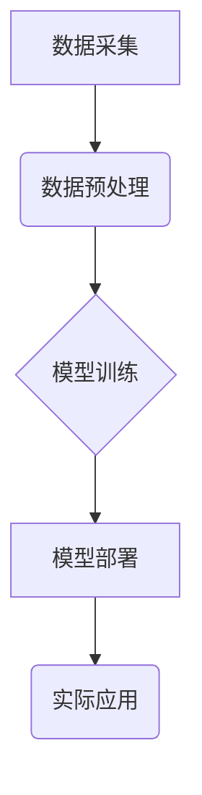

> 深度学习，农业科技，图像识别，预测模型，智能农业，数据分析，机器学习

## 1. 背景介绍

农业，作为人类文明的基石，一直以来都面临着诸多挑战，例如：气候变化、资源短缺、病虫害爆发等。传统农业生产方式往往依赖于经验和人力，效率低下，难以应对日益严峻的挑战。近年来，随着人工智能技术的飞速发展，深度学习作为人工智能的重要分支，为农业科技带来了新的机遇。

深度学习算法能够从海量数据中自动提取特征，并建立复杂的映射关系，从而实现对农业生产过程的智能化管理和优化。例如，利用深度学习技术可以实现精准的作物识别、病虫害检测、产量预测等，从而提高农业生产效率，降低生产成本，促进农业可持续发展。

## 2. 核心概念与联系

**2.1 深度学习在农业科技中的应用**

深度学习在农业科技中的应用主要集中在以下几个方面：

* **图像识别:** 利用深度学习算法对农业图像进行识别，例如识别作物种类、病虫害类型、土壤状况等。
* **预测模型:** 建立深度学习模型，对农业生产过程进行预测，例如预测作物产量、病虫害发生概率、天气变化等。
* **智能农业:** 利用深度学习技术构建智能农业系统，实现对农业生产过程的自动化管理和优化，例如自动浇水、施肥、除草等。

**2.2 深度学习技术架构**

深度学习技术架构通常由以下几个部分组成：

* **数据采集:** 收集农业生产过程中的各种数据，例如图像、传感器数据、气候数据等。
* **数据预处理:** 对采集到的数据进行清洗、转换、特征提取等预处理操作。
* **模型训练:** 利用深度学习算法对预处理后的数据进行训练，建立深度学习模型。
* **模型部署:** 将训练好的深度学习模型部署到实际应用场景中，例如部署到无人机、机器人、智能农场等设备上。



## 3. 核心算法原理 & 具体操作步骤

**3.1 算法原理概述**

深度学习算法的核心原理是利用多层神经网络来模拟人类大脑的学习过程。神经网络由多个神经元组成，每个神经元都连接着其他神经元，并通过权重来控制信号的传递。通过对大量数据进行训练，神经网络可以自动学习到数据的特征和规律，从而实现对数据的预测和分类。

**3.2 算法步骤详解**

深度学习算法的训练过程通常包括以下几个步骤：

1. **初始化:** 初始化神经网络的权重和偏置。
2. **前向传播:** 将输入数据通过神经网络进行前向传播，计算输出结果。
3. **损失函数计算:** 计算输出结果与真实值的误差，即损失函数的值。
4. **反向传播:** 利用梯度下降算法，反向传播误差信号，更新神经网络的权重和偏置。
5. **迭代训练:** 重复步骤2-4，直到损失函数收敛。

**3.3 算法优缺点**

**优点:**

* **自动特征提取:** 深度学习算法能够自动从数据中提取特征，无需人工特征工程。
* **高精度:** 深度学习算法在许多任务中能够达到很高的精度。
* **可扩展性:** 深度学习算法可以处理海量数据，并可以扩展到多个领域。

**缺点:**

* **数据依赖:** 深度学习算法需要大量的训练数据。
* **计算资源:** 深度学习算法的训练需要大量的计算资源。
* **可解释性:** 深度学习模型的决策过程难以解释。

**3.4 算法应用领域**

深度学习算法在农业科技领域有着广泛的应用，例如：

* **作物识别:** 利用深度学习算法识别不同种类的作物，例如小麦、玉米、大豆等。
* **病虫害检测:** 利用深度学习算法检测作物上的病虫害，例如叶斑病、蚜虫等。
* **产量预测:** 利用深度学习算法预测作物的产量，例如小麦产量、玉米产量等。
* **精准农业:** 利用深度学习算法实现精准农业，例如精准施肥、精准灌溉等。

## 4. 数学模型和公式 & 详细讲解 & 举例说明

**4.1 数学模型构建**

深度学习模型通常采用多层感知机 (MLP) 或卷积神经网络 (CNN) 等结构。

* **多层感知机 (MLP):** MLP 由多个全连接层组成，每个层的神经元都连接着上一层的每个神经元。

* **卷积神经网络 (CNN):** CNN 利用卷积层和池化层来提取图像特征。卷积层通过卷积核对图像进行卷积运算，提取图像局部特征。池化层对卷积层的输出进行降维，减少计算量。

**4.2 公式推导过程**

深度学习模型的训练过程基于梯度下降算法。梯度下降算法的目标是找到一个最优的权重和偏置，使得模型的损失函数最小。

损失函数通常采用均方误差 (MSE) 或交叉熵 (Cross-Entropy) 等。

**4.3 案例分析与讲解**

例如，在作物识别任务中，我们可以使用 CNN 模型来识别不同种类的作物。

训练数据包括不同种类的作物图像及其对应的标签。

模型训练过程如下：

1. 将图像数据输入 CNN 模型。
2. CNN 模型提取图像特征。
3. 将提取的特征输入全连接层，进行分类。
4. 计算模型的输出结果与真实标签的误差，即损失函数的值。
5. 利用梯度下降算法，反向传播误差信号，更新 CNN 模型的权重和偏置。
6. 重复步骤1-5，直到损失函数收敛。

## 5. 项目实践：代码实例和详细解释说明

**5.1 开发环境搭建**

* 操作系统: Ubuntu 20.04
* Python 版本: 3.8
* 深度学习框架: TensorFlow 2.0

**5.2 源代码详细实现**

```python
import tensorflow as tf

# 定义 CNN 模型
model = tf.keras.models.Sequential([
    tf.keras.layers.Conv2D(32, (3, 3), activation='relu', input_shape=(224, 224, 3)),
    tf.keras.layers.MaxPooling2D((2, 2)),
    tf.keras.layers.Conv2D(64, (3, 3), activation='relu'),
    tf.keras.layers.MaxPooling2D((2, 2)),
    tf.keras.layers.Flatten(),
    tf.keras.layers.Dense(10, activation='softmax')
])

# 编译模型
model.compile(optimizer='adam',
              loss='sparse_categorical_crossentropy',
              metrics=['accuracy'])

# 训练模型
model.fit(x_train, y_train, epochs=10)

# 评估模型
loss, accuracy = model.evaluate(x_test, y_test)
print('Loss:', loss)
print('Accuracy:', accuracy)
```

**5.3 代码解读与分析**

* 代码首先定义了一个 CNN 模型，包含卷积层、池化层和全连接层。
* 然后，模型被编译，指定了优化器、损失函数和评估指标。
* 接着，模型被训练，使用训练数据进行训练。
* 最后，模型被评估，使用测试数据评估模型的性能。

**5.4 运行结果展示**

训练完成后，可以查看模型的训练过程和评估结果。

## 6. 实际应用场景

**6.1 作物识别**

利用深度学习技术可以实现对不同作物种类的识别，例如识别小麦、玉米、大豆等。

**6.2 病虫害检测**

利用深度学习技术可以检测作物上的病虫害，例如叶斑病、蚜虫等。

**6.3 产量预测**

利用深度学习技术可以预测作物的产量，例如小麦产量、玉米产量等。

**6.4 未来应用展望**

深度学习技术在农业科技领域的应用前景广阔，未来可能应用于以下领域：

* **精准农业:** 利用深度学习技术实现精准农业，例如精准施肥、精准灌溉等。
* **无人驾驶农业:** 利用深度学习技术实现无人驾驶农业，例如无人驾驶拖拉机、无人驾驶喷洒机等。
* **农业机器人:** 利用深度学习技术开发农业机器人，例如采摘机器人、播种机器人等。

## 7. 工具和资源推荐

**7.1 学习资源推荐**

* **书籍:**
    * 深度学习
    * 深度学习实战
* **在线课程:**
    * Coursera 深度学习课程
    * Udacity 深度学习工程师 Nanodegree

**7.2 开发工具推荐**

* **深度学习框架:** TensorFlow, PyTorch
* **图像处理库:** OpenCV

**7.3 相关论文推荐**

* **深度学习在农业中的应用综述**
* **基于深度学习的作物识别方法**
* **基于深度学习的病虫害检测方法**

## 8. 总结：未来发展趋势与挑战

**8.1 研究成果总结**

深度学习技术在农业科技领域取得了显著的成果，例如在作物识别、病虫害检测、产量预测等方面取得了较高的精度。

**8.2 未来发展趋势**

未来，深度学习技术在农业科技领域的应用将更加广泛，例如：

* **更精准的农业管理:** 利用深度学习技术实现更精准的农业管理，例如精准施肥、精准灌溉等。
* **更智能的农业机器人:** 开发更智能的农业机器人，例如采摘机器人、播种机器人等。
* **更可持续的农业生产:** 利用深度学习技术提高农业生产效率，降低资源消耗，促进农业可持续发展。

**8.3 面临的挑战**

深度学习技术在农业科技领域的应用也面临着一些挑战，例如：

* **数据获取和标注:** 深度学习算法需要大量的训练数据，而农业数据的获取和标注成本较高。
* **模型解释性:** 深度学习模型的决策过程难以解释，这可能会导致人们对模型的信任度降低。
* **模型部署:** 将深度学习模型部署到实际应用场景中，例如部署到无人机、机器人、智能农场等设备上，也面临着一些技术挑战。

**8.4 研究展望**

未来，我们需要继续研究和探索深度学习技术在农业科技领域的应用，解决上述挑战，推动深度学习技术在农业科技领域的广泛应用。

## 9. 附录：常见问题与解答

**9.1 如何获取农业数据？**

农业数据可以从以下几个渠道获取：

* **政府机构:** 许多政府机构会发布农业统计数据。
* **科研机构:** 许多科研机构会进行农业研究，并收集相关数据。
* **企业:** 一些农业企业会收集和存储农业数据。

**9.2 如何标注农业数据？**

农业数据的标注可以采用以下几种方法：

* **人工标注:** 由人工对数据进行标注。
* **自动标注:** 利用计算机视觉算法自动对数据进行标注。
* **半自动标注:** 人工和自动标注相结合的方法。

**9.3 如何部署深度学习模型？**

深度学习模型的部署可以采用以下几种方法：

* **云端部署:** 将模型部署到云服务器上。
* **边缘部署:** 将模型部署到边缘设备上，例如无人机、机器人等。
* **混合部署:** 将模型部署到云端和边缘设备上。


作者：禅与计算机程序设计艺术 / Zen and the Art of Computer Programming 
<end_of_turn>