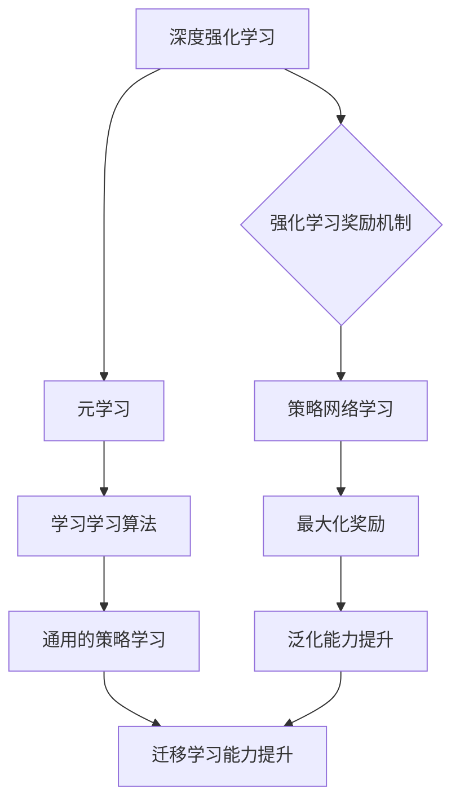

> 深度强化学习，元学习，映射，泛化能力，迁移学习，挑战，机遇

## 1. 背景介绍

人工智能领域近年来取得了令人瞩目的进展，深度学习作为其核心驱动力，在图像识别、自然语言处理等领域展现出强大的能力。然而，深度学习模型通常需要海量数据进行训练，且在面对新任务时表现欠佳，缺乏泛化能力和迁移学习能力。

元学习（Meta-Learning）应运而生，它旨在通过学习学习算法，使模型能够更快、更有效地适应新的任务。深度强化元学习（Deep Reinforcement Meta-Learning）则将强化学习的思想引入元学习，通过强化学习的奖励机制，引导模型学习更通用的策略，从而提升其泛化能力和迁移学习能力。

## 2. 核心概念与联系

**2.1 深度强化学习**

深度强化学习是将深度学习与强化学习相结合的技术。它利用深度神经网络作为策略网络，通过与环境交互，学习一个能够最大化奖励的策略。

**2.2 元学习**

元学习的目标是学习学习算法，即学习如何快速学习新的任务。它通过在多个任务上进行训练，学习一个通用的策略，能够有效地适应新的任务。

**2.3 深度强化元学习**

深度强化元学习将深度强化学习与元学习相结合，通过强化学习的奖励机制，引导模型学习更通用的策略，从而提升其泛化能力和迁移学习能力。

**2.4 映射关系**

深度强化元学习的核心思想是将学习任务看作一个映射关系，即从输入数据到输出结果的映射。通过学习这个映射关系，模型能够泛化到新的任务。



## 3. 核心算法原理 & 具体操作步骤

### 3.1 算法原理概述

深度强化元学习算法通常包括以下几个步骤：

1. **初始化模型参数:** 初始化策略网络的参数。
2. **训练元学习算法:** 在多个任务上进行训练，通过强化学习的奖励机制，更新策略网络的参数。
3. **测试泛化能力:** 在新的任务上测试模型的性能，评估其泛化能力。

### 3.2 算法步骤详解

1. **数据准备:** 收集多个任务的数据，每个任务包含输入数据和目标输出。
2. **模型初始化:** 初始化策略网络的参数。
3. **元训练:**
    * 对于每个任务，随机抽取一小部分数据作为训练集，剩余部分作为测试集。
    * 使用训练集训练策略网络，并使用测试集评估模型性能。
    * 根据模型性能计算奖励，并使用强化学习算法更新策略网络的参数。
4. **元测试:** 在新的任务上测试模型的性能，评估其泛化能力。

### 3.3 算法优缺点

**优点:**

* 能够提升模型的泛化能力和迁移学习能力。
* 能够在有限数据情况下有效学习。

**缺点:**

* 训练过程复杂，需要大量的计算资源。
* 算法参数的选择对性能影响较大。

### 3.4 算法应用领域

深度强化元学习算法在以下领域具有广泛的应用前景:

* **机器人控制:** 训练机器人快速学习新的任务，例如抓取、导航等。
* **药物发现:** 预测药物的活性，加速药物研发过程。
* **个性化推荐:** 根据用户的行为数据，推荐个性化的商品或服务。

## 4. 数学模型和公式 & 详细讲解 & 举例说明

### 4.1 数学模型构建

深度强化元学习算法通常使用马尔可夫决策过程（MDP）来建模学习任务。

MDP 由以下几个要素组成:

* **状态空间 S:** 所有可能的系统状态。
* **动作空间 A:** 在每个状态下可以执行的动作。
* **状态转移概率 P(s' | s, a):** 从状态 s 执行动作 a 后转移到状态 s' 的概率。
* **奖励函数 R(s, a):** 在状态 s 执行动作 a 后获得的奖励。
* **折扣因子 γ:** 权衡未来奖励和当前奖励。

### 4.2 公式推导过程

深度强化元学习算法的目标是学习一个策略 π(a | s)，该策略能够最大化累积奖励。

可以使用动态规划或蒙特卡罗方法来求解 MDP，但对于复杂的任务，这些方法可能难以应用。

深度强化元学习算法通常使用深度神经网络来近似策略 π(a | s)，并使用梯度下降算法来更新网络参数。

### 4.3 案例分析与讲解

例如，在机器人控制任务中，状态空间可以是机器人当前的位置和姿态，动作空间可以是机器人可以执行的运动指令。

奖励函数可以设计为，当机器人到达目标位置时获得高奖励，否则获得低奖励。

通过训练深度强化元学习算法，机器人能够学习一个策略，能够有效地导航到目标位置。

## 5. 项目实践：代码实例和详细解释说明

### 5.1 开发环境搭建

* Python 3.6+
* TensorFlow 或 PyTorch
* CUDA 和 cuDNN

### 5.2 源代码详细实现

```python
import tensorflow as tf

# 定义策略网络
class PolicyNetwork(tf.keras.Model):
    def __init__(self):
        super(PolicyNetwork, self).__init__()
        # ...

    def call(self, state):
        # ...

# 定义强化学习算法
class MetaLearner(tf.keras.Model):
    def __init__(self):
        super(MetaLearner, self).__init__()
        # ...

    def train_step(self, data):
        # ...

# 训练模型
meta_learner = MetaLearner()
# ...
```

### 5.3 代码解读与分析

* 策略网络负责预测在给定状态下执行的动作概率。
* 强化学习算法负责更新策略网络的参数，使其能够最大化累积奖励。
* 训练过程包括元训练和元测试两个阶段。

### 5.4 运行结果展示

* 在新的任务上测试模型的性能，评估其泛化能力。
* 可视化模型的学习过程，例如奖励曲线、策略变化等。

## 6. 实际应用场景

### 6.1 机器人控制

* 训练机器人快速学习新的任务，例如抓取、导航等。
* 提高机器人适应环境变化的能力。

### 6.2 药物发现

* 预测药物的活性，加速药物研发过程。
* 发现新的药物靶点。

### 6.3 个性化推荐

* 根据用户的行为数据，推荐个性化的商品或服务。
* 提高推荐系统的准确性和效率。

### 6.4 未来应用展望

* **自动驾驶:** 训练自动驾驶汽车快速学习新的驾驶场景。
* **医疗诊断:** 帮助医生更快、更准确地诊断疾病。
* **金融预测:** 预测股票价格、汇率等金融指标。

## 7. 工具和资源推荐

### 7.1 学习资源推荐

* **书籍:**
    * Deep Reinforcement Learning Hands-On
    * Reinforcement Learning: An Introduction
* **课程:**
    * Deep Reinforcement Learning Specialization (Coursera)
    * Reinforcement Learning (Udacity)
* **博客:**
    * OpenAI Blog
    * DeepMind Blog

### 7.2 开发工具推荐

* **TensorFlow:** 开源深度学习框架。
* **PyTorch:** 开源深度学习框架。
* **Gym:** 强化学习环境库。

### 7.3 相关论文推荐

* **Model-Agnostic Meta-Learning for Fast Adaptation of Deep Networks**
* **Prototypical Networks for Few-Shot Learning**
* **Matching Networks for One Shot Learning**

## 8. 总结：未来发展趋势与挑战

### 8.1 研究成果总结

深度强化元学习取得了显著的进展，在多个领域展现出强大的应用潜力。

### 8.2 未来发展趋势

* **更有效的元学习算法:** 探索更有效的元学习算法，提升模型的泛化能力和迁移学习能力。
* **更强大的计算资源:** 利用更强大的计算资源，训练更复杂的深度强化元学习模型。
* **更丰富的应用场景:** 将深度强化元学习应用到更多领域，例如自动驾驶、医疗诊断等。

### 8.3 面临的挑战

* **数据效率:** 深度强化元学习算法对数据需求较高，如何提高数据效率是一个重要的挑战。
* **算法复杂度:** 深度强化元学习算法的训练过程复杂，需要大量的计算资源。
* **可解释性:** 深度强化元学习模型的决策过程难以解释，如何提高模型的可解释性是一个重要的研究方向。

### 8.4 研究展望

未来，深度强化元学习将继续是一个重要的研究方向，其发展将推动人工智能技术的进步，并为人类社会带来更多福祉。

## 9. 附录：常见问题与解答

* **什么是元学习？**
* **深度强化元学习与传统强化学习有什么区别？**
* **如何选择合适的深度强化元学习算法？**
* **如何评估深度强化元学习模型的性能？**


作者：禅与计算机程序设计艺术 / Zen and the Art of Computer Programming 
<end_of_turn>