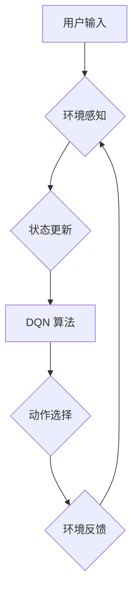

> 深度强化学习，DQN，虚拟现实，同步应用，映射，游戏开发，机器人控制

## 1. 背景介绍

虚拟现实（VR）技术近年来发展迅速，为人们提供了沉浸式体验和交互式环境。然而，构建复杂、逼真的虚拟世界仍然面临着诸多挑战，例如：

* **环境建模复杂度高：** 虚拟世界的构建需要大量的3D模型、材质、灯光等资源，且需要考虑环境的物理特性和交互逻辑。
* **智能体行为设计困难：** 虚拟世界中的角色或智能体需要具备逼真的行为模式，能够做出合理的决策和反应。
* **交互体验缺乏灵活性：** 传统的VR交互方式往往局限于手柄或控制器，难以实现更加自然、流畅的交互体验。

深度强化学习（Deep Reinforcement Learning，DRL）作为一种机器学习方法，能够通过训练智能体在环境中学习最优策略，从而解决上述挑战。DQN（Deep Q-Network）作为DRL领域的重要算法，在游戏、机器人控制等领域取得了显著成果。

## 2. 核心概念与联系

**2.1 深度强化学习 (DRL)**

DRL是一种机器学习方法，它通过训练智能体在环境中学习最优策略，以最大化累积奖励。DRL系统主要由以下几个组成部分构成：

* **智能体 (Agent):**  在环境中行动的实体，例如游戏中的角色或机器人。
* **环境 (Environment):** 智能体所处的世界，包括状态、动作和奖励。
* **状态 (State):** 环境的当前情况，例如游戏中的游戏画面或机器人的位置。
* **动作 (Action):** 智能体可以执行的操作，例如游戏中的按键操作或机器人的运动指令。
* **奖励 (Reward):** 智能体执行动作后获得的反馈，可以是正向奖励或负向奖励。
* **策略 (Policy):** 智能体根据当前状态选择动作的规则。

**2.2 DQN 算法**

DQN 算法是一种基于深度神经网络的强化学习算法，它通过学习一个 Q 函数来估计在给定状态下执行特定动作的期望累积奖励。

* **Q 函数:** Q(s, a) 表示在状态 s 下执行动作 a 的期望累积奖励。
* **目标网络:** 用于评估 Q 函数的网络，其参数与训练网络的参数保持一致。
* **训练网络:** 用于学习 Q 函数的网络，其参数通过与目标网络的误差进行更新。

**2.3 虚拟现实与 DQN 的结合**

将 DQN 算法应用于虚拟现实领域，可以实现以下功能：

* **自动生成虚拟环境:** DQN 可以学习生成逼真的虚拟环境，例如城市街道、森林场景等。
* **创建智能虚拟角色:** DQN 可以训练虚拟角色具备逼真的行为模式，例如行走、对话、完成任务等。
* **实现自然交互:** DQN 可以学习用户行为模式，实现更加自然、流畅的交互体验。

**2.4 映射关系**

在虚拟现实中，我们可以将现实世界中的物体、场景、行为等映射到虚拟世界中，从而实现虚拟世界的构建和交互。DQN 算法可以帮助我们学习这些映射关系，并根据这些关系生成逼真的虚拟世界和智能角色。

**2.5 Mermaid 流程图**



## 3. 核心算法原理 & 具体操作步骤

### 3.1 算法原理概述

DQN 算法的核心思想是通过学习一个 Q 函数来估计在给定状态下执行特定动作的期望累积奖励。Q 函数是一个映射关系，将状态-动作对映射到期望累积奖励。

DQN 算法使用深度神经网络来逼近 Q 函数，并通过 Q 学习算法进行训练。Q 学习算法的核心思想是通过不断地更新 Q 函数的值，使其逼近真实的环境奖励。

### 3.2 算法步骤详解

1. **初始化 Q 函数:** 使用随机值初始化 Q 函数的网络参数。
2. **收集经验:** 在环境中与环境交互，收集状态、动作、奖励和下一个状态的经验数据。
3. **构建经验 replay 缓冲区:** 将收集到的经验数据存储在经验 replay 缓冲区中。
4. **从经验 replay 缓冲区中采样数据:** 从经验 replay 缓冲区中随机采样一批经验数据。
5. **计算目标 Q 值:** 使用目标网络计算目标 Q 值，即在下一个状态下执行最佳动作的期望累积奖励。
6. **更新 Q 函数:** 使用采样的经验数据和目标 Q 值更新训练网络的参数。
7. **更新目标网络:** 定期更新目标网络的参数，使其与训练网络的参数保持一致。
8. **重复步骤 3-7:** 重复上述步骤，直到 Q 函数收敛。

### 3.3 算法优缺点

**优点:**

* **能够学习复杂环境:** DQN 算法能够学习复杂环境中的最优策略，即使环境状态空间很大。
* **能够处理连续动作空间:** DQN 算法可以处理连续动作空间，例如机器人控制中的运动指令。
* **能够利用经验 replay:** DQN 算法使用经验 replay 缓冲区，可以利用过去的经验数据进行训练，提高训练效率。

**缺点:**

* **训练过程可能不稳定:** DQN 算法的训练过程可能不稳定，需要仔细调整超参数。
* **需要大量的训练数据:** DQN 算法需要大量的训练数据才能学习到有效的策略。
* **计算资源消耗大:** DQN 算法的训练过程需要大量的计算资源。

### 3.4 算法应用领域

DQN 算法在以下领域取得了成功应用:

* **游戏:** DQN 算法被成功应用于 Atari 游戏、Go 游戏等，取得了人类水平的成绩。
* **机器人控制:** DQN 算法被用于训练机器人控制策略，例如机器人导航、抓取物体等。
* **自动驾驶:** DQN 算法被用于训练自动驾驶汽车的决策策略。

## 4. 数学模型和公式 & 详细讲解 & 举例说明

### 4.1 数学模型构建

DQN 算法的核心是 Q 函数，它是一个映射关系，将状态-动作对映射到期望累积奖励。

**Q 函数定义:**

$$Q(s, a) = E[\sum_{t=0}^{\infty} \gamma^t r_{t+1} | s_t = s, a_t = a]$$

其中：

* $s$ 是状态
* $a$ 是动作
* $r_{t+1}$ 是在时间步 $t+1$ 获得的奖励
* $\gamma$ 是折扣因子，控制未来奖励的权重

**目标网络:**

目标网络是一个与训练网络结构相同的网络，其参数与训练网络的参数保持一致。目标网络用于计算目标 Q 值。

**训练网络:**

训练网络是一个深度神经网络，其参数通过与目标网络的误差进行更新。

### 4.2 公式推导过程

DQN 算法使用 Q 学习算法进行训练，其核心公式为：

$$Q(s, a) \leftarrow Q(s, a) + \alpha [r + \gamma \max_{a'} Q(s', a') - Q(s, a)]$$

其中：

* $\alpha$ 是学习率
* $r$ 是在当前状态下执行动作 $a$ 后获得的奖励
* $s'$ 是下一个状态
* $a'$ 是在下一个状态 $s'$ 下执行的动作

### 4.3 案例分析与讲解

假设我们有一个简单的游戏环境，其中智能体可以向左或向右移动，目标是到达游戏结束位置。

* 状态 $s$ 可以表示智能体的当前位置。
* 动作 $a$ 可以是向左或向右移动。
* 奖励 $r$ 可以是到达游戏结束位置时获得的正向奖励，否则为负向奖励。

DQN 算法可以学习一个 Q 函数，该函数将状态-动作对映射到期望累积奖励。通过训练，智能体可以学习到最优策略，即在每个状态下执行哪个动作可以获得最大的累积奖励。

## 5. 项目实践：代码实例和详细解释说明

### 5.1 开发环境搭建

* Python 3.x
* TensorFlow 或 PyTorch 深度学习框架
* OpenAI Gym 游戏环境

### 5.2 源代码详细实现

```python
import gym
import tensorflow as tf

# 定义 DQN 算法
class DQN:
    def __init__(self, state_size, action_size):
        # 定义神经网络结构
        self.model = tf.keras.models.Sequential([
            tf.keras.layers.Dense(64, activation='relu', input_shape=(state_size,)),
            tf.keras.layers.Dense(64, activation='relu'),
            tf.keras.layers.Dense(action_size)
        ])
        # 定义目标网络
        self.target_model = tf.keras.models.Sequential([
            tf.keras.layers.Dense(64, activation='relu', input_shape=(state_size,)),
            tf.keras.layers.Dense(64, activation='relu'),
            tf.keras.layers.Dense(action_size)
        ])
        # 初始化目标网络参数
        self.target_model.set_weights(self.model.get_weights())
        # 定义损失函数和优化器
        self.optimizer = tf.keras.optimizers.Adam(learning_rate=0.001)
        self.loss_fn = tf.keras.losses.MeanSquaredError()

    # 定义选择动作的方法
    def choose_action(self, state):
        # 使用 epsilon-greedy 策略选择动作
        if tf.random.uniform(()) < 0.1:
            return tf.random.uniform(shape=(1,), minval=0, maxval=self.model.output_shape[-1], dtype=tf.int32)
        else:
            return tf.argmax(self.model(state), axis=-1)

    # 定义训练方法
    def train(self, state, action, reward, next_state, done):
        # 计算目标 Q 值
        target = reward + (1 - done) * self.target_model(next_state)
        # 计算 Q 值的损失
        with tf.GradientTape() as tape:
            q_values = self.model(state)
            loss = self.loss_fn(target, q_values[0, action])
        # 更新模型参数
        gradients = tape.gradient(loss, self.model.trainable_variables)
        self.optimizer.apply_gradients(zip(gradients, self.model.trainable_variables))

# 创建游戏环境
env = gym.make('CartPole-v1')

# 创建 DQN 算法实例
dqn = DQN(state_size=env.observation_space.shape[0], action_size=env.action_space.n)

# 训练 DQN 算法
for episode in range(1000):
    state = env.reset()
    done = False
    total_reward = 0
    while not done:
        action = dqn.choose_action(state)
        next_state, reward, done, _ = env.step(action)
        dqn.train(state, action, reward, next_state, done)
        state = next_state
        total_reward += reward
    print(f'Episode {episode+1}: Total Reward = {total_reward}')

# 测试 DQN 算法
state = env.reset()
while True:
    action = dqn.choose_action(state)
    next_state, reward, done, _ = env.step(action)
    env.render()
    state = next_state
    if done:
        break
env.close()
```

### 5.3 代码解读与分析

* **