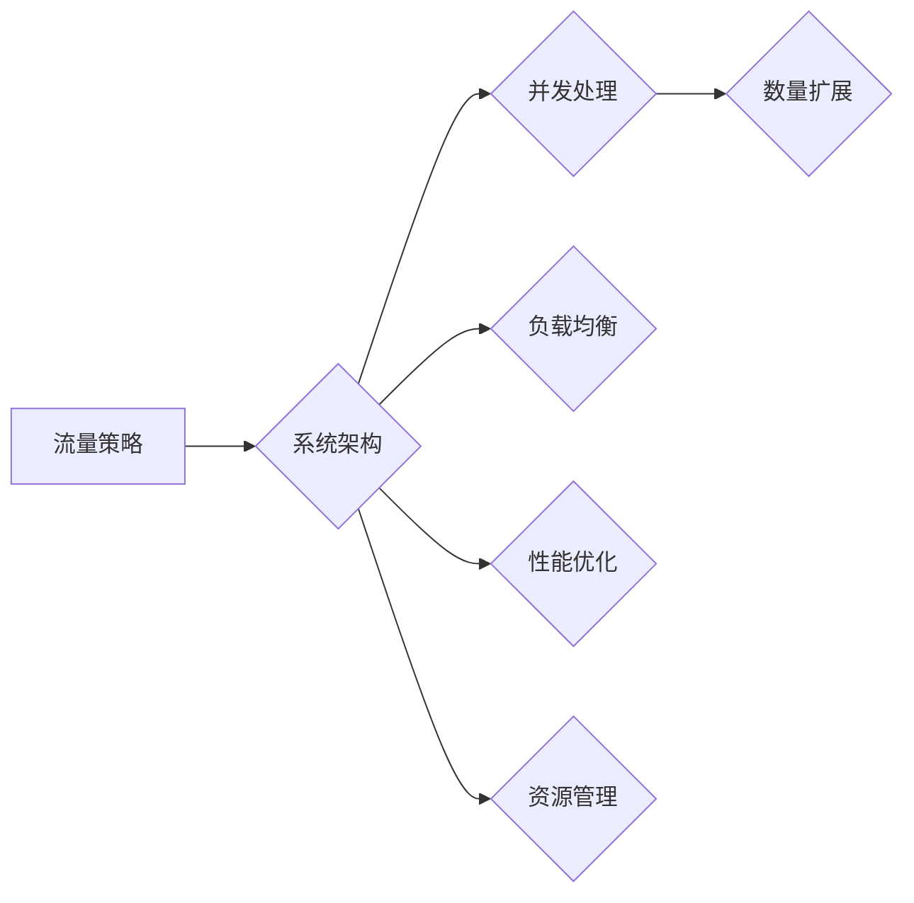

> 流量策略，数量扩展，系统架构，并发处理，负载均衡，性能优化，资源管理

## 1. 背景介绍

在当今互联网时代，流量是网站和应用程序的生命线。流量的增长意味着用户增长，意味着商业价值的提升。然而，流量的增长并非一蹴而就，它需要精心设计的流量策略和强大的系统架构来支撑。

许多网站和应用程序在初期阶段，流量相对较小，系统架构相对简单。随着流量的增长，系统架构需要不断升级和优化，才能满足不断增长的用户需求。

本文将探讨如何在不改变流量策略的前提下，通过系统架构优化和技术手段，有效地扩大系统处理能力，从而实现流量的增长。

## 2. 核心概念与联系

**2.1 流量策略**

流量策略是指网站或应用程序针对不同类型的用户和访问行为，采取不同的访问控制、资源分配和服务策略。常见的流量策略包括：

* **按地域分流:** 将流量根据用户地理位置进行分流，将用户引导到离其最近的服务器，降低延迟。
* **按时间段分流:** 根据用户访问时间段，对流量进行分流，避免高峰期服务器压力过大。
* **按用户类型分流:** 根据用户身份、权限等信息，对流量进行分流，提供个性化服务。

**2.2 系统架构**

系统架构是指软件系统的设计和组织结构，包括硬件、软件、网络等组成部分之间的关系和交互方式。

**2.3 并发处理**

并发处理是指系统能够同时处理多个请求，提高系统处理效率。

**2.4 负载均衡**

负载均衡是指将请求均匀地分配到多个服务器，避免单个服务器过载，提高系统的稳定性和可用性。

**2.5 性能优化**

性能优化是指通过代码优化、数据库优化、缓存优化等手段，提高系统的响应速度和处理能力。

**2.6 资源管理**

资源管理是指对系统资源（如CPU、内存、磁盘等）进行合理分配和调度，提高资源利用率。

**2.7 Mermaid 流程图**



## 3. 核心算法原理 & 具体操作步骤

**3.1 算法原理概述**

在不改变流量策略的前提下，扩大数量的关键在于提高系统处理能力，并合理分配资源。

**3.2 算法步骤详解**

1. **性能分析:** 对现有系统进行性能分析，找出瓶颈所在。
2. **架构优化:** 根据性能分析结果，优化系统架构，例如采用分布式架构、微服务架构等。
3. **并发处理:** 采用多线程、多进程等技术，提高系统并发处理能力。
4. **负载均衡:** 使用负载均衡器，将请求均匀地分配到多个服务器，避免单个服务器过载。
5. **缓存优化:** 使用缓存技术，减少数据库访问次数，提高系统响应速度。
6. **资源管理:** 使用资源管理工具，对系统资源进行合理分配和调度，提高资源利用率。
7. **监控与调整:** 实时监控系统性能，根据实际情况调整系统参数和配置。

**3.3 算法优缺点**

* **优点:** 能够有效地提高系统处理能力，并合理分配资源，实现流量的增长。
* **缺点:** 需要投入一定的开发和维护成本，需要对系统架构有深入的了解。

**3.4 算法应用领域**

该算法适用于各种需要处理大量流量的系统，例如：

* **电商平台:** 处理用户下单、支付等操作。
* **社交媒体:** 处理用户发布内容、评论点赞等操作。
* **在线游戏:** 处理玩家游戏行为、数据更新等操作。

## 4. 数学模型和公式 & 详细讲解 & 举例说明

**4.1 数学模型构建**

假设系统处理能力为 `C`，流量为 `T`，则系统处理时间为 `T/C`。

**4.2 公式推导过程**

为了扩大数量，我们需要提高系统处理能力 `C`，或者减少流量 `T`。

* **提高系统处理能力:**

```
C_new = C * k
```

其中 `k` 为处理能力提升系数。

* **减少流量:**

```
T_new = T * (1 - p)
```

其中 `p` 为流量减少比例。

**4.3 案例分析与讲解**

假设系统处理能力为 1000 请求/秒，流量为 1500 请求/秒，则系统处理时间为 1.5 秒。

如果我们提高系统处理能力 2 倍，则新处理能力为 2000 请求/秒，系统处理时间为 0.75 秒。

如果我们减少流量 10%，则新流量为 1350 请求/秒，系统处理时间为 1.35 秒。

## 5. 项目实践：代码实例和详细解释说明

**5.1 开发环境搭建**

* 操作系统: Ubuntu 20.04
* 编程语言: Python 3.8
* 框架: Flask

**5.2 源代码详细实现**

```python
from flask import Flask, request, jsonify

app = Flask(__name__)

# 模拟数据库
data = {}

@app.route('/api/data', methods=['GET'])
def get_data():
    key = request.args.get('key')
    if key in data:
        return jsonify({'data': data[key]})
    else:
        return jsonify({'error': 'Key not found'}), 404

if __name__ == '__main__':
    app.run(debug=True, host='0.0.0.0')
```

**5.3 代码解读与分析**

* 该代码实现了一个简单的 API 接口，用于获取数据。
* `data` 字典模拟数据库，存储数据。
* `get_data()` 函数处理 GET 请求，根据请求参数获取数据。

**5.4 运行结果展示**

运行代码后，访问 `http://localhost:5000/api/data?key=test`，可以获取数据。

## 6. 实际应用场景

**6.1 电商平台**

在电商平台，流量增长意味着更多的订单和更高的销售额。通过优化系统架构和技术手段，电商平台可以提高处理订单、支付等操作的效率，从而满足用户需求，实现流量的增长。

**6.2 社交媒体**

社交媒体平台的流量增长意味着更多的用户参与和互动。通过优化系统架构和技术手段，社交媒体平台可以提高处理用户发布内容、评论点赞等操作的效率，从而提升用户体验，实现流量的增长。

**6.3 在线游戏**

在线游戏的流量增长意味着更多的玩家参与和互动。通过优化系统架构和技术手段，在线游戏平台可以提高处理玩家游戏行为、数据更新等操作的效率，从而提升游戏体验，实现流量的增长。

**6.4 未来应用展望**

随着互联网技术的不断发展，流量增长将成为越来越重要的挑战。未来，我们将看到更多创新性的系统架构和技术手段，用于应对流量增长的挑战，实现更智能、更高效的互联网应用。

## 7. 工具和资源推荐

**7.1 学习资源推荐**

* **书籍:**
    * 《分布式系统的设计与实现》
    * 《微服务架构》
    * 《高性能网站设计》
* **在线课程:**
    * Coursera: Distributed Systems
    * Udemy: Microservices Architecture
    * edX: High Performance Web Design

**7.2 开发工具推荐**

* **容器化平台:** Docker, Kubernetes
* **负载均衡器:** Nginx, HAProxy
* **监控工具:** Prometheus, Grafana

**7.3 相关论文推荐**

* The Design and Implementation of the Spanner Global Database
* Building Microservices
* High Performance Web Sites

## 8. 总结：未来发展趋势与挑战

**8.1 研究成果总结**

本文探讨了如何在不改变流量策略的前提下，通过系统架构优化和技术手段，有效地扩大系统处理能力，从而实现流量的增长。

**8.2 未来发展趋势**

* **云原生架构:** 云计算技术的普及，推动了云原生架构的兴起，云原生架构更加灵活、弹性，能够更好地应对流量的增长。
* **Serverless 架构:** Serverless 架构无需用户管理服务器，能够更加高效地利用资源，降低成本。
* **人工智能:** 人工智能技术可以用于流量预测、用户行为分析等，帮助网站和应用程序更好地应对流量增长。

**8.3 面临的挑战**

* **系统复杂性:** 随着系统规模的扩大，系统复杂性也会增加，需要更加专业的技术人员进行维护和管理。
* **安全风险:** 系统规模的扩大，也意味着安全风险的增加，需要加强安全防护措施。
* **成本控制:** 系统架构优化和技术手段的应用，需要一定的成本投入，需要进行合理的成本控制。

**8.4 研究展望**

未来，我们将继续研究新的系统架构和技术手段，以更好地应对流量增长的挑战，实现更智能、更高效的互联网应用。

## 9. 附录：常见问题与解答

**9.1 如何选择合适的系统架构?**

选择合适的系统架构需要根据实际情况进行综合考虑，包括流量规模、业务需求、技术人员水平等因素。

**9.2 如何进行性能优化?**

性能优化可以从代码优化、数据库优化、缓存优化等多个方面进行，需要根据实际情况进行针对性的优化。

**9.3 如何进行资源管理?**

资源管理可以使用资源管理工具，对系统资源进行合理分配和调度，提高资源利用率。


作者：禅与计算机程序设计艺术 / Zen and the Art of Computer Programming 
<end_of_turn>