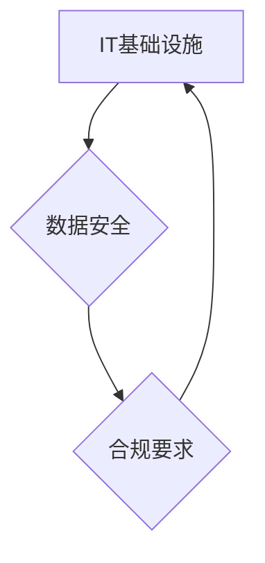

> IT基础设施、数据安全、合规要求、云计算、网络安全、数据隐私、风险管理、法规遵从

## 1. 背景介绍

在当今数字化时代，信息技术 (IT) 基础设施已成为企业运营和发展的核心驱动力。随着云计算、大数据、人工智能等技术的快速发展，IT基础设施的复杂性、规模和安全性也面临着前所未有的挑战。同时，数据安全和合规要求也日益严格，企业需要具备专业的技术能力来应对这些挑战，确保业务的稳定运行和数据安全。

本篇文章将深入探讨IT基础设施、数据安全和合规要求的核心概念、原理和实践，帮助读者全面了解这些关键领域，并掌握相应的专业技术能力。

## 2. 核心概念与联系

**2.1 IT基础设施**

IT基础设施是指支撑企业信息系统运行和服务的硬件、软件、网络和数据资源的整体体系。它包括：

* **硬件资源:** 服务器、存储设备、网络设备、终端设备等。
* **软件资源:** 操作系统、数据库、应用程序、中间件等。
* **网络资源:** 网络连接、路由器、交换机、防火墙等。
* **数据资源:** 数据存储、数据备份、数据恢复等。

**2.2 数据安全**

数据安全是指保护数据免受未经授权的访问、使用、披露、修改或销毁的措施。它包括：

* **数据访问控制:** 限制对数据的访问权限，确保只有授权人员才能访问敏感数据。
* **数据加密:** 使用加密算法对数据进行加密，防止未经授权的访问者解读数据内容。
* **数据备份和恢复:** 定期备份数据，并建立数据恢复机制，以应对数据丢失或损坏的情况。
* **安全审计:** 定期对系统进行安全审计，发现和修复安全漏洞。

**2.3 合规要求**

合规要求是指企业在运营过程中必须遵守的法律法规和行业标准。常见的合规要求包括：

* **数据隐私法规:** 如 GDPR、CCPA 等，规定了个人数据的收集、使用、存储和披露等方面的规则。
* **信息安全标准:** 如 ISO 27001、NIST CSF 等，规定了信息安全管理体系的建设和运行要求。
* **行业特定法规:** 如 HIPAA、PCI DSS 等，针对特定行业制定了相关的合规要求。

**2.4 核心概念联系**

IT基础设施、数据安全和合规要求相互关联，共同构成了企业信息安全和合规管理的整体体系。

* IT基础设施为数据安全提供基础支撑，例如安全设备、网络架构、数据存储等。
* 数据安全措施保护IT基础设施和数据资源免受威胁，确保业务的正常运行。
* 合规要求规范了IT基础设施和数据安全的建设和运营，确保企业遵守法律法规和行业标准。

**2.5 Mermaid 流程图**



## 3. 核心算法原理 & 具体操作步骤

**3.1 算法原理概述**

本节将介绍一种常用的数据加密算法，例如 AES (Advanced Encryption Standard)。AES 是一种对称加密算法，使用相同的密钥进行加密和解密。它通过一系列轮函数对数据进行加密，每个轮函数都包含多个子步骤，例如置换、混淆、加法等。

**3.2 算法步骤详解**

1. **密钥扩展:** 将初始密钥扩展为多个轮密钥，每个轮密钥用于加密或解密不同的轮函数。
2. **数据分组:** 将数据分成若干个块，每个块的大小为 128 位。
3. **轮函数加密:** 对每个数据块进行一系列轮函数加密，每个轮函数都使用对应的轮密钥。
4. **最终轮函数:** 对最后一个数据块进行最终轮函数加密，并输出加密后的数据块。

**3.3 算法优缺点**

* **优点:** AES 算法具有较高的安全性，已被广泛应用于各种领域。
* **缺点:** AES 算法的加密速度相对较慢，尤其是在硬件资源有限的情况下。

**3.4 算法应用领域**

AES 算法广泛应用于以下领域:

* **数据加密:** 对敏感数据进行加密，防止未经授权的访问。
* **网络安全:** 加密网络通信，防止数据被窃取。
* **存储安全:** 加密存储设备上的数据，防止数据被泄露。

## 4. 数学模型和公式 & 详细讲解 & 举例说明

**4.1 数学模型构建**

AES 算法的加密过程可以抽象为一个数学模型，其中数据块作为输入，密钥作为参数，输出为加密后的数据块。

**4.2 公式推导过程**

AES 算法的具体加密过程涉及到大量的数学运算，例如置换、混淆、加法等。这些运算的具体公式可以参考 AES 算法的官方标准文档。

**4.3 案例分析与讲解**

假设我们使用 AES 算法对一个 128 位的数据块进行加密，密钥长度为 128 位。加密过程可以分为以下步骤:

1. 将密钥扩展为 10 个轮密钥。
2. 将数据块分成 4 个 32 位的字。
3. 对每个字进行一系列轮函数加密，每个轮函数都使用对应的轮密钥。
4. 对最后一个字进行最终轮函数加密，并输出加密后的数据块。

## 5. 项目实践：代码实例和详细解释说明

**5.1 开发环境搭建**

本示例使用 Python 语言和 PyCryptodome 库实现 AES 加密算法。

**5.2 源代码详细实现**

```python
from Crypto.Cipher import AES

# 密钥
key = b'your_secret_key'

# 数据块
data = b'your_secret_data'

# 创建 AES 加密器
cipher = AES.new(key, AES.MODE_ECB)

# 加密数据
encrypted_data = cipher.encrypt(data)

# 解密数据
decrypted_data = cipher.decrypt(encrypted_data)

# 打印结果
print(f"加密数据: {encrypted_data}")
print(f"解密数据: {decrypted_data}")
```

**5.3 代码解读与分析**

* `from Crypto.Cipher import AES`: 导入 PyCryptodome 库中的 AES 加密器。
* `key = b'your_secret_key'`: 设置加密密钥，需要使用字节类型。
* `data = b'your_secret_data'`: 设置需要加密的数据，需要使用字节类型。
* `cipher = AES.new(key, AES.MODE_ECB)`: 创建 AES 加密器，使用 ECB 模式加密。
* `encrypted_data = cipher.encrypt(data)`: 对数据进行加密，返回加密后的数据块。
* `decrypted_data = cipher.decrypt(encrypted_data)`: 对加密后的数据进行解密，返回原始数据。

**5.4 运行结果展示**

运行代码后，将输出加密后的数据和解密后的数据。加密后的数据将是一个不可读的字节序列，解密后的数据将恢复为原始数据。

## 6. 实际应用场景

**6.1 数据加密**

AES 算法广泛应用于数据加密，例如：

* **数据库加密:** 对数据库中的敏感数据进行加密，防止未经授权的访问。
* **文件加密:** 对重要文件进行加密，防止数据泄露。
* **云存储加密:** 对云存储中的数据进行加密，确保数据安全。

**6.2 网络安全**

AES 算法用于加密网络通信，例如：

* **VPN 加密:** 对 VPN 通讯进行加密，保护用户隐私。
* **HTTPS 加密:** 对 HTTPS 通讯进行加密，确保网站数据安全。
* **无线网络加密:** 对无线网络进行加密，防止数据被窃取。

**6.3 其他应用场景**

AES 算法还应用于其他领域，例如：

* **数字签名:** 用于数字签名验证，确保数据来源的真实性。
* **密码学研究:** 用于密码学研究和算法分析。

**6.4 未来应用展望**

随着技术的不断发展，AES 算法将在更多领域得到应用，例如：

* **区块链技术:** 用于加密区块链数据，确保数据安全和不可篡改性。
* **物联网安全:** 用于加密物联网设备的数据，防止数据被窃取。
* **人工智能安全:** 用于保护人工智能模型和数据安全。

## 7. 工具和资源推荐

**7.1 学习资源推荐**

* **书籍:**
    * 《Applied Cryptography》 by Bruce Schneier
    * 《Cryptography Engineering》 by Niels Ferguson, Bruce Schneier, and Tadayoshi Kohno
* **在线课程:**
    * Coursera: Cryptography I
    * edX: Introduction to Cryptography

**7.2 开发工具推荐**

* **PyCryptodome:** Python 语言的加密库。
* **OpenSSL:** 跨平台的加密库。
* **Bouncy Castle:** Java 语言的加密库。

**7.3 相关论文推荐**

* **The Design of Rijndael** by Joan Daemen and Vincent Rijmen
* **Advanced Encryption Standard (AES)** by NIST

## 8. 总结：未来发展趋势与挑战

**8.1 研究成果总结**

本篇文章深入探讨了IT基础设施、数据安全和合规要求的核心概念、原理和实践，并介绍了常用的数据加密算法 AES。

**8.2 未来发展趋势**

* **量子计算对加密算法的影响:** 量子计算技术的发展可能会对现有的加密算法造成威胁，需要研究新的量子安全的加密算法。
* **人工智能在安全领域的应用:** 人工智能技术可以用于检测和防御网络攻击，提高安全防护能力。
* **数据隐私保护的加强:** 数据隐私法规的不断完善，将推动数据安全技术的发展。

**8.3 面临的挑战**

* **技术复杂性:** IT基础设施、数据安全和合规要求涉及到复杂的技术，需要不断学习和提升专业技能。
* **人才短缺:** 安全人才短缺是全球性的问题，需要加强安全人才的培养和引进。
* **法规变化:** 法规和标准的不断变化，需要企业及时调整安全策略和措施。

**8.4 研究展望**

未来，需要继续研究和开发新的安全技术，以应对不断变化的威胁环境。同时，需要加强安全人才培养，提高企业安全意识，共同构建安全可靠的数字世界。

## 9. 附录：常见问题与解答

**9.1 什么是数据加密？**

数据加密是指使用算法将数据转换为不可读的形式，只有拥有正确密钥的人才能解密数据。

**9.2 AES 算法的安全性如何？**

AES 算法被认为是目前最安全的加密算法之一，已被广泛应用于各种领域。

**9.3 如何选择合适的加密算法？**

选择合适的加密算法需要考虑多种因素，例如数据敏感程度、应用场景、性能要求等。

**9.4 如何保护密钥安全？**

密钥是加密系统的关键，需要妥善保管和管理，防止泄露或被盗用。


作者：禅与计算机程序设计艺术 / Zen and the Art of Computer Programming 
<end_of_turn>