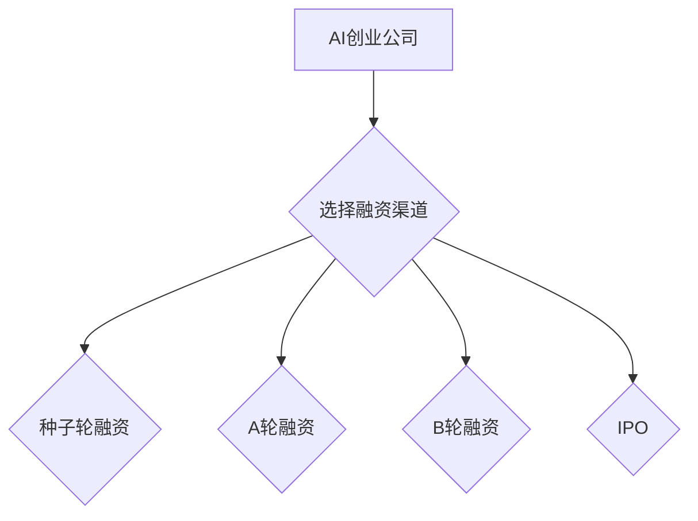

> 人工智能，创业，融资渠道，风险投资，天使投资，种子轮融资，A轮融资，B轮融资，IPO

## 1. 背景介绍

人工智能（AI）正以惊人的速度发展，其应用领域不断拓展，从医疗保健到金融，再到自动驾驶，AI正在改变着我们生活的方方面面。这势必催生了一批新的AI创业公司，这些公司致力于利用AI技术解决现实世界中的问题，创造新的价值。然而，创业之路充满挑战，资金是创业公司发展的重要保障。选择合适的融资渠道对于AI创业公司的成功至关重要。

## 2. 核心概念与联系

**2.1 融资渠道**

融资渠道是指企业筹集资金的途径，可以分为内部融资和外部融资两大类。

* **内部融资:** 利用企业自身积累的资金进行投资，例如自有资金、利润再投资等。
* **外部融资:** 从外部机构或个人获取资金，例如银行贷款、债券融资、股权融资等。

**2.2 AI创业融资特点**

AI创业公司融资的特点主要体现在以下几个方面：

* **高技术门槛:** AI技术研发需要大量的资金投入和专业人才，因此AI创业公司通常需要较高的初始资金。
* **高成长性:** AI技术发展迅速，市场潜力巨大，AI创业公司具有较高的成长性，吸引了投资者的目光。
* **高风险:** AI技术研发存在不确定性，市场竞争激烈，AI创业公司面临着较高的风险。

**2.3 融资渠道选择**

AI创业公司在选择融资渠道时，需要综合考虑自身情况和市场环境，选择最适合的融资方式。

**2.4 融资阶段**

AI创业公司的融资阶段通常分为以下几个阶段：

* **种子轮融资:** 用于验证商业模式、进行产品开发和市场测试。
* **A轮融资:** 用于扩大规模、提升产品功能和市场推广。
* **B轮融资:** 用于加速市场占有率、实现盈利目标。
* **IPO:** 在资本市场上市融资。

**2.5 Mermaid 流程图**

## 3. 核心算法原理 & 具体操作步骤

**3.1 算法原理概述**

**3.2 算法步骤详解**

**3.3 算法优缺点**

**3.4 算法应用领域**

## 4. 数学模型和公式 & 详细讲解 & 举例说明

**4.1 数学模型构建**

**4.2 公式推导过程**

**4.3 案例分析与讲解**

## 5. 项目实践：代码实例和详细解释说明

**5.1 开发环境搭建**

**5.2 源代码详细实现**

**5.3 代码解读与分析**

**5.4 运行结果展示**

## 6. 实际应用场景

**6.1 医疗保健**

**6.2 金融服务**

**6.3 自动驾驶**

**6.4 未来应用展望**

## 7. 工具和资源推荐

**7.1 学习资源推荐**

**7.2 开发工具推荐**

**7.3 相关论文推荐**

## 8. 总结：未来发展趋势与挑战

**8.1 研究成果总结**

**8.2 未来发展趋势**

**8.3 面临的挑战**

**8.4 研究展望**

## 9. 附录：常见问题与解答

**9.1 常见问题**

**9.2 常见问题解答**

作者：禅与计算机程序设计艺术 / Zen and the Art of Computer Programming

<end_of_turn>