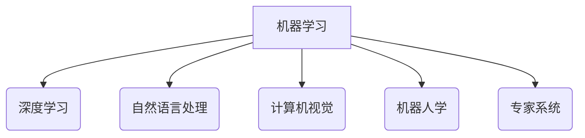

> 人工智能、机器学习、深度学习、自然语言处理、计算机视觉、机器人学、专家系统

## 1. 背景介绍

人工智能（Artificial Intelligence，简称AI）作为一门跨学科研究领域，旨在创建能够像人类一样思考、学习和解决问题智能机器。自20世纪50年代诞生以来，AI研究取得了长足进步，并在各个领域展现出巨大的应用潜力。

随着计算能力的提升、数据量的爆炸式增长以及算法的不断创新，AI技术正经历着前所未有的发展机遇。从自动驾驶汽车到智能医疗诊断，从个性化教育到金融风险管理，AI正在深刻地改变着我们的生活方式和工作模式。

为了更好地理解和把握AI的发展趋势，本文将从七个核心领域出发，深入探讨其原理、算法、应用场景以及未来发展方向。

## 2. 核心概念与联系

**2.1 核心概念**

* **机器学习（Machine Learning，简称ML）:**  让计算机从数据中学习，无需明确编程，自动发现模式和规律。
* **深度学习（Deep Learning，简称DL）:**  一种基于多层神经网络的机器学习方法，能够学习更复杂的特征表示。
* **自然语言处理（Natural Language Processing，简称NLP）:**  使计算机能够理解、处理和生成人类语言。
* **计算机视觉（Computer Vision，简称CV）:**  赋予计算机“看”的能力，使其能够理解和解释图像和视频信息。
* **机器人学（Robotics）:**  设计、制造和控制机器人，使其能够执行各种任务。
* **专家系统（Expert System）:**  模拟人类专家知识和推理能力的计算机系统。

**2.2 联系图**



**2.3 核心概念关系**

* 机器学习是人工智能的核心技术，深度学习是机器学习的一种重要分支。
* 自然语言处理、计算机视觉和机器人学都依赖于机器学习和深度学习技术。
* 专家系统则更侧重于知识表示和推理，但也可以结合机器学习技术进行增强。

## 3. 核心算法原理 & 具体操作步骤

**3.1 算法原理概述**

本节将以深度学习为例，介绍其核心算法原理。深度学习的核心是多层神经网络，它由多个神经元组成的层级结构组成。每个神经元接收来自上一层的输入信号，并通过权重进行加权求和，然后经过激活函数处理，输出到下一层。

**3.2 算法步骤详解**

1. **数据预处理:** 将原始数据转换为深度学习模型可以理解的格式，例如归一化、编码等。
2. **网络结构设计:** 根据任务需求设计神经网络的层数、神经元数量、激活函数等参数。
3. **参数初始化:** 为神经网络中的权重和偏置赋予初始值。
4. **前向传播:** 将输入数据通过神经网络层层传递，最终得到输出结果。
5. **损失函数计算:** 计算模型输出与真实值的差异，即损失值。
6. **反向传播:** 根据损失函数的梯度，调整神经网络参数，使损失值最小化。
7. **迭代训练:** 重复前向传播和反向传播的过程，直到模型达到预设的精度。

**3.3 算法优缺点**

* **优点:** 能够学习复杂特征，具有强大的泛化能力。
* **缺点:** 需要大量数据进行训练，训练时间长，参数量大。

**3.4 算法应用领域**

* **图像识别:** 人脸识别、物体检测、图像分类等。
* **语音识别:** 语音转文本、语音助手等。
* **自然语言处理:** 机器翻译、文本摘要、情感分析等。
* **推荐系统:** 商品推荐、内容推荐等。

## 4. 数学模型和公式 & 详细讲解 & 举例说明

**4.1 数学模型构建**

深度学习模型可以看作是一个复杂的函数映射，其输入是原始数据，输出是预测结果。

**4.2 公式推导过程**

* **激活函数:** sigmoid函数、ReLU函数等。
* **损失函数:** 均方误差、交叉熵损失等。
* **梯度下降算法:** 随机梯度下降、批量梯度下降等。

**4.3 案例分析与讲解**

以图像分类为例，假设我们有一个包含猫和狗的图像数据集。

* **输入数据:** 每张图像被表示为一个向量，每个元素代表图像像素的灰度值。
* **网络结构:** 可以使用卷积神经网络（CNN）来提取图像特征。
* **损失函数:** 使用交叉熵损失函数来衡量模型预测结果与真实标签之间的差异。
* **梯度下降算法:** 使用随机梯度下降算法来更新网络参数，使损失值最小化。

## 5. 项目实践：代码实例和详细解释说明

**5.1 开发环境搭建**

使用Python语言和深度学习框架TensorFlow或PyTorch搭建开发环境。

**5.2 源代码详细实现**

```python
import tensorflow as tf

# 定义模型结构
model = tf.keras.models.Sequential([
    tf.keras.layers.Conv2D(32, (3, 3), activation='relu', input_shape=(28, 28, 1)),
    tf.keras.layers.MaxPooling2D((2, 2)),
    tf.keras.layers.Conv2D(64, (3, 3), activation='relu'),
    tf.keras.layers.MaxPooling2D((2, 2)),
    tf.keras.layers.Flatten(),
    tf.keras.layers.Dense(10, activation='softmax')
])

# 编译模型
model.compile(optimizer='adam',
              loss='sparse_categorical_crossentropy',
              metrics=['accuracy'])

# 训练模型
model.fit(x_train, y_train, epochs=10)

# 评估模型
loss, accuracy = model.evaluate(x_test, y_test)
print('Test loss:', loss)
print('Test accuracy:', accuracy)
```

**5.3 代码解读与分析**

* 代码定义了一个简单的卷积神经网络模型，用于图像分类任务。
* 模型包含两个卷积层、两个池化层、一个全连接层和一个输出层。
* 使用Adam优化器、交叉熵损失函数和准确率作为评估指标。
* 模型在训练集上训练10个epochs，然后在测试集上进行评估。

**5.4 运行结果展示**

运行代码后，会输出模型在测试集上的损失值和准确率。

## 6. 实际应用场景

**6.1 自动驾驶汽车**

* **计算机视觉:** 用于识别道路标志、交通信号灯、行人、车辆等。
* **机器人学:** 控制车辆的转向、加速、制动等动作。

**6.2 智能医疗诊断**

* **计算机视觉:** 用于分析医学影像，例如X光片、CT扫描、MRI等，辅助医生诊断疾病。
* **自然语言处理:** 用于分析患者病历、医学文献等，辅助医生进行诊断和治疗决策。

**6.3 个性化教育**

* **自然语言处理:** 用于理解学生的学习需求，提供个性化的学习内容和辅导。
* **机器学习:** 用于分析学生的学习数据，预测学生的学习成绩和学习进度。

**6.4 未来应用展望**

* 人工智能将更加深入地融入到我们的生活和工作中，为我们带来更多便利和效率。
* 人工智能技术将推动新兴产业的兴起，例如自动驾驶汽车、智能医疗、个性化教育等。

## 7. 工具和资源推荐

**7.1 学习资源推荐**

* **书籍:**
    * 《深度学习》
    * 《机器学习》
    * 《人工智能：现代方法》
* **在线课程:**
    * Coursera
    * edX
    * Udacity

**7.2 开发工具推荐**

* **Python:** 
* **TensorFlow:** 
* **PyTorch:** 
* **Keras:** 

**7.3 相关论文推荐**

* **《ImageNet Classification with Deep Convolutional Neural Networks》**
* **《Attention Is All You Need》**
* **《BERT: Pre-training of Deep Bidirectional Transformers for Language Understanding》**

## 8. 总结：未来发展趋势与挑战

**8.1 研究成果总结**

近年来，人工智能研究取得了长足进步，在各个领域都取得了显著成果。

**8.2 未来发展趋势**

* **更强大的计算能力:** 
* **更丰富的训练数据:** 
* **更先进的算法模型:** 

**8.3 面临的挑战**

* **数据安全和隐私保护:** 
* **算法偏见和公平性:** 
* **人工智能伦理问题:** 

**8.4 研究展望**

未来，人工智能研究将继续朝着更智能、更安全、更可解释的方向发展。


## 9. 附录：常见问题与解答

**9.1 什么是机器学习？**

机器学习是一种人工智能技术，它使计算机能够从数据中学习，无需明确编程，自动发现模式和规律。

**9.2 深度学习和机器学习有什么区别？**

深度学习是机器学习的一种重要分支，它使用多层神经网络来学习更复杂的特征表示。

**9.3 人工智能有哪些应用场景？**

人工智能的应用场景非常广泛，例如自动驾驶汽车、智能医疗诊断、个性化教育、金融风险管理等。


作者：禅与计算机程序设计艺术 / Zen and the Art of Computer Programming 
<end_of_turn>