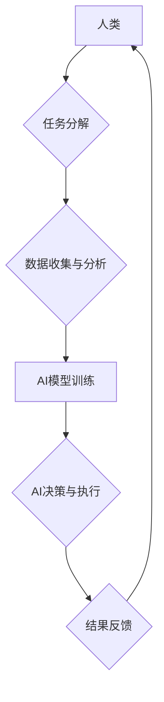

> 人工智能，协作，人类福祉，机器学习，深度学习，自然语言处理

## 1. 背景介绍

人工智能（AI）正以惊人的速度发展，其影响力正在深刻地改变着我们的生活。从自动驾驶汽车到个性化医疗，AI技术正在各个领域展现出巨大的潜力。然而，AI的发展也引发了一些担忧，例如工作岗位的替代、算法偏见以及伦理问题。

面对这些挑战，我们需要思考如何更好地利用AI技术，使其真正服务于人类福祉。人类-AI协作，即人类与人工智能共同工作，将成为未来发展的重要方向。通过协作，我们可以发挥各自的优势，克服各自的局限，共同创造更美好的未来。

## 2. 核心概念与联系

**2.1 人类与AI的优势互补**

人类拥有创造力、批判性思维、情感智能等独特的优势，而AI擅长处理大量数据、识别模式、进行快速计算等。将这两者结合起来，可以形成一个强大的协作体系。

**2.2 协作模式的探索**

人类-AI协作的模式多种多样，例如：

* **监督式协作:** 人类提供指导和反馈，AI根据反馈进行学习和改进。
* **自主式协作:** AI独立完成任务，并在遇到问题时寻求人类的帮助。
* **共创式协作:** 人类和AI共同参与决策和创意过程。

**2.3 协作架构**



## 3. 核心算法原理 & 具体操作步骤

**3.1 算法原理概述**

深度学习是人工智能领域的重要分支，其核心是利用多层神经网络来模拟人类大脑的学习过程。通过训练大量的样本数据，深度学习模型可以自动学习特征，并进行预测或分类。

**3.2 算法步骤详解**

1. **数据预处理:** 将原始数据进行清洗、转换和特征提取。
2. **网络结构设计:** 根据任务需求设计神经网络的层数、节点数和激活函数等参数。
3. **模型训练:** 使用训练数据训练神经网络模型，并通过反向传播算法调整模型参数。
4. **模型评估:** 使用测试数据评估模型的性能，并进行调优。
5. **模型部署:** 将训练好的模型部署到实际应用场景中。

**3.3 算法优缺点**

* **优点:** 能够学习复杂的数据模式，具有较高的准确率。
* **缺点:** 需要大量的训练数据，训练时间较长，容易出现过拟合问题。

**3.4 算法应用领域**

* **图像识别:** 人脸识别、物体检测、图像分类。
* **自然语言处理:** 机器翻译、文本摘要、情感分析。
* **语音识别:** 语音转文本、语音助手。
* **推荐系统:** 商品推荐、内容推荐。

## 4. 数学模型和公式 & 详细讲解 & 举例说明

**4.1 数学模型构建**

深度学习模型的核心是神经网络，其结构可以表示为多层感知机（MLP）。每个神经元接收来自上一层的输入信号，并通过权重进行加权求和，然后应用激活函数进行非线性变换，最后输出到下一层。

**4.2 公式推导过程**

* **激活函数:** sigmoid函数、ReLU函数等。
* **损失函数:** 均方误差、交叉熵等。
* **梯度下降算法:** 用于更新模型参数。

**4.3 案例分析与讲解**

以图像分类为例，假设我们有一个包含10个类别的数据集，每个类别有1000张图片。我们可以使用深度学习模型来训练一个分类器，能够识别图片所属的类别。

## 5. 项目实践：代码实例和详细解释说明

**5.1 开发环境搭建**

使用Python语言和深度学习框架TensorFlow或PyTorch搭建开发环境。

**5.2 源代码详细实现**

```python
import tensorflow as tf

# 定义模型结构
model = tf.keras.models.Sequential([
    tf.keras.layers.Conv2D(32, (3, 3), activation='relu', input_shape=(28, 28, 1)),
    tf.keras.layers.MaxPooling2D((2, 2)),
    tf.keras.layers.Conv2D(64, (3, 3), activation='relu'),
    tf.keras.layers.MaxPooling2D((2, 2)),
    tf.keras.layers.Flatten(),
    tf.keras.layers.Dense(10, activation='softmax')
])

# 编译模型
model.compile(optimizer='adam',
              loss='sparse_categorical_crossentropy',
              metrics=['accuracy'])

# 训练模型
model.fit(x_train, y_train, epochs=10)

# 评估模型
loss, accuracy = model.evaluate(x_test, y_test)
print('Test loss:', loss)
print('Test accuracy:', accuracy)
```

**5.3 代码解读与分析**

这段代码定义了一个简单的卷积神经网络模型，用于手写数字识别任务。模型包含两层卷积层、两层池化层、一层全连接层和一层输出层。

**5.4 运行结果展示**

训练完成后，模型可以对新的手写数字图片进行分类。

## 6. 实际应用场景

**6.1 医疗诊断:** AI辅助医生进行疾病诊断，提高诊断准确率和效率。

**6.2 金融风险管理:** AI识别金融风险，帮助金融机构进行风险控制。

**6.3 教育个性化学习:** AI根据学生的学习情况提供个性化的学习方案。

**6.4 未来应用展望**

随着AI技术的不断发展，其应用场景将更加广泛，例如自动驾驶、机器人、虚拟现实等领域。

## 7. 工具和资源推荐

**7.1 学习资源推荐**

* **在线课程:** Coursera、edX、Udacity等平台提供丰富的AI课程。
* **书籍:** 《深度学习》、《机器学习实战》等。
* **开源项目:** TensorFlow、PyTorch等深度学习框架。

**7.2 开发工具推荐**

* **Python:** 广泛应用于AI开发的编程语言。
* **Jupyter Notebook:** 用于编写和运行Python代码的交互式环境。
* **TensorFlow/PyTorch:** 深度学习框架。

**7.3 相关论文推荐**

* **《ImageNet Classification with Deep Convolutional Neural Networks》**
* **《Attention Is All You Need》**

## 8. 总结：未来发展趋势与挑战

**8.1 研究成果总结**

近年来，AI技术取得了长足的进步，在各个领域都展现出巨大的潜力。

**8.2 未来发展趋势**

* **模型更加强大:** 模型规模更大、能力更强。
* **应用更加广泛:** AI技术应用到更多领域。
* **伦理问题更加突出:** 需要加强对AI伦理的规范和研究。

**8.3 面临的挑战**

* **数据获取和隐私保护:** AI模型需要大量数据进行训练，如何获取高质量数据并保护用户隐私是一个挑战。
* **算法解释性和可信度:** AI模型的决策过程往往难以解释，如何提高算法的可解释性和可信度是一个重要问题。
* **公平性和偏见:** AI模型可能存在公平性和偏见问题，需要采取措施确保AI技术公平公正地服务于所有人。

**8.4 研究展望**

未来，AI研究将更加注重模型的可解释性、公平性和安全性，并探索AI与人类更加紧密、协作的未来。

## 9. 附录：常见问题与解答

**9.1 如何选择合适的AI模型？**

选择合适的AI模型需要根据具体任务需求、数据特点和计算资源等因素进行综合考虑。

**9.2 如何解决AI模型的过拟合问题？**

可以使用正则化技术、数据增强、交叉验证等方法来解决AI模型的过拟合问题。

**9.3 如何评估AI模型的性能？**

可以使用准确率、召回率、F1-score等指标来评估AI模型的性能。


作者：禅与计算机程序设计艺术 / Zen and the Art of Computer Programming 
<end_of_turn>