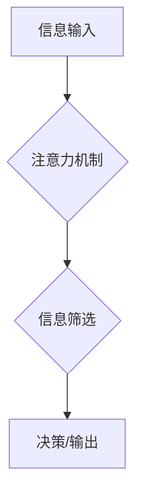

> 人类注意力，增强，决策，问题解决，深度学习，神经网络，注意力机制，Transformer

## 1. 背景介绍

在当今信息爆炸的时代，人类面临着前所未有的信息过载挑战。海量的资讯、纷繁复杂的网络环境，以及不断涌现的新技术，都对我们的注意力提出了极高的要求。然而，人类的注意力资源是有限的，容易被分散和干扰。注意力力的下降，直接影响着我们的学习效率、工作效率、决策能力和问题解决能力。

注意力是认知的核心功能之一，它指我们对特定信息或刺激的集中和选择性关注。注意力力的增强，可以帮助我们更好地过滤信息噪音，聚焦于重要内容，提高信息处理效率，从而提升决策能力和问题解决能力。

## 2. 核心概念与联系

### 2.1 人类注意力机制

人类的注意力机制是一个复杂而精妙的系统，它涉及到多个脑区和神经网络的协同工作。当我们面对信息时，大脑会根据信息的 relevance、novelty 和 salience 等因素，选择性地关注某些信息，而忽略其他信息。

### 2.2 深度学习与注意力机制

深度学习技术近年来取得了飞速发展，特别是在计算机视觉、自然语言处理等领域取得了突破性进展。深度学习模型的成功离不开注意力机制的应用。注意力机制可以帮助深度学习模型学习到输入数据的关键信息，并根据这些信息进行决策或生成输出。

### 2.3 注意力增强技术

注意力增强技术旨在通过技术手段，帮助人类提升注意力能力。这些技术可以分为以下几类：

* **脑机接口技术:** 通过脑电波或其他生物信号，实时监测用户的注意力状态，并提供反馈或干预。
* **认知训练软件:** 通过游戏化和互动化的方式，训练用户的注意力、记忆力和执行功能。
* **环境优化技术:** 通过调整环境光线、噪音、温度等因素，创造一个有利于集中注意力的环境。

**Mermaid 流程图**



## 3. 核心算法原理 & 具体操作步骤

### 3.1 算法原理概述

注意力机制的核心思想是，在处理序列数据时，赋予不同数据元素不同的权重，从而突出重要信息，抑制无关信息。

### 3.2 算法步骤详解

1. **计算注意力权重:** 对于输入序列中的每个元素，计算其与其他元素之间的相关性，并将其转化为注意力权重。
2. **加权求和:** 将注意力权重与输入序列元素相乘，并求和，得到加权后的输出。
3. **输出结果:** 输出加权后的结果，作为模型的最终输出。

### 3.3 算法优缺点

**优点:**

* 可以有效地学习到输入数据的关键信息。
* 可以提高模型的表达能力和泛化能力。
* 可以处理长序列数据。

**缺点:**

* 计算复杂度较高。
* 需要大量的训练数据。

### 3.4 算法应用领域

注意力机制在自然语言处理、计算机视觉、语音识别等领域都有广泛的应用。

## 4. 数学模型和公式 & 详细讲解 & 举例说明

### 4.1 数学模型构建

假设我们有一个输入序列 X = {x1, x2, ..., xn}，其中每个元素 xi 代表一个词或一个图像特征。我们想要学习一个注意力机制，来计算每个元素 xi 与其他元素之间的相关性。

### 4.2 公式推导过程

注意力权重计算公式如下：

```latex
a_{ij} = \frac{exp(e_{ij})}{\sum_{k=1}^{n} exp(e_{ik})}
```

其中，e_{ij} 是 xi 和 xj 之间的相关性得分，可以由一个神经网络计算得到。

加权求和公式如下：

```latex
c_i = \sum_{j=1}^{n} a_{ij} x_j
```

其中，ci 是 xi 的加权后的输出。

### 4.3 案例分析与讲解

例如，在机器翻译任务中，注意力机制可以帮助模型关注源语言中与目标语言中对应词语相关的词语，从而提高翻译质量。

## 5. 项目实践：代码实例和详细解释说明

### 5.1 开发环境搭建

* Python 3.x
* TensorFlow 或 PyTorch

### 5.2 源代码详细实现

```python
import tensorflow as tf

# 定义注意力机制层
class AttentionLayer(tf.keras.layers.Layer):
    def __init__(self, units):
        super(AttentionLayer, self).__init__()
        self.W1 = tf.keras.layers.Dense(units)
        self.W2 = tf.keras.layers.Dense(units)
        self.v = tf.keras.layers.Dense(1)

    def call(self, inputs):
        # 计算注意力权重
        scores = self.v(tf.tanh(self.W1(inputs) + self.W2(tf.transpose(inputs, perm=[0, 2, 1]))))
        attention_weights = tf.nn.softmax(scores, axis=-1)
        # 加权求和
        context_vector = tf.matmul(attention_weights, inputs)
        return context_vector
```

### 5.3 代码解读与分析

* `AttentionLayer` 类定义了一个注意力机制层。
* `W1` 和 `W2` 是两个全连接层，用于计算注意力权重。
* `v` 是一个全连接层，用于将注意力权重映射到一个标量值。
* `call` 方法实现注意力机制的计算过程。

### 5.4 运行结果展示

运行上述代码，可以得到注意力权重和加权后的输出向量。

## 6. 实际应用场景

### 6.1 机器翻译

注意力机制可以帮助机器翻译模型关注源语言中与目标语言中对应词语相关的词语，从而提高翻译质量。

### 6.2 文本摘要

注意力机制可以帮助文本摘要模型识别文本中最关键的信息，并生成简洁准确的摘要。

### 6.3 图像识别

注意力机制可以帮助图像识别模型关注图像中与目标物体相关的区域，从而提高识别准确率。

### 6.4 未来应用展望

注意力机制在未来将有更广泛的应用，例如：

* **个性化推荐:** 根据用户的兴趣和行为，推荐更相关的商品或服务。
* **医疗诊断:** 帮助医生识别病人的关键症状，提高诊断准确率。
* **自动驾驶:** 帮助自动驾驶汽车识别道路上的障碍物和行人，提高安全性。

## 7. 工具和资源推荐

### 7.1 学习资源推荐

* **书籍:**
    * 《深度学习》
    * 《Attention Is All You Need》
* **在线课程:**
    * Coursera: 深度学习
    * Udacity: 自然语言处理

### 7.2 开发工具推荐

* **TensorFlow:** 开源深度学习框架
* **PyTorch:** 开源深度学习框架

### 7.3 相关论文推荐

* 《Attention Is All You Need》
* 《BERT: Pre-training of Deep Bidirectional Transformers for Language Understanding》

## 8. 总结：未来发展趋势与挑战

### 8.1 研究成果总结

注意力机制在近年来取得了显著的进展，并在多个领域取得了突破性成果。

### 8.2 未来发展趋势

未来，注意力机制的研究将朝着以下方向发展：

* **更有效的注意力机制:** 设计更有效的注意力机制，提高计算效率和模型性能。
* **跨模态注意力机制:** 研究跨模态注意力机制，例如文本-图像、文本-音频等。
* **可解释性注意力机制:** 研究可解释性注意力机制，使得模型的注意力机制更加透明和可理解。

### 8.3 面临的挑战

注意力机制也面临着一些挑战：

* **计算复杂度:** 某些注意力机制的计算复杂度较高，难以应用于大规模数据。
* **参数量:** 一些注意力机制的参数量较大，需要大量的训练数据。
* **可解释性:** 目前，注意力机制的可解释性仍然较差，难以理解模型是如何进行决策的。

### 8.4 研究展望

未来，我们将继续致力于研究注意力机制，探索其在更多领域中的应用，并解决其面临的挑战。

## 9. 附录：常见问题与解答

### 9.1 什么是注意力机制？

注意力机制是一种机器学习技术，它可以帮助模型学习到输入数据的关键信息，并根据这些信息进行决策或生成输出。

### 9.2 注意力机制的应用场景有哪些？

注意力机制在自然语言处理、计算机视觉、语音识别等领域都有广泛的应用。

### 9.3 注意力机制的优缺点是什么？

注意力机制的优点是能够有效地学习到输入数据的关键信息，提高模型的表达能力和泛化能力。缺点是计算复杂度较高，需要大量的训练数据。

作者：禅与计算机程序设计艺术 / Zen and the Art of Computer Programming


<end_of_turn>