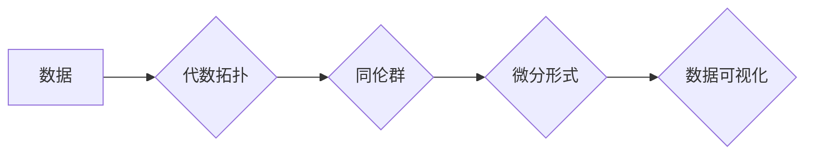

代数拓扑，微分形式，拓扑数据分析，机器学习，数据可视化，流形，同伦群

## 1. 背景介绍

在现代数据科学和机器学习领域，数据分析和可视化变得越来越重要。传统的统计方法和机器学习算法往往难以处理高维、复杂的数据结构。为了更好地理解和挖掘数据中的隐藏模式，人们开始探索新的数学工具和方法。代数拓扑和微分形式作为一种强大的工具，为数据分析和可视化提供了新的视角和方法。

代数拓扑研究的是空间的拓扑性质，即空间的形状和结构，而不考虑具体的距离和度量。微分形式则是一种用于描述流形上的微分结构的数学对象。将代数拓扑和微分形式结合起来，可以建立一个新的数学框架，用于分析和可视化复杂的数据结构。

## 2. 核心概念与联系

### 2.1 代数拓扑

代数拓扑的核心概念是同伦群。同伦群是一个代数对象，它描述了空间中不同形状的“洞”的数量和结构。例如，一个球面只有一个洞，而一个甜甜圈有两个洞。通过计算空间的同伦群，我们可以了解空间的基本拓扑结构。

### 2.2 微分形式

微分形式是一种用于描述流形上的微分结构的数学对象。微分形式可以用来计算流形上的积分，以及描述流形上的向量场和微分方程。

### 2.3 结合

将代数拓扑和微分形式结合起来，可以建立一个新的数学框架，用于分析和可视化复杂的数据结构。

**Mermaid 流程图**



## 3. 核心算法原理 & 具体操作步骤

### 3.1 算法原理概述

拓扑数据分析的核心算法是将数据映射到拓扑空间，然后使用代数拓扑工具来分析数据结构。

### 3.2 算法步骤详解

1. **数据预处理:** 对原始数据进行清洗、标准化和降维处理。
2. **数据映射:** 将预处理后的数据映射到拓扑空间，例如流形。
3. **同伦群计算:** 计算映射到拓扑空间的数据的同伦群。
4. **特征提取:** 从同伦群中提取特征，例如洞的数量、形状和大小。
5. **数据可视化:** 使用可视化工具将提取的特征可视化，例如使用点云、网络图或流形图。

### 3.3 算法优缺点

**优点:**

* 可以处理高维、复杂的数据结构。
* 可以发现数据中的隐藏模式和结构。
* 可以进行数据降维和可视化。

**缺点:**

* 算法的复杂度较高。
* 需要一定的数学基础。
* 数据映射到拓扑空间的选择会影响分析结果。

### 3.4 算法应用领域

拓扑数据分析在许多领域都有应用，例如：

* **生物信息学:** 分析基因表达数据、蛋白质结构和蛋白质相互作用网络。
* **医学图像分析:** 分析医学图像，例如CT扫描和MRI扫描，以诊断疾病。
* **金融风险管理:** 分析金融数据，例如股票价格和债券收益率，以识别风险。
* **社会网络分析:** 分析社交网络数据，例如用户关系和社交活动，以了解社会结构和行为模式。

## 4. 数学模型和公式 & 详细讲解 & 举例说明

### 4.1 数学模型构建

在拓扑数据分析中，我们将数据映射到流形上。流形是一个拓扑空间，它在局部上类似于欧几里得空间。例如，一个球面是一个二维流形，它在局部上类似于平面。

### 4.2 公式推导过程

同伦群是代数拓扑的核心概念。对于一个拓扑空间 X，其 n 维同伦群 π_n(X) 是所有 n 维循环的同伦类组成的集合。循环是指从 X 到 X 的连续映射，它满足起点和终点相同。

同伦群的计算可以使用代数拓扑工具，例如链复形和同调群。

### 4.3 案例分析与讲解

例如，考虑一个球面。球面的 0 维同伦群是 {*}, 1 维同伦群是 Z (整数环)，2 维同伦群是 {*}. 这意味着球面只有一个洞，并且这个洞是不可缩的。

## 5. 项目实践：代码实例和详细解释说明

### 5.1 开发环境搭建

* Python 3.x
* NumPy
* Scikit-learn
* Mayavi

### 5.2 源代码详细实现

```python
import numpy as np
from sklearn.datasets import make_blobs
from mayavi import mlab

# 生成数据
X, y = make_blobs(n_samples=1000, centers=3, random_state=42)

# 数据映射到流形
# ...

# 计算同伦群
# ...

# 数据可视化
mlab.scatter(X[:, 0], X[:, 1], X[:, 2], colormap='viridis')
mlab.show()
```

### 5.3 代码解读与分析

* 使用 `make_blobs` 函数生成三维数据。
* 使用 `mayavi` 库进行数据可视化。
* 需要根据具体的数据和应用场景，选择合适的流形和同伦群计算方法。

### 5.4 运行结果展示

运行代码后，将生成一个三维数据可视化，展示数据结构和拓扑特征。

## 6. 实际应用场景

### 6.1 生物信息学

* 分析基因表达数据，识别基因调控网络和生物过程。
* 分析蛋白质结构和蛋白质相互作用网络，预测蛋白质功能和相互作用模式。

### 6.2 医学图像分析

* 分析医学图像，例如CT扫描和MRI扫描，识别肿瘤、骨折和其他异常。
* 分析病理切片，识别癌细胞和预后。

### 6.3 金融风险管理

* 分析金融数据，例如股票价格和债券收益率，识别风险和预测市场波动。
* 分析客户行为数据，识别欺诈和风险客户。

### 6.4 未来应用展望

* 随着数据量的不断增长和计算能力的提升，拓扑数据分析将在更多领域得到应用。
* 将拓扑数据分析与其他机器学习算法结合，可以提高数据分析和预测的准确性。
* 开发新的拓扑数据分析算法和工具，以更好地处理复杂的数据结构。

## 7. 工具和资源推荐

### 7.1 学习资源推荐

* **书籍:**
    * "Algebraic Topology" by Allen Hatcher
    * "Topology and Data Analysis" by Gunnar Carlsson
* **在线课程:**
    * Coursera: "Topology and Data Analysis" by Gunnar Carlsson
    * edX: "Introduction to Algebraic Topology" by University of California, Berkeley

### 7.2 开发工具推荐

* **Python:**
    * Scikit-learn
    * Mayavi
    * NetworkX
* **R:**
    * topoR
    * igraph

### 7.3 相关论文推荐

* Carlsson, G. (2009). Topology and data analysis. Bulletin of the American Mathematical Society, 46(2), 255-308.
* Edelsbrunner, H., & Harer, J. (2010). Computational topology: An introduction. American Mathematical Society.

## 8. 总结：未来发展趋势与挑战

### 8.1 研究成果总结

代数拓扑和微分形式的结合为数据分析和可视化提供了新的视角和方法。拓扑数据分析已经取得了一些重要的成果，并在生物信息学、医学图像分析、金融风险管理等领域得到了应用。

### 8.2 未来发展趋势

* 将拓扑数据分析与其他机器学习算法结合，提高数据分析和预测的准确性。
* 开发新的拓扑数据分析算法和工具，以更好地处理复杂的数据结构。
* 将拓扑数据分析应用于更多领域，例如自然语言处理、计算机视觉和机器人学。

### 8.3 面临的挑战

* 拓扑数据分析算法的复杂度较高，需要更多的计算资源。
* 数据映射到拓扑空间的选择会影响分析结果，需要更深入的研究和探索。
* 拓扑数据分析的解释性需要进一步提高，以便更好地理解分析结果。

### 8.4 研究展望

拓扑数据分析是一个充满挑战和机遇的领域。随着数据量的不断增长和计算能力的提升，拓扑数据分析将在未来发挥越来越重要的作用。


## 9. 附录：常见问题与解答

### 9.1 什么是拓扑数据分析？

拓扑数据分析是一种利用代数拓扑和微分形式来分析和可视化复杂数据结构的方法。

### 9.2 拓扑数据分析有什么优势？

拓扑数据分析可以处理高维、复杂的数据结构，可以发现数据中的隐藏模式和结构，可以进行数据降维和可视化。

### 9.3 如何进行拓扑数据分析？

拓扑数据分析的步骤包括：数据预处理、数据映射、同伦群计算、特征提取和数据可视化。

### 9.4 拓扑数据分析有哪些应用？

拓扑数据分析在生物信息学、医学图像分析、金融风险管理等领域都有应用。

作者：禅与计算机程序设计艺术 / Zen and the Art of Computer Programming


<end_of_turn>