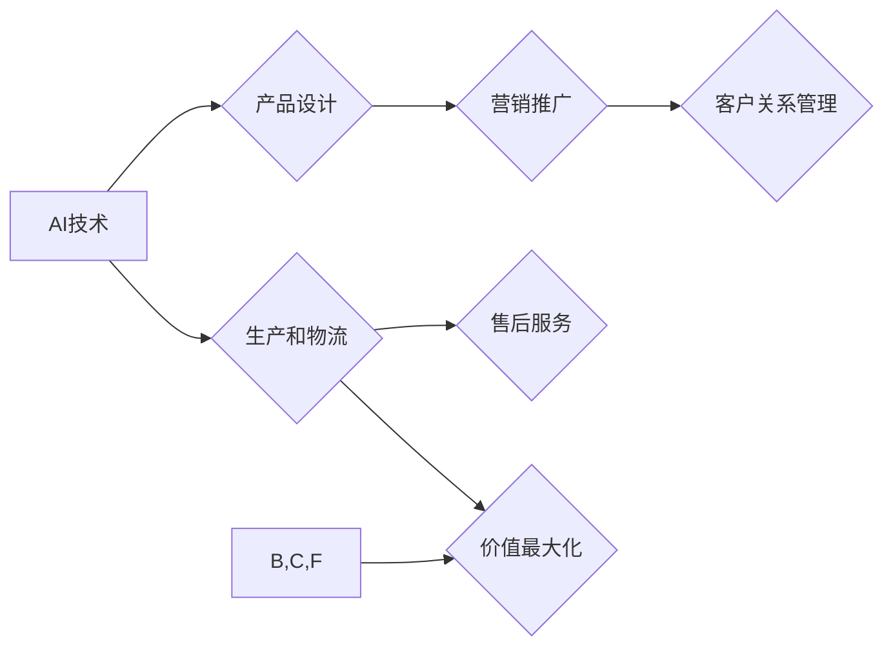

> AI公司、价值微笑曲线、技术创新、商业模式、市场竞争、未来趋势

## 1. 背景介绍

在当今科技飞速发展的时代，人工智能（AI）正以惊人的速度改变着我们的生活和工作方式。AI技术在各个领域都展现出巨大的潜力，从医疗保健到金融服务，从自动驾驶到个性化教育，AI正在推动着社会进步和经济发展。

然而，AI技术的发展也带来了新的挑战和机遇。对于AI公司来说，如何在激烈的市场竞争中脱颖而出，建立可持续的商业模式，并创造真正的价值，成为摆在他们面前的关键问题。

价值微笑曲线是分析企业价值链和竞争优势的经典模型，它指出，企业价值链中，产品设计和营销推广环节往往能够创造最大的价值，而中间环节的生产和物流环节则价值相对较低。

将价值微笑曲线与AI公司结合起来，我们可以发现，AI技术可以帮助AI公司在产品设计和营销推广环节创造更大的价值，从而获得更强的竞争优势。

## 2. 核心概念与联系

**2.1 价值微笑曲线**

价值微笑曲线是一个描述企业价值链中不同环节价值分配的模型。它将价值链分为三个环节：

* **前端环节（产品设计和营销推广）：** 创造产品和服务价值的核心环节，通常能够创造最大的价值。
* **中间环节（生产和物流）：** 负责将产品和服务交付给客户的环节，价值相对较低。
* **后端环节（售后服务和客户关系管理）：** 维护客户关系和提升客户满意度的环节，价值相对较高。

**2.2 AI公司**

AI公司是指利用人工智能技术开发和提供产品和服务的企业。AI公司可以分为以下几类：

* **基础设施提供商：** 提供AI计算平台、数据存储和管理等基础设施服务。
* **算法开发商：** 开发和销售AI算法模型，例如图像识别、自然语言处理等。
* **应用开发商：** 利用AI技术开发和提供特定领域的应用软件，例如医疗诊断、金融风险控制等。

**2.3 价值微笑曲线与AI公司**

AI技术可以帮助AI公司在价值链中各个环节创造更大的价值，从而获得更强的竞争优势。

* **前端环节：** AI技术可以帮助AI公司开发更智能、更个性化的产品和服务，例如个性化推荐、智能客服等，从而提升产品和服务的价值。
* **中间环节：** AI技术可以帮助AI公司提高生产效率、降低成本，例如自动化生产、智能物流等，从而降低中间环节的成本。
* **后端环节：** AI技术可以帮助AI公司提供更精准、更个性化的客户服务，例如智能客服、个性化营销等，从而提升客户满意度。

**2.4 Mermaid 流程图**



## 3. 核心算法原理 & 具体操作步骤

**3.1 算法原理概述**

深度学习是人工智能领域最热门的技术之一，它能够通过多层神经网络学习复杂的模式和关系，从而实现图像识别、自然语言处理、语音识别等各种任务。

**3.2 算法步骤详解**

1. **数据预处理：** 将原始数据进行清洗、转换和格式化，使其适合深度学习模型的训练。
2. **模型构建：** 根据具体任务选择合适的深度学习模型架构，例如卷积神经网络（CNN）、循环神经网络（RNN）等。
3. **模型训练：** 使用训练数据训练深度学习模型，调整模型参数，使其能够准确地预测或分类数据。
4. **模型评估：** 使用测试数据评估模型的性能，例如准确率、召回率、F1-score等。
5. **模型部署：** 将训练好的模型部署到实际应用场景中，例如云平台、边缘设备等。

**3.3 算法优缺点**

**优点：**

* 能够学习复杂的模式和关系。
* 性能优于传统机器学习算法。
* 应用范围广泛。

**缺点：**

* 需要大量的训练数据。
* 计算资源需求高。
* 模型解释性差。

**3.4 算法应用领域**

* **图像识别：** 人脸识别、物体检测、图像分类等。
* **自然语言处理：** 文本分类、情感分析、机器翻译等。
* **语音识别：** 语音转文本、语音助手等。
* **自动驾驶：** 路线规划、物体检测、驾驶决策等。

## 4. 数学模型和公式 & 详细讲解 & 举例说明

**4.1 数学模型构建**

深度学习模型可以看作是一个复杂的数学函数，其输入是数据，输出是预测结果。

**4.2 公式推导过程**

深度学习模型的训练过程是通过优化模型参数来最小化损失函数的过程。损失函数衡量模型预测结果与真实结果之间的差异。常用的损失函数包括均方误差（MSE）、交叉熵损失（Cross-Entropy Loss）等。

**4.3 案例分析与讲解**

例如，在图像分类任务中，可以使用卷积神经网络（CNN）作为模型。CNN模型的结构由多个卷积层、池化层和全连接层组成。每个卷积层使用卷积核对输入图像进行卷积运算，提取图像特征。池化层对卷积层的输出进行降维，减少计算量。全连接层将提取的特征进行分类。

训练CNN模型时，需要使用大量的图像数据进行训练。训练过程是通过反向传播算法来更新模型参数的。反向传播算法通过计算损失函数对模型参数的梯度，并使用梯度下降算法来更新模型参数。

## 5. 项目实践：代码实例和详细解释说明

**5.1 开发环境搭建**

可以使用Python语言和深度学习框架TensorFlow或PyTorch来开发深度学习模型。

**5.2 源代码详细实现**

```python
import tensorflow as tf

# 定义模型结构
model = tf.keras.models.Sequential([
    tf.keras.layers.Conv2D(32, (3, 3), activation='relu', input_shape=(28, 28, 1)),
    tf.keras.layers.MaxPooling2D((2, 2)),
    tf.keras.layers.Conv2D(64, (3, 3), activation='relu'),
    tf.keras.layers.MaxPooling2D((2, 2)),
    tf.keras.layers.Flatten(),
    tf.keras.layers.Dense(10, activation='softmax')
])

# 编译模型
model.compile(optimizer='adam',
              loss='sparse_categorical_crossentropy',
              metrics=['accuracy'])

# 训练模型
model.fit(x_train, y_train, epochs=5)

# 评估模型
loss, accuracy = model.evaluate(x_test, y_test)
print('Test loss:', loss)
print('Test accuracy:', accuracy)
```

**5.3 代码解读与分析**

这段代码定义了一个简单的卷积神经网络模型，用于手写数字识别任务。

* `tf.keras.models.Sequential` 创建了一个顺序模型，即层级结构。
* `tf.keras.layers.Conv2D` 定义了一个卷积层，用于提取图像特征。
* `tf.keras.layers.MaxPooling2D` 定义了一个池化层，用于降维。
* `tf.keras.layers.Flatten` 将多维特征转换为一维向量。
* `tf.keras.layers.Dense` 定义了一个全连接层，用于分类。
* `model.compile` 编译模型，指定优化器、损失函数和评价指标。
* `model.fit` 训练模型，使用训练数据进行训练。
* `model.evaluate` 评估模型，使用测试数据评估模型性能。

**5.4 运行结果展示**

训练完成后，可以将模型应用于新的图像数据进行预测。

## 6. 实际应用场景

**6.1 医疗诊断**

AI技术可以帮助医生更快、更准确地诊断疾病，例如癌症、心血管疾病等。

**6.2 金融风险控制**

AI技术可以帮助金融机构识别和预防欺诈行为，例如信用卡欺诈、网络钓鱼等。

**6.3 自动驾驶**

AI技术可以帮助汽车自动驾驶，提高道路安全性和交通效率。

**6.4 未来应用展望**

AI技术将在未来更加广泛地应用于各个领域，例如教育、娱乐、制造业等，为人类社会带来更多便利和福祉。

## 7. 工具和资源推荐

**7.1 学习资源推荐**

* **在线课程：** Coursera、edX、Udacity等平台提供丰富的AI课程。
* **书籍：** 《深度学习》、《人工智能：一种现代方法》等书籍。
* **博客和论坛：** AI社区博客和论坛，例如Towards Data Science、Machine Learning Mastery等。

**7.2 开发工具推荐**

* **深度学习框架：** TensorFlow、PyTorch、Keras等。
* **数据处理工具：** Pandas、NumPy等。
* **可视化工具：** Matplotlib、Seaborn等。

**7.3 相关论文推荐**

* **ImageNet Classification with Deep Convolutional Neural Networks**
* **Attention Is All You Need**
* **BERT: Pre-training of Deep Bidirectional Transformers for Language Understanding**

## 8. 总结：未来发展趋势与挑战

**8.1 研究成果总结**

近年来，AI技术取得了长足的进步，在图像识别、自然语言处理、语音识别等领域取得了突破性进展。

**8.2 未来发展趋势**

* **模型规模和复杂度提升：** 未来AI模型将更加庞大、复杂，能够学习更复杂的模式和关系。
* **跨模态学习：** AI模型将能够处理多种模态数据，例如文本、图像、音频等，实现更智能的交互。
* **边缘计算：** AI模型将部署到边缘设备，实现更快速的响应和更低的延迟。

**8.3 面临的挑战**

* **数据隐私和安全：** AI模型的训练需要大量数据，如何保护数据隐私和安全是一个重要的挑战。
* **算法可解释性：** 许多AI模型的决策过程难以解释，如何提高算法的可解释性是一个重要的研究方向。
* **伦理问题：** AI技术的发展也带来了伦理问题，例如算法偏见、工作岗位替代等，需要社会各界共同探讨和解决。

**8.4 研究展望**

未来，AI技术将继续发展，为人类社会带来更多机遇和挑战。我们需要加强基础研究，探索更强大的AI算法和模型；同时，也要关注AI技术的伦理和社会影响，确保AI技术能够真正造福人类。

## 9. 附录：常见问题与解答

**9.1 如何选择合适的深度学习模型？**

选择合适的深度学习模型需要根据具体任务和数据特点进行选择。例如，图像识别任务可以使用卷积神经网络（CNN），自然语言处理任务可以使用循环神经网络（RNN）或Transformer模型。

**9.2 如何处理数据不平衡问题？**

数据不平衡是指训练数据中某些类别样本数量远大于其他类别样本数量。可以采用数据增广、权重调整等方法来解决数据不平衡问题。

**9.3 如何评估深度学习模型的性能？**

常用的评估指标包括准确率、召回率、F1-score、AUC等。选择合适的评估指标需要根据具体任务和数据特点进行选择。


作者：禅与计算机程序设计艺术 / Zen and the Art of Computer Programming 
<end_of_turn>