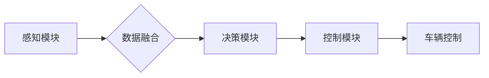
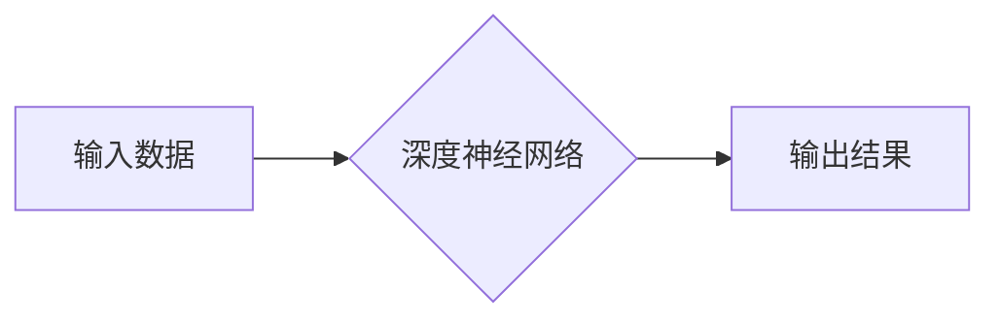

> 自动驾驶, 模块化架构, 端到端架构, 深度学习, 神经网络, 计算机视觉

## 1. 背景介绍

自动驾驶技术作为未来交通运输的重要发展方向，近年来取得了显著进展。传统的自动驾驶系统通常采用模块化架构，将感知、决策和控制等功能模块独立设计和实现。然而，随着深度学习技术的兴起，端到端架构逐渐成为自动驾驶领域的新趋势。

模块化架构的自动驾驶系统通常由以下几个主要模块组成：

* **感知模块:** 负责获取车辆周围环境的信息，例如图像、激光雷达数据、雷达数据等。
* **决策模块:** 基于感知模块获取的信息，进行路径规划、决策控制等。
* **控制模块:** 根据决策模块的指令，控制车辆的转向、加速、制动等动作。

模块化架构的优势在于模块之间可以独立开发和测试，提高了系统的可维护性和可扩展性。然而，模块之间的数据传递和信息融合存在一定的困难，导致系统性能难以进一步提升。

端到端架构的自动驾驶系统则将感知、决策和控制等功能直接映射到一个深度神经网络中，通过训练数据直接学习驾驶策略。这种架构简化了系统结构，提高了数据利用效率，并能够更好地融合不同传感器的信息。

## 2. 核心概念与联系

### 2.1 模块化架构

模块化架构是一种将复杂系统分解成多个独立的模块，每个模块负责特定的功能，并通过接口进行通信和数据交换的软件设计模式。

**优点:**

* **可维护性:** 模块独立性强，易于修改和维护。
* **可扩展性:** 可以根据需要添加新的模块，扩展系统功能。
* **复用性:** 模块可以被多个系统复用。

**缺点:**

* **接口复杂性:** 模块之间需要通过接口进行通信，接口设计复杂，容易出现问题。
* **数据传递效率:** 数据需要通过接口传递，可能会导致数据传递效率低下。
* **信息融合困难:** 模块之间的数据融合较为困难，难以实现全局优化。

**Mermaid 流程图:**



### 2.2 端到端架构

端到端架构是一种将输入数据直接映射到输出结果的机器学习模型架构。

**优点:**

* **数据利用效率高:** 模型直接学习数据特征，无需人工设计特征，提高了数据利用效率。
* **信息融合能力强:** 模型能够自动融合不同传感器的信息，实现全局优化。
* **系统结构简单:** 简化了系统结构，提高了模型训练效率。

**缺点:**

* **训练数据需求量大:** 需要大量的标注数据进行训练。
* **可解释性差:** 模型内部决策过程难以解释。
* **调试难度大:** 模型调试难度较大，需要专业的机器学习知识。

**Mermaid 流程图:**



## 3. 核心算法原理 & 具体操作步骤

### 3.1 算法原理概述

端到端自动驾驶算法的核心是深度神经网络，它能够学习驾驶策略，将感知到的环境信息映射到控制指令。常用的深度神经网络架构包括卷积神经网络（CNN）、循环神经网络（RNN）和强化学习算法等。

* **卷积神经网络（CNN）:** 用于处理图像数据，提取图像特征。
* **循环神经网络（RNN）:** 用于处理序列数据，例如驾驶轨迹、传感器数据等。
* **强化学习算法:** 通过奖励机制训练模型，学习最优的驾驶策略。

### 3.2 算法步骤详解

1. **数据收集和预处理:** 收集大量驾驶场景数据，包括图像、激光雷达数据、雷达数据等，并进行预处理，例如数据清洗、数据增强等。
2. **模型构建:** 根据任务需求选择合适的深度神经网络架构，并进行模型参数初始化。
3. **模型训练:** 使用训练数据训练模型，通过反向传播算法更新模型参数，使模型能够准确预测驾驶策略。
4. **模型评估:** 使用测试数据评估模型性能，例如准确率、召回率、平均位移误差等。
5. **模型部署:** 将训练好的模型部署到自动驾驶系统中，用于实际驾驶场景。

### 3.3 算法优缺点

**优点:**

* **高精度:** 深度学习算法能够学习复杂的驾驶策略，实现高精度驾驶。
* **数据驱动:** 模型训练基于大量数据，能够适应不同的驾驶场景。
* **自动化:** 模型训练和部署自动化程度高，降低了人工成本。

**缺点:**

* **数据依赖:** 需要大量的标注数据进行训练，数据获取成本高。
* **黑盒问题:** 模型内部决策过程难以解释，难以进行安全分析。
* **鲁棒性:** 模型对异常情况的鲁棒性较差，容易受到干扰。

### 3.4 算法应用领域

端到端自动驾驶算法已广泛应用于自动驾驶汽车、无人机、机器人等领域。

## 4. 数学模型和公式 & 详细讲解 & 举例说明

### 4.1 数学模型构建

端到端自动驾驶算法的数学模型通常基于深度神经网络，其结构可以表示为多层神经元网络，每个神经元接收来自前一层神经元的输入，并通过激活函数进行处理，输出到下一层神经元。

**神经网络结构:**

```
输入层 -> 隐藏层1 -> 隐藏层2 -> ... -> 隐藏层N -> 输出层
```

**激活函数:**

常用的激活函数包括 sigmoid 函数、ReLU 函数、tanh 函数等。

**损失函数:**

损失函数用于衡量模型预测结果与真实值的差异，常用的损失函数包括均方误差（MSE）、交叉熵损失（Cross-Entropy Loss）等。

### 4.2 公式推导过程

深度神经网络的训练过程基于梯度下降算法，其核心思想是通过不断调整模型参数，使损失函数最小化。

**梯度下降算法:**

```
参数 = 参数 - 学习率 * 梯度
```

其中，学习率是一个控制参数更新幅度的超参数，梯度是损失函数对模型参数的偏导数。

### 4.3 案例分析与讲解

以图像识别为例，假设输入图像为一个包含猫的图片，目标是识别出图片中的物体类别。

1. **输入层:** 将图像数据转换为神经网络可处理的数值格式，例如像素值。
2. **隐藏层:** 通过卷积操作和池化操作提取图像特征，例如边缘、纹理等。
3. **输出层:** 将提取到的特征映射到不同的物体类别，例如猫、狗、车等。
4. **损失函数:** 使用交叉熵损失函数衡量模型预测结果与真实类别之间的差异。
5. **梯度下降算法:** 通过梯度下降算法更新模型参数，使损失函数最小化。

## 5. 项目实践：代码实例和详细解释说明

### 5.1 开发环境搭建

* 操作系统: Ubuntu 20.04
* Python 版本: 3.8
* 深度学习框架: TensorFlow 2.0

### 5.2 源代码详细实现

```python
import tensorflow as tf

# 定义模型结构
model = tf.keras.models.Sequential([
    tf.keras.layers.Conv2D(32, (3, 3), activation='relu', input_shape=(64, 64, 3)),
    tf.keras.layers.MaxPooling2D((2, 2)),
    tf.keras.layers.Conv2D(64, (3, 3), activation='relu'),
    tf.keras.layers.MaxPooling2D((2, 2)),
    tf.keras.layers.Flatten(),
    tf.keras.layers.Dense(10, activation='softmax')
])

# 定义损失函数和优化器
model.compile(loss='sparse_categorical_crossentropy',
              optimizer='adam',
              metrics=['accuracy'])

# 训练模型
model.fit(x_train, y_train, epochs=10)

# 评估模型
loss, accuracy = model.evaluate(x_test, y_test)
print('Test loss:', loss)
print('Test accuracy:', accuracy)
```

### 5.3 代码解读与分析

* **模型结构:** 该代码定义了一个简单的卷积神经网络模型，用于图像分类任务。模型包含两层卷积层、两层池化层、一层全连接层和一层输出层。
* **损失函数和优化器:** 使用交叉熵损失函数和Adam优化器进行模型训练。
* **训练模型:** 使用训练数据训练模型，训练epochs设置为10。
* **评估模型:** 使用测试数据评估模型性能，输出测试损失和准确率。

### 5.4 运行结果展示

训练完成后，可以将模型部署到实际应用场景中，例如自动驾驶汽车中，用于识别道路上的障碍物、交通信号灯等。

## 6. 实际应用场景

端到端自动驾驶算法已在自动驾驶汽车、无人机、机器人等领域得到广泛应用。

### 6.1 自动驾驶汽车

端到端自动驾驶算法可以实现车辆的感知、决策和控制，使车辆能够自动驾驶。

### 6.2 无人机

端到端自动驾驶算法可以使无人机能够自主飞行，例如进行航拍、物料运输等任务。

### 6.3 机器人

端到端自动驾驶算法可以使机器人能够自主导航，例如在工厂、仓库等环境中进行搬运、巡逻等任务。

### 6.4 未来应用展望

随着深度学习技术的不断发展，端到端自动驾驶算法的性能将不断提升，应用场景也将更加广泛。

## 7. 工具和资源推荐

### 7.1 学习资源推荐

* **书籍:**
    * Deep Learning by Ian Goodfellow, Yoshua Bengio, and Aaron Courville
    * Hands-On Machine Learning with Scikit-Learn, Keras & TensorFlow by Aurélien Géron
* **在线课程:**
    * TensorFlow Tutorials: https://www.tensorflow.org/tutorials
    * Deep Learning Specialization by Andrew Ng: https://www.deeplearning.ai/

### 7.2 开发工具推荐

* **深度学习框架:** TensorFlow, PyTorch, Keras
* **数据处理工具:** Pandas, NumPy
* **可视化工具:** Matplotlib, Seaborn

### 7.3 相关论文推荐

* **End to End Learning for Self-Driving Cars** by Bojarski et al. (2016)
* **Learning to Drive with Deep Reinforcement Learning** by Schulman et al. (2017)
* **Attention Is All You Need** by Vaswani et al. (2017)

## 8. 总结：未来发展趋势与挑战

### 8.1 研究成果总结

端到端自动驾驶算法取得了显著进展，能够实现车辆的自动驾驶，并应用于多个领域。

### 8.2 未来发展趋势

* **模型复杂度提升:** 采用更复杂的深度神经网络架构，例如Transformer网络，提高模型性能。
* **数据增强技术:** 开发更有效的图像数据增强技术，提高模型鲁棒性。
* **多模态融合:** 将不同传感器数据融合，提高模型感知能力。
* **安全性和可靠性:** 加强模型安全性和可靠性研究，确保自动驾驶系统的安全运行。

### 8.3 面临的挑战

* **数据获取成本高:** 需要大量的标注数据进行训练，数据获取成本高。
* **黑盒问题:** 模型内部决策过程难以解释，难以进行安全分析。
* **鲁棒性:** 模型对异常情况的鲁棒性较差，容易受到干扰。

### 8.4 研究展望

未来研究将重点关注模型安全性和可靠性、数据效率、多模态融合等方面，推动端到端自动驾驶算法的进一步发展。

## 9. 附录：常见问题与解答

### 9.1 什么是端到端学习？

端到端学习是指将输入