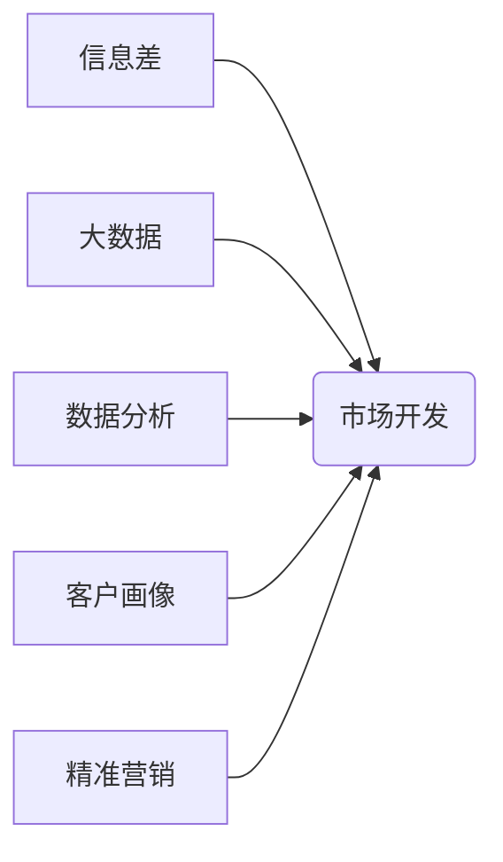

> 大数据，市场开发，信息差，商业模式，数据分析，预测模型，客户画像，精准营销

## 1. 背景介绍

在当今数据爆炸的时代，信息已成为企业竞争的核心资源。掌握信息，洞察市场，精准定位目标客户，是企业取得成功的重要驱动力。传统市场开发模式往往依赖于经验和直觉，难以有效应对市场变化和客户需求的多样化。而大数据技术的出现，为企业提供了全新的市场开发思路和工具，帮助企业打破信息壁垒，缩小信息差，实现精准营销和高效运营。

## 2. 核心概念与联系

**2.1 信息差与市场开发**

信息差是指在市场参与者之间，对市场信息、产品信息、客户信息等方面的认知和掌握程度存在差异。信息差是市场开发的核心驱动力，它决定了企业在市场竞争中的优势和劣势。

**2.2 大数据与市场开发**

大数据是指海量、高速、多样化的数据，它蕴含着丰富的市场信息和客户洞察。通过对大数据的分析和挖掘，企业可以获得对市场趋势、客户行为、竞争对手等方面的深刻理解，从而制定更精准的市场开发策略。

**2.3 核心概念关系图**



## 3. 核心算法原理 & 具体操作步骤

**3.1 算法原理概述**

市场开发中常用的算法包括：

* **聚类算法**: 将客户根据相似特征进行分组，形成客户画像。
* **关联规则挖掘**: 发现客户购买行为之间的关联关系，预测客户需求。
* **预测模型**: 基于历史数据，预测未来市场趋势和客户行为。

**3.2 算法步骤详解**

以聚类算法为例，其具体步骤如下：

1. **数据预处理**: 清洗、转换、标准化数据，确保数据质量。
2. **特征选择**: 选择与客户行为和市场趋势相关的特征变量。
3. **聚类算法选择**: 根据数据特点和需求选择合适的聚类算法，例如K-means聚类、层次聚类等。
4. **聚类结果分析**: 分析聚类结果，形成客户画像，并根据客户画像进行精准营销。

**3.3 算法优缺点**

不同的算法具有不同的优缺点，需要根据实际情况选择合适的算法。

* **聚类算法**: 优点：能够发现数据中的隐含结构，形成客户画像。缺点：需要确定聚类数量，结果易受初始值影响。
* **关联规则挖掘**: 优点：能够发现客户购买行为之间的关联关系，预测客户需求。缺点：需要处理大量数据，结果可能存在冗余。
* **预测模型**: 优点：能够预测未来市场趋势和客户行为，为决策提供依据。缺点：需要大量历史数据，模型精度受数据质量影响。

**3.4 算法应用领域**

大数据算法广泛应用于市场开发各个环节，例如：

* **客户画像**: 通过聚类算法，将客户根据相似特征进行分组，形成客户画像，了解客户需求和行为模式。
* **精准营销**: 根据客户画像，制定精准的营销策略，提高营销效果。
* **市场预测**: 通过预测模型，预测未来市场趋势和客户行为，为企业决策提供依据。
* **产品开发**: 通过数据分析，了解客户需求和市场趋势，为产品开发提供方向。

## 4. 数学模型和公式 & 详细讲解 & 举例说明

**4.1 数学模型构建**

市场开发中的数据分析可以构建数学模型，例如：

* **客户价值模型**: 计算客户的价值，帮助企业识别高价值客户。
* **市场份额模型**: 预测企业在特定市场中的份额，帮助企业制定市场策略。

**4.2 公式推导过程**

以客户价值模型为例，其公式可以推导如下：

```latex
客户价值 = 净利润 * 客户生命周期
```

其中：

* **净利润**: 客户带来的收入减去服务成本。
* **客户生命周期**: 客户与企业建立关系的持续时间。

**4.3 案例分析与讲解**

假设一家电商平台，通过数据分析发现，高价值客户的净利润是普通客户的2倍，客户生命周期是普通客户的1.5倍。那么，高价值客户的价值是普通客户的3倍。

## 5. 项目实践：代码实例和详细解释说明

**5.1 开发环境搭建**

* 操作系统：Windows/Linux/macOS
* 编程语言：Python
* 数据分析工具：Pandas、Scikit-learn
* 可视化工具：Matplotlib、Seaborn

**5.2 源代码详细实现**

```python
import pandas as pd
from sklearn.cluster import KMeans

# 加载数据
data = pd.read_csv('customer_data.csv')

# 数据预处理
data['购买金额'] = data['购买金额'].apply(lambda x: float(x))
data['购买频率'] = data['购买频率'].apply(lambda x: int(x))

# 特征选择
features = ['购买金额', '购买频率']

# 聚类算法
kmeans = KMeans(n_clusters=3)
kmeans.fit(data[features])

# 聚类结果分析
data['cluster'] = kmeans.labels_

# 查看聚类结果
print(data.groupby('cluster').mean())
```

**5.3 代码解读与分析**

* 代码首先加载数据，并进行数据预处理，例如将字符串转换为数字。
* 然后选择与客户行为相关的特征变量，例如购买金额和购买频率。
* 使用K-means聚类算法将客户进行分组，并根据聚类结果分析客户画像。

**5.4 运行结果展示**

运行代码后，可以得到每个聚类群体的平均购买金额和购买频率，从而形成客户画像。

## 6. 实际应用场景

**6.1 精准营销**

通过大数据分析，企业可以了解客户的兴趣爱好、购买习惯等信息，制定精准的营销策略，提高营销效果。例如，电商平台可以根据客户的购买历史，推荐相关的商品，提高转化率。

**6.2 客户关系管理**

大数据可以帮助企业建立更完善的客户关系管理系统，例如：

* **客户分级**: 根据客户价值和行为，将客户进行分级，提供个性化的服务。
* **客户流失预测**: 通过分析客户行为数据，预测客户流失风险，及时采取措施挽留客户。

**6.3 产品开发**

大数据可以帮助企业了解客户需求和市场趋势，为产品开发提供方向。例如，通过分析客户评论和反馈，企业可以了解产品优缺点，改进产品设计。

**6.4 未来应用展望**

随着大数据技术的不断发展，其在市场开发领域的应用将更加广泛和深入。例如：

* **人工智能驱动的市场开发**: 利用人工智能技术，自动分析数据，生成市场洞察和营销策略。
* **个性化定制**: 基于大数据分析，为每个客户提供个性化的产品和服务。
* **实时市场监测**: 利用实时数据流，实时监测市场变化，及时调整营销策略。

## 7. 工具和资源推荐

**7.1 学习资源推荐**

* **书籍**:
    * 《大数据时代》
    * 《数据科学实战》
    * 《Python数据分析》
* **在线课程**:
    * Coursera
    * edX
    * Udemy

**7.2 开发工具推荐**

* **数据分析工具**:
    * Pandas
    * Scikit-learn
    * TensorFlow
* **可视化工具**:
    * Matplotlib
    * Seaborn
    * Tableau

**7.3 相关论文推荐**

* 《大数据分析在市场开发中的应用研究》
* 《基于大数据的精准营销策略研究》
* 《大数据时代下的客户关系管理》

## 8. 总结：未来发展趋势与挑战

**8.1 研究成果总结**

本文介绍了大数据在市场开发中的应用，包括核心概念、算法原理、实践案例等。大数据技术为企业提供了全新的市场开发思路和工具，帮助企业打破信息壁垒，缩小信息差，实现精准营销和高效运营。

**8.2 未来发展趋势**

未来，大数据在市场开发领域的应用将更加广泛和深入，例如：

* 人工智能驱动的市场开发
* 个性化定制
* 实时市场监测

**8.3 面临的挑战**

大数据应用也面临一些挑战，例如：

* 数据质量问题
* 数据安全问题
* 算法模型的复杂性

**8.4 研究展望**

未来研究方向包括：

* 开发更有效的算法模型
* 提高数据质量和安全
* 探索大数据与人工智能的融合应用

## 9. 附录：常见问题与解答

**9.1 如何选择合适的聚类算法？**

选择合适的聚类算法需要根据数据特点和需求进行选择。例如，如果数据分布较为均匀，可以使用K-means聚类算法；如果数据结构较为复杂，可以使用层次聚类算法。

**9.2 如何处理数据质量问题？**

数据质量问题是影响大数据应用的关键因素。处理数据质量问题的方法包括：数据清洗、数据转换、数据标准化等。

**9.3 如何保证数据安全？**

数据安全是企业应用大数据的重要考虑因素。保障数据安全的措施包括：数据加密、访问控制、数据备份等。


作者：禅与计算机程序设计艺术 / Zen and the Art of Computer Programming 
<end_of_turn>