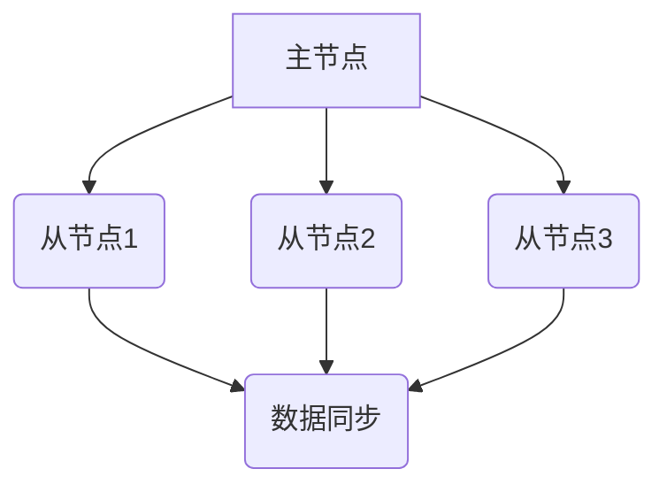
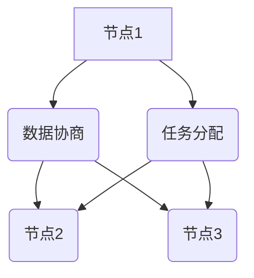

> 单领导集群，无领导集群，分布式系统，一致性，容错性，高可用性，算法设计，实践案例

## 1. 背景介绍

随着互联网技术的快速发展，分布式系统架构逐渐成为主流，其高并发、高可用、可扩展等特性满足了现代应用的需求。在分布式系统中，数据和任务的分布式处理是核心挑战之一。为了解决这个问题，出现了多种集群架构，其中单领导集群和无领导集群是两种常见的模式。

单领导集群，顾名思义，由一个主节点负责协调所有节点的操作，它负责分配任务、管理数据一致性等。无领导集群则没有明确的主节点，每个节点都是平等的，节点之间通过协商和通信来达成一致，共同完成任务。

本文将深入探讨单领导集群和无领导集群的原理、优缺点、算法设计以及实际应用场景，并通过案例分析，帮助读者更好地理解这两种集群架构的特点和应用场景。

## 2. 核心概念与联系

### 2.1 单领导集群

单领导集群的核心概念是**主从架构**，其中一个节点被选为主节点，负责管理集群的整体运作。其他节点称为从节点，它们负责执行主节点分配的任务，并同步数据。

**架构图：**



**优点：**

* **简单易懂：** 架构简单，易于理解和维护。
* **高性能：** 主节点负责决策和分配任务，可以提高整体处理效率。
* **数据一致性：** 主节点负责数据更新，可以保证数据的一致性。

**缺点：**

* **单点故障：** 主节点故障会导致整个集群瘫痪。
* **可扩展性有限：** 增加节点需要重新选举主节点，操作复杂。

### 2.2 无领导集群

无领导集群的核心概念是**分布式一致性**，每个节点都是平等的，通过协商和通信来达成一致，共同完成任务。

**架构图：**



**优点：**

* **高可用性：** 没有单点故障，节点故障不会影响整个集群的运作。
* **高可扩展性：** 随时可以添加或移除节点，无需重新选举。
* **容错性强：** 节点故障可以被其他节点自动弥补。

**缺点：**

* **复杂性高：** 实现分布式一致性算法比较复杂。
* **性能可能较低：** 节点之间需要进行协商和通信，可能会增加延迟。

## 3. 核心算法原理 & 具体操作步骤

### 3.1  算法原理概述

单领导集群和无领导集群都依赖于特定的算法来实现其核心功能。

* **单领导集群：** 通常使用**选举算法**来选择主节点，例如Paxos算法、Raft算法等。这些算法保证在主节点故障后，集群能够快速选举出新的主节点，并保证数据的一致性。
* **无领导集群：** 通常使用**分布式一致性算法**来保证节点之间的数据一致性，例如Paxos算法、Raft算法、ZooKeeper等。这些算法通过节点之间的协商和通信，确保所有节点都拥有最新的数据。

### 3.2  算法步骤详解

**Paxos算法：**

1. **提案阶段：** 主节点提出一个提案，并将其发送给所有节点。
2. **承诺阶段：** 节点收到提案后，如果接受该提案，则向主节点发送承诺消息。
3. **接受阶段：** 当主节点收到多数节点的承诺消息后，则将提案发送给所有节点，要求它们接受该提案。
4. **执行阶段：** 节点收到接受消息后，将执行该提案，并更新其本地数据。

**Raft算法：**

1. **选举阶段：** 当主节点故障时，集群会启动选举过程，节点会投票选择新的主节点。
2. **领导阶段：** 选出的主节点负责协调集群的运作，分配任务、管理数据一致性等。
3. **跟随阶段：** 从节点跟随主节点的指令，执行任务、同步数据等。

### 3.3  算法优缺点

**Paxos算法：**

* **优点：** 理论上可以保证数据的一致性，适用于各种类型的分布式系统。
* **缺点：** 实现复杂，性能较低，容易出现死锁。

**Raft算法：**

* **优点：** 实现相对简单，性能较好，更容易理解和维护。
* **缺点：** 只能用于特定类型的分布式系统，例如日志复制系统。

### 3.4  算法应用领域

* **Paxos算法：** 数据库、分布式文件系统、分布式锁等。
* **Raft算法：** 日志复制、分布式存储、分布式配置管理等。

## 4. 数学模型和公式 & 详细讲解 & 举例说明

### 4.1  数学模型构建

**Paxos算法的数学模型：**

* **状态空间：** 包括提案状态（未提交、提交）、节点状态（领导者、跟随者）、数据状态（一致、不一致）。
* **状态转移函数：** 根据节点之间的通信和提案的接受情况，更新节点状态和数据状态。
* **终止条件：** 所有节点的数据状态一致，且没有新的提案被提交。

**Raft算法的数学模型：**

* **状态空间：** 包括节点状态（领导者、跟随者）、日志状态（提交、未提交）、选举状态（选举中、未选举）。
* **状态转移函数：** 根据节点之间的通信和选举结果，更新节点状态和日志状态。
* **终止条件：** 节点状态稳定，日志状态一致。

### 4.2  公式推导过程

**Paxos算法的公式推导：**

* **承诺消息的发送条件：** 节点收到提案后，如果接受该提案，则发送承诺消息。
* **接受消息的发送条件：** 主节点收到多数节点的承诺消息后，则发送接受消息。
* **执行消息的发送条件：** 节点收到接受消息后，则执行该提案，并更新其本地数据。

**Raft算法的公式推导：**

* **选举投票的条件：** 节点收到其他节点的选举请求后，如果该节点没有成为领导者，则投票给该请求。
* **领导者选举的条件：** 节点获得多数票后，则成为领导者。
* **日志复制的条件：** 领导者将日志条目发送给所有节点，节点收到日志条目后，将其添加到本地日志中。

### 4.3  案例分析与讲解

**Paxos算法案例：**

假设有三个节点，A、B、C，其中A是主节点。A提出一个提案，并将其发送给B和C。B和C收到提案后，发送承诺消息给A。A收到多数节点的承诺消息后，发送接受消息给B和C。B和C收到接受消息后，执行该提案，并更新其本地数据。

**Raft算法案例：**

假设有三个节点，A、B、C，其中A是领导者。A将一个日志条目发送给B和C。B和C收到日志条目后，将其添加到本地日志中。如果A故障，则集群会启动选举过程，选择新的领导者。新的领导者将继续执行日志条目，并保证数据的一致性。

## 5. 项目实践：代码实例和详细解释说明

### 5.1  开发环境搭建

* 操作系统：Linux
* 编程语言：Go
* 工具：Docker、Kubernetes

### 5.2  源代码详细实现

```go
// 主节点代码
func main() {
    // 初始化集群
    cluster := NewCluster()
    // 接收提案
    proposal := receiveProposal()
    // 投票
    vote := cluster.Vote(proposal)
    // 提交提案
    if vote {
        cluster.Commit(proposal)
    }
}

// 从节点代码
func main() {
    // 初始化集群
    cluster := NewCluster()
    // 接收提案
    proposal := receiveProposal()
    // 投票
    vote := cluster.Vote(proposal)
    // 提交提案
    if vote {
        cluster.Commit(proposal)
    }
}
```

### 5.3  代码解读与分析

* 主节点负责接收提案、投票和提交提案。
* 从节点负责接收提案、投票和提交提案。
* `NewCluster()` 函数用于初始化集群。
* `receiveProposal()` 函数用于接收提案。
* `Vote()` 函数用于投票。
* `Commit()` 函数用于提交提案。

### 5.4  运行结果展示

运行代码后，可以观察到主节点和从节点之间的通信和数据同步过程。

## 6. 实际应用场景

### 6.1  数据库

* **单领导集群：** MySQL、PostgreSQL等数据库通常采用单领导集群架构，主节点负责数据写入和查询，从节点负责数据备份和读操作。
* **无领导集群：** Cassandra、MongoDB等数据库采用无领导集群架构，每个节点都存储完整的数据副本，可以实现高可用性和高容错性。

### 6.2  分布式文件系统

* **单领导集群：** Ceph、GlusterFS等分布式文件系统通常采用单领导集群架构，主节点负责协调数据存储和访问。
* **无领导集群：** HDFS、Erasure Coding等分布式文件系统采用无领导集群架构，每个节点都存储数据副本，可以实现高可用性和高容错性。

### 6.3  消息队列

* **单领导集群：** Kafka、RabbitMQ等消息队列通常采用单领导集群架构，主节点负责消息的生产和消费，从节点负责消息的备份和消费。
* **无领导集群：** Apache Pulsar等消息队列采用无领导集群架构，每个节点都存储消息副本，可以实现高可用性和高容错性。

### 6.4  未来应用展望

随着分布式系统的不断发展，单领导集群和无领导集群的应用场景将会更加广泛。未来，我们将看到更多基于这些架构的创新应用，例如：

* **边缘计算：** 无领导集群可以更好地支持边缘计算场景，实现数据本地处理和决策。
* **物联网：** 单领导集群可以更好地支持物联网场景，实现数据采集、处理和分析。
* **区块链：** 无领导集群可以更好地支持区块链场景，实现数据安全性和去中心化。

## 7. 工具和资源推荐

### 7.1  学习资源推荐

* **书籍：**
    * 《分布式系统的设计与实现》
    * 《深入理解Paxos》
    * 《Raft算法》
* **在线课程：**
    * Coursera: Distributed Systems
    * edX: Introduction to Distributed Systems
* **博客：**
    * Martin Kleppmann's blog
    * The Distributed Systems Blog

### 7.2  开发工具推荐

* **Docker:** 用于容器化应用部署
* **Kubernetes:** 用于容器编排和管理
* **etcd:** 用于分布式键值存储
* **ZooKeeper:** 用于分布式协调和配置管理

### 7.3  相关论文推荐

* **Paxos Made Live: An Account of Distributed Systems**
* **The Raft Consensus Algorithm**
* **Consistency and Availability in Distributed Systems**

## 8. 总结：未来发展趋势与挑战

### 8.1  研究成果总结

单领导集群和无领导集群是两种重要的分布式系统架构，它们各有优缺点，适用于不同的场景。Paxos算法和Raft算法是实现这些架构的关键算法，它们保证了数据的一致性和系统的高可用性。

### 8.2  未来发展趋势

* **更复杂的分布式系统：** 未来，分布式系统将更加复杂