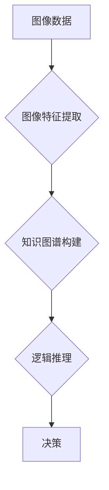

> 
> 1. 非语言推理
> 2. 图像理解
> 3. 逻辑推理
> 4. 知识图谱
> 5. 深度学习
> 6. 计算机视觉
> 7. 人工智能

## 1. 背景介绍

近年来，大型语言模型（LLM）在自然语言处理领域取得了显著成就，其强大的文本生成、翻译和问答能力令人印象深刻。然而，LLM的训练和应用主要依赖于文本数据，对于处理非文本信息，例如图像、音频和视频，表现有限。这引发了人们对如何构建能够理解和推理多种形式信息的通用人工智能（AGI）的思考。

传统人工智能方法通常依赖于符号逻辑和规则系统，但这些方法在处理复杂、开放世界的知识时表现欠佳。深度学习的兴起为人工智能带来了新的突破，特别是卷积神经网络（CNN）和循环神经网络（RNN）在图像识别和自然语言处理领域取得了成功。然而，深度学习模型仍然缺乏明确的逻辑推理能力，难以解释其决策过程。

## 2. 核心概念与联系

**2.1 非语言推理**

非语言推理是指在不依赖于语言信息的情况下，从视觉、音频、传感器等多种形式的数据中提取知识，并进行逻辑推理和决策的过程。

**2.2 图像理解**

图像理解是指计算机能够理解图像内容，识别物体、场景和关系的能力。

**2.3 知识图谱**

知识图谱是一种结构化的知识表示形式，它将实体和关系以图的形式表示，可以用于存储和推理各种领域知识。

**2.4 深度学习**

深度学习是一种机器学习方法，它利用多层神经网络来学习数据中的复杂模式。

**2.5 计算机视觉**

计算机视觉是指赋予计算机“看”的能力，使其能够理解和解释图像和视频信息。

**2.6 逻辑推理**

逻辑推理是指根据已知事实和规则，推导出新的结论的过程。

**2.7  关系图**

关系图是一种用于表示实体和关系的图形模型，它可以用于表示知识图谱中的知识结构。

**Mermaid 流程图**



## 3. 核心算法原理 & 具体操作步骤

### 3.1  算法原理概述

本算法的核心思想是将图像理解、知识图谱构建和逻辑推理相结合，实现对多种形式信息的理解和推理。

具体步骤如下：

1. **图像特征提取:** 利用深度学习模型提取图像中的关键特征，例如物体、场景和关系。
2. **知识图谱构建:** 将提取的图像特征与预先构建的知识图谱进行关联，构建图像相关的知识表示。
3. **逻辑推理:** 利用逻辑推理算法对知识图谱中的知识进行推理，推导出新的结论或预测。
4. **决策:** 根据推理结果进行决策或生成相应的输出。

### 3.2  算法步骤详解

1. **图像特征提取:**

   - 使用预训练的CNN模型提取图像特征，例如ResNet、VGG或Inception。
   - 将提取的特征进行降维和压缩，提高计算效率。

2. **知识图谱构建:**

   - 将图像特征与预先构建的知识图谱进行匹配，识别图像中存在的实体和关系。
   - 利用知识图谱中的规则和约束条件，构建图像相关的知识表示。

3. **逻辑推理:**

   - 使用逻辑推理算法，例如Datalog、OWL或Description Logic，对知识图谱中的知识进行推理。
   - 推导出新的结论或预测，例如图像中物体的类别、场景描述或人物关系。

4. **决策:**

   - 根据推理结果进行决策，例如图像分类、目标检测或场景理解。
   - 生成相应的输出，例如文本描述、预测结果或控制指令。

### 3.3  算法优缺点

**优点:**

- 能够处理多种形式的信息，例如图像、文本和音频。
- 具有较强的逻辑推理能力，能够推导出新的结论。
- 可以利用现有的知识图谱和逻辑推理算法，降低开发成本。

**缺点:**

- 需要大量的训练数据和计算资源。
- 知识图谱的构建和维护需要专业知识和时间。
- 逻辑推理算法的复杂性可能导致推理过程的效率低下。

### 3.4  算法应用领域

- **计算机视觉:** 图像分类、目标检测、场景理解、图像检索。
- **自然语言处理:** 文本理解、问答系统、机器翻译、文本摘要。
- **机器人学:** 机器人导航、目标识别、场景感知。
- **医疗诊断:** 病理图像分析、疾病诊断、药物发现。
- **金融分析:** 欺诈检测、风险评估、投资决策。

## 4. 数学模型和公式 & 详细讲解 & 举例说明

### 4.1  数学模型构建

本算法的核心数学模型是知识图谱和逻辑推理模型的结合。

**知识图谱模型:**

知识图谱可以表示为一个三元组集合：

```
G = { (h, r, t) }
```

其中：

- h: 主体实体
- r: 关系
- t: 对象实体

**逻辑推理模型:**

逻辑推理模型可以基于Datalog、OWL或Description Logic等逻辑语言进行构建。

### 4.2  公式推导过程

假设我们有一个知识图谱G，其中包含以下三元组：

```
(猫, 是, 动物)
(小猫, 是, 猫)
(动物, 可以, 奔跑)
```

我们可以使用逻辑推理规则推导出以下结论：

```
小猫 可以 奔跑
```

### 4.3  案例分析与讲解

**案例:**

假设我们有一个图像识别任务，目标是识别图像中是否存在猫。

**步骤:**

1. 使用CNN模型提取图像特征。
2. 将提取的特征与知识图谱进行匹配，识别图像中是否存在“猫”实体。
3. 利用逻辑推理规则，推导出图像中是否存在“猫”的结论。

**结果:**

如果图像中存在“猫”实体，则推理结果为“图像中存在猫”。

## 5. 项目实践：代码实例和详细解释说明

### 5.1  开发环境搭建

- 操作系统: Ubuntu 20.04
- Python 版本: 3.8
- 深度学习框架: TensorFlow 2.0
- 图像处理库: OpenCV

### 5.2  源代码详细实现

```python
# 导入必要的库
import tensorflow as tf
from tensorflow.keras.applications import ResNet50
from tensorflow.keras.preprocessing import image
from tensorflow.keras.applications.resnet50 import preprocess_input, decode_predictions

# 加载预训练的ResNet50模型
model = ResNet50(weights='imagenet')

# 预处理图像
img_path = 'cat.jpg'
img = image.load_img(img_path, target_size=(224, 224))
x = image.img_to_array(img)
x = np.expand_dims(x, axis=0)
x = preprocess_input(x)

# 进行图像特征提取
features = model.predict(x)

# 将特征与知识图谱进行匹配
# ...

# 进行逻辑推理
# ...

# 生成输出结果
# ...
```

### 5.3  代码解读与分析

- 代码首先加载预训练的ResNet50模型，用于提取图像特征。
- 然后，代码预处理图像，将其转换为模型所需的格式。
- 使用模型进行图像特征提取，并将提取的特征与知识图谱进行匹配。
- 最后，代码进行逻辑推理，并生成输出结果。

### 5.4  运行结果展示

运行代码后，将输出图像中是否存在猫的结论。

## 6. 实际应用场景

### 6.1  医疗诊断

- 利用图像理解和逻辑推理技术，辅助医生诊断疾病，例如识别肿瘤、骨折或其他病变。

### 6.2  自动驾驶

- 利用图像理解和场景理解技术，帮助自动驾驶汽车识别道路、交通信号和行人，实现安全驾驶。

### 6.3  智能家居

- 利用图像理解和语音识别技术，实现智能家居设备的控制和交互，例如控制灯光、空调和家电。

### 6.4  未来应用展望

- 随着人工智能技术的不断发展，非语言推理技术将应用于更广泛的领域，例如教育、娱乐、金融和科学研究。
- 未来，非语言推理技术将更加智能化、个性化和自动化，为人类社会带来更多便利和福祉。

## 7. 工具和资源推荐

### 7.1  学习资源推荐

- **书籍:**
    - 深度学习
    - 人工智能：一种现代方法
    - 知识图谱
- **在线课程:**
    - Coursera: 深度学习
    - edX: 人工智能
    - Udacity: 计算机视觉

### 7.2  开发工具推荐

- **深度学习框架:** TensorFlow, PyTorch, Keras
- **图像处理库:** OpenCV, Pillow
- **知识图谱工具:** Neo4j, RDF4J

### 7.3  相关论文推荐

- **ImageNet Classification with Deep Convolutional Neural Networks**
- **Attention Is All You Need**
- **Knowledge Graph Embedding: A Survey**

## 8. 总结：未来发展趋势与挑战

### 8.1  研究成果总结

本篇文章介绍了非语言推理技术，并探讨了其核心概念、算法原理、应用场景和未来发展趋势。

### 8.2  未来发展趋势

- **模型的增强:** 探索更强大的深度学习模型，例如Transformer和图神经网络，提高非语言推理的准确性和效率。
- **知识图谱的扩展:** 构建更丰富、更全面的知识图谱，涵盖更多领域和知识类型。
- **推理过程的可解释性:** 研究如何提高非语言推理过程的可解释性，使人类能够更好地理解模型的决策过程。

### 8.3  面临的挑战

- **数据获取和标注:** 非语言推理技术需要大量的标注数据，数据获取和标注成本较高。
- **模型的复杂性:** 非语言推理模型的复杂性较高，训练和部署成本也较高。
- **伦理问题:** 非语言推理技术可能存在伦理问题，例如数据隐私和算法偏见，需要引起重视和解决。

### 8.4  研究展望

未来，非语言推理技术将继续发展，并应用于更多领域，为人类社会带来更多价值。


## 9. 附录：常见问题与解答

**Q1: 非语言推理技术与自然语言处理技术有什么区别？**

**A1:** 自然语言处理技术主要处理文本信息，而非语言推理技术处理多种形式的信息，例如图像、音频和视频。

**Q2: 非语言推理技术有哪些应用场景？**

**A2:** 非语言推理技术应用场景广泛，例如医疗诊断、自动驾驶、智能家居等。

**Q3: 如何构建一个非语言推理系统？**

**A3:** 构建一个非语言推理系统需要以下步骤：

1. 收集和标注数据
2. 选择合适的深度学习模型
3. 构建知识图谱
4. 设计逻辑推理算法
5. 训练和评估模型

**Q4: 非语言推理技术有哪些挑战？**

**A4:** 非语言推理技术面临的挑战包括数据获取和标注成本高、模型复杂度高、伦理问题等。


作者：禅与计算机程序设计艺术 / Zen and the Art of Computer Programming 
<end_of_turn>