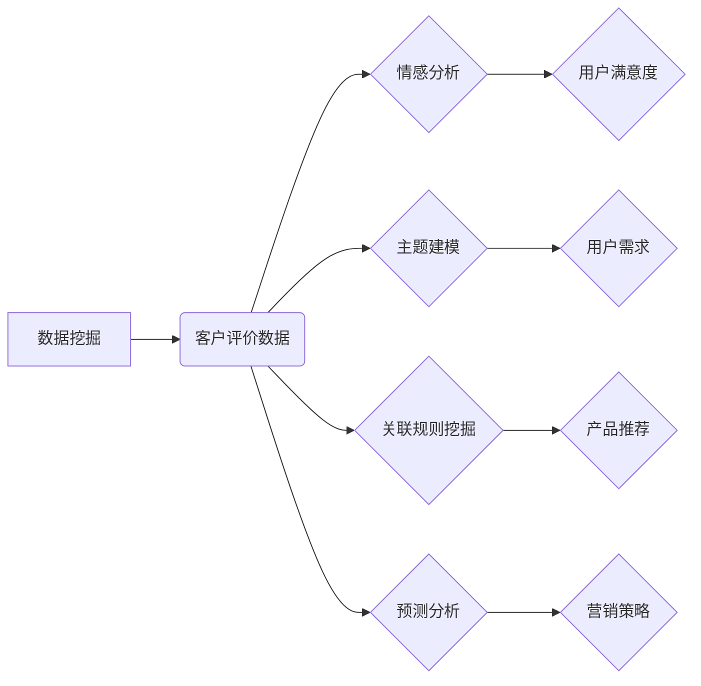

> 数据挖掘，客户评价，拼多多，情感分析，推荐系统，机器学习

## 1. 背景介绍

拼多多作为国内领先的社交电商平台，其用户规模庞大，每天产生海量的用户评价数据。这些评价数据蕴含着丰富的用户需求、产品质量和市场趋势信息，是企业进行产品优化、营销策略调整和用户体验提升的重要资源。然而，海量文本数据的分析和挖掘是一项复杂的任务，需要借助数据挖掘技术进行有效处理。

基于数据挖掘的客户评价研究，能够帮助企业从海量评价数据中提取有价值的信息，例如：

* **产品质量评估:** 通过分析用户评价中的正面、负面词语和情感倾向，可以对产品质量进行客观评估，并及时发现潜在问题。
* **用户需求分析:**  挖掘用户评价中的关键词和主题，可以了解用户对产品的期望和需求，为产品开发和改进提供参考。
* **营销策略优化:**  分析用户评价中的情感倾向和购买动机，可以帮助企业制定更有效的营销策略，提升用户转化率。
* **用户体验提升:** 通过分析用户评价中的痛点和建议，可以针对性地改进产品功能和服务，提升用户体验。

## 2. 核心概念与联系

**2.1 数据挖掘概述**

数据挖掘是指从大规模、复杂的数据集中发现隐藏的模式、规律和知识的过程。它利用统计学、机器学习、数据库技术等多种方法，对数据进行分析和处理，以提取有价值的信息。

**2.2 客户评价数据特点**

客户评价数据通常具有以下特点：

* **文本数据:**  评价内容主要以文本形式表达，需要进行文本预处理和分析。
* **海量数据:**  电商平台每天产生大量的用户评价数据，需要高效的存储和处理机制。
* **多模态数据:**  除了文本评价，用户评价还可能包含图片、视频等多模态信息，需要进行多模态数据融合分析。
* **动态变化:**  用户评价数据是动态变化的，需要实时更新和分析。

**2.3 数据挖掘技术应用**

数据挖掘技术可以应用于客户评价数据的分析和挖掘，例如：

* **情感分析:**  分析用户评价中的情感倾向，判断用户对产品的满意度。
* **主题建模:**  挖掘用户评价中的主题和关键词，了解用户对产品的关注点。
* **关联规则挖掘:**  发现用户评价中的关联规则，例如哪些产品经常被一起评价。
* **预测分析:**  预测用户未来的评价行为，例如是否会购买该产品。

**2.4  核心概念关系图**



## 3. 核心算法原理 & 具体操作步骤

### 3.1  算法原理概述

本研究主要采用以下数据挖掘算法：

* **情感分析算法:**  利用自然语言处理技术，对用户评价中的词语进行情感分类，判断用户对产品的正面、负面或中性评价。常用的情感分析算法包括：
    * 基于词典的方法：根据预先定义的词语情感词典，对用户评价中的词语进行情感标注。
    * 基于机器学习的方法：利用训练数据，训练机器学习模型，对用户评价进行情感分类。
* **主题建模算法:**  利用统计学方法，从用户评价中提取出主要的主题和关键词。常用的主题建模算法包括：
    * LDA算法：Latent Dirichlet Allocation，是一种概率模型，可以自动学习用户评价中的主题分布。
* **关联规则挖掘算法:**  利用统计学方法，从用户评价数据中挖掘出用户对不同产品的关联规则。常用的关联规则挖掘算法包括：
    * Apriori算法：一种基于频繁项集的关联规则挖掘算法。

### 3.2  算法步骤详解

**3.2.1 情感分析算法步骤:**

1. **数据预处理:**  对用户评价数据进行清洗、去停用词、分词等预处理操作。
2. **情感词典构建:**  构建一个包含情感词语及其情感倾向的词典。
3. **情感分类:**  利用情感词典或机器学习模型，对用户评价中的词语进行情感分类。
4. **情感倾向计算:**  计算用户评价的整体情感倾向，例如正面、负面或中性。

**3.2.2 主题建模算法步骤:**

1. **数据预处理:**  对用户评价数据进行清洗、去停用词、分词等预处理操作。
2. **主题建模:**  利用LDA算法等主题建模算法，从用户评价数据中提取出主要的主题和关键词。
3. **主题聚类:**  将提取出的主题进行聚类，形成更细粒度的主题分类。

**3.2.3 关联规则挖掘算法步骤:**

1. **数据预处理:**  对用户评价数据进行清洗、去停用词、分词等预处理操作。
2. **频繁项集挖掘:**  利用Apriori算法等频繁项集挖掘算法，找出用户评价中频繁出现的词语组合。
3. **关联规则生成:**  根据频繁项集，生成关联规则，例如哪些产品经常被一起评价。

### 3.3  算法优缺点

**3.3.1 情感分析算法:**

* **优点:**  能够快速准确地识别用户评价中的情感倾向。
* **缺点:**  对复杂语境和幽默语言的理解能力有限。

**3.3.2 主题建模算法:**

* **优点:**  能够自动学习用户评价中的主题分布，发现隐藏的主题结构。
* **缺点:**  需要大量的训练数据，对数据质量要求较高。

**3.3.3 关联规则挖掘算法:**

* **优点:**  能够发现用户评价中隐藏的关联规则，为产品推荐和营销策略提供 insights。
* **缺点:**  容易产生大量冗余规则，需要进行规则筛选和优化。

### 3.4  算法应用领域

* **电商平台:**  分析用户评价数据，提升产品质量、优化营销策略、提升用户体验。
* **金融行业:**  分析客户反馈数据，改进服务质量、识别潜在风险。
* **医疗行业:**  分析患者评价数据，提升医疗服务质量、发现疾病趋势。
* **教育行业:**  分析学生评价数据，改进教学方法、提升教学效果。

## 4. 数学模型和公式 & 详细讲解 & 举例说明

### 4.1  数学模型构建

**4.1.1 情感分析模型:**

假设用户评价文本为 T，情感词典为 D，每个词语的权重为 w。情感分析模型可以表示为：

$$
Sentiment(T) = \sum_{t \in T} w(t) * Sentiment(t)
$$

其中，Sentiment(t) 为词语 t 的情感倾向值，可以取正值、负值或零。

**4.1.2 主题建模模型:**

LDA模型假设每个文档是由多个主题组成的混合分布，每个主题又由一系列词语组成。LDA模型的概率分布可以表示为：

$$
P(z_i | \theta_d) = \theta_{d, z_i}
$$

$$
P(w_i | z_i, \beta) = \beta_{z_i, w_i}
$$

其中，$z_i$ 为词语 $w_i$ 所属的主题，$\theta_d$ 为文档 d 的主题分布，$\beta$ 为主题词语分布。

### 4.2  公式推导过程

**4.2.1 情感分析模型推导:**

情感分析模型的推导过程主要基于情感词典和词语权重。

* **情感词典构建:**  可以利用人工标注或机器学习方法构建情感词典。
* **词语权重计算:**  可以根据词语在用户评价中的出现频率、重要性等因素计算词语权重。

**4.2.2 主题建模模型推导:**

LDA模型的推导过程基于贝叶斯统计和概率图模型。

* **贝叶斯定理:**  LDA模型利用贝叶斯定理计算主题分布和词语分布的概率。
* **概率图模型:**  LDA模型可以用概率图模型表示，方便理解和推导。

### 4.3  案例分析与讲解

**4.3.1 情感分析案例:**

假设用户评价文本为“这款手机拍照效果很好，但是电池续航时间短”。

* 情感词典中，“很好”为正向情感词，“短”为负向情感词。
* 由于“很好”的权重高于“短”，因此该评价的整体情感倾向为正向。

**4.3.2 主题建模案例:**

假设用户评价数据包含多个关于手机的评价，LDA模型可以发现以下主题：

* 主题1：拍照效果
* 主题2：电池续航时间
* 主题3：屏幕尺寸

## 5. 项目实践：代码实例和详细解释说明

### 5.1  开发环境搭建

本项目使用 Python 语言进行开发，需要安装以下软件包：

* NLTK: 自然语言处理工具包
* Scikit-learn: 机器学习库
* Gensim: 主题建模库

### 5.2  源代码详细实现

```python
# 情感分析示例代码
import nltk
from nltk.sentiment import SentimentIntensityAnalyzer

nltk.download('vader_lexicon')

analyzer = SentimentIntensityAnalyzer()

text = "这款手机拍照效果很好，但是电池续航时间短。"

scores = analyzer.polarity_scores(text)

print(scores)

# 主题建模示例代码
from gensim import corpora
from gensim.models import LdaModel

# 数据预处理
# ...

# 创建词袋模型
dictionary = corpora.Dictionary(documents)
corpus = [dictionary.doc2bow(doc) for doc in documents]

# 训练LDA模型
lda_model = LdaModel(corpus=corpus, id2word=dictionary, num_topics=3)

# 打印主题分布
for idx, topic in lda_model.print_topics(-1):
    print('Topic: {} 
Words: {}'.format(idx, topic))
```

### 5.3  代码解读与分析

* **情感分析代码:**  利用 NLTK 库中的 SentimentIntensityAnalyzer 类进行情感分析，计算文本的正面、负面、中性情感分数。
* **主题建模代码:**  利用 Gensim 库中的 corpora 和 LdaModel 类进行主题建模，训练 LDA 模型并打印主题分布。

### 5.4  运行结果展示

运行上述代码后，可以得到以下结果：

* **情感分析结果:**  显示文本的正面、负面、中性情感分数。
* **主题建模结果:**  打印出 LDA 模型训练出的主题，以及每个主题对应的关键词。

## 6. 实际应用场景

### 6.1  拼多多产品质量评估

利用情感分析算法对拼多多用户评价数据进行分析，可以识别出哪些产品存在质量问题，并及时进行改进。例如，如果发现大量用户评价中出现“质量差”、“不符合描述”等负面词语，则需要对该产品进行质量检查和改进。

### 6.2  拼多多用户需求分析

利用主题建模算法对拼多多用户评价数据进行分析，可以挖掘出用户对产品的关注点和需求。例如，如果发现用户评价中频繁出现“价格”、“物流”等主题，则需要关注这些方面的用户体验。

### 6.3  拼多多产品推荐

利用关联规则挖掘算法对拼多多用户评价数据进行分析，可以发现用户对不同产品的关联规则，例如哪些产品经常被一起评价。可以利用这些规则，为用户推荐相关产品，提升用户购物体验。

### 6.4  未来应用展望

* **多模态数据融合:**  结合用户评价中的图片、视频等多模