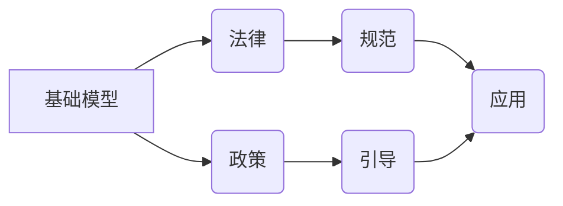

> 基础模型，人工智能，法律，政策，伦理，监管，可解释性，公平性，责任

## 1. 背景介绍

基础模型（Foundation Models）是近年来人工智能领域发展迅速的代表性技术之一。它们通常是规模庞大、训练数据海量的人工智能模型，能够在广泛的应用场景中进行泛化学习，例如文本生成、图像识别、语音合成等。基础模型的强大能力带来了前所未有的机遇，但也引发了广泛的法律和政策讨论。

随着基础模型的应用范围不断扩大，其潜在的影响力也日益凸显。基础模型可能被用于生成虚假信息、侵犯隐私、加剧社会分化等方面，因此需要制定相应的法律和政策框架来规范其发展和应用。

## 2. 核心概念与联系

**2.1 基础模型概述**

基础模型是指在海量数据上进行预训练的通用人工智能模型，能够在不同下游任务中进行微调，实现跨模态、跨领域的泛化能力。

**2.2 法律与政策的关联**

法律和政策是社会规范和秩序的基石，旨在维护社会公正、公平和稳定。人工智能技术的快速发展，特别是基础模型的出现，对现有的法律和政策体系提出了新的挑战。

**2.3 核心概念关系图**

## 3. 核心算法原理 & 具体操作步骤

**3.1 算法原理概述**

基础模型的训练主要基于深度学习算法，例如Transformer模型。这些模型通过学习海量文本数据，建立语言的表示和理解能力。

**3.2 算法步骤详解**

1. **数据收集和预处理:** 收集大量文本数据，并进行清洗、格式化等预处理操作。
2. **模型架构设计:** 选择合适的深度学习模型架构，例如Transformer模型。
3. **模型训练:** 使用训练数据对模型进行训练，调整模型参数，使其能够准确地理解和生成文本。
4. **模型评估:** 使用测试数据评估模型的性能，例如准确率、流畅度等。
5. **模型部署:** 将训练好的模型部署到实际应用场景中。

**3.3 算法优缺点**

**优点:**

* 泛化能力强，能够在不同下游任务中进行微调。
* 训练效率高，能够利用大规模计算资源进行训练。
* 表现力强，能够生成高质量的文本内容。

**缺点:**

* 训练成本高，需要大量的计算资源和数据。
* 可解释性差，难以理解模型的决策过程。
* 存在潜在的偏见和风险，可能生成不准确或有害的文本内容。

**3.4 算法应用领域**

* 文本生成：例如文章写作、故事创作、对话系统等。
* 语言翻译：将一种语言翻译成另一种语言。
* 文本摘要：提取文本的关键信息，生成简短的摘要。
* 情感分析：分析文本中的情感倾向，例如正面、负面、中性等。

## 4. 数学模型和公式 & 详细讲解 & 举例说明

**4.1 数学模型构建**

基础模型的训练通常基于概率模型，例如语言模型。语言模型的目标是学习文本的概率分布，即给定一个词序列，预测下一个词的概率。

**4.2 公式推导过程**

常用的语言模型是基于神经网络的Transformer模型。Transformer模型使用注意力机制来学习文本之间的关系，并使用多层神经网络进行特征提取。

**4.3 案例分析与讲解**

例如，在文本生成任务中，基础模型可以根据输入的文本序列，预测下一个词的概率分布。通过采样下一个词，并重复该过程，最终生成一段完整的文本。

## 5. 项目实践：代码实例和详细解释说明

**5.1 开发环境搭建**

使用Python语言和深度学习框架TensorFlow或PyTorch搭建开发环境。

**5.2 源代码详细实现**

使用预训练的Transformer模型，例如BERT或GPT-3，进行微调，实现文本生成任务。

**5.3 代码解读与分析**

解释代码中使用的函数、类和参数，以及模型训练和预测过程。

**5.4 运行结果展示**

展示模型训练的指标，例如准确率、困惑度等，以及模型生成的文本示例。

## 6. 实际应用场景

**6.1 文本生成**

* 自动写作：生成新闻报道、产品描述、广告文案等。
* 聊天机器人：构建更自然、更智能的对话系统。
* 代码生成：辅助程序员编写代码。

**6.2 语言翻译**

* 自动翻译：将文本从一种语言翻译成另一种语言。
* 多语言支持：为用户提供多语言的网站和应用程序。

**6.3 其他应用场景**

* 文本摘要
* 情感分析
* 问答系统
* 搜索引擎

**6.4 未来应用展望**

基础模型将在更多领域得到应用，例如医疗、教育、金融等。

## 7. 工具和资源推荐

**7.1 学习资源推荐**

* 深度学习书籍和课程
* 开源深度学习框架文档
* AI研究论文

**7.2 开发工具推荐**

* Python语言
* TensorFlow或PyTorch深度学习框架
* Jupyter Notebook

**7.3 相关论文推荐**

* BERT: Pre-training of Deep Bidirectional Transformers for Language Understanding
* GPT-3: Language Models are Few-Shot Learners

## 8. 总结：未来发展趋势与挑战

**8.1 研究成果总结**

基础模型在文本生成、语言翻译等领域取得了显著的成果，展现了强大的泛化能力和应用潜力。

**8.2 未来发展趋势**

* 模型规模和能力的进一步提升
* 多模态基础模型的开发
* 可解释性和安全性方面的研究

**8.3 面临的挑战**

* 训练成本和数据需求
* 可解释性和公平性问题
* 伦理和社会影响

**8.4 研究展望**

未来需要加强基础模型的安全性、可解释性和公平性研究，并制定相应的法律和政策框架，引导其健康发展。

## 9. 附录：常见问题与解答

* **基础模型的训练数据来源？**
* **基础模型的训练成本如何？**
* **基础模型的应用场景有哪些？**
* **基础模型存在哪些风险？**
* **如何应对基础模型带来的挑战？**

作者：禅与计算机程序设计艺术 / Zen and the Art of Computer Programming 
<end_of_turn>