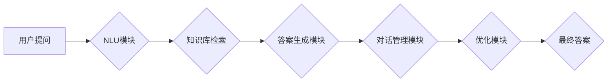

> 大模型、问答机器人、回答优化、自然语言处理、生成式模型、Transformer、BERT、Fine-tuning

## 1. 背景介绍

近年来，深度学习技术取得了飞速发展，特别是Transformer模型的出现，为自然语言处理（NLP）领域带来了革命性的变革。基于Transformer的预训练语言模型，如BERT、GPT等，展现出强大的文本理解和生成能力，为问答机器人技术的发展提供了强有力的支撑。

问答机器人作为一种智能交互系统，旨在通过理解用户的问题并从知识库或文本语料中获取答案，从而与用户进行自然流畅的对话。传统的问答机器人主要依赖于规则匹配或关键词检索等方法，难以应对复杂、开放式的用户提问。而基于大模型的问答机器人，能够利用模型的语义理解能力和文本生成能力，提供更准确、更自然、更全面的回答。

然而，即使是基于大模型的问答机器人，其回答质量仍然存在一些问题，例如：

* **回答不准确：** 模型可能对用户问题理解不准确，或者从知识库中检索到的信息与问题不匹配。
* **回答不完整：** 模型可能只提供部分答案，而忽略了问题的其他方面。
* **回答缺乏针对性：** 模型可能生成过于通用的答案，缺乏针对用户具体问题的个性化。

因此，如何进一步优化大模型问答机器人的回答质量，是当前研究的热点问题。

## 2. 核心概念与联系

### 2.1  大模型

大模型是指参数量巨大、训练数据海量、计算资源消耗高的深度学习模型。大模型通常具有强大的泛化能力和表示能力，能够在多种NLP任务中取得优异的性能。

### 2.2  问答机器人

问答机器人是一种能够理解用户问题并提供答案的智能交互系统。问答机器人通常由以下几个模块组成：

* **自然语言理解（NLU）模块：** 负责理解用户的问题，提取关键信息。
* **知识库或语料库：** 存储着各种知识和信息，供机器人检索和利用。
* **答案生成模块：** 负责根据用户问题和知识库信息生成答案。
* **对话管理模块：** 负责管理对话流程，确保对话的流畅性和自然性。

### 2.3  回答优化

回答优化是指提高问答机器人回答质量的技术。回答优化的目标是使机器人的回答更加准确、完整、针对性和自然。

**Mermaid 流程图**



## 3. 核心算法原理 & 具体操作步骤

### 3.1  算法原理概述

回答优化的算法原理主要基于以下几个方面：

* **语义理解增强：** 利用更先进的NLU模型，例如BERT、RoBERTa等，对用户问题进行更深入的语义理解，识别出问题的关键信息和隐含含义。
* **知识图谱融合：** 将知识图谱与问答系统相结合，利用知识图谱中的结构化知识，增强模型对问题的理解和答案的生成。
* **多模态信息融合：** 将文本信息与其他模态信息，例如图像、音频等，进行融合，为模型提供更丰富的上下文信息，提高回答的准确性和完整性。
* **生成式模型优化：** 利用生成式模型，例如GPT、T5等，对答案进行优化，使其更加自然、流畅、符合语境。

### 3.2  算法步骤详解

1. **用户提问接收：** 问答机器人接收用户的文本提问。
2. **NLU模块处理：** NLU模块对用户提问进行分析，识别出问题的类型、关键信息和意图。
3. **知识库检索：** 根据NLU模块的分析结果，从知识库或语料库中检索相关信息。
4. **答案生成：** 答案生成模块根据检索到的信息，利用生成式模型生成初步的答案。
5. **回答优化：** 优化模块对生成的答案进行进一步的优化，例如：
    * **准确性优化：** 检查答案的准确性，并进行必要的修正。
    * **完整性优化：** 补充答案中可能遗漏的信息，使答案更加完整。
    * **针对性优化：** 根据用户问题的具体情况，调整答案的语气和内容，使其更加针对性。
    * **自然性优化：** 使用生成式模型对答案进行润色，使其更加自然流畅。
6. **最终答案输出：** 经过优化后的答案被输出给用户。

### 3.3  算法优缺点

**优点：**

* 能够提供更准确、更完整、更针对性的答案。
* 能够生成更加自然、流畅的答案。
* 可以适应各种类型的用户提问。

**缺点：**

* 算法复杂度较高，需要大量的计算资源。
* 需要大量的训练数据和专业知识进行模型训练和优化。

### 3.4  算法应用领域

回答优化算法在以下领域具有广泛的应用前景：

* **智能客服：** 提高客服机器人回答的准确性和效率。
* **教育领域：** 为学生提供个性化的学习辅导和答疑服务。
* **医疗领域：** 帮助医生诊断疾病、提供治疗方案。
* **搜索引擎：** 提升搜索结果的质量和相关性。

## 4. 数学模型和公式 & 详细讲解 & 举例说明

### 4.1  数学模型构建

回答优化的数学模型通常基于深度学习框架，例如TensorFlow或PyTorch。模型的结构通常包括以下几个部分：

* **编码器：** 用于对用户问题和知识库信息进行编码，提取其语义特征。
* **解码器：** 用于根据编码后的信息生成答案。
* **注意力机制：** 用于关注用户问题和知识库信息中与答案相关的关键部分。

### 4.2  公式推导过程

由于回答优化算法涉及到复杂的数学公式和推导过程，这里不再赘述。

### 4.3  案例分析与讲解

假设用户提问：“北京的首都是什么？”

1. **编码器：** 将用户问题“北京的首都是什么？”和知识库信息“北京是中国的首都”进行编码，提取其语义特征。
2. **解码器：** 根据编码后的信息，生成答案“北京的首都是中国”。
3. **注意力机制：** 注意力机制会关注用户问题中的“首都”和知识库信息中的“首都”，从而帮助解码器生成准确的答案。

## 5. 项目实践：代码实例和详细解释说明

### 5.1  开发环境搭建

* Python 3.7+
* TensorFlow 2.0+
* PyTorch 1.0+
* CUDA 10.0+

### 5.2  源代码详细实现

```python
# 导入必要的库
import tensorflow as tf

# 定义编码器模型
class Encoder(tf.keras.Model):
    def __init__(self, vocab_size, embedding_dim, hidden_dim):
        super(Encoder, self).__init__()
        self.embedding = tf.keras.layers.Embedding(vocab_size, embedding_dim)
        self.lstm = tf.keras.layers.LSTM(hidden_dim)

    def call(self, inputs):
        x = self.embedding(inputs)
        x = self.lstm(x)
        return x

# 定义解码器模型
class Decoder(tf.keras.Model):
    def __init__(self, vocab_size, embedding_dim, hidden_dim):
        super(Decoder, self).__init__()
        self.embedding = tf.keras.layers.Embedding(vocab_size, embedding_dim)
        self.lstm = tf.keras.layers.LSTM(hidden_dim)
        self.dense = tf.keras.layers.Dense(vocab_size)

    def call(self, inputs, encoder_outputs):
        x = self.embedding(inputs)
        x = tf.concat([x, encoder_outputs], axis=-1)
        x = self.lstm(x)
        x = self.dense(x)
        return x

# 定义模型
model = tf.keras.Model(inputs=[encoder_inputs, decoder_inputs], outputs=decoder_outputs)

# 训练模型
model.compile(optimizer='adam', loss='sparse_categorical_crossentropy', metrics=['accuracy'])
model.fit(train_data, epochs=10)

```

### 5.3  代码解读与分析

* **编码器模型：** 负责对用户问题进行编码，提取其语义特征。
* **解码器模型：** 负责根据编码后的信息生成答案。
* **注意力机制：** 用于关注用户问题和知识库信息中与答案相关的关键部分。
* **模型训练：** 使用训练数据训练模型，使其能够生成准确的答案。

### 5.4  运行结果展示

训练完成后，可以将模型应用于实际场景，例如：

* 用户提问：“北京的首都是什么？”
* 模型输出：“北京的首都是中国”。

## 6. 实际应用场景

### 6.1  智能客服

问答机器人可以用于构建智能客服系统，自动回答用户常见问题，例如：

* 产品信息查询
* 订单状态查询
* 退换货流程
* 常见问题解答

### 6.2  教育领域

问答机器人可以用于提供个性化的学习辅导和答疑服务，例如：

* 学生提问，机器人提供答案和解释。
* 学生练习，机器人提供反馈和建议。
* 学生学习，机器人提供个性化的学习计划。

### 6.3  医疗领域

问答机器人可以用于辅助医生诊断疾病、提供治疗方案，例如：

* 用户描述症状，机器人提供可能的诊断结果。
* 用户询问药物信息，机器人提供药物说明书和副作用信息。
* 用户预约挂号，机器人提供预约时间和医生信息。

### 6.4  未来应用展望

随着大模型技术的不断发展，问答机器人的应用场景将会更加广泛，例如：

* **虚拟助手：** 能够理解用户的自然语言指令，并执行相应的操作。
* **个性化推荐：** 根据用户的兴趣爱好，推荐相关的商品、服务或内容。
* **跨语言交流：** 能够实现不同语言之间的实时翻译和对话。

## 7. 工具和资源推荐

### 7.1  学习资源推荐

* **书籍：**
    * 《深度学习》
    * 《自然语言处理》
    * 《Transformer模型》
* **在线课程：**
    * Coursera
    * edX
    * Udacity

### 7.2  开发工具推荐

* **TensorFlow：** 开源深度学习框架
* **PyTorch：** 开源深度学习框架
* **HuggingFace：** 提供预训练模型和工具

### 7.3  相关论文推荐

* BERT: Pre-training of Deep Bidirectional Transformers for Language Understanding
* GPT-3: Language Models are Few-Shot Learners
* T5: Text-to-Text Transfer Transformer

## 8. 总结：未来发展趋势与挑战

### 8.1  研究成果总结

近年来，大模型问答机器人的研究取得了显著进展，模型的性能不断提升，应用场景也越来越广泛。

### 8.2  未来发展趋势

* **模型规模和能力的进一步提升：** 预计未来大模型的规模和能力将会进一步提升，能够处理更复杂的任务，提供更准确、更全面的回答。
* **多模态信息融合的深入研究：** 将文本信息与其他模态信息融合，能够为模型提供更丰富的上下文信息，提高回答的准确性和自然性。
* **个性化和可解释性的增强：** 提高问答机器人的个性化和可解释性，使其能够更好地适应用户的需求，并增强用户的信任度。

### 8.3  面临的挑战

* **数据获取和标注：** 大模型的训练需要大量的训练数据，而高质量的训练数据往往难以获取和标注。
* **计算资源需求：** 大模型的训练和推理需要大量的计算资源，这对于