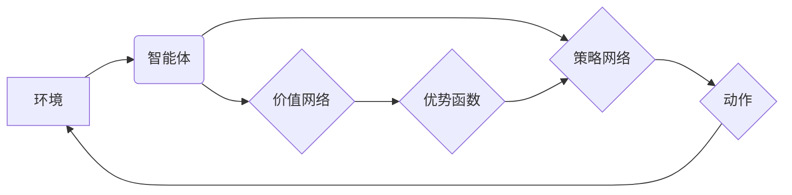

> 大语言模型、PPO算法、强化学习、策略梯度、优势函数、稳定性、应用场景

## 1. 背景介绍

近年来，大语言模型（LLM）在自然语言处理领域取得了显著进展，展现出强大的文本生成、翻译、问答等能力。这些模型通常基于Transformer架构，并通过海量文本数据进行预训练。然而，训练和部署大型语言模型仍然面临着巨大的挑战，其中之一就是如何高效地学习和优化模型参数。

强化学习（RL）作为一种机器学习范式，通过与环境交互，学习最优策略来最大化奖励。它在许多领域，如游戏、机器人控制等，取得了成功应用。将RL应用于LLM训练，可以使模型能够更好地理解上下文、生成更符合人类期望的文本，并适应不同的任务需求。

策略梯度算法是RL领域的重要方法之一，它通过直接优化策略网络的参数来学习最优策略。其中，Proximal Policy Optimization（PPO）算法是一种基于策略梯度的强化学习算法，它在稳定性和效率方面表现出色，成为训练大语言模型的热门选择。

## 2. 核心概念与联系

**2.1 核心概念**

* **强化学习 (Reinforcement Learning):**  一种机器学习方法，通过与环境交互，学习最优策略来最大化累积奖励。
* **策略 (Policy):**  描述智能体在不同状态下采取行动的概率分布。
* **价值函数 (Value Function):**  评估状态或状态-动作对的期望未来奖励。
* **优势函数 (Advantage Function):**  衡量当前动作相对于当前策略的平均价值。
* **策略梯度 (Policy Gradient):**  通过计算策略网络参数的梯度，更新策略网络参数，从而优化策略。

**2.2 架构图**



**2.3 联系**

PPO算法将强化学习的思想应用于大语言模型训练，通过优化策略网络的参数，使模型能够生成更符合人类期望的文本。

* **环境:**  文本生成任务的环境，例如对话系统、文本摘要等。
* **智能体:**  大语言模型，通过策略网络生成文本。
* **策略网络:**  负责根据输入文本生成下一个词的概率分布。
* **价值网络:**  评估当前状态的期望未来奖励。
* **优势函数:**  衡量当前动作相对于当前策略的价值。

## 3. 核心算法原理 & 具体操作步骤

### 3.1 算法原理概述

PPO算法的核心思想是通过策略梯度更新策略网络参数，同时通过一个称为“KL散度”的指标来限制策略更新的幅度，从而保证算法的稳定性。

PPO算法的主要步骤如下：

1. **收集经验:**  智能体与环境交互，收集状态、动作、奖励和下一个状态的经验数据。
2. **计算优势函数:**  使用价值网络计算每个状态-动作对的优势函数。
3. **更新策略网络:**  使用策略梯度更新策略网络参数，同时限制策略更新的幅度，以避免过大的策略变化导致训练不稳定。

### 3.2 算法步骤详解

1. **初始化:**  初始化策略网络和价值网络的参数。
2. **经验收集:**  使用策略网络与环境交互，收集经验数据。
3. **优势函数计算:**  使用价值网络计算每个状态-动作对的优势函数。
4. **策略更新:**  使用策略梯度更新策略网络参数，同时限制策略更新的幅度，以避免过大的策略变化导致训练不稳定。
5. **重复步骤2-4:**  重复上述步骤，直到达到预设的训练目标。

### 3.3 算法优缺点

**优点:**

* **稳定性:**  PPO算法通过限制策略更新的幅度，可以有效避免训练不稳定问题。
* **效率:**  PPO算法的训练速度相对较快，并且能够收敛到较好的解。
* **通用性:**  PPO算法可以应用于各种强化学习任务，包括大语言模型训练。

**缺点:**

* **参数设置:**  PPO算法需要一些超参数的设置，例如KL散度阈值，这些参数需要根据具体任务进行调整。
* **样本效率:**  PPO算法对样本效率要求较高，需要大量的经验数据才能训练出好的模型。

### 3.4 算法应用领域

PPO算法在以下领域有广泛的应用：

* **大语言模型训练:**  用于训练生成文本、翻译、问答等功能的大语言模型。
* **机器人控制:**  用于训练机器人执行复杂任务的策略。
* **游戏AI:**  用于训练游戏中的AI对手。
* **推荐系统:**  用于训练个性化推荐系统的策略。

## 4. 数学模型和公式 & 详细讲解 & 举例说明

### 4.1 数学模型构建

PPO算法的核心是策略梯度更新公式，其目标是最大化策略网络输出的期望奖励。

**策略网络:**  π(a|s)表示在状态s下采取动作a的概率分布。

**价值网络:**  V(s)表示状态s的期望未来奖励。

**优势函数:**  A(s, a) = Q(s, a) - V(s)，其中Q(s, a)表示状态s下采取动作a的期望奖励。

**目标函数:**  J(π) = E<sub>τ~π</sub>[R(τ)]，其中R(τ)是轨迹τ的总奖励。

### 4.2 公式推导过程

策略梯度更新公式如下：

```
θ = θ + α ∇<sub>θ</sub> J(π)
```

其中：

* θ是策略网络的参数。
* α是学习率。
* ∇<sub>θ</sub> J(π)是目标函数J(π)关于参数θ的梯度。

根据策略梯度理论，我们可以得到：

```
∇<sub>θ</sub> J(π) = E<sub>τ~π</sub>[∇<sub>θ</sub> log π(a|s) * A(s, a)]
```

### 4.3 案例分析与讲解

假设我们有一个简单的强化学习任务，智能体需要在两个状态之间切换，每个状态都有一个奖励值。

* 状态1:  奖励值=1
* 状态2:  奖励值=0

策略网络输出两个状态的概率分布，价值网络评估每个状态的期望未来奖励。

通过计算优势函数和策略梯度，我们可以更新策略网络参数，使智能体倾向于选择奖励值更高的状态。

## 5. 项目实践：代码实例和详细解释说明

### 5.1 开发环境搭建

* Python 3.7+
* TensorFlow/PyTorch
* 其他必要的库，例如NumPy、Pandas等

### 5.2 源代码详细实现

```python
import tensorflow as tf

# 定义策略网络
class PolicyNetwork(tf.keras.Model):
    def __init__(self, state_dim, action_dim):
        super(PolicyNetwork, self).__init__()
        self.dense1 = tf.keras.layers.Dense(64, activation='relu')
        self.dense2 = tf.keras.layers.Dense(action_dim, activation='softmax')

    def call(self, state):
        x = self.dense1(state)
        return self.dense2(x)

# 定义价值网络
class ValueNetwork(tf.keras.Model):
    def __init__(self, state_dim):
        super(ValueNetwork, self).__init__()
        self.dense1 = tf.keras.layers.Dense(64, activation='relu')
        self.dense2 = tf.keras.layers.Dense(1)

    def call(self, state):
        x = self.dense1(state)
        return self.dense2(x)

# PPO算法
class PPO:
    def __init__(self, state_dim, action_dim, learning_rate=0.001, gamma=0.99, clip_ratio=0.2):
        self.state_dim = state_dim
        self.action_dim = action_dim
        self.learning_rate = learning_rate
        self.gamma = gamma
        self.clip_ratio = clip_ratio
        self.policy_network = PolicyNetwork(state_dim, action_dim)
        self.value_network = ValueNetwork(state_dim)
        self.optimizer = tf.keras.optimizers.Adam(learning_rate=self.learning_rate)

    def train(self, states, actions, rewards, next_states, dones):
        # 计算优势函数
        advantages = self.calculate_advantages(rewards, dones, next_states)

        # 更新策略网络
        with tf.GradientTape() as tape:
            log_probs = self.policy_network(states)
            probs = tf.exp(log_probs)
            ratios = probs * tf.one_hot(actions, depth=self.action_dim) / tf.reduce_sum(probs, axis=1, keepdims=True)
            clipped_ratios = tf.clip_by_value(ratios, 1 - self.clip_ratio, 1 + self.clip_ratio)
            surrogate_loss = tf.minimum(ratios * advantages, clipped_ratios * advantages)
            value_loss = tf.reduce_mean(tf.square(self.value_network(states) - rewards))
            loss = -tf.reduce_mean(surrogate_loss) + 0.5 * value_loss

        gradients = tape.gradient(loss, self.policy_network.trainable_variables + self.value_network.trainable_variables)
        self.optimizer.apply_gradients(zip(gradients, self.policy_network.trainable_variables + self.value_network.trainable_variables))

    def calculate_advantages(self, rewards, dones, next_states):
        values = self.value_network(states)
        next_values = self.value_network(next_states)
        advantages = []
        for i in range(len(rewards) - 1, -1, -1):
            if i == len(rewards) - 1:
                advantage = rewards[i] - values[i]
            else:
                advantage = rewards[i] + self.gamma * next_values[i] * (1 - dones[i]) - values[i]
            advantages.insert(0, advantage)
        return tf.convert_to_tensor(advantages)

```

### 5.3 代码解读与分析

* **策略网络和价值网络:**  代码中定义了策略网络和价值网络，分别用于生成动作概率分布和评估状态价值。
* **PPO算法:**  代码中实现了PPO算法的核心逻辑，包括计算优势函数、更新策略网络和价值网络。
* **训练过程:**  训练过程包括收集经验数据、计算优势函数、更新策略网络和价值网络。

### 5.4 运行结果展示

训练完成后，可以评估模型的性能，例如在测试集上计算准确率、奖励等指标。

## 6. 实际应用场景

PPO算法在以下实际应用场景中表现出色：

* **对话系统:**  训练对话系统，使之能够更自然地与人类进行交流。
* **文本摘要:**  训练文本摘要模型，自动生成文本的简洁摘要。
* **机器翻译:**  训练机器翻译模型，将文本从一种语言翻译成另一种语言。
* **代码生成:**  训练代码生成模型，自动生成代码片段。

### 6.4 未来应用展望

随着大语言模型的发展，PPO算法在未来将有更广泛的应用场景，例如：

* **个性化教育:**  根据学生的学习情况，个性化定制学习内容和教学方法。
* **医疗诊断:**  辅助医生进行疾病诊断，提高诊断准确率。
* **科学研究:**  加速科学研究，发现新的知识和规律。

## 7.