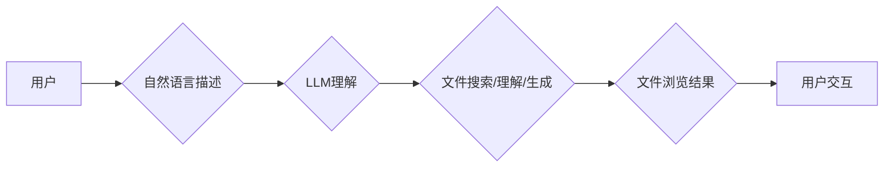

> 大语言模型，本地文件浏览，文件理解，文本生成，自然语言交互，文件管理，AI应用

## 1. 背景介绍

随着大语言模型（LLM）的快速发展，其强大的文本理解和生成能力已在各个领域展现出巨大的潜力。从聊天机器人到代码生成，LLM正在改变着我们与计算机交互的方式。然而，LLM的应用场景远不止于此。本文将探讨LLM在本地文件浏览领域的应用，探讨如何利用LLM的优势，实现更智能、更便捷的文件管理体验。

传统的文件浏览方式通常依赖于图形用户界面（GUI），用户需要通过鼠标和文件夹结构来查找和管理文件。这种方式存在着一定的局限性，例如：

* **搜索效率低:**  当文件数量庞大时，通过文件名或文件夹路径进行搜索效率低下。
* **文件理解能力不足:**  传统的GUI无法理解文件内容，只能根据文件名和扩展名进行分类和排序。
* **交互方式单一:**  用户只能通过鼠标点击和键盘输入进行操作，缺乏更自然、更直观的交互方式。

LLM的出现为解决这些问题提供了新的思路。通过训练大量的文本数据，LLM能够学习文件内容的语义信息，并利用其强大的文本生成能力，实现更智能、更便捷的文件浏览体验。

## 2. 核心概念与联系

### 2.1  大语言模型（LLM）

大语言模型是一种基于Transformer架构的深度学习模型，能够理解和生成人类语言。通过训练大量的文本数据，LLM可以学习语言的语法、语义和上下文关系，从而实现各种自然语言处理任务，例如文本分类、文本摘要、机器翻译等。

### 2.2  本地文件浏览

本地文件浏览是指在用户本地计算机上浏览和管理文件。传统的本地文件浏览方式通常依赖于图形用户界面（GUI），用户需要通过鼠标和文件夹结构来查找和管理文件。

### 2.3  LLM在本地文件浏览中的应用

将LLM应用于本地文件浏览，可以实现以下功能：

* **智能文件搜索:**  用户可以使用自然语言描述文件内容，LLM可以理解用户的意图，并返回匹配的文件。
* **文件内容理解:**  LLM可以分析文件内容，提取关键信息，并进行分类和排序。
* **文件生成:**  用户可以使用自然语言描述文件内容，LLM可以生成相应的文本文件。
* **文件管理:**  LLM可以帮助用户管理文件，例如创建文件夹、移动文件、删除文件等。

**核心概念与架构流程图:**



## 3. 核心算法原理 & 具体操作步骤

### 3.1  算法原理概述

LLM在本地文件浏览中的应用主要基于以下核心算法：

* **文本嵌入:** 将文本转换为向量表示，以便于模型进行计算和比较。
* **检索模型:**  根据用户查询和文件内容的文本嵌入，检索出匹配的文件。
* **文本生成:**  根据用户指令和文件内容，生成相应的文本文件。

### 3.2  算法步骤详解

1. **文件预处理:** 将本地文件转换为文本格式，并进行必要的预处理，例如去除停用词、分词等。
2. **文本嵌入:** 使用预训练的文本嵌入模型（例如Word2Vec、GloVe、BERT等）将文件内容和用户查询转换为向量表示。
3. **检索模型训练:** 使用训练数据（例如文件内容和对应的标签）训练检索模型，例如基于余弦相似度的检索模型或基于深度学习的检索模型。
4. **文件搜索:**  用户输入自然语言查询，将查询转换为向量表示，并使用训练好的检索模型检索出匹配的文件。
5. **文件内容理解:**  使用LLM对匹配的文件内容进行理解，提取关键信息，并进行分类和排序。
6. **文件生成:**  根据用户指令和文件内容，使用LLM生成相应的文本文件。

### 3.3  算法优缺点

**优点:**

* **智能搜索:**  用户可以使用自然语言描述文件内容，实现更智能的搜索体验。
* **文件理解:**  LLM可以理解文件内容，并进行分类和排序，提高文件管理效率。
* **自然交互:**  用户可以使用自然语言与系统交互，更便捷地管理文件。

**缺点:**

* **计算资源需求高:**  LLM训练和推理需要大量的计算资源。
* **数据隐私问题:**  LLM需要访问用户本地文件，可能会带来数据隐私问题。
* **模型准确性:**  LLM的理解和生成能力仍然存在一定的局限性，可能会出现错误的结果。

### 3.4  算法应用领域

LLM在本地文件浏览领域的应用具有广泛的应用前景，例如：

* **个人文件管理:**  帮助用户更智能地管理个人文件，例如查找、分类、整理等。
* **企业文件管理:**  帮助企业更有效地管理文件，例如搜索、共享、协作等。
* **学术研究:**  帮助研究人员更快速地查找和分析相关文献。
* **法律文件管理:**  帮助律师更快速地查找和分析法律文件。

## 4. 数学模型和公式 & 详细讲解 & 举例说明

### 4.1  数学模型构建

LLM的训练过程本质上是一个优化问题，目标是找到一个模型参数，使得模型在训练数据上的预测结果与真实标签尽可能接近。常用的数学模型包括：

* **交叉熵损失函数:**  用于分类任务，衡量模型预测结果与真实标签之间的差异。

$$
Loss = - \sum_{i=1}^{N} y_i \log(p_i)
$$

其中：

* $N$ 是样本数量
* $y_i$ 是真实标签
* $p_i$ 是模型预测概率

* **均方误差损失函数:**  用于回归任务，衡量模型预测结果与真实值之间的差异。

$$
Loss = \frac{1}{N} \sum_{i=1}^{N} (y_i - \hat{y}_i)^2
$$

其中：

* $N$ 是样本数量
* $y_i$ 是真实值
* $\hat{y}_i$ 是模型预测值

### 4.2  公式推导过程

LLM的训练过程通常使用梯度下降算法，通过不断更新模型参数，降低损失函数的值。梯度下降算法的核心思想是：沿着梯度方向更新模型参数，使得损失函数的值逐渐减小。

梯度下降算法的更新公式如下：

$$
\theta = \theta - \alpha \nabla Loss(\theta)
$$

其中：

* $\theta$ 是模型参数
* $\alpha$ 是学习率
* $\nabla Loss(\theta)$ 是损失函数关于模型参数的梯度

### 4.3  案例分析与讲解

假设我们训练一个LLM模型，用于识别文本中的情感倾向（例如正面、负面、中性）。我们可以使用交叉熵损失函数来衡量模型的预测结果与真实情感倾向之间的差异。

训练过程中，模型会不断更新参数，使得预测结果与真实情感倾向之间的差异逐渐减小。最终，模型能够识别文本中的情感倾向，并给出相应的预测结果。

## 5. 项目实践：代码实例和详细解释说明

### 5.1  开发环境搭建

* **操作系统:**  Linux/macOS/Windows
* **编程语言:**  Python
* **深度学习框架:**  TensorFlow/PyTorch
* **文本嵌入模型:**  Word2Vec/GloVe/BERT

### 5.2  源代码详细实现

```python
# 导入必要的库
import os
import nltk
from transformers import AutoTokenizer, AutoModel

# 下载预训练模型和词典
tokenizer = AutoTokenizer.from_pretrained("bert-base-uncased")
model = AutoModel.from_pretrained("bert-base-uncased")

# 文件预处理函数
def preprocess_file(file_path):
    with open(file_path, "r") as f:
        text = f.read()
    # 进行必要的预处理，例如去除停用词、分词等
    return text

# 文件搜索函数
def search_files(query, files):
    # 将查询转换为向量表示
    query_embedding = tokenizer.encode(query, add_special_tokens=True)
    # 计算文件向量与查询向量的相似度
    # ...
    # 返回相似度最高的N个文件
    return top_n_files

# 文件内容理解函数
def understand_file(file_path):
    # 读取文件内容
    text = preprocess_file(file_path)
    # 使用LLM对文件内容进行理解
    # ...
    # 返回文件内容的摘要、关键词等信息

# 文件生成函数
def generate_file(prompt, file_path):
    # 使用LLM生成文件内容
    # ...
    # 保存生成的文本文件

# 示例代码
if __name__ == "__main__":
    # 获取本地文件列表
    files = os.listdir(".")
    # 用户输入查询
    query = input("请输入查询内容: ")
    # 搜索匹配文件
    matched_files = search_files(query, files)
    # 打印匹配文件列表
    print("匹配文件:")
    for file in matched_files:
        print(file)
```

### 5.3  代码解读与分析

* **文件预处理:**  将文件转换为文本格式，并进行必要的预处理，例如去除停用词、分词等。
* **文本嵌入:**  使用预训练的文本嵌入模型将文件内容和用户查询转换为向量表示。
* **检索模型:**  使用训练好的检索模型检索出匹配的文件。
* **文件内容理解:**  使用LLM对匹配的文件内容进行理解，提取关键信息。
* **文件生成:**  根据用户指令和文件内容，使用LLM生成相应的文本文件。

### 5.4  运行结果展示

运行上述代码后，用户可以输入自然语言查询，系统会返回匹配的文件列表。用户还可以选择查看文件内容的摘要、关键词等信息，或者根据指令生成新的文本文件。

## 6. 实际应用场景

### 6.1  个人文件管理

LLM可以帮助个人更智能地管理文件，例如：

* **查找文件:**  用户可以使用自然语言描述文件内容，例如“查找关于机器学习的笔记”，LLM可以快速找到匹配的文件。
* **分类文件:**  LLM可以分析文件内容，自动将文件分类到不同的文件夹中，例如“工作文件”、“学习文件”、“个人文件”等。
* **整理文件:**  LLM可以帮助用户整理文件，例如合并重复的文件、删除不需要的文件等。

### 6.2  企业文件管理

LLM可以帮助企业更有效地管理文件，例如：

* **搜索文件:**  企业员工可以使用自然语言描述文件内容，例如“查找关于新产品的会议记录”，LLM可以快速找到匹配的文件。
* **共享文件:**  LLM可以帮助企业员工更方便地共享文件，例如根据文件内容自动推荐合适的共享对象。
* **协作文件:**  LLM可以帮助企业员工更有效地协作文件，例如自动生成文件修改记录、提醒文件过期等。

### 6.3  学术研究

LLM可以帮助研究人员更快速地查找和分析相关文献，例如：

* **文献检索:**  研究人员可以使用自然语言描述研究主题，LLM可以快速找到相关的文献。
* **文献摘要:**  LLM可以自动生成文献的摘要，帮助研究人员快速了解文献内容。
* **文献分析:**  LLM可以分析文献内容，提取关键信息，例如研究方法、研究结果、结论等。

### 6.4  未来应用展望

LLM在本地文件浏览领域的应用前景广阔，未来可能会有以下发展趋势：

* **更智能的搜索:**  LLM可以理解文件内容的语义信息，实现更智能的搜索体验。
* **更个性化的文件管理:**  LLM可以根据用户的习惯和偏好，提供更个性化的文件管理服务。
* **更丰富的交互方式:**  LLM可以支持语音、