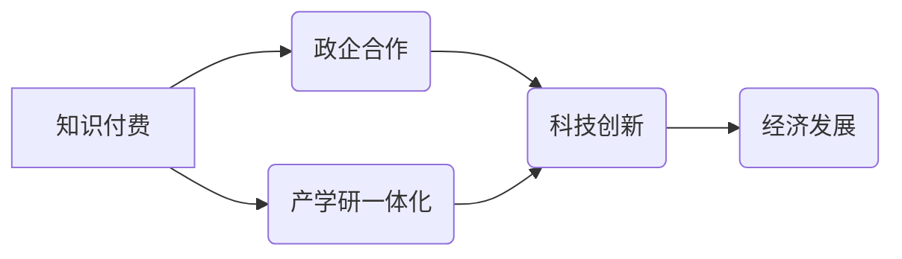

> 知识付费、政企合作、产学研一体化、人工智能、数据驱动、技术创新、人才培养

## 1. 背景介绍

当前，全球科技发展日新月异，人工智能、大数据、云计算等新兴技术蓬勃发展，为社会经济发展带来了前所未有的机遇。然而，科技创新是一个系统工程，需要政府、企业和高校等多方力量协同合作，才能实现资源的有效整合和科技成果的转化。

知识付费作为一种新型的知识传播模式，以其独特的价值链和商业模式，为政企合作与产学研一体化提供了新的思路和路径。

**1.1  政企合作的现状与挑战**

传统政企合作模式往往存在着信息不对称、利益分配不均、合作机制不完善等问题，难以有效促进科技成果的转化和产业发展。

**1.2  产学研一体化的重要性**

产学研一体化是推动科技创新、促进经济发展的重要战略。通过加强高校与企业的合作，可以有效促进科研成果的转化，提升企业的核心竞争力，推动经济转型升级。

**1.3  知识付费的优势**

知识付费模式以其独特的价值链和商业模式，能够有效解决政企合作和产学研一体化中的诸多问题。

* **信息共享:** 知识付费平台可以搭建一个信息共享平台，让政府、企业和高校能够及时了解彼此的需求和资源，促进合作共赢。
* **利益互惠:** 知识付费模式可以实现利益互惠，政府可以获得知识产权和技术成果，企业可以获得人才和技术支持，高校可以获得科研经费和实践机会。
* **机制完善:** 知识付费平台可以提供完善的合作机制，包括知识产权保护、利益分配、风险分担等，降低合作风险，提高合作效率。

## 2. 核心概念与联系

**2.1  知识付费**

知识付费是指以知识、技能、经验等为核心内容，通过线上线下等多种渠道，向用户提供付费学习服务的一种商业模式。

**2.2  政企合作**

政企合作是指政府和企业之间建立合作关系，共同参与科技创新、产业发展等领域的活动。

**2.3  产学研一体化**

产学研一体化是指高校、企业和科研机构之间建立密切的合作关系，共同参与科研项目、技术开发、人才培养等活动。

**2.4  知识付费与政企合作的结合**

知识付费可以为政企合作提供新的平台和机制，促进政府、企业和高校之间的信息共享、资源整合和利益互惠。

**2.5  知识付费与产学研一体化的结合**

知识付费可以为产学研一体化提供新的模式和动力，促进高校科研成果的转化，提升企业技术创新能力。

**2.6  核心概念关系图**



## 3. 核心算法原理 & 具体操作步骤

**3.1  算法原理概述**

知识付费平台的运营需要基于一系列的算法模型，例如用户画像算法、内容推荐算法、支付安全算法等。这些算法模型需要根据平台的具体业务需求和用户行为数据进行设计和优化。

**3.2  算法步骤详解**

* **用户画像算法:** 通过分析用户的学习行为、兴趣偏好、消费习惯等数据，构建用户的个性化画像，为用户提供更精准的学习推荐和个性化服务。
* **内容推荐算法:** 根据用户的学习历史、兴趣标签、平台内容的分类和标签等信息，推荐用户感兴趣和有学习价值的内容。
* **支付安全算法:** 利用加密技术、身份验证机制等技术，保障用户支付信息的安全和交易的可靠性。

**3.3  算法优缺点**

* **优点:** 能够提高平台的运营效率、用户体验和商业价值。
* **缺点:** 需要大量的用户数据和计算资源，算法模型的准确性和稳定性需要不断优化。

**3.4  算法应用领域**

* **教育培训:** 个性化学习推荐、课程内容匹配、学习进度跟踪等。
* **在线娱乐:** 内容推荐、用户画像分析、个性化广告投放等。
* **电商平台:** 商品推荐、用户画像分析、精准营销等。

## 4. 数学模型和公式 & 详细讲解 & 举例说明

**4.1  数学模型构建**

知识付费平台的运营可以抽象为一个多目标优化问题，目标函数可以包含用户满意度、平台收入、用户活跃度等指标。

**4.2  公式推导过程**

用户满意度可以根据用户对平台内容的评价、学习效果的反馈等信息进行量化，平台收入可以根据用户付费行为进行计算，用户活跃度可以根据用户登录频率、学习时长等信息进行衡量。

**4.3  案例分析与讲解**

假设一个知识付费平台提供两种类型的课程：付费课程和免费课程。平台的目标是最大化平台收入，同时保证用户满意度。

可以通过构建一个多目标优化模型，将平台收入和用户满意度作为目标函数，并根据用户行为数据和平台运营策略进行参数调整，从而找到最优的课程价格、内容推荐策略和用户服务策略。

## 5. 项目实践：代码实例和详细解释说明

**5.1  开发环境搭建**

* 操作系统: Ubuntu 20.04 LTS
* 编程语言: Python 3.8
* 开发框架: Django 3.2
* 数据库: PostgreSQL 13

**5.2  源代码详细实现**

```python
# models.py
from django.db import models

class Course(models.Model):
    title = models.CharField(max_length=255)
    description = models.TextField()
    price = models.DecimalField(max_digits=10, decimal_places=2)
    is_free = models.BooleanField(default=False)

# views.py
from django.shortcuts import render
from .models import Course

def course_list(request):
    courses = Course.objects.all()
    return render(request, 'course_list.html', {'courses': courses})
```

**5.3  代码解读与分析**

* models.py 文件定义了课程模型，包括课程标题、描述、价格和是否免费等字段。
* views.py 文件定义了课程列表页面的视图函数，从数据库中获取所有课程数据，并将其传递给模板文件进行渲染。

**5.4  运行结果展示**

运行上述代码后，可以访问 http://localhost:8000/courses/ 地址，查看课程列表页面。

## 6. 实际应用场景

**6.1  政府部门**

政府部门可以利用知识付费平台，提供政策解读、法律法规培训、技能提升课程等，提升政府工作人员的专业能力和服务水平。

**6.2  企业机构**

企业机构可以利用知识付费平台，提供行业知识、技术培训、管理咨询等服务，提升员工的专业技能和核心竞争力。

**6.3  高校科研机构**

高校科研机构可以利用知识付费平台，将科研成果转化为知识产品，向社会公众和企业提供技术咨询和服务，促进科技成果的推广应用。

**6.4  未来应用展望**

随着人工智能、大数据等技术的不断发展，知识付费平台将更加智能化、个性化和多元化。未来，知识付费平台将成为推动政企合作、产学研一体化和科技创新的重要平台。

## 7. 工具和资源推荐

**7.1  学习资源推荐**

* **在线课程平台:** Coursera, edX, Udemy
* **技术博客:** Hacker News, Medium, Stack Overflow
* **开源社区:** GitHub, GitLab

**7.2  开发工具推荐**

* **编程语言:** Python, Java, C++
* **开发框架:** Django, Flask, Spring Boot
* **数据库:** MySQL, PostgreSQL, MongoDB

**7.3  相关论文推荐**

* **知识付费模式研究:** 
* **政企合作与产学研一体化:** 
* **人工智能在知识付费领域的应用:** 

## 8. 总结：未来发展趋势与挑战

**8.1  研究成果总结**

本文探讨了知识付费在政企合作和产学研一体化中的应用，分析了其核心概念、算法原理、项目实践和实际应用场景。

**8.2  未来发展趋势**

* **智能化:** 利用人工智能技术，实现知识付费平台的智能化运营，提供更精准的学习推荐和个性化服务。
* **多元化:** 拓展知识付费平台的业务范围，提供更多类型的知识产品和服务，满足不同用户的需求。
* **国际化:** 推广知识付费模式到海外市场，促进全球知识共享和文化交流。

**8.3  面临的挑战**

* **知识产权保护:** 知识付费平台需要建立完善的知识产权保护机制，防止知识盗版和侵权行为。
* **用户信任:** 知识付费平台需要建立用户的信任，确保知识产品的质量和服务水平。
* **监管政策:** 知识付费行业需要完善的监管政策，规范市场秩序，保护用户权益。

**8.4  研究展望**

未来，我们将继续深入研究知识付费模式在政企合作和产学研一体化中的应用，探索其在推动科技创新、促进经济发展和提升社会福祉方面的潜力。

## 9. 附录：常见问题与解答

**9.1  知识付费平台如何保证知识产品的质量？**

知识付费平台会对知识产品进行严格的审核，确保其内容准确、可靠、有价值。平台还会鼓励用户对知识产品进行评价和反馈，以便及时改进和优化知识产品质量。

**9.2  知识付费平台如何保护用户的个人信息？**

知识付费平台会严格遵守相关法律法规，采取安全措施保护用户的个人信息，不会向第三方泄露用户隐私。

**9.3  如何选择适合自己的知识付费课程？**

用户可以根据自己的学习目标、兴趣爱好和时间安排，选择适合自己的知识付费课程。平台也会提供课程推荐和用户评价等信息，帮助用户做出选择。


作者：禅与计算机程序设计艺术 / Zen and the Art of Computer Programming 
<end_of_turn>