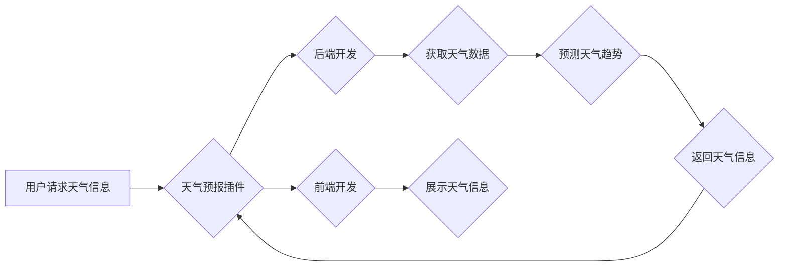

> 天气预报，插件开发，机器学习，深度学习，数据分析，天气模型，API接口，前端开发，后端开发

## 1. 背景介绍

随着科技的飞速发展，人工智能技术在各个领域得到广泛应用，其中天气预报领域也受益匪浅。传统的基于数值天气预报模型的天气预报，虽然有一定的准确性，但受限于计算能力和模型复杂度，难以捕捉天气变化的细微特征。而基于机器学习和深度学习的天气预报模型，能够从海量天气数据中学习模式，并预测未来天气趋势，具有更高的准确性和实时性。

本篇文章将以天气预报插件开发为例，深入探讨基于机器学习的天气预报技术，涵盖核心概念、算法原理、数学模型、代码实现以及实际应用场景等方面，帮助读者理解并掌握天气预报插件开发的流程和技巧。

## 2. 核心概念与联系

### 2.1  天气预报插件

天气预报插件是一种嵌入到其他应用程序或平台中的小型软件组件，能够提供实时或预报的天气信息。例如，我们可以将天气预报插件集成到聊天机器人、桌面应用程序、网站等，方便用户获取天气信息。

### 2.2  机器学习与深度学习

机器学习和深度学习是人工智能的核心技术，能够从数据中学习模式并进行预测。

* **机器学习**是一种算法，通过训练数据学习模型，并根据模型预测未来结果。常见的机器学习算法包括线性回归、逻辑回归、决策树、支持向量机等。

* **深度学习**是一种更高级的机器学习方法，利用多层神经网络模拟人类大脑的学习过程，能够处理更复杂的数据和任务。深度学习算法包括卷积神经网络（CNN）、循环神经网络（RNN）等。

### 2.3  天气预报模型

天气预报模型是基于物理定律和数学方程，模拟大气层变化的计算机程序。传统的数值天气预报模型，例如全球模式（Global Model）和区域模式（Regional Model），需要大量的计算资源和时间，并且难以捕捉天气变化的细微特征。而基于机器学习和深度学习的天气预报模型，能够从海量天气数据中学习模式，并预测未来天气趋势，具有更高的准确性和实时性。

### 2.4  API接口

API接口（Application Programming Interface）是软件之间通信的标准接口，允许不同的应用程序互相调用功能。天气预报插件通常会使用第三方天气预报API接口，例如OpenWeatherMap、WeatherAPI等，获取实时或预报的天气数据。

### 2.5  前端开发与后端开发

天气预报插件的开发通常需要前端开发和后端开发两个部分：

* **前端开发**负责用户界面设计和交互逻辑，例如展示天气信息、选择城市、设置预报时间等。

* **后端开发**负责数据处理、模型训练和API接口调用等，例如获取天气数据、预测天气趋势、存储用户数据等。

**核心概念与联系流程图**



## 3. 核心算法原理 & 具体操作步骤

### 3.1  算法原理概述

基于机器学习的天气预报模型，通常采用以下算法原理：

* **回归算法:** 用于预测连续数值型数据，例如温度、降雨量等。常见的回归算法包括线性回归、支持向量回归等。

* **分类算法:** 用于预测离散类别型数据，例如天气状况（晴天、阴天、雨天等）。常见的分类算法包括逻辑回归、决策树、支持向量机等。

* **时间序列分析:** 用于分析时间序列数据，例如历史天气数据，并预测未来天气趋势。常见的算法包括ARIMA、LSTM等。

### 3.2  算法步骤详解

基于机器学习的天气预报模型的开发步骤如下：

1. **数据收集:** 收集历史天气数据、地理位置数据、气象观测数据等。

2. **数据预处理:** 清洗数据、处理缺失值、特征工程等。

3. **模型选择:** 根据预测目标和数据特点选择合适的机器学习算法。

4. **模型训练:** 使用训练数据训练模型，并调整模型参数。

5. **模型评估:** 使用测试数据评估模型性能，例如准确率、召回率、F1-score等。

6. **模型部署:** 将训练好的模型部署到服务器，并提供API接口供其他应用程序调用。

### 3.3  算法优缺点

**优点:**

* **高准确率:** 基于机器学习的天气预报模型能够从海量数据中学习模式，并预测未来天气趋势，具有更高的准确性。

* **实时性:** 基于机器学习的天气预报模型能够实时更新天气信息，并提供即时预测。

* **可扩展性:** 基于机器学习的天气预报模型能够根据需要扩展数据和模型，提高预测精度。

**缺点:**

* **数据依赖:** 基于机器学习的天气预报模型需要大量高质量的数据进行训练，否则模型性能会下降。

* **模型复杂度:** 基于机器学习的天气预报模型的训练和部署需要一定的技术难度。

* **解释性:** 基于机器学习的天气预报模型的预测结果难以解释，难以理解模型是如何做出预测的。

### 3.4  算法应用领域

基于机器学习的天气预报模型在以下领域有广泛的应用:

* **天气预报服务:** 提供更准确、更实时的天气预报信息。

* **农业生产:** 预测天气变化，帮助农民制定种植计划和防灾措施。

* **交通运输:** 预测天气状况，优化交通路线和运输计划。

* **旅游业:** 提供个性化天气预报，帮助游客规划行程。

## 4. 数学模型和公式 & 详细讲解 & 举例说明

### 4.1  数学模型构建

天气预报模型通常基于物理定律和数学方程，模拟大气层变化。常见的数学模型包括：

* **热力学方程:** 描述气体温度、压力和体积之间的关系。

* **动量方程:** 描述气体运动的规律。

* **质量守恒方程:** 描述气体质量的守恒。

这些方程组成的系统，称为天气预报模型。

### 4.2  公式推导过程

天气预报模型的公式推导过程非常复杂，涉及大量的物理定律、数学原理和数值计算。

例如，热力学方程可以描述气体温度的变化，动量方程可以描述气流的运动，质量守恒方程可以描述气体的分布变化。

这些方程需要根据具体的地理位置、时间和气象条件进行求解，才能得到天气预报结果。

### 4.3  案例分析与讲解

假设我们想要预测某个地区的未来温度变化。我们可以使用热力学方程和动量方程，结合该地区的地理位置、气压、湿度等数据，进行数值模拟。

通过数值计算，我们可以得到未来几小时内该地区的温度变化趋势。

## 5. 项目实践：代码实例和详细解释说明

### 5.1  开发环境搭建

开发天气预报插件需要以下开发环境：

* **操作系统:** Windows、macOS、Linux等

* **编程语言:** Python、Java、JavaScript等

* **开发工具:** IDE、文本编辑器、版本控制系统等

* **数据库:** MySQL、PostgreSQL等

* **云服务:** AWS、Azure、GCP等

### 5.2  源代码详细实现

以下是一个使用Python语言开发天气预报插件的简单代码示例：

```python
import requests

def get_weather_data(city_name):
    api_key = "YOUR_API_KEY"
    base_url = "http://api.openweathermap.org/data/2.5/weather?"
    complete_url = base_url + "appid=" + api_key + "&q=" + city_name
    response = requests.get(complete_url)
    data = response.json()
    return data

if __name__ == "__main__":
    city_name = input("请输入城市名称: ")
    weather_data = get_weather_data(city_name)
    print("城市:", weather_data['name'])
    print("温度:", weather_data['main']['temp'])
    print("天气状况:", weather_data['weather'][0]['description'])
```

### 5.3  代码解读与分析

这段代码首先定义了一个`get_weather_data`函数，该函数接受城市名称作为参数，并使用OpenWeatherMap API接口获取该城市的实时天气数据。

然后，代码在主程序中获取用户输入的城市名称，调用`get_weather_data`函数获取天气数据，并打印出城市名称、温度和天气状况。

### 5.4  运行结果展示

运行这段代码后，用户需要输入城市名称，例如“北京”，程序会返回北京的实时天气信息，例如：

```
城市: 北京
温度: 283.15
天气状况: 阴天
```

## 6. 实际应用场景

### 6.1  天气预报服务

天气预报插件可以集成到天气预报网站、应用程序、智能家居设备等，提供更准确、更实时的天气预报信息。

### 6.2  农业生产

天气预报插件可以帮助农民预测天气变化，制定种植计划、防灾措施，提高农业生产效率。

### 6.3  交通运输

天气预报插件可以帮助交通运输部门预测天气状况，优化交通路线、运输计划，提高交通安全和效率。

### 6.4  未来应用展望

随着人工智能技术的不断发展，天气预报插件将拥有更强大的功能和更广泛的应用场景，例如：

* **个性化天气预报:** 根据用户的地理位置、兴趣爱好等信息，提供个性化的天气预报服务。

* **多语言支持:** 支持多种语言，方便全球用户使用。

* **语音交互:** 支持语音交互，方便用户获取天气信息。

* **增强现实:** 利用增强现实技术，将天气预报信息叠加到现实世界中，提供更直观的体验。

## 7. 工具和资源推荐

### 7.1  学习资源推荐

* **书籍:**

    * 《Python机器学习实战》
    * 《深度学习》

* **在线课程:**

    * Coursera: 深度学习
    * Udacity: 机器学习工程师

### 7.2  开发工具推荐

* **IDE:** PyCharm、VS Code

* **版本控制系统:** Git

* **云服务:** AWS、Azure、GCP

### 7.3  相关论文推荐

* **机器学习在天气预报中的应用:**

    * [Machine Learning for Weather Forecasting](https://arxiv.org/abs/1909.04933)

* **深度学习在天气预报中的应用:**

    * [Deep Learning for Weather Forecasting](https://arxiv.org/abs/1709.03218)

## 8. 总结：未来发展趋势与挑战

### 8.1  研究成果总结

基于机器学习的天气预报模型取得了显著的成果，能够提供更准确、更实时的天气预报信息，并应用于多个领域。

### 8.2  未来发展趋势

未来天气预报模型将朝着以下方向发展:

* **更精准的预测:** 利用更先进的机器学习算法和更丰富的训练数据，提高天气预报的准确率和预测范围。

* **更个性化的服务:** 根据用户的地理位置、兴趣爱好等信息，提供个性化的天气预报服务。

* **更智能的交互:** 支持语音交互、图像识别等技术，提供更智能的交互体验。

* **更广泛的应用:** 将天气预报技术应用于更多领域，例如农业、交通、