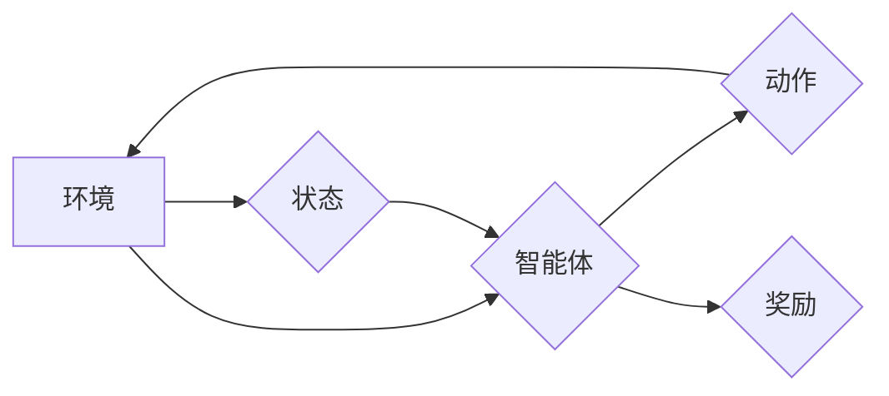

> 强化学习，物联网，IoT，智能决策，资源优化，机器学习，深度学习

## 1. 背景介绍

物联网（IoT）正以惊人的速度发展，连接着数以亿计的设备，从智能家居到工业自动化，再到智能城市，无处不在。随着物联网设备数量的激增，数据量的爆炸式增长也带来了新的挑战。如何有效地管理、分析和利用这些海量数据，以实现更智能、更高效的物联网应用，成为一个关键问题。

强化学习（Reinforcement Learning，RL）作为一种机器学习范式，在解决复杂决策问题方面展现出强大的潜力。它通过让智能体与环境交互，学习最优策略来最大化奖励，从而能够适应动态变化的环境，并做出智能决策。

## 2. 核心概念与联系

**2.1 物联网（IoT）**

物联网是指通过网络连接各种物理设备、传感器、软件和数据，形成一个互联互通的智能网络。物联网设备可以收集、处理和交换数据，实现远程控制、数据分析和智能决策。

**2.2 强化学习（RL）**

强化学习是一种机器学习方法，它通过奖励机制来训练智能体学习最优策略。智能体与环境交互，根据环境的反馈（奖励或惩罚）调整其行为，最终学习到能够最大化奖励的策略。

**2.3 RL在IoT中的应用**

将强化学习应用于物联网，可以实现以下目标：

* **智能决策:** RL可以帮助物联网设备做出更智能的决策，例如根据实时数据调整设备工作状态，优化资源分配，提高能源效率。
* **资源优化:** RL可以帮助物联网系统优化资源分配，例如动态调整网络带宽，降低网络拥塞，提高网络性能。
* **故障预测与预防:** RL可以学习设备运行模式，预测潜在故障，并采取措施进行预防，提高设备可靠性。

**2.4 架构图**



## 3. 核心算法原理 & 具体操作步骤

**3.1 算法原理概述**

强化学习的核心是智能体与环境的交互过程。智能体通过与环境交互，获得状态信息和奖励信号，并根据这些信息更新其策略，最终学习到能够最大化奖励的策略。

**3.2 算法步骤详解**

1. **初始化:** 智能体选择一个初始策略，并设置奖励函数。
2. **交互:** 智能体与环境交互，根据当前状态选择一个动作。
3. **反馈:** 环境根据智能体的动作产生新的状态和奖励信号。
4. **更新:** 智能体根据奖励信号更新其策略，使未来的策略能够获得更高的奖励。
5. **重复:** 重复步骤2-4，直到智能体学习到最优策略。

**3.3 算法优缺点**

**优点:**

* 可以学习复杂决策问题
* 可以适应动态变化的环境
* 不需要明确的规则和模型

**缺点:**

* 训练时间长
* 需要大量的训练数据
* 容易陷入局部最优解

**3.4 算法应用领域**

* 机器人控制
* 游戏人工智能
* 自动驾驶
* 医疗诊断
* 金融投资

## 4. 数学模型和公式 & 详细讲解 & 举例说明

**4.1 数学模型构建**

强化学习的数学模型通常由以下几个要素组成：

* **状态空间 (S):** 所有可能的系统状态的集合。
* **动作空间 (A):** 智能体可以采取的所有动作的集合。
* **奖励函数 (R):** 描述智能体在特定状态采取特定动作后获得的奖励的函数。
* **策略 (π):** 智能体在特定状态下选择动作的概率分布。

**4.2 公式推导过程**

强化学习的目标是找到一个最优策略 π*，使得智能体在与环境交互的过程中获得最大的累积奖励。

最优策略的定义是：

π* = argmax ∑t=0∞ γ^t R(s_t, a_t)

其中：

* γ 是折扣因子，控制未来奖励的权重。
* R(s_t, a_t) 是在状态 s_t 采取动作 a_t 后获得的奖励。

**4.3 案例分析与讲解**

例如，考虑一个简单的强化学习问题：一个机器人需要在迷宫中找到出口。

* 状态空间：迷宫中的所有位置。
* 动作空间：向上、向下、向左、向右四个方向。
* 奖励函数：到达出口时获得最大奖励，迷宫墙壁时获得惩罚。
* 策略：机器人根据当前位置选择一个动作，以最大化奖励。

通过强化学习算法，机器人可以学习到最优策略，找到最短路径到达出口。

## 5. 项目实践：代码实例和详细解释说明

**5.1 开发环境搭建**

* Python 3.x
* TensorFlow 或 PyTorch
* OpenAI Gym

**5.2 源代码详细实现**

```python
import gym
import numpy as np

# 定义环境
env = gym.make('CartPole-v1')

# 定义学习率
learning_rate = 0.1

# 定义折扣因子
gamma = 0.99

# 定义状态空间维度
state_dim = env.observation_space.shape[0]

# 定义动作空间维度
action_dim = env.action_space.n

# 初始化 Q 表
q_table = np.zeros((state_dim, action_dim))

# 训练循环
for episode in range(1000):
    state = env.reset()
    done = False

    while not done:
        # 选择动作
        action = np.argmax(q_table[state])

        # 执行动作
        next_state, reward, done, _ = env.step(action)

        # 更新 Q 值
        q_table[state, action] = (1 - learning_rate) * q_table[state, action] + learning_rate * (reward + gamma * np.max(q_table[next_state]))

        # 更新状态
        state = next_state

    print(f'Episode {episode+1} completed')

# 测试
state = env.reset()
while True:
    action = np.argmax(q_table[state])
    state, reward, done, _ = env.step(action)
    env.render()
    if done:
        break
env.close()
```

**5.3 代码解读与分析**

这段代码实现了一个简单的强化学习算法，用于训练一个机器人控制 CartPole 实验的智能体。

* 首先，定义了环境和学习参数。
* 然后，初始化了一个 Q 表，用于存储每个状态下每个动作的价值估计。
* 训练循环中，智能体与环境交互，根据 Q 表选择动作，执行动作，并根据奖励更新 Q 表。
* 训练完成后，可以测试智能体的性能。

**5.4 运行结果展示**

运行代码后，可以观察到智能体在 CartPole 实验中逐渐学习到控制杆的策略，并能够保持 CartPole 平衡更长时间。

## 6. 实际应用场景

**6.1 智能家居**

* 通过强化学习，智能家居设备可以根据用户的行为习惯和环境变化，自动调节温度、灯光、窗帘等，实现更加舒适和节能的居住体验。

**6.2 工业自动化**

* 强化学习可以帮助工业机器人优化生产流程，提高生产效率和产品质量。例如，机器人可以学习到最优的抓取路径，减少生产过程中的浪费和错误。

**6.3 智能交通**

* 强化学习可以应用于智能交通系统，例如优化交通信号灯控制，减少拥堵，提高交通效率。

**6.4 未来应用展望**

* **更智能的物联网设备:** 强化学习可以使物联网设备更加智能，能够自主学习和适应环境变化，提供更个性化和高效的服务。
* **更安全的物联网系统:** 强化学习可以帮助检测和预防网络攻击，提高物联网系统的安全性。
* **更可持续的物联网应用:** 强化学习可以帮助优化资源分配，提高物联网应用的能源效率和可持续性。

## 7. 工具和资源推荐

**7.1 学习资源推荐**

* **书籍:**
    * Reinforcement Learning: An Introduction by Richard S. Sutton and Andrew G. Barto
    * Deep Reinforcement Learning Hands-On by Maxim Lapan
* **在线课程:**
    * Coursera: Reinforcement Learning Specialization by David Silver
    * Udacity: Deep Reinforcement Learning Nanodegree

**7.2 开发工具推荐**

* **TensorFlow:** 深度学习框架，支持强化学习算法的实现。
* **PyTorch:** 深度学习框架，支持强化学习算法的实现。
* **OpenAI Gym:** 强化学习环境库，提供各种标准强化学习任务。

**7.3 相关论文推荐**

* Deep Q-Network (DQN)
* Proximal Policy Optimization (PPO)
* Trust Region Policy Optimization (TRPO)

## 8. 总结：未来发展趋势与挑战

**8.1 研究成果总结**

近年来，强化学习在物联网领域的应用取得了显著进展，例如智能家居、工业自动化、智能交通等领域都出现了基于强化学习的创新应用。

**8.2 未来发展趋势**

* **更强大的算法:** 研究人员将继续开发更强大的强化学习算法，例如能够处理更大规模和更复杂环境的算法。
* **更广泛的应用场景:** 强化学习将在更多物联网应用场景中得到应用，例如医疗保健、金融服务、教育等。
* **更安全的强化学习:** 研究人员将致力于开发更安全的强化学习算法，防止恶意攻击和数据泄露。

**8.3 面临的挑战**

* **数据获取和标注:** 强化学习算法需要大量的训练数据，获取和标注这些数据是一个挑战。
* **计算资源:** 训练大型强化学习模型需要大量的计算资源，这对于一些资源有限的物联网设备来说是一个挑战。
* **安全性和隐私性:** 强化学习算法可能会暴露用户的隐私信息，因此需要采取措施保护用户隐私。

**8.4 研究展望**

未来，强化学习将在物联网领域发挥越来越重要的作用，推动物联网技术的发展和应用。


## 9. 附录：常见问题与解答

**9.1 Q: 强化学习与监督学习有什么区别？**

**A:** 强化学习和监督学习都是机器学习的范式，但它们的区别在于数据获取方式和学习目标。

* **监督学习:** 使用标记数据训练模型，模型学习从输入到输出的映射关系。
* **强化学习:** 使用奖励信号训练模型，模型学习在特定环境中采取最优行动以最大化奖励。

**9.2 Q: 强化学习的训练时间长吗？**

**A:** 强化学习的训练时间取决于算法复杂度、环境规模和训练数据量等因素。一般来说，强化学习的训练时间比监督学习长。

**9.3 Q: 强化学习的应用场景有哪些？**

**A:** 强化学习的应用场景非常广泛，例如：

* 机器人控制
* 游戏人工智能
* 自动驾驶
* 医疗诊断
* 金融投资

**9.4 Q: 如何选择合适的强化学习算法？**

**A:** 选择合适的强化学习算法取决于具体的应用场景和问题特点。例如，对于离散动作空间的问题，可以使用 Q 学习算法；对于连续动作空间的问题，可以使用策略梯度算法。


作者：禅与计算机程序设计艺术 / Zen and the Art of Computer Programming 
<end_of_turn>