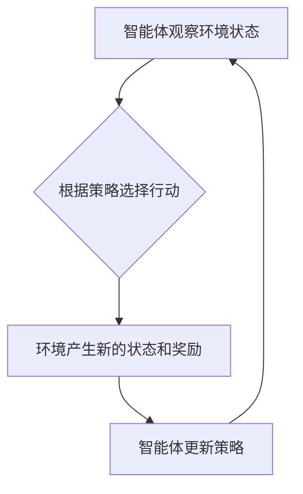

> 强化学习，机器学习，深度学习，强化算法，状态空间，奖励函数，策略梯度，价值函数，Q学习，SARSA

## 1. 背景介绍

在人工智能领域，强化学习 (Reinforcement Learning, RL) 作为一种重要的机器学习范式，近年来取得了显著进展，并在许多应用领域展现出强大的潜力。与监督学习和无监督学习不同，强化学习的核心在于让智能体通过与环境的交互学习最优策略，以最大化累积的奖励。

传统机器学习方法依赖于大量的标记数据，而强化学习则更侧重于学习过程中的探索和利用。智能体在与环境交互的过程中不断尝试不同的行动，并根据环境反馈的奖励信号调整策略，最终学习到能够在特定环境中取得最佳结果的策略。

强化学习的应用领域非常广泛，包括游戏、机器人控制、自动驾驶、医疗诊断、金融交易等。例如，AlphaGo 通过强化学习战胜了世界围棋冠军，DeepMind 的 AlphaStar 在星际争霸 II 中取得了职业水平的表现，自动驾驶汽车也越来越多地利用强化学习技术进行路径规划和决策控制。

## 2. 核心概念与联系

**2.1 强化学习基本要素**

强化学习的核心要素包括：

* **智能体 (Agent):**  学习和决策的实体，例如游戏中的角色、机器人、自动驾驶汽车等。
* **环境 (Environment):** 智能体所处的外部世界，包括状态、行动和奖励。
* **状态 (State):** 环境的当前描述，例如游戏中的棋盘状态、机器人的位置等。
* **行动 (Action):** 智能体可以执行的操作，例如游戏中的棋步、机器人的运动指令等。
* **奖励 (Reward):** 环境对智能体行动的反馈，可以是正向奖励或负向惩罚，用于指导智能体的学习。
* **策略 (Policy):** 智能体根据当前状态选择行动的规则，可以是确定性策略或概率性策略。

**2.2 强化学习流程**

强化学习的学习过程可以概括为以下步骤：

1. 智能体观察环境的当前状态。
2. 根据策略选择一个行动。
3. 环境根据行动产生新的状态和奖励。
4. 智能体根据奖励更新策略，以提高未来获得奖励的概率。

**2.3 强化学习的数学模型**

强化学习的数学模型通常使用马尔可夫决策过程 (Markov Decision Process, MDP) 来描述。MDP 包含以下要素：

* 状态空间 S
* 行动空间 A
* 状态转移概率 P(s', r | s, a)
* 奖励函数 R(s, a)
* 折扣因子 γ

**2.4 Mermaid 流程图**



## 3. 核心算法原理 & 具体操作步骤

**3.1 算法原理概述**

强化学习算法旨在学习一个策略，使智能体在与环境交互的过程中获得最大化的累积奖励。常见的强化学习算法包括：

* **Q学习:**  Q学习是一种基于价值函数的强化学习算法，它学习一个 Q 表，其中 Q(s, a) 表示从状态 s 执行行动 a 的期望累积奖励。
* **SARSA:** SARSA 是一种基于策略的强化学习算法，它学习一个策略 π，其中 π(s) 表示在状态 s 下执行的行动。
* **策略梯度:** 策略梯度算法直接优化策略参数，通过计算策略梯度来更新策略参数，以提高奖励期望。

**3.2 算法步骤详解**

**3.2.1 Q学习算法步骤**

1. 初始化 Q 表，将所有 Q(s, a) 设置为 0。
2. 在环境中进行交互，观察状态 s，选择行动 a。
3. 根据策略 π 选择行动 a。
4. 环境产生新的状态 s' 和奖励 r。
5. 更新 Q(s, a) 为：

```
Q(s, a) = Q(s, a) + α [r + γ max Q(s', a') - Q(s, a)]
```

其中：

* α 是学习率
* γ 是折扣因子

6. 重复步骤 2-5，直到 Q 表收敛。

**3.2.2 SARSA算法步骤**

1. 初始化 Q 表，将所有 Q(s, a) 设置为 0。
2. 在环境中进行交互，观察状态 s，选择行动 a。
3. 根据策略 π 选择行动 a。
4. 环境产生新的状态 s' 和奖励 r。
5. 更新 Q(s, a) 为：

```
Q(s, a) = Q(s, a) + α [r + γ Q(s', π(s')) - Q(s, a)]
```

其中：

* α 是学习率
* γ 是折扣因子
* π(s') 是在状态 s' 下根据策略 π 选择的行动

6. 重复步骤 2-5，直到 Q 表收敛。

**3.3 算法优缺点**

**3.3.1 Q学习**

* **优点:** 能够学习到最优策略，适用于离散状态和行动空间。
* **缺点:** 需要构建 Q 表，当状态和行动空间很大时，会面临存储和计算瓶颈。

**3.3.2 SARSA**

* **优点:** 不需要构建 Q 表，适用于连续状态和行动空间。
* **缺点:** 可能会陷入局部最优解，收敛速度较慢。

**3.4 算法应用领域**

* **游戏:** AlphaGo、AlphaStar
* **机器人控制:** 机器人导航、抓取、运动控制
* **自动驾驶:** 路径规划、决策控制
* **医疗诊断:** 疾病预测、治疗方案推荐
* **金融交易:** 股票交易、风险管理

## 4. 数学模型和公式 & 详细讲解 & 举例说明

**4.1 数学模型构建**

强化学习的数学模型通常使用马尔可夫决策过程 (MDP) 来描述。MDP 包含以下要素：

* **状态空间 S:** 所有可能的系统状态的集合。
* **行动空间 A:** 智能体在每个状态下可以执行的所有动作的集合。
* **状态转移概率 P(s', r | s, a):** 从状态 s 执行动作 a 后，转移到状态 s' 的概率，以及获得奖励 r 的概率。
* **奖励函数 R(s, a):** 智能体在状态 s 执行动作 a 后获得的奖励。
* **折扣因子 γ:**  衡量未来奖励的价值，0 < γ < 1。

**4.2 公式推导过程**

强化学习的目标是找到一个策略 π(s) ，使得智能体在与环境交互的过程中获得最大化的累积奖励。

**价值函数:**

价值函数 Vπ(s) 表示在状态 s 下，遵循策略 π 的期望累积奖励。

```
Vπ(s) = E[R(s, a) + γ R(s', a') + γ^2 R(s'', a'') + ... | s, π]
```

其中：

* E 表示期望值
* R(s, a) 是在状态 s 执行动作 a 后获得的奖励
* s', s'' 等表示后续状态

**策略梯度:**

策略梯度算法通过计算策略参数的梯度来更新策略参数，以提高奖励期望。

```
∇π J(π) = E[∇θ log π(a|s) * (R(s, a) + γ Vπ(s'))]
```

其中：

* J(π) 是策略 π 的奖励函数
* θ 是策略参数
* ∇θ 表示关于 θ 的梯度

**4.3 案例分析与讲解**

**案例:**  一个简单的强化学习问题是训练一个智能体学习玩一个简单的游戏，例如贪吃蛇。

* **状态空间:** 游戏中的蛇的位置和食物的位置。
* **行动空间:** 蛇可以向四个方向移动。
* **奖励函数:** 当蛇吃掉食物时获得奖励，当蛇撞到墙壁或自己身体时惩罚。
* **折扣因子:** 设置为 0.9，表示未来奖励的价值比当前奖励低。

可以使用 Q 学习算法或策略梯度算法来训练智能体学习玩这个游戏。

## 5. 项目实践：代码实例和详细解释说明

**5.1 开发环境搭建**

* Python 3.x
* TensorFlow 或 PyTorch
* OpenAI Gym

**5.2 源代码详细实现**

```python
import gym
import numpy as np

# 定义环境
env = gym.make('CartPole-v1')

# 定义学习率
alpha = 0.1

# 定义折扣因子
gamma = 0.99

# 定义 Q 表
q_table = np.zeros((env.observation_space.n, env.action_space.n))

# 训练循环
for episode in range(1000):
    state = env.reset()
    done = False

    while not done:
        # 选择行动
        action = np.argmax(q_table[state])

        # 执行行动
        next_state, reward, done, _ = env.step(action)

        # 更新 Q 表
        q_table[state, action] = q_table[state, action] + alpha * (reward + gamma * np.max(q_table[next_state]) - q_table[state, action])

        # 更新状态
        state = next_state

    print(f'Episode {episode+1} completed')

# 测试
state = env.reset()
while True:
    action = np.argmax(q_table[state])
    state, reward, done, _ = env.step(action)
    env.render()
    if done:
        break
env.close()
```

**5.3 代码解读与分析**

* 代码首先定义了环境和学习参数，然后构建了一个 Q 表来存储状态-行动对的价值估计。
* 训练循环中，智能体在环境中进行交互，选择行动，执行行动，并根据奖励更新 Q 表。
* 测试阶段，智能体使用训练好的 Q 表选择行动，并与环境交互，展示学习到的策略。

**5.4 运行结果展示**

运行代码后，智能体将在环境中学习并最终能够完成任务，例如在 CartPole-v1 环境中保持平衡杆的平衡时间越来越长。

## 6. 实际应用场景

**6.1 游戏 AI**

强化学习在游戏 AI 中取得了显著进展，例如 AlphaGo、AlphaStar 等游戏 AI 都是基于强化学习算法训练的。

**6.2 机器人控制**

强化学习可以用于训练机器人执行各种任务，例如导航、抓取、运动控制等。

**6.3 自动驾驶**

自动驾驶汽车也越来越多地利用强化学习技术进行路径规划和决策控制。

**6.4 医疗诊断**

强化学习可以用于辅助医生进行疾病诊断，例如预测疾病风险、推荐治疗方案等。

**6.5 金融交易**

强化学习可以用于股票交易、风险管理等金融领域。

**6.6 未来应用展望**

强化学习在未来将有更广泛的应用，例如：

* 个性化教育
* 智能家居
* 医疗保健
* 科学研究

## 7. 工具和资源推荐

**7.1 学习资源推荐**

* **书籍:**
    * Reinforcement Learning: An Introduction by Richard S. Sutton and Andrew G. Barto
    * Deep Reinforcement Learning Hands-On by Maxim Lapan
* **在线课程:**
    * Coursera: Reinforcement Learning Specialization by David Silver
    * Udacity: Deep Reinforcement Learning Nanodegree

**7.2 开发工具推荐**

* **TensorFlow:**  开源深度学习框架，支持强化学习算法的实现。
* **PyTorch:**  开源深度学习框架，也支持强化学习算法的实现。
* **OpenAI Gym:**  强化学习环境库，提供各种标准的强化学习任务。

**7.3 相关论文推荐**

* Deep Reinforcement Learning with Double Q-