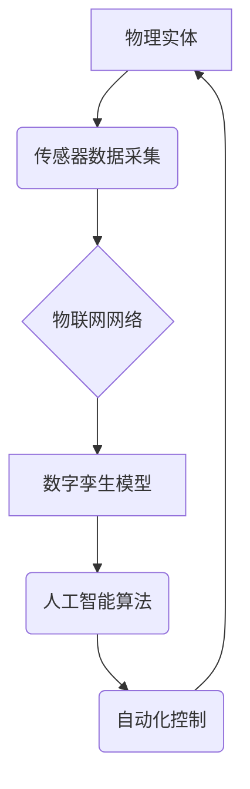

> 数字孪生、物理实体、自动化、机器学习、人工智能、物联网、数据驱动

## 1. 背景介绍

随着信息技术的飞速发展，数字技术与物理世界之间的融合日益紧密。数字孪生技术作为连接虚拟世界与现实世界的桥梁，正在深刻地改变着我们对实体世界的感知和交互方式。数字孪生是指基于物理实体构建的虚拟模型，它能够实时反映物理实体的状态、行为和运行情况。通过对数字孪生的模拟和分析，我们可以更好地理解物理实体的运作机制，预测其未来状态，并进行优化控制。

数字孪生技术在多个领域展现出巨大的应用潜力，例如：

* **制造业：** 数字孪生可以用于产品设计、生产过程优化、设备故障预测和维护管理等方面。
* **能源行业：** 数字孪生可以用于能源生产、输配电、能源管理等方面的优化和控制。
* **交通运输：** 数字孪生可以用于交通流量预测、道路安全管理、智能交通系统等方面的建设。
* **医疗保健：** 数字孪生可以用于虚拟手术模拟、个性化医疗方案设计、疾病预测和治疗方案优化等方面。

## 2. 核心概念与联系

数字实体与物理实体的自动化前景的核心概念包括：

* **数字孪生：** 虚拟模型，实时反映物理实体的状态、行为和运行情况。
* **物联网：** 物理实体之间的互联互通，通过传感器和网络技术收集和传输数据。
* **人工智能：** 利用机器学习和深度学习等算法，赋予数字孪生智能化能力，实现自主学习、决策和控制。
* **自动化：** 通过数字孪生和人工智能技术，实现物理实体的自动化控制和管理。

**核心概念架构：**



## 3. 核心算法原理 & 具体操作步骤

### 3.1  算法原理概述

数字实体与物理实体的自动化主要依赖于机器学习和深度学习算法。这些算法能够从传感器数据中学习物理实体的运行规律，并预测其未来状态。常见的算法包括：

* **回归算法：** 用于预测连续数值输出，例如温度、压力、流量等。
* **分类算法：** 用于分类不同的状态或事件，例如故障诊断、异常检测等。
* **强化学习算法：** 用于训练智能体在特定环境中做出最优决策，例如机器人控制、无人驾驶等。

### 3.2  算法步骤详解

1. **数据采集：** 从物理实体收集相关数据，例如传感器数据、操作记录、环境信息等。
2. **数据预处理：** 对采集到的数据进行清洗、转换、特征提取等处理，使其适合机器学习算法的训练。
3. **模型训练：** 选择合适的机器学习算法，并利用预处理后的数据进行模型训练。
4. **模型评估：** 使用测试数据评估模型的性能，例如准确率、召回率、F1-score等。
5. **模型部署：** 将训练好的模型部署到实际应用场景中，用于预测物理实体的状态或控制其行为。

### 3.3  算法优缺点

**优点：**

* **数据驱动：** 基于大量数据进行训练，能够学习到物理实体的复杂运行规律。
* **自动化控制：** 实现物理实体的自动化控制和管理，提高效率和安全性。
* **预测能力：** 能够预测物理实体的未来状态，帮助提前预防和解决问题。

**缺点：**

* **数据依赖：** 算法性能依赖于数据质量和数量，数据不足或质量差会导致模型性能下降。
* **黑盒问题：** 一些机器学习算法难以解释其决策过程，导致模型的可解释性差。
* **安全风险：** 算法的漏洞可能被恶意攻击，导致物理实体的安全风险。

### 3.4  算法应用领域

数字实体与物理实体的自动化算法广泛应用于以下领域：

* **智能制造：** 产品设计优化、生产过程控制、设备故障预测和维护管理。
* **智能能源：** 能源生产优化、输配电控制、能源管理系统。
* **智能交通：** 交通流量预测、道路安全管理、智能交通信号灯控制。
* **智能医疗：** 虚拟手术模拟、个性化医疗方案设计、疾病预测和治疗方案优化。

## 4. 数学模型和公式 & 详细讲解 & 举例说明

### 4.1  数学模型构建

数字实体与物理实体的自动化通常使用状态空间模型来描述物理实体的动态行为。状态空间模型将物理实体的状态和输入输出关系表示为一组微分方程。

**状态空间模型：**

```
ẋ = f(x, u, t)
y = g(x, u, t)
```

其中：

* x：状态向量，描述物理实体的当前状态。
* u：输入向量，描述物理实体的控制输入。
* y：输出向量，描述物理实体的输出信号。
* f：状态方程，描述状态随时间的变化规律。
* g：输出方程，描述输出信号与状态的关系。
* t：时间变量。

### 4.2  公式推导过程

状态空间模型的推导过程通常依赖于物理实体的物理定律和数学描述。例如，对于一个机械系统，其状态空间模型可以基于牛顿第二定律推导出来。

**牛顿第二定律：**

```
F = ma
```

其中：

* F：力
* m：质量
* a：加速度

通过将力、质量、加速度等物理量转换为状态变量和输入变量，可以得到机械系统的状态空间模型。

### 4.3  案例分析与讲解

**案例：** 温度控制系统

假设有一个温度控制系统，其目标是将房间温度保持在设定值。我们可以使用状态空间模型来描述该系统的行为。

* 状态变量：房间温度
* 输入变量：加热器功率
* 输出变量：房间温度

状态方程可以描述房间温度随时间的变化规律，例如：

```
ẋ = (Q - Kx) / C
```

其中：

* x：房间温度
* Q：加热器功率
* K：热损失系数
* C：房间热容量

输出方程直接等于状态变量：

```
y = x
```

通过训练机器学习算法，我们可以学习到该系统的状态方程和输出方程，并利用这些模型来控制加热器功率，实现房间温度的自动控制。

## 5. 项目实践：代码实例和详细解释说明

### 5.1  开发环境搭建

* 操作系统：Ubuntu 20.04 LTS
* Python 版本：3.8.10
* 库依赖：NumPy、Pandas、Scikit-learn、TensorFlow

### 5.2  源代码详细实现

```python
import numpy as np
from sklearn.linear_model import LinearRegression

# 训练数据
X = np.array([[1], [2], [3], [4], [5]])
y = np.array([2, 4, 6, 8, 10])

# 创建线性回归模型
model = LinearRegression()

# 训练模型
model.fit(X, y)

# 预测新数据
new_data = np.array([[6]])
prediction = model.predict(new_data)

# 打印预测结果
print(f"预测结果: {prediction}")
```

### 5.3  代码解读与分析

这段代码演示了如何使用Scikit-learn库中的线性回归模型进行预测。

1. 首先，我们导入必要的库，并定义训练数据和目标变量。
2. 然后，我们创建了一个线性回归模型对象。
3. 接着，我们使用`fit()`方法训练模型，将训练数据作为输入。
4. 训练完成后，我们可以使用`predict()`方法预测新数据的输出值。
5. 最后，我们打印预测结果。

### 5.4  运行结果展示

```
预测结果: [12.]
```

## 6. 实际应用场景

### 6.1  智能制造

数字孪生技术可以用于模拟和优化制造过程，例如：

* **产品设计优化：** 通过数字孪生模型，可以模拟不同设计方案的性能，并选择最佳方案。
* **生产过程控制：** 数字孪生模型可以实时监控生产过程，并根据实际情况进行调整，提高生产效率和产品质量。
* **设备故障预测和维护管理：** 通过分析设备的运行数据，数字孪生模型可以预测设备故障，并提前进行维护，降低停机时间和维修成本。

### 6.2  智能能源

数字孪生技术可以用于优化能源生产、输配电和管理，例如：

* **能源生产优化：** 数字孪生模型可以模拟不同能源生产方式的效率，并选择最佳方案。
* **输配电控制：** 数字孪生模型可以实时监控输配电网络的状态，并根据实际情况进行调整，提高能源传输效率和可靠性。
* **能源管理系统：** 数字孪生模型可以帮助用户更好地了解自己的能源使用情况，并提供个性化的节能建议。

### 6.3  智能交通

数字孪生技术可以用于优化交通流量、提高道路安全和建设智能交通系统，例如：

* **交通流量预测：** 数字孪生模型可以根据历史数据和实时交通信息预测未来交通流量，帮助交通管理部门制定合理的交通策略。
* **道路安全管理：** 数字孪生模型可以模拟不同道路设计方案的安全性能，并选择最安全的方案。
* **智能交通信号灯控制：** 数字孪生模型可以根据实时交通流量情况动态调整信号灯的控制策略，提高交通效率和安全性。

### 6.4  未来应用展望

数字实体与物理实体的自动化前景广阔，未来将有更多新的应用场景出现，例如：

* **智慧城市：** 数字孪生技术可以用于模拟和优化城市运行，提高城市管理效率和居民生活质量。
* **工业互联网：** 数字孪生技术可以连接工业设备和系统，实现工业生产的智能化和自动化。
* **虚拟现实和增强现实：** 数字孪生技术可以为虚拟现实和增强现实应用提供真实可靠的虚拟环境。

## 7. 工具和资源推荐

### 7.1  学习资源推荐

* **书籍：**
    * 《数字孪生：构建未来》
    * 《工业互联网：数字孪生应用》
* **在线课程：**
    * Coursera：数字孪生与工业互联网
    * edX：数字孪生技术与应用

### 7.2  开发工具推荐

* **数字孪生平台：**
    * Siemens MindSphere
    * GE Predix
    * Microsoft Azure Digital Twins
* **机器学习库：**
    * TensorFlow
    * PyTorch
    * Scikit-learn

### 7.3  相关论文推荐

* **数字孪生：概念、架构和应用**
* **数字孪生在工业互联网中的应用**
* **数字孪生技术在智能制造中的应用**

## 8. 总结：未来发展趋势与挑战

### 8.1  研究成果总结

数字实体与物理实体的自动化技术取得了显著进展，为多个领域带来了革命性的变革。数字孪生技术已经成为连接虚拟世界与现实世界的桥梁，为我们提供了更深入地理解和控制物理实体的新途径。

### 8.2  未来发展趋势

未来，数字实体与物理实体的自动化技术将朝着以下方向发展：

* **更精细化的建模：** 数字孪生模型将更加精细化，能够更加准确地反映物理实体的复杂行为。
* **更强大的计算能力：** 随着计算能力的提升，数字孪生模型将能够处理更多数据，并进行更复杂的分析。
* **更广泛的应用场景：** 数字孪生技术将应用于更多领域，例如医疗保健、教育、金融等。

### 8.3  面临的挑战

数字实体与物理实体的自动化技术也面临着一些挑战：

* **