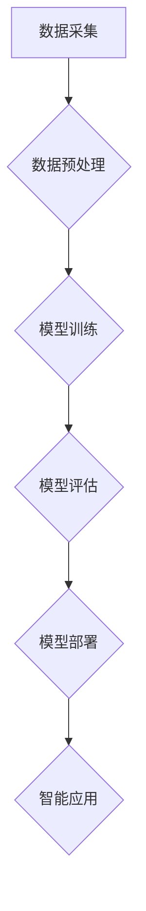

> 智能产业化、人工智能、机器学习、深度学习、云计算、大数据、边缘计算

## 1. 背景介绍

智能产业化是指将人工智能技术应用于各个产业领域，以提升生产效率、降低成本、创造新的商业模式。近年来，人工智能技术取得了长足的进步，特别是深度学习算法的突破，为智能产业化提供了强大的技术支撑。

随着云计算、大数据、物联网等技术的快速发展，人工智能技术正在从实验室走向现实世界，并逐渐渗透到各个行业。从医疗保健、金融服务到制造业、零售业，人工智能正在改变着我们的生活和工作方式。

## 2. 核心概念与联系

**2.1 智能产业化的核心概念**

* **人工智能 (AI):** 人工智能是指模拟人类智能行为的计算机系统。它包括感知、学习、推理、决策、语言理解等多种能力。
* **机器学习 (ML):** 机器学习是人工智能的一个子领域，它通过算法训练模型，使模型能够从数据中学习并做出预测或决策。
* **深度学习 (DL):** 深度学习是机器学习的一个子领域，它使用多层神经网络来模拟人类大脑的学习过程，能够处理更复杂的数据和任务。
* **云计算:** 云计算是指通过互联网提供计算资源、存储资源和软件服务的模式。
* **大数据:** 大数据是指海量、高速度、高多样性的数据。

**2.2 智能产业化的联系**

智能产业化是人工智能技术与各个产业领域融合的产物。

* **人工智能技术**为智能产业化提供了技术支撑，例如机器学习算法可以帮助企业进行数据分析、预测和决策。
* **产业领域**为人工智能技术提供了应用场景和数据资源，例如医疗保健领域可以利用人工智能技术进行疾病诊断和治疗方案推荐。
* **云计算、大数据和物联网等技术**为智能产业化提供了基础设施和数据支撑。

**2.3 智能产业化流程图**



## 3. 核心算法原理 & 具体操作步骤

**3.1 算法原理概述**

深度学习算法是智能产业化的核心算法之一。深度学习算法使用多层神经网络来模拟人类大脑的学习过程。

神经网络由多个层组成，每层包含多个神经元。神经元之间通过连接进行信息传递，每个连接都有一个权重。通过训练神经网络，可以调整连接权重，使神经网络能够学习数据中的模式和规律。

**3.2 算法步骤详解**

1. **数据准备:** 收集和预处理数据，例如清洗数据、特征工程等。
2. **模型构建:** 选择合适的深度学习模型架构，例如卷积神经网络 (CNN)、循环神经网络 (RNN) 等。
3. **模型训练:** 使用训练数据训练模型，调整模型参数，使模型能够准确地预测或分类数据。
4. **模型评估:** 使用测试数据评估模型的性能，例如准确率、召回率等。
5. **模型部署:** 将训练好的模型部署到生产环境中，用于实际应用。

**3.3 算法优缺点**

**优点:**

* 能够处理复杂的数据和任务。
* 学习能力强，能够自动提取数据特征。
* 性能优异，在许多领域取得了突破性进展。

**缺点:**

* 训练数据量大，需要大量的计算资源。
* 模型解释性差，难以理解模型的决策过程。
* 对数据质量要求高，数据噪声会影响模型性能。

**3.4 算法应用领域**

* **图像识别:** 人脸识别、物体检测、图像分类等。
* **自然语言处理:** 文本分类、机器翻译、语音识别等。
* **推荐系统:** 商品推荐、内容推荐等。
* **医疗诊断:** 疾病诊断、影像分析等。
* **金融风险控制:** 欺诈检测、信用评估等。

## 4. 数学模型和公式 & 详细讲解 & 举例说明

**4.1 数学模型构建**

深度学习模型的数学基础是神经网络。神经网络可以看作是一个复杂的函数，其输入是数据，输出是预测结果。

神经网络的每个神经元都接收多个输入信号，并通过一个激活函数进行处理，输出一个信号。激活函数的作用是将输入信号转换为非线性输出，从而使神经网络能够学习复杂的数据模式。

**4.2 公式推导过程**

神经网络的训练过程是通过调整连接权重来最小化预测误差的过程。常用的优化算法包括梯度下降法、动量法、Adam 算法等。

梯度下降法是一种迭代算法，它通过计算误差梯度来更新连接权重。动量法和Adam 算法则是在梯度下降法的基础上进行改进，可以加速训练速度并提高收敛性。

**4.3 案例分析与讲解**

例如，在图像分类任务中，我们可以使用卷积神经网络 (CNN) 模型。CNN 模型的结构包括卷积层、池化层和全连接层。

卷积层使用卷积核对图像进行卷积运算，提取图像特征。池化层对卷积层的输出进行降维，减少计算量。全连接层将提取的特征进行分类。

训练 CNN 模型时，我们需要使用大量的图像数据，并通过梯度下降法等算法调整模型参数，使模型能够准确地分类图像。

## 5. 项目实践：代码实例和详细解释说明

**5.1 开发环境搭建**

* 操作系统: Ubuntu 20.04
* Python 版本: 3.8
* 深度学习框架: TensorFlow 2.0

**5.2 源代码详细实现**

```python
import tensorflow as tf

# 定义模型结构
model = tf.keras.models.Sequential([
    tf.keras.layers.Conv2D(32, (3, 3), activation='relu', input_shape=(28, 28, 1)),
    tf.keras.layers.MaxPooling2D((2, 2)),
    tf.keras.layers.Conv2D(64, (3, 3), activation='relu'),
    tf.keras.layers.MaxPooling2D((2, 2)),
    tf.keras.layers.Flatten(),
    tf.keras.layers.Dense(10, activation='softmax')
])

# 编译模型
model.compile(optimizer='adam',
              loss='sparse_categorical_crossentropy',
              metrics=['accuracy'])

# 加载 MNIST 数据集
(x_train, y_train), (x_test, y_test) = tf.keras.datasets.mnist.load_data()

# 数据预处理
x_train = x_train.astype('float32') / 255.0
x_test = x_test.astype('float32') / 255.0
x_train = x_train.reshape((x_train.shape[0], 28, 28, 1))
x_test = x_test.reshape((x_test.shape[0], 28, 28, 1))

# 训练模型
model.fit(x_train, y_train, epochs=5)

# 评估模型
loss, accuracy = model.evaluate(x_test, y_test)
print('Test loss:', loss)
print('Test accuracy:', accuracy)
```

**5.3 代码解读与分析**

这段代码实现了使用 TensorFlow 框架训练一个简单的卷积神经网络模型，用于 MNIST 手写数字识别任务。

* 首先，定义了模型结构，包括卷积层、池化层和全连接层。
* 然后，编译了模型，指定了优化器、损失函数和评价指标。
* 接着，加载了 MNIST 数据集，并对数据进行了预处理，例如归一化和形状转换。
* 最后，训练了模型，并评估了模型的性能。

**5.4 运行结果展示**

训练完成后，模型的准确率通常可以达到 98% 以上。

## 6. 实际应用场景

**6.1 智能制造**

* **预测性维护:** 利用机器学习算法分析设备运行数据，预测设备故障，提前进行维护，降低设备停机时间和维修成本。
* **质量控制:** 利用计算机视觉技术对产品进行实时检测，识别缺陷，提高产品质量。
* **生产过程优化:** 利用数据分析和机器学习算法优化生产流程，提高生产效率和降低成本。

**6.2 智能医疗**

* **疾病诊断:** 利用深度学习算法分析医学影像数据，辅助医生进行疾病诊断。
* **个性化治疗:** 利用患者数据分析，制定个性化的治疗方案。
* **药物研发:** 利用机器学习算法加速药物研发过程。

**6.3 智能金融**

* **欺诈检测:** 利用机器学习算法分析交易数据，识别欺诈行为。
* **信用评估:** 利用机器学习算法分析客户数据，评估客户信用风险。
* **投资决策:** 利用机器学习算法分析市场数据，辅助投资决策。

**6.4 未来应用展望**

智能产业化将继续深入各个行业，带来更多创新应用。例如，在自动驾驶、机器人、虚拟现实等领域，人工智能技术将发挥越来越重要的作用。

## 7. 工具和资源推荐

**7.1 学习资源推荐**

* **在线课程:** Coursera、edX、Udacity 等平台提供丰富的深度学习课程。
* **书籍:** 《深度学习》、《机器学习实战》等书籍是深度学习学习的经典教材。
* **开源项目:** TensorFlow、PyTorch 等开源深度学习框架提供了丰富的学习资源和示例代码。

**7.2 开发工具推荐**

* **深度学习框架:** TensorFlow、PyTorch、Keras 等深度学习框架提供了高效的深度学习开发工具。
* **数据处理工具:** Pandas、NumPy 等数据处理工具可以帮助处理和分析数据。
* **可视化工具:** Matplotlib、Seaborn 等可视化工具可以帮助可视化数据和模型结果。

**7.3 相关论文推荐**

* **《ImageNet Classification with Deep Convolutional Neural Networks》**
* **《Attention Is All You Need》**
* **《BERT: Pre-training of Deep Bidirectional Transformers for Language Understanding》**

## 8. 总结：未来发展趋势与挑战

**8.1 研究成果总结**

近年来，人工智能技术取得了长足的进步，特别是深度学习算法的突破，为智能产业化提供了强大的技术支撑。

**8.2 未来发展趋势**

* **模型规模和能力的提升:** 未来，深度学习模型将更加庞大，能够处理更加复杂的数据和任务。
* **模型解释性和可解释性的增强:** 研究人员将致力于开发更加可解释的深度学习模型，以便更好地理解模型的决策过程。
* **边缘计算和联邦学习的应用:** 将深度学习模型部署到边缘设备和分布式数据中心，提高模型的效率和隐私保护能力。

**8.3 面临的挑战**

* **数据质量和隐私问题:** 深度学习模型对数据质量要求高，同时需要解决数据隐私保护问题。
* **模型安全性和可控性:** 深度学习模型可能存在安全漏洞和不可控性问题，需要加强模型安全性和可控性研究。
* **伦理和社会影响:** 深度学习技术的发展可能带来伦理和社会影响，需要加强伦理和社会规范的制定和监管。

**8.4 研究展望**

未来，人工智能技术将继续发展，并对社会产生更深远的影响。我们需要加强基础研究，解决技术难题，并积极应对人工智能带来的挑战，推动人工智能技术朝着更加安全、可控、可解释的方向发展。

## 9. 附录：常见问题与解答

**9.1 什么是深度学习？**

深度学习是一种机器学习的子领域，它使用多层神经网络来模拟人类大脑的学习过程。

**9.2 深度学习有哪些应用场景？**

深度学习应用场景广泛，包括图像识别、自然语言处理、推荐系统、医疗诊断、金融风险控制等。

**9.3 如何学习深度学习？**

可以通过在线课程、书籍、开源项目等