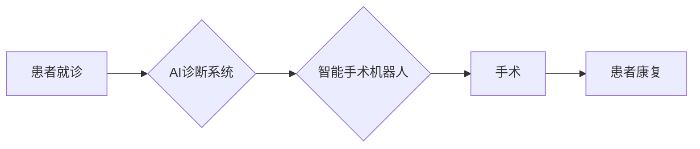

> AI诊断, 智能手术机器人, 智慧医疗, 深度学习, 自然语言处理, 计算机视觉, 机器学习, 医疗影像分析

## 1. 背景介绍

医疗保健领域正在经历一场前所未有的变革，人工智能（AI）正以惊人的速度改变着医疗保健的未来。从诊断和治疗到药物研发和患者护理，AI技术正在各个方面发挥着越来越重要的作用。

2050年，智慧医疗将成为医疗保健的基石，AI将成为医疗保健的核心驱动力。AI驱动的诊断系统将能够更快、更准确地识别疾病，而智能手术机器人将使手术更加精准、安全和有效。

## 2. 核心概念与联系

**2.1 AI诊断**

AI诊断是指利用人工智能技术，分析患者的医疗数据，例如病史、体征、实验室结果和影像学检查结果，以辅助医生做出诊断。

**2.2 智能手术机器人**

智能手术机器人是指由人工智能技术控制的机器人系统，能够协助外科医生进行手术。这些机器人能够提供更高的精度、灵活性以及可重复性，从而提高手术的成功率和降低并发症的风险。

**2.3 核心概念联系**

AI诊断和智能手术机器人是智慧医疗的核心组成部分，它们相互协作，共同推动医疗保健的进步。

* AI诊断系统可以帮助医生更快、更准确地识别疾病，从而为智能手术机器人提供更精准的治疗方案。
* 智能手术机器人可以根据AI诊断系统的建议，执行更加精准、安全的手术操作。

**2.4  流程图**



## 3. 核心算法原理 & 具体操作步骤

**3.1 算法原理概述**

AI诊断和智能手术机器人都依赖于多种机器学习算法，例如：

* **深度学习:** 用于分析医疗影像数据，识别病变和预测疾病风险。
* **自然语言处理:** 用于分析患者的病史和症状描述，提取关键信息并辅助诊断。
* **强化学习:** 用于训练智能手术机器人，使其能够在复杂手术环境中做出最佳决策。

**3.2 算法步骤详解**

**3.2.1 AI诊断系统**

1. **数据收集:** 收集患者的医疗数据，包括病史、体征、实验室结果和影像学检查结果。
2. **数据预处理:** 对收集到的数据进行清洗、转换和特征提取。
3. **模型训练:** 使用深度学习、自然语言处理等算法，训练AI诊断模型。
4. **模型评估:** 使用测试数据评估模型的性能，例如准确率、敏感度和特异度。
5. **模型部署:** 将训练好的模型部署到临床环境中，用于辅助医生诊断。

**3.2.2 智能手术机器人**

1. **环境感知:** 使用传感器收集手术环境的信息，例如手术区域的形状、位置和组织类型。
2. **路径规划:** 根据手术目标和环境信息，规划手术路径。
3. **运动控制:** 控制机器人的运动，执行手术操作。
4. **反馈控制:** 收集手术过程中的反馈信息，例如手术器械的力矩和位置，并进行调整，确保手术的精准性和安全性。

**3.3 算法优缺点**

**3.3.1 AI诊断系统**

* **优点:** 提高诊断准确率，缩短诊断时间，降低诊断成本。
* **缺点:** 需要大量高质量的训练数据，存在算法偏差和黑盒问题。

**3.3.2 智能手术机器人**

* **优点:** 提高手术精度，减少手术创伤，降低手术风险。
* **缺点:** 仍然依赖于医生的操作和决策，成本较高。

**3.4 算法应用领域**

* **AI诊断系统:** 癌症检测、心血管疾病诊断、神经系统疾病诊断等。
* **智能手术机器人:** 心脏手术、神经外科手术、泌尿外科手术等。

## 4. 数学模型和公式 & 详细讲解 & 举例说明

**4.1 数学模型构建**

AI诊断和智能手术机器人都依赖于复杂的数学模型，例如：

* **深度神经网络:** 用于分析医疗影像数据，识别病变和预测疾病风险。
* **支持向量机:** 用于分类和回归问题，例如预测患者的疾病风险。
* **强化学习算法:** 用于训练智能手术机器人，使其能够在复杂手术环境中做出最佳决策。

**4.2 公式推导过程**

深度神经网络的训练过程涉及到大量的数学公式，例如：

* **激活函数:** 用于引入非线性，使神经网络能够学习复杂的模式。
* **损失函数:** 用于衡量模型的预测结果与真实值的差异。
* **梯度下降算法:** 用于更新模型参数，使模型的损失函数最小化。

**4.3 案例分析与讲解**

**4.3.1 癌症检测**

深度神经网络可以用于分析医学影像数据，例如X光片、CT扫描和MRI扫描，识别癌症病变。

假设我们有一个深度神经网络模型，用于检测肺癌。模型的输入是肺部CT扫描图像，输出是肺癌的概率。

模型的训练过程涉及到以下步骤：

1. 收集大量肺部CT扫描图像数据，并标记出哪些图像包含肺癌。
2. 使用梯度下降算法，训练深度神经网络模型，使模型的输出概率与真实标签尽可能接近。
3. 使用测试数据评估模型的性能，例如准确率、敏感度和特异度。

**4.3.2 智能手术机器人**

强化学习算法可以用于训练智能手术机器人，使其能够在复杂手术环境中做出最佳决策。

假设我们有一个智能手术机器人，用于进行心脏手术。

机器人需要学习如何避开血管和神经组织，同时准确地定位和切除病变组织。

强化学习算法可以将手术过程视为一个马尔可夫决策过程，机器人需要根据当前状态和动作选择，以最大化手术成功率和最小化并发症风险。

## 5. 项目实践：代码实例和详细解释说明

**5.1 开发环境搭建**

* 操作系统: Ubuntu 20.04
* Python 版本: 3.8
* 必要的库: TensorFlow, PyTorch, OpenCV, NumPy, Pandas

**5.2 源代码详细实现**

```python
# 这是一个简单的AI诊断模型示例，用于识别肺癌

import tensorflow as tf

# 定义模型结构
model = tf.keras.models.Sequential([
    tf.keras.layers.Conv2D(32, (3, 3), activation='relu', input_shape=(256, 256, 3)),
    tf.keras.layers.MaxPooling2D((2, 2)),
    tf.keras.layers.Conv2D(64, (3, 3), activation='relu'),
    tf.keras.layers.MaxPooling2D((2, 2)),
    tf.keras.layers.Flatten(),
    tf.keras.layers.Dense(10, activation='softmax')
])

# 编译模型
model.compile(optimizer='adam',
              loss='sparse_categorical_crossentropy',
              metrics=['accuracy'])

# 训练模型
model.fit(x_train, y_train, epochs=10)

# 评估模型
loss, accuracy = model.evaluate(x_test, y_test)
print('Loss:', loss)
print('Accuracy:', accuracy)
```

**5.3 代码解读与分析**

这段代码定义了一个简单的深度神经网络模型，用于识别肺癌。

* `tf.keras.models.Sequential` 创建了一个顺序模型，即层级结构。
* `tf.keras.layers.Conv2D` 是卷积层，用于提取图像特征。
* `tf.keras.layers.MaxPooling2D` 是最大池化层，用于降低特征图的大小。
* `tf.keras.layers.Flatten` 将多维特征图转换为一维向量。
* `tf.keras.layers.Dense` 是全连接层，用于分类。
* `model.compile` 编译模型，指定优化器、损失函数和评价指标。
* `model.fit` 训练模型，使用训练数据进行训练。
* `model.evaluate` 评估模型，使用测试数据评估模型的性能。

**5.4 运行结果展示**

训练完成后，模型的性能指标（例如准确率）将被打印出来。

## 6. 实际应用场景

**6.1 AI诊断系统**

* **癌症早期筛查:** AI诊断系统可以分析医学影像数据，识别癌症病变，帮助医生进行早期筛查和诊断。
* **心血管疾病风险评估:** AI诊断系统可以分析患者的医疗数据，评估心血管疾病的风险，帮助医生制定个性化的预防和治疗方案。
* **神经系统疾病诊断:** AI诊断系统可以分析患者的脑部影像数据，识别神经系统疾病，帮助医生进行诊断和治疗。

**6.2 智能手术机器人**

* **微创手术:** 智能手术机器人可以进行微创手术，减少手术创伤，缩短患者的恢复时间。
* **复杂手术:** 智能手术机器人可以协助外科医生进行复杂手术，提高手术的成功率和安全性。
* **远程手术:** 智能手术机器人可以实现远程手术，让专家医生能够远程指导手术操作。

**6.4 未来应用展望**

* **个性化医疗:** AI诊断和智能手术机器人将推动个性化医疗的发展，为患者提供更加精准、有效的治疗方案。
* **远程医疗:** AI诊断和智能手术机器人将促进远程医疗的发展，让医疗资源能够更有效地分配到需要的地方。
* **医疗保健成本降低:** AI诊断和智能手术机器人将提高医疗效率，降低医疗保健成本。

## 7. 工具和资源推荐

**7.1 学习资源推荐**

* **在线课程:** Coursera, edX, Udacity
* **书籍:** 深度学习，机器学习，自然语言处理
* **开源项目:** TensorFlow, PyTorch, OpenCV

**7.2 开发工具推荐**

* **编程语言:** Python
* **深度学习框架:** TensorFlow, PyTorch
* **图像处理库:** OpenCV

**7.3 相关论文推荐**

* **AI诊断:**
    * [Deep Learning for Medical Image Analysis](https://arxiv.org/abs/1702.05747)
    * [A Survey on Deep Learning for Medical Image Segmentation](https://arxiv.org/abs/1909.09937)
* **智能手术机器人:**
    * [Surgical Robotics: A Review](https://www.ncbi.nlm.nih.gov/pmc/articles/PMC5497734/)
    * [Deep Reinforcement Learning for Surgical Robotics](https://arxiv.org/abs/1906.04174)

## 8. 总结：未来发展趋势与挑战

**8.1 研究成果总结**

AI诊断和智能手术机器人已经取得了显著的进展，在医疗保健领域展现出巨大的潜力。

**8.2 未来发展趋势**

* **更精准的诊断:** AI诊断系统将能够识别更加细微的病变，提高诊断的准确率。
* **更安全的手术:** 智能手术机器人将能够更加精准地执行手术操作，降低手术风险。
* **更个性化的治疗:** AI诊断和智能手术机器人将帮助医生制定更加个性化的治疗方案。

**8.3 面临的挑战**

* **数据隐私和安全:** AI诊断和智能手术机器人需要大量医疗数据，如何保护患者的隐私和数据安全是一个重要的挑战。
* **算法偏差:** AI算法可能存在偏差，导致对不同人群的诊断和治疗效果不一致。
* **伦理问题:** AI诊断和智能手术机器人可能会引发一些伦理问题，例如责任归属和决策权。

**8.4 研究展望**

未来，我们需要继续研究和开发更安全、更可靠、更智能的AI诊断和智能手术机器人，以更好地服务于人类健康。

## 9. 附录：常见问题与解答

**9.1 AI诊断系统是否