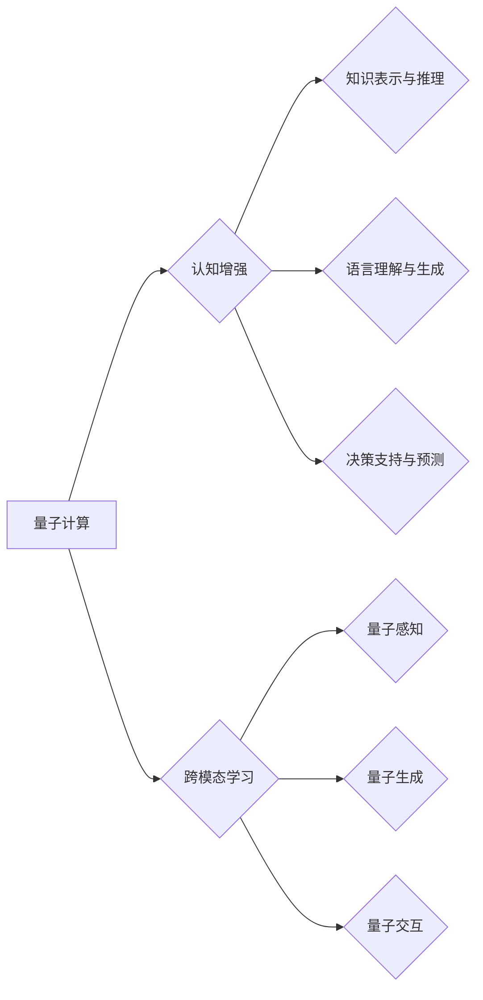

>  * 量子计算
>  * 认知增强
>  * 人工智能
>  * 算法优化
>  * 跨模态学习
>  * 知识图谱

## 1. 背景介绍

人类文明的进步离不开对认知能力的不断提升。从语言的诞生到文字的出现，再到互联网的普及，每一次认知跃迁都推动了社会的发展。如今，人工智能（AI）的兴起，正在开启新的认知革命。

传统人工智能主要依赖于深度学习算法，通过海量数据训练，学习模式和规律。然而，深度学习算法在处理复杂、抽象的知识时仍然存在局限性。

量子计算作为一种全新的计算 paradigm，利用量子力学原理，拥有超越经典计算的强大能力。它能够解决传统计算机难以处理的复杂问题，为认知增强和人工智能发展带来新的机遇。

## 2. 核心概念与联系

**2.1 量子计算与认知增强**

量子计算的核心在于利用量子叠加和量子纠缠等量子力学特性，实现超越经典计算的计算能力。

* **量子叠加:** 量子比特可以同时处于0和1的叠加态，相比经典比特的0或1状态，拥有更大的信息存储和处理能力。
* **量子纠缠:** 两个或多个量子比特可以相互纠缠，即使相隔很远，它们的状态也相互关联。这种纠缠特性可以实现高效的量子信息处理。

量子计算的强大能力可以应用于认知增强领域，例如：

* **知识表示和推理:** 利用量子算法处理复杂知识图谱，实现更智能的知识推理和知识发现。
* **语言理解和生成:** 利用量子算法处理自然语言文本，实现更精准的语言理解和生成。
* **决策支持和预测:** 利用量子算法分析海量数据，提供更精准的决策支持和预测。

**2.2 人工智能与跨模态学习**

人工智能的目标是构建能够像人类一样思考、学习和解决问题的智能系统。跨模态学习是人工智能的重要方向之一，旨在训练模型能够理解和处理多种模态数据，例如文本、图像、音频等。

量子计算可以为跨模态学习提供新的解决方案，例如：

* **量子感知:** 利用量子算法处理多模态数据，实现更精准的感知和理解。
* **量子生成:** 利用量子算法生成新的多模态内容，例如图像、文本、音频等。
* **量子交互:** 利用量子算法实现人机交互的全新体验，例如自然语言交互、虚拟现实交互等。

**2.3 核心概念架构**



## 3. 核心算法原理 & 具体操作步骤

**3.1 算法原理概述**

量子计算的核心算法包括量子门、量子叠加、量子纠缠、量子测量等。

* **量子门:** 用于操作量子比特，类似于经典计算机中的逻辑门。
* **量子叠加:** 量子比特可以同时处于0和1的叠加态，拥有更大的信息存储和处理能力。
* **量子纠缠:** 两个或多个量子比特可以相互纠缠，即使相隔很远，它们的状态也相互关联。这种纠缠特性可以实现高效的量子信息处理。
* **量子测量:** 量子测量会将量子比特从叠加态坍缩到0或1的状态。

**3.2 算法步骤详解**

量子算法的具体步骤通常包括以下几个阶段：

1. **量子初始化:** 将量子比特初始化到特定的状态。
2. **量子门操作:** 使用量子门对量子比特进行操作，实现特定的逻辑运算。
3. **量子叠加和纠缠:** 利用量子叠加和纠缠特性，将量子比特的状态进行叠加和纠缠。
4. **量子测量:** 对量子比特进行测量，获得结果。

**3.3 算法优缺点**

**优点:**

* **计算能力强:** 量子算法可以解决传统计算机难以处理的复杂问题。
* **效率高:** 在某些特定问题上，量子算法比经典算法效率更高。

**缺点:**

* **技术难度高:** 量子计算技术还处于发展初期，技术难度较大。
* **硬件成本高:** 量子计算机的硬件成本很高。

**3.4 算法应用领域**

量子算法的应用领域非常广泛，包括：

* **药物研发:** 利用量子算法模拟分子结构，加速药物研发。
* **材料科学:** 利用量子算法设计新型材料。
* **金融建模:** 利用量子算法进行风险管理和投资决策。
* **密码学:** 利用量子算法破解传统加密算法。

## 4. 数学模型和公式 & 详细讲解 & 举例说明

**4.1 数学模型构建**

量子计算的数学模型基于线性代数和微分方程。

* **量子态:** 量子态可以用一个向量来表示，例如|ψ⟩ = a|0⟩ + b|1⟩，其中a和b是复数系数，|0⟩和|1⟩是量子比特的基本态。
* **量子门:** 量子门可以用矩阵来表示，例如Hadamard门H = 1/√2 * [[1, 1], [1, -1]]。

**4.2 公式推导过程**

量子算法的推导过程通常涉及以下公式：

* **叠加原理:** 量子态的叠加可以表示为|ψ⟩ = α|0⟩ + β|1⟩，其中α和β是复数系数。
* **纠缠原理:** 两个量子比特的纠缠态可以表示为|ψ⟩ = (|00⟩ + |11⟩)/√2。
* **量子测量:** 量子测量会将量子态坍缩到一个特定的状态。

**4.3 案例分析与讲解**

**例子：量子门操作**

假设我们有一个量子比特处于|0⟩态，我们想用Hadamard门对其进行操作。

根据Hadamard门的矩阵表示，我们可以得到：

H|0⟩ = (1/√2) * [[1, 1], [1, -1]] * [1, 0]T = (1/√2) * [1, 0]T = |+⟩

其中|+⟩是量子比特处于叠加态(|0⟩ + |1⟩)/√2。

## 5. 项目实践：代码实例和详细解释说明

**5.1 开发环境搭建**

* **量子计算平台:** 选择一个量子计算平台，例如IBM Quantum Experience、Google Quantum AI、Microsoft Azure Quantum等。
* **编程语言:** 使用支持量子编程的语言，例如Python、Qiskit、Cirq等。

**5.2 源代码详细实现**

```python
from qiskit import QuantumCircuit, Aer, execute

# 创建一个量子电路
qc = QuantumCircuit(1)

# 应用Hadamard门
qc.h(0)

# 测量量子比特
qc.measure(0, 0)

# 模拟运行量子电路
simulator = Aer.get_backend('qasm_simulator')
job = execute(qc, simulator, shots=1024)
result = job.result()
counts = result.get_counts(qc)

# 打印测量结果
print(counts)
```

**5.3 代码解读与分析**

* **创建量子电路:** 使用`QuantumCircuit`类创建量子电路，指定量子比特数量。
* **应用量子门:** 使用`h`函数应用Hadamard门到量子比特0。
* **测量量子比特:** 使用`measure`函数测量量子比特0，并将结果存储到经典比特0。
* **模拟运行量子电路:** 使用`Aer.get_backend`获取模拟器，使用`execute`函数运行量子电路，指定模拟次数。
* **打印测量结果:** 使用`result.get_counts`获取测量结果，并打印出来。

**5.4 运行结果展示**

运行上述代码，会得到类似于以下的测量结果：

```
{'0': 512, '1': 512}
```

结果表明，量子比特处于叠加态，测量结果以50%的概率为0，以50%的概率为1。

## 6. 实际应用场景

**6.1 药物研发**

量子计算可以模拟分子结构和化学反应，加速药物研发过程。例如，利用量子算法模拟蛋白质折叠，可以帮助开发新的药物靶点。

**6.2 材料科学**

量子计算可以设计新型材料，例如超导材料、半导体材料等。例如，利用量子算法模拟材料的电子结构，可以预测材料的性能。

**6.3 金融建模**

量子计算可以进行风险管理和投资决策。例如，利用量子算法模拟金融市场波动，可以帮助投资者做出更明智的决策。

**6.4 未来应用展望**

量子计算在未来将应用于更多领域，例如：

* **人工智能:** 利用量子算法加速机器学习和深度学习算法的训练。
* **密码学:** 利用量子算法破解传统加密算法，并开发新的量子加密算法。
* **科学研究:** 利用量子计算解决复杂科学问题，例如宇宙起源、粒子物理等。

## 7. 工具和资源推荐

**7.1 学习资源推荐**

* **书籍:**
    * "Quantum Computing for Everyone" by Chris Bernhardt
    * "Quantum Computation and Quantum Information" by Michael Nielsen
* **在线课程:**
    * Coursera: Quantum Computing Specialization
    * edX: Quantum Computing Fundamentals

**7.2 开发工具推荐**

* **Qiskit:** IBM开发的开源量子编程框架。
* **Cirq:** Google开发的开源量子编程框架。
* **PennyLane:** 基于TensorFlow的量子机器学习框架。

**7.3 相关论文推荐**

* "Quantum Supremacy Using a Programmable Superconducting Processor" by Google AI
* "Quantum Advantage with a Noisy Intermediate-Scale Quantum (NISQ) Computer" by IBM Research

## 8. 总结：未来发展趋势与挑战

**8.1 研究成果总结**

近年来，量子计算领域取得了显著进展，例如：

* **量子计算机硬件:** 量子计算机的规模和稳定性不断提高。
* **量子算法:** 开发了越来越多的量子算法，并取得了突破性进展。
* **应用场景:** 量子计算的应用场景不断扩展，涵盖了多个领域。

**8.2 未来发展趋势**

未来量子计算的发展趋势包括：

* **量子计算机规模的进一步扩大:** 量子比特数量将继续增加，实现更强大的计算能力。
* **量子算法的不断创新:** 开发更有效的量子算法，解决更复杂的问题。
* **量子计算的商业化应用:** 量子计算将被应用于更多商业场景，带来新的商业价值。

**8.3 面临的挑战**

量子计算仍然面临着许多挑战，例如：

* **量子计算机的稳定性:** 量子比特容易受到环境噪声的影响，导致计算结果不准确。
* **量子算法的开发:** 开发有效的量子算法仍然是一个难题。
* **量子计算的成本:** 量子计算机的硬件成本很高，限制了其普及。

**8.4 研究展望**

未来量子计算的研究方向包括：

* **提高量子计算机的稳定性:** 开发新的量子比特和量子纠缠技术，降低量子计算机的噪声水平。
* **开发更有效的量子算法:** 研究新的量子算法，并将其应用于实际问题。
* **降低量子计算的成本:** 开发更经济高效的量子计算机硬件。


## 9. 附录：常见问题与解答

**9.1 量子计算和经典计算有什么区别？**

量子计算利用量子力学原理，而经典计算利用经典物理学原理。量子计算可以解决一些经典计算无法解决的问题，例如：

* **搜索问题:** 量子算法可以比经典算法更快地搜索大型数据库。
* **优化问题:** 量子算法可以找到经典算法难以找到的最佳解决方案。

**9.2 量子计算的应用场景有哪些？**

量子计算的应用