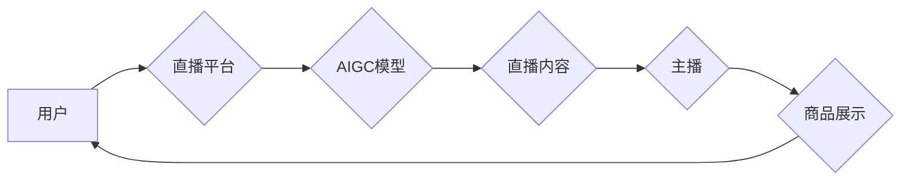

> 直播电商、AIGC、机器人、人工智能、自然语言处理、计算机视觉、用户体验

## 1. 背景介绍

直播电商近年来发展迅速，成为电商领域的新兴趋势。其沉浸式的购物体验、实时互动和个性化推荐等特点，吸引了越来越多的消费者和商家。然而，直播电商也面临着一些挑战，例如主播的精力有限、内容重复性高、用户互动率低等。

AIGC（人工智能生成内容）技术近年来也取得了长足的进步，能够生成高质量的文本、图像、音频等内容。将AIGC技术与直播电商相结合，可以有效解决直播电商面临的一些挑战，提升用户体验和商业价值。

## 2. 核心概念与联系

**2.1 直播电商**

直播电商是指利用直播平台进行商品展示、销售和互动的一种新型电商模式。其特点包括：

* **实时互动:** 直播平台提供实时聊天、问答等功能，让消费者和主播进行直接互动。
* **沉浸式体验:** 直播画面可以直观地展示商品的细节和使用场景，提升消费者的购物体验。
* **个性化推荐:** 直播平台可以根据用户的浏览历史、购买记录等信息，进行个性化的商品推荐。

**2.2 AIGC**

AIGC是指利用人工智能技术自动生成各种类型的内容，例如文本、图像、音频、视频等。其核心技术包括：

* **自然语言处理 (NLP):** 用于理解和生成人类语言。
* **计算机视觉 (CV):** 用于理解和生成图像和视频。
* **机器学习 (ML):** 用于训练模型，使其能够自动生成内容。

**2.3 结合关系**

将AIGC技术与直播电商相结合，可以实现以下功能：

* **自动生成直播内容:** AIGC可以自动生成直播脚本、商品介绍、互动问答等内容，减轻主播的工作负担。
* **个性化推荐:** AIGC可以根据用户的兴趣和需求，推荐个性化的商品和直播内容。
* **智能客服:** AIGC可以作为智能客服，回答用户的疑问，提供购物指导。
* **虚拟主播:** AIGC可以生成虚拟主播，进行直播互动，吸引更多用户。

**2.4 架构图**



## 3. 核心算法原理 & 具体操作步骤

**3.1 算法原理概述**

AIGC技术的核心算法包括自然语言生成、图像生成、音频生成等。这些算法通常基于深度学习模型，例如Transformer、GAN等。

**3.2 算法步骤详解**

1. **数据收集和预处理:** 收集大量文本、图像、音频等数据，并进行预处理，例如清洗、分词、标注等。
2. **模型训练:** 使用深度学习模型训练，将数据转化为模型参数。
3. **内容生成:** 将模型应用于新的输入数据，生成新的内容。
4. **内容评估:** 对生成的內容进行评估，例如流畅度、准确性、原创性等。

**3.3 算法优缺点**

**优点:**

* **自动化:** AIGC可以自动生成内容，节省人力成本。
* **效率:** AIGC可以快速生成大量内容，提高效率。
* **个性化:** AIGC可以根据用户的需求生成个性化的内容。

**缺点:**

* **质量:** AIGC生成的內容质量可能不如人类创作的內容高。
* **原创性:** AIGC生成的內容可能存在抄袭或重复的问题。
* **伦理问题:** AIGC可能被用于生成虚假信息或进行恶意攻击。

**3.4 算法应用领域**

AIGC技术广泛应用于以下领域:

* **内容创作:** 自动生成新闻、文章、广告等内容。
* **客服服务:** 提供智能客服，回答用户问题。
* **教育培训:** 生成个性化的学习内容。
* **娱乐休闲:** 生成游戏、动画、音乐等内容。

## 4. 数学模型和公式 & 详细讲解 & 举例说明

**4.1 数学模型构建**

AIGC模型通常基于深度学习框架，例如TensorFlow、PyTorch等。这些框架提供了一系列预训练模型和工具，可以方便地构建和训练AIGC模型。

**4.2 公式推导过程**

AIGC模型的训练过程涉及到大量的数学公式，例如梯度下降、反向传播等。这些公式用于优化模型参数，使其能够生成高质量的内容。

**4.3 案例分析与讲解**

例如，在文本生成任务中，可以使用Transformer模型进行训练。Transformer模型利用注意力机制，可以捕捉文本中的长距离依赖关系，生成更流畅、更自然的文本。

## 5. 项目实践：代码实例和详细解释说明

**5.1 开发环境搭建**

AIGC模型的开发环境通常包括以下软件：

* Python编程语言
* 深度学习框架 (例如TensorFlow、PyTorch)
* 数据处理工具 (例如Pandas、NumPy)
* 虚拟环境管理工具 (例如conda)

**5.2 源代码详细实现**

以下是一个简单的文本生成模型的代码示例，使用PyTorch框架实现：

```python
import torch
import torch.nn as nn

class TextGenerator(nn.Module):
    def __init__(self, vocab_size, embedding_dim, hidden_dim):
        super(TextGenerator, self).__init__()
        self.embedding = nn.Embedding(vocab_size, embedding_dim)
        self.lstm = nn.LSTM(embedding_dim, hidden_dim)
        self.fc = nn.Linear(hidden_dim, vocab_size)

    def forward(self, x):
        embedded = self.embedding(x)
        output, (hidden, cell) = self.lstm(embedded)
        output = self.fc(output[:, -1, :])
        return output

# ... 模型训练代码 ...
```

**5.3 代码解读与分析**

该代码定义了一个简单的文本生成模型，包含三个主要部分：

* **Embedding层:** 将单词转换为向量表示。
* **LSTM层:** 用于捕捉文本中的长距离依赖关系。
* **全连接层:** 将LSTM输出映射到单词的概率分布。

**5.4 运行结果展示**

训练完成后，可以将模型应用于新的文本数据，生成新的文本内容。

## 6. 实际应用场景

**6.1 直播电商场景**

* **自动生成直播脚本:** AIGC可以根据商品信息、目标用户等信息，自动生成直播脚本，包括商品介绍、互动环节等。
* **个性化商品推荐:** AIGC可以根据用户的浏览历史、购买记录等信息，推荐个性化的商品，提升用户购物体验。
* **智能客服:** AIGC可以作为智能客服，回答用户的疑问，提供购物指导，提升客服效率。
* **虚拟主播:** AIGC可以生成虚拟主播，进行直播互动，吸引更多用户。

**6.2 其他应用场景**

* **教育培训:** AIGC可以生成个性化的学习内容，例如习题、讲解视频等。
* **娱乐休闲:** AIGC可以生成游戏、动画、音乐等内容，丰富用户的娱乐体验。

**6.3 未来应用展望**

随着AIGC技术的不断发展，其在直播电商领域的应用场景将更加广泛，例如：

* **沉浸式购物体验:** AIGC可以生成虚拟场景，让用户在虚拟空间中体验商品，提升购物体验。
* **个性化直播内容:** AIGC可以根据用户的兴趣和需求，生成个性化的直播内容，例如定制化商品推荐、个性化互动环节等。
* **跨语言直播:** AIGC可以实现跨语言直播，让更多用户参与到直播电商中。

## 7. 工具和资源推荐

**7.1 学习资源推荐**

* **书籍:**
    * 《深度学习》
    * 《自然语言处理》
    * 《计算机视觉》
* **在线课程:**
    * Coursera
    * edX
    * Udacity

**7.2 开发工具推荐**

* **深度学习框架:** TensorFlow、PyTorch
* **数据处理工具:** Pandas、NumPy
* **代码编辑器:** VS Code、PyCharm

**7.3 相关论文推荐**

* **Transformer模型:** Attention Is All You Need
* **GAN模型:** Generative Adversarial Networks
* **文本生成模型:** GPT-3, BERT

## 8. 总结：未来发展趋势与挑战

**8.1 研究成果总结**

AIGC技术在直播电商领域取得了显著的成果，例如自动生成直播内容、个性化商品推荐、智能客服等。

**8.2 未来发展趋势**

未来AIGC技术将朝着以下方向发展:

* **更强大的生成能力:** AIGC模型将能够生成更逼真、更自然的文本、图像、音频等内容。
* **更个性化的体验:** AIGC将能够根据用户的需求，生成更个性化的内容，提升用户体验。
* **更广泛的应用场景:** AIGC将应用于更多领域，例如教育、医疗、金融等。

**8.3 面临的挑战**

AIGC技术也面临一些挑战，例如:

* **内容质量:** AIGC生成的內容质量可能不如人类创作的內容高。
* **原创性:** AIGC生成的內容可能存在抄袭或重复的问题。
* **伦理问题:** AIGC可能被用于生成虚假信息或进行恶意攻击。

**8.4 研究展望**

未来研究将重点关注以下方面:

* **提高AIGC内容质量:** 研究更有效的训练方法和评价指标，提升AIGC内容的质量。
* **保障AIGC内容原创性:** 研究防止AIGC内容抄袭和重复的方法。
* **解决AIGC伦理问题:** 研究AIGC的伦理规范和应用场景，避免其被用于恶意目的。

## 9. 附录：常见问题与解答

**9.1 如何选择合适的AIGC模型？**

选择合适的AIGC模型取决于具体的应用场景和需求。例如，文本生成任务可以使用Transformer模型，图像生成任务可以使用GAN模型。

**9.2 如何评估AIGC内容的质量？**

AIGC内容的质量可以从流畅度、准确性、原创性等方面进行评估。

**9.3 如何防止AIGC内容的抄袭和重复？**

可以使用文本相似度算法检测AIGC内容的抄袭和重复。

**9.4 如何解决AIGC伦理问题？**

需要制定AIGC的伦理规范和应用场景，避免其被用于恶意目的。


作者：禅与计算机程序设计艺术 / Zen and the Art of Computer Programming 
<end_of_turn>