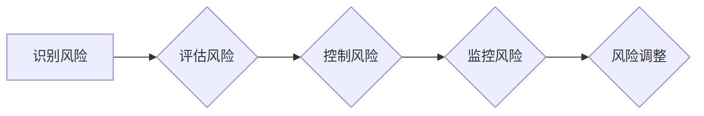

> 知识付费、风险管理、创业、商业模式、数据分析、用户运营、法律合规

## 1. 背景介绍

知识付费行业近年来发展迅速，成为互联网经济的新热点。从在线课程、直播带货到付费咨询，各种知识付费模式层出不穷，吸引了大量创作者和用户。然而，知识付费创业也面临着诸多风险，例如市场竞争激烈、用户粘性低、知识产权保护等。因此，做好风险管理，对于知识付费创业的成功至关重要。

## 2. 核心概念与联系

**2.1 知识付费的核心概念**

知识付费是指创作者将自己的知识、技能、经验等转化为有价值的内容，通过付费的方式向用户提供学习、提升和服务的商业模式。

**2.2 风险管理的核心概念**

风险管理是指识别、评估、控制和应对可能对企业目标产生负面影响的事件或因素的过程。

**2.3 知识付费创业与风险管理的联系**

知识付费创业是一个充满机遇和挑战的领域，风险和机遇并存。做好风险管理，可以帮助知识付费创业者规避风险，降低损失，提高成功率。

**2.4 风险管理流程图**



## 3. 核心算法原理 & 具体操作步骤

**3.1 算法原理概述**

在知识付费创业中，数据分析是风险管理的重要工具。通过对用户行为、市场趋势等数据的分析，可以识别潜在的风险，并制定相应的应对措施。

**3.2 算法步骤详解**

1. **数据收集:** 收集用户行为数据、市场数据、竞争对手数据等。
2. **数据清洗:** 对收集到的数据进行清洗，去除无效数据和重复数据。
3. **数据分析:** 使用数据分析工具对数据进行分析，识别潜在的风险。
4. **风险评估:** 对识别出的风险进行评估，确定风险等级和影响范围。
5. **风险控制:** 制定相应的风险控制措施，例如调整产品策略、优化用户运营等。
6. **风险监控:** 持续监控风险，及时发现和应对新的风险。

**3.3 算法优缺点**

* **优点:** 数据分析可以帮助知识付费创业者更准确地识别风险，制定更有效的应对措施。
* **缺点:** 数据分析需要专业的技术人员和工具支持，并且数据分析结果的准确性取决于数据的质量。

**3.4 算法应用领域**

* **用户风险识别:** 识别潜在的恶意用户、付费用户流失等风险。
* **市场风险分析:** 分析市场竞争、用户需求变化等风险。
* **产品风险评估:** 评估产品功能、价格、营销策略等风险。

## 4. 数学模型和公式 & 详细讲解 & 举例说明

**4.1 数学模型构建**

知识付费创业的风险可以建模为一个多因素的概率模型，其中每个因素都代表一个潜在的风险因素，例如用户粘性、市场竞争、知识产权保护等。

**4.2 公式推导过程**

可以使用贝叶斯定理来计算每个风险因素发生的概率，以及这些风险因素组合在一起发生的概率。

**4.3 案例分析与讲解**

假设一个知识付费平台想要评估其用户流失风险，可以构建一个用户流失概率模型，其中包括用户活跃度、付费频率、用户反馈等因素。通过分析这些因素之间的关系，可以计算出用户流失的概率，并制定相应的措施来降低用户流失风险。

## 5. 项目实践：代码实例和详细解释说明

**5.1 开发环境搭建**

可以使用 Python 语言和相关库来实现知识付费创业的风险管理系统。

**5.2 源代码详细实现**

```python
# 导入必要的库
import pandas as pd
from sklearn.linear_model import LogisticRegression

# 加载用户数据
data = pd.read_csv("user_data.csv")

# 选择特征变量和目标变量
features = ["user_active", "pay_frequency", "feedback_score"]
target = "user_churn"

# 训练逻辑回归模型
model = LogisticRegression()
model.fit(data[features], data[target])

# 预测用户流失概率
predictions = model.predict_proba(data[features])[:, 1]

# 输出用户流失概率
print(predictions)
```

**5.3 代码解读与分析**

这段代码首先加载用户数据，然后选择特征变量和目标变量。接着，使用逻辑回归模型训练一个用户流失预测模型。最后，使用训练好的模型预测用户流失概率，并输出结果。

**5.4 运行结果展示**

运行代码后，会输出每个用户的流失概率，可以根据这些概率对用户进行分层管理，并针对不同风险等级的用户采取不同的措施。

## 6. 实际应用场景

**6.1 用户运营**

* **精准推送:** 根据用户流失风险，精准推送优惠活动和个性化内容，提高用户粘性。
* **用户分层:** 将用户根据流失风险进行分层管理，针对不同风险等级的用户制定不同的运营策略。

**6.2 产品开发**

* **产品优化:** 分析用户反馈和使用数据，识别产品缺陷和用户痛点，进行产品优化。
* **新产品开发:** 根据市场需求和用户风险分析，开发符合用户需求的新产品。

**6.3 市场营销**

* **精准营销:** 根据用户风险分析，精准投放广告和营销活动，提高营销效果。
* **品牌建设:** 通过风险管理，提升品牌信誉和用户信任度。

**6.4 未来应用展望**

随着人工智能技术的不断发展，知识付费创业的风险管理将更加智能化和自动化。未来，我们可以期待看到更多基于人工智能的风险管理工具和解决方案，帮助知识付费创业者更好地应对风险，实现可持续发展。

## 7. 工具和资源推荐

**7.1 学习资源推荐**

* **书籍:** 《风险管理基础》
* **在线课程:** Coursera 上的风险管理课程

**7.2 开发工具推荐**

* **Python:** 数据分析和机器学习
* **R:** 数据可视化和统计分析
* **Tableau:** 数据可视化

**7.3 相关论文推荐**

* **《知识付费平台用户流失预测模型研究》**
* **《基于机器学习的知识付费创业风险评估方法》**

## 8. 总结：未来发展趋势与挑战

**8.1 研究成果总结**

本文介绍了知识付费创业中的风险管理，并探讨了数据分析、数学建模和人工智能技术在风险管理中的应用。

**8.2 未来发展趋势**

* **人工智能驱动的风险管理:** 利用人工智能技术，实现风险识别、评估和控制的自动化。
* **个性化风险管理:** 根据用户的不同特征和需求，提供个性化的风险管理方案。
* **跨行业风险管理:** 将风险管理经验和方法推广到其他行业，促进跨行业合作和发展。

**8.3 面临的挑战**

* **数据质量问题:** 数据分析的准确性取决于数据的质量，需要加强数据采集、清洗和处理工作。
* **算法模型的局限性:** 现有的算法模型可能无法完全覆盖所有类型的风险，需要不断改进和完善算法模型。
* **伦理和法律问题:** 人工智能驱动的风险管理需要考虑伦理和法律问题，例如数据隐私保护和算法公平性。

**8.4 研究展望**

未来，我们将继续深入研究知识付费创业的风险管理，探索更有效的风险管理方法和工具，为知识付费创业者提供更全面的支持。

## 9. 附录：常见问题与解答

**9.1 如何识别知识付费创业中的风险？**

知识付费创业中的风险可以从以下几个方面进行识别：

* **市场风险:** 市场竞争激烈、用户需求变化快等。
* **产品风险:** 产品功能不足、价格不合理等。
* **运营风险:** 用户粘性低、用户流失率高等。
* **法律风险:** 知识产权保护、用户隐私保护等。

**9.2 如何控制知识付费创业中的风险？**

控制知识付费创业中的风险可以通过以下措施：

* **市场调研:** 充分了解市场需求和竞争对手情况。
* **产品开发:** 开发符合用户需求的产品，并进行持续优化。
* **用户运营:** 提高用户粘性，降低用户流失率。
* **法律合规:** 遵守相关法律法规，做好知识产权保护和用户隐私保护工作。


作者：禅与计算机程序设计艺术 / Zen and the Art of Computer Programming 
<end_of_turn>