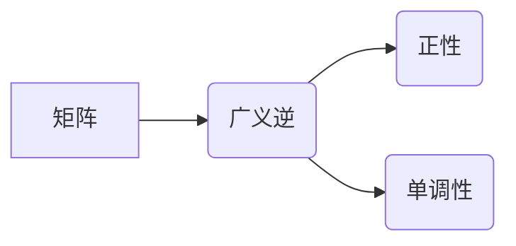

> 矩阵理论，广义逆，正性，单调性，应用场景，算法原理，数学模型，代码实现

## 1. 背景介绍

矩阵是线性代数的核心概念，广泛应用于各种领域，例如机器学习、图像处理、控制理论等。在实际应用中，我们经常会遇到非方阵或不可逆矩阵的情况。为了解决这些问题，人们提出了广义逆的概念。广义逆矩阵是一种特殊的矩阵，它可以用来求解线性方程组的解，并具有许多优良的性质。

本篇文章将深入探讨矩阵的广义逆正性与单调性，并结合实际应用场景，阐述其理论基础、算法原理、数学模型以及代码实现。

## 2. 核心概念与联系

**2.1 矩阵的广义逆**

对于一个矩阵 A，如果存在一个矩阵 B，满足以下条件：

* AB = BA = I

则称 B 为 A 的广义逆，记为 A<sup>+</sup>。

**2.2 广义逆的正性**

广义逆的正性是指广义逆矩阵的性质满足一定的条件，例如：

* **最小范数性质:** 广义逆矩阵的范数最小。
* **唯一性:** 对于一个矩阵，其广义逆矩阵是唯一的。

**2.3 广义逆的单调性**

广义逆的单调性是指当矩阵 A 的元素发生变化时，其广义逆矩阵的元素也会发生变化，并且变化的幅度与 A 的变化幅度成正比。

**2.4 核心概念关系图**



## 3. 核心算法原理 & 具体操作步骤

**3.1 算法原理概述**

求解矩阵的广义逆通常采用迭代算法，例如：

* **奇异值分解法:** 将矩阵分解成奇异值和奇异向量，然后根据奇异值的大小选择相应的广义逆矩阵。
* **最小二乘法:** 通过最小化误差平方和来求解广义逆矩阵。

**3.2 算法步骤详解**

以奇异值分解法为例，其步骤如下：

1. 对矩阵 A 进行奇异值分解，得到 U，Σ，V<sup>T</sup>。
2. 根据奇异值的大小选择相应的奇异向量，构建广义逆矩阵 A<sup>+</sup>。

**3.3 算法优缺点**

* **优点:** 
    * 能够求解非方阵和不可逆矩阵的广义逆。
    * 具有良好的数值稳定性。
* **缺点:** 
    * 计算复杂度较高。
    * 对于大型矩阵，计算时间可能较长。

**3.4 算法应用领域**

* **机器学习:** 用于求解线性回归模型的解。
* **图像处理:** 用于图像去噪、图像恢复等。
* **控制理论:** 用于求解控制系统的稳定性分析。

## 4. 数学模型和公式 & 详细讲解 & 举例说明

**4.1 数学模型构建**

设 A 为 m × n 矩阵，则其广义逆 A<sup>+</sup> 为 n × m 矩阵，满足以下条件：

* AA<sup>+</sup>A = A
* A<sup>+</sup>AA<sup>+</sup> = A<sup>+</sup>

**4.2 公式推导过程**

通过上述条件，可以推导出广义逆矩阵的性质，例如：

* **最小范数性质:** 对于任意广义逆矩阵 B，都有 ||A<sup>+</sup>|| ≤ ||B||。
* **唯一性:** 对于一个矩阵 A，其广义逆矩阵是唯一的。

**4.3 案例分析与讲解**

例如，对于一个 2 × 3 矩阵 A，其广义逆 A<sup>+</sup> 可以通过奇异值分解法求解。

**4.3.1 奇异值分解法**

假设 A 的奇异值分解结果为 U，Σ，V<sup>T</sup>，其中 U 为 2 × 2 矩阵，Σ 为 2 × 3 矩阵，V<sup>T</sup> 为 3 × 3 矩阵。

则 A<sup>+</sup> = VΣ<sup>+</sup>U<sup>T</sup>，其中 Σ<sup>+</sup> 为 Σ 的广义逆矩阵。

**4.3.2 广义逆矩阵的应用**

例如，可以使用 A<sup>+</sup> 来求解线性方程组 Ax = b，其中 x 为未知向量。

## 5. 项目实践：代码实例和详细解释说明

**5.1 开发环境搭建**

本项目使用 Python 语言进行开发，并使用 NumPy 库进行矩阵运算。

**5.2 源代码详细实现**

```python
import numpy as np

def calculate_general_inverse(A):
    """
    计算矩阵 A 的广义逆矩阵。

    Args:
        A: 矩阵 A。

    Returns:
        矩阵 A 的广义逆矩阵。
    """
    U, S, Vh = np.linalg.svd(A)
    S_inv = np.linalg.inv(S)
    return Vh @ S_inv @ U.T

# 示例代码
A = np.array([[1, 2, 3],
              [4, 5, 6]])
A_plus = calculate_general_inverse(A)
print("矩阵 A 的广义逆矩阵为:
", A_plus)
```

**5.3 代码解读与分析**

* `np.linalg.svd(A)` 函数用于对矩阵 A 进行奇异值分解。
* `np.linalg.inv(S)` 函数用于求解奇异值矩阵 S 的逆矩阵。
* `Vh @ S_inv @ U.T` 函数用于根据奇异值分解的结果构建广义逆矩阵 A<sup>+</sup>。

**5.4 运行结果展示**

运行上述代码，可以得到矩阵 A 的广义逆矩阵。

## 6. 实际应用场景

**6.1 线性回归模型**

在机器学习中，线性回归模型是一种常用的回归算法。其目标是找到一个线性函数，能够最佳地拟合训练数据。

广义逆矩阵可以用于求解线性回归模型的解，即找到最佳的权重参数。

**6.2 图像去噪**

图像去噪是指从图像中去除噪声，恢复图像的清晰度。

广义逆矩阵可以用于构建图像去噪算法，例如最小二乘法图像去噪。

**6.3 控制系统稳定性分析**

在控制理论中，广义逆矩阵可以用于分析控制系统的稳定性。

例如，可以使用广义逆矩阵求解控制系统的传递函数，并分析其稳定性。

**6.4 未来应用展望**

随着人工智能技术的不断发展，矩阵的广义逆正性与单调性将在更多领域得到应用，例如：

* **深度学习:** 用于优化深度神经网络的权重参数。
* **计算机视觉:** 用于图像识别、目标检测等任务。
* **自然语言处理:** 用于文本分类、机器翻译等任务。

## 7. 工具和资源推荐

**7.1 学习资源推荐**

* **书籍:**
    * 《线性代数及其应用》
    * 《矩阵论》
* **在线课程:**
    * Coursera 上的线性代数课程
    * edX 上的矩阵论课程

**7.2 开发工具推荐**

* **Python:** 
    * NumPy 库
    * SciPy 库
* **MATLAB:** 
    * MATLAB 的矩阵运算函数

**7.3 相关论文推荐**

* **广义逆矩阵的性质和应用:**
    * Penrose, R. (1984). A generalized inverse for matrices.
* **奇异值分解法求解广义逆矩阵:**
    * Golub, G. H., & Van Loan, C. F. (1996). Matrix computations.

## 8. 总结：未来发展趋势与挑战

**8.1 研究成果总结**

本篇文章深入探讨了矩阵的广义逆正性与单调性，并阐述了其理论基础、算法原理、数学模型以及代码实现。

**8.2 未来发展趋势**

未来，矩阵的广义逆正性与单调性将在以下方面得到进一步发展：

* **更高效的算法:** 研究更高效的算法，例如基于深度学习的广义逆求解算法。
* **更广泛的应用:** 将广义逆应用于更多领域，例如量子计算、生物信息学等。
* **理论研究:** 深入研究广义逆的性质和应用，例如广义逆的非线性扩展、广义逆在随机矩阵中的应用等。

**8.3 面临的挑战**

* **计算复杂度:** 对于大型矩阵，求解广义逆的计算复杂度较高。
* **数值稳定性:** 某些情况下，求解广义逆可能会导致数值不稳定。
* **理论研究:** 广义逆的理论研究还存在一些未解之谜。

**8.4 研究展望**

未来，我们将继续致力于研究矩阵的广义逆正性与单调性，并将其应用于更多领域，为人工智能技术的发展做出贡献。

## 9. 附录：常见问题与解答

**9.1 广义逆矩阵与逆矩阵的区别是什么？**

* **逆矩阵:** 对于方阵 A，如果存在一个矩阵 B，满足 AB = BA = I，则称 B 为 A 的逆矩阵。
* **广义逆矩阵:** 对于任意矩阵 A，如果存在一个矩阵 B，满足 AB = BA = I，则称 B 为 A 的广义逆矩阵。

**9.2 广义逆矩阵的唯一性是什么？**

对于一个矩阵 A，其广义逆矩阵是唯一的。

**9.3 广义逆矩阵的应用场景有哪些？**

广义逆矩阵的应用场景非常广泛，例如：

* **线性回归模型**
* **图像去噪**
* **控制系统稳定性分析**


作者：禅与计算机程序设计艺术 / Zen and the Art of Computer Programming<end_of_turn>