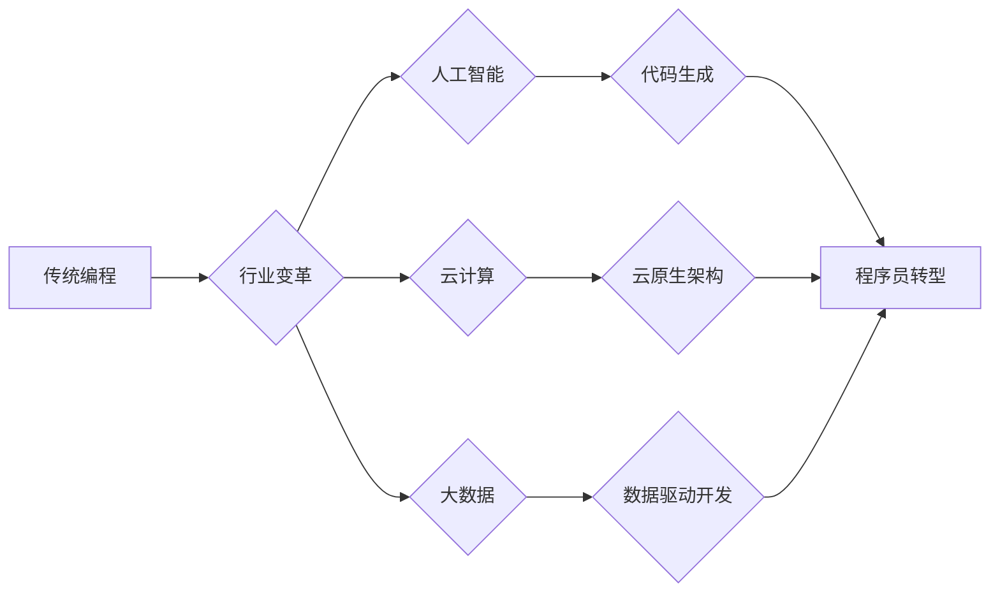

> 程序员转型，行业变革，人工智能，云计算，大数据，软件架构，持续学习

## 1. 背景介绍

科技发展日新月异，程序员所处的行业也面临着前所未有的变革和挑战。传统的编程模式、技术栈和职业发展路径正在被颠覆，程序员需要不断学习和适应新的技术和趋势，才能保持竞争力。

近年来，人工智能、云计算、大数据等新兴技术蓬勃发展，对软件开发行业产生了深远影响。这些技术不仅改变了软件开发的方式，也催生了许多新的职业机会和发展方向。

## 2. 核心概念与联系

**2.1  行业变革趋势**

* **人工智能 (AI) 崛起:** AI 技术正在改变软件开发的各个环节，例如代码生成、测试、部署等。程序员需要了解 AI 的基本原理和应用场景，并学习如何与 AI 工具协同工作。
* **云计算普及:** 云计算平台提供了弹性、可扩展的计算资源，降低了软件开发的成本和门槛。程序员需要掌握云计算平台的开发和运维知识，并熟悉云原生架构的开发模式。
* **大数据分析:** 大数据技术为软件开发提供了更丰富的用户数据和行为分析能力。程序员需要了解大数据处理和分析技术，并学习如何利用数据驱动软件开发决策。
* **敏捷开发:** 敏捷开发方法强调快速迭代、持续交付，并注重团队协作和客户反馈。程序员需要掌握敏捷开发的理念和实践，并适应快速变化的开发环境。

**2.2  程序员转型路径**

* **深化专业技能:** 程序员需要不断学习新的编程语言、框架和工具，并精通现有技术领域。
* **拓展知识面:** 程序员需要了解人工智能、云计算、大数据等新兴技术的原理和应用场景，并学习如何将这些技术应用到软件开发中。
* **培养跨领域能力:** 程序员需要具备良好的沟通、协作和解决问题的能力，并能够与不同领域的专家进行有效沟通。
* **拥抱终身学习:** 科技发展日新月异，程序员需要保持持续学习的热情，并不断更新自己的知识和技能。

**2.3  Mermaid 流程图**

## 3. 核心算法原理 & 具体操作步骤

**3.1  算法原理概述**

**3.2  算法步骤详解**

**3.3  算法优缺点**

**3.4  算法应用领域**

## 4. 数学模型和公式 & 详细讲解 & 举例说明

**4.1  数学模型构建**

**4.2  公式推导过程**

**4.3  案例分析与讲解**

## 5. 项目实践：代码实例和详细解释说明

**5.1  开发环境搭建**

**5.2  源代码详细实现**

**5.3  代码解读与分析**

**5.4  运行结果展示**

## 6. 实际应用场景

**6.1  案例分析**

**6.2  应用价值**

**6.3  未来应用展望**

## 7. 工具和资源推荐

**7.1  学习资源推荐**

**7.2  开发工具推荐**

**7.3  相关论文推荐**

## 8. 总结：未来发展趋势与挑战

**8.1  研究成果总结**

**8.2  未来发展趋势**

**8.3  面临的挑战**

**8.4  研究展望**

## 9. 附录：常见问题与解答

作者：禅与计算机程序设计艺术 / Zen and the Art of Computer Programming 
<end_of_turn>