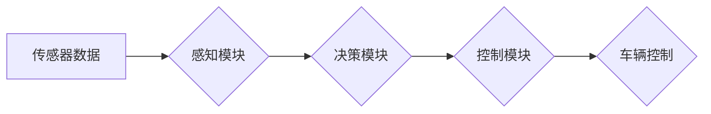

> 自动驾驶, 端到端学习, 渐进式商业化, 深度学习, 计算机视觉, 决策控制, 仿真测试, 数据标注, 监管政策

## 1. 背景介绍

自动驾驶技术作为未来交通运输的重要发展方向，近年来取得了显著进展。从早期基于规则的控制系统到如今的深度学习驱动的端到端自动驾驶，技术发展呈现出加速趋势。然而，将自动驾驶技术从实验室推向市场，并实现商业化应用，仍然面临着诸多挑战。

本文将探讨端到端自动驾驶的渐进式商业化路径，从技术架构、算法原理、项目实践到实际应用场景，全面分析自动驾驶技术商业化的关键要素，并展望未来发展趋势。

## 2. 核心概念与联系

端到端自动驾驶是指利用深度学习算法，将传感器数据直接映射到控制指令，实现车辆从感知到决策、控制的全流程自动化。

**核心概念:**

* **感知:** 利用摄像头、雷达、激光雷达等传感器获取车辆周围环境信息。
* **决策:** 基于感知信息，判断车辆行驶路线、速度、转向等控制策略。
* **控制:** 将决策结果转化为车辆的实际控制指令，例如油门、刹车、转向等。

**架构图:**



## 3. 核心算法原理 & 具体操作步骤

### 3.1  算法原理概述

端到端自动驾驶的核心算法是深度神经网络，主要包括卷积神经网络（CNN）、循环神经网络（RNN）和强化学习（RL）。

* **CNN:** 用于处理图像数据，提取车辆周围环境的特征信息。
* **RNN:** 用于处理时间序列数据，例如车辆速度、方向等，预测未来行驶状态。
* **RL:** 用于训练车辆决策策略，通过奖励机制优化控制策略，使其能够在复杂环境中安全高效地行驶。

### 3.2  算法步骤详解

1. **数据采集:** 收集大量真实道路场景数据，包括图像、雷达数据、激光雷达数据等。
2. **数据预处理:** 对采集到的数据进行清洗、格式化、标注等处理，使其能够被深度学习算法训练。
3. **模型训练:** 利用深度学习框架，例如TensorFlow或PyTorch，训练深度神经网络模型。
4. **模型评估:** 使用测试数据集评估模型的性能，例如准确率、召回率、平均位移误差等。
5. **模型部署:** 将训练好的模型部署到车辆控制系统中，实现自动驾驶功能。

### 3.3  算法优缺点

**优点:**

* **端到端学习:** 可以直接从传感器数据到控制指令，减少人工设计规则的复杂度。
* **高精度:** 深度学习算法能够学习到复杂的驾驶模式，实现高精度控制。
* **可扩展性:** 可以通过增加训练数据和模型复杂度，不断提升自动驾驶性能。

**缺点:**

* **数据依赖:** 需要大量高质量的训练数据，数据标注成本高。
* **黑盒效应:** 深度学习模型的决策过程难以解释，存在安全隐患。
* **计算资源:** 训练深度学习模型需要大量的计算资源，成本较高。

### 3.4  算法应用领域

端到端自动驾驶算法广泛应用于以下领域:

* **自动驾驶汽车:** 实现车辆自动驾驶功能。
* **无人机:** 实现无人机自主飞行。
* **机器人:** 实现机器人自主导航和避障。
* **智能交通:** 优化交通流量，提高道路安全。

## 4. 数学模型和公式 & 详细讲解 & 举例说明

### 4.1  数学模型构建

端到端自动驾驶的数学模型主要包括感知模型、决策模型和控制模型。

* **感知模型:** 利用深度学习算法，将传感器数据映射到车辆周围环境的语义表示，例如道路边界、行人、车辆等。
* **决策模型:** 基于感知信息，预测车辆未来行驶状态，并制定相应的控制策略。
* **控制模型:** 将决策结果转化为车辆的实际控制指令，例如油门、刹车、转向等。

### 4.2  公式推导过程

由于篇幅限制，此处仅列举部分关键公式，详细推导过程可参考相关文献。

* **损失函数:** 用于衡量模型预测结果与真实值的差异，常用的损失函数包括均方误差（MSE）、交叉熵损失（CE）等。
* **梯度下降:** 用于优化模型参数，使其能够最小化损失函数。

### 4.3  案例分析与讲解

以感知模型为例，假设使用CNN进行道路边界检测，其输出为道路边界位置的概率图。

损失函数可以定义为预测结果与真实边界位置之间的距离误差。通过梯度下降算法，不断更新模型参数，使其能够预测更准确的道路边界位置。

## 5. 项目实践：代码实例和详细解释说明

### 5.1  开发环境搭建

* 操作系统: Ubuntu 20.04
* 编程语言: Python 3.8
* 深度学习框架: TensorFlow 2.0
* 硬件环境: GPU (NVIDIA GeForce RTX 3090)

### 5.2  源代码详细实现

```python
import tensorflow as tf

# 定义CNN模型
model = tf.keras.models.Sequential([
    tf.keras.layers.Conv2D(32, (3, 3), activation='relu', input_shape=(640, 480, 3)),
    tf.keras.layers.MaxPooling2D((2, 2)),
    tf.keras.layers.Conv2D(64, (3, 3), activation='relu'),
    tf.keras.layers.MaxPooling2D((2, 2)),
    tf.keras.layers.Flatten(),
    tf.keras.layers.Dense(10, activation='softmax')
])

# 编译模型
model.compile(optimizer='adam',
              loss='sparse_categorical_crossentropy',
              metrics=['accuracy'])

# 训练模型
model.fit(x_train, y_train, epochs=10)

# 评估模型
loss, accuracy = model.evaluate(x_test, y_test)
print('Loss:', loss)
print('Accuracy:', accuracy)
```

### 5.3  代码解读与分析

* 代码首先定义了一个简单的CNN模型，包含卷积层、池化层和全连接层。
* 然后使用Adam优化器和交叉熵损失函数编译模型。
* 最后使用训练数据训练模型，并使用测试数据评估模型性能。

### 5.4  运行结果展示

训练完成后，可以将模型部署到车辆控制系统中，实现自动驾驶功能。

## 6. 实际应用场景

### 6.1  自动驾驶汽车

端到端自动驾驶技术已应用于自动驾驶汽车的研发，例如特斯拉 Autopilot、Waymo 等。

### 6.2  无人机

无人机也广泛应用于自动驾驶技术，例如无人机物流、无人机巡逻等。

### 6.3  机器人

端到端自动驾驶技术也应用于机器人领域，例如自动导航机器人、避障机器人等。

### 6.4  未来应用展望

未来，端到端自动驾驶技术将应用于更多领域，例如智能交通、智慧城市等。

## 7. 工具和资源推荐

### 7.1  学习资源推荐

* **书籍:**
    * Deep Learning by Ian Goodfellow
    * Hands-On Machine Learning with Scikit-Learn, Keras & TensorFlow by Aurélien Géron
* **在线课程:**
    * Coursera: Deep Learning Specialization
    * Udacity: Self-Driving Car Engineer Nanodegree

### 7.2  开发工具推荐

* **深度学习框架:** TensorFlow, PyTorch
* **数据标注工具:** LabelImg, CVAT
* **仿真平台:** CARLA, Gazebo

### 7.3  相关论文推荐

* End to End Learning for Self-Driving Cars
* Deep Reinforcement Learning for End-to-End Autonomous Driving

## 8. 总结：未来发展趋势与挑战

### 8.1  研究成果总结

端到端自动驾驶技术取得了显著进展，但仍然面临着诸多挑战。

### 8.2  未来发展趋势

* **模型复杂度提升:** 采用更复杂的深度学习模型，例如Transformer、Graph Neural Network等，提升自动驾驶性能。
* **数据增强:** 利用数据增强技术，扩大训练数据规模，提高模型泛化能力。
* **安全性和可靠性:** 加强安全性和可靠性研究，确保自动驾驶系统的安全性和可靠性。

### 8.3  面临的挑战

* **数据标注成本高:** 自动驾驶数据标注成本高昂，需要探索更有效的标注方法。
* **安全性和伦理问题:** 自动驾驶系统面临安全性和伦理挑战，需要制定相应的法律法规和伦理规范。
* **监管政策:** 自动驾驶技术的监管政策尚不完善，需要政府部门制定相应的政策法规。

### 8.4  研究展望

未来，端到端自动驾驶技术将继续发展，并应用于更多领域，为人类社会带来更多便利。

## 9. 附录：常见问题与解答

### 9.1  常见问题

* **端到端自动驾驶和传统自动驾驶有什么区别？**
* **端到端自动驾驶技术有哪些优势和劣势？**
* **端到端自动驾驶技术有哪些应用场景？**

### 9.2  解答

* **端到端自动驾驶和传统自动驾驶的区别:** 传统自动驾驶系统通常采用规则-基于的控制策略，需要人工设计大量的规则，而端到端自动驾驶系统则利用深度学习算法，直接从传感器数据到控制指令，减少人工设计规则的复杂度。
* **端到端自动驾驶技术的优势和劣势:** 端到端自动驾驶技术的优势在于可以学习到复杂的驾驶模式，实现高精度控制，并且具有可扩展性。劣势在于需要大量高质量的训练数据，数据标注成本高，并且存在黑盒效应，难以解释模型的决策过程。
* **端到端自动驾驶技术的应用场景:** 端到端自动驾驶技术广泛应用于自动驾驶汽车、无人机、机器人等领域。


作者：禅与计算机程序设计艺术 / Zen and the Art of Computer Programming 
<end_of_turn>