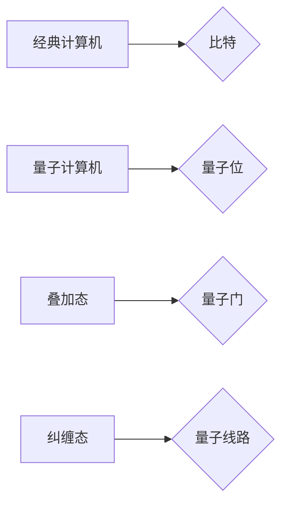

> 量子计算，量子计算机，量子位，叠加态，纠缠态，量子算法，量子门，量子线路

## 1. 背景介绍

随着传统计算机技术的发展逐渐接近物理极限，人们开始探索新的计算 paradigms。量子力学，作为描述微观世界行为的理论，为我们提供了全新的计算思路。量子计算利用量子力学的原理，如叠加态和纠缠态，来实现超越经典计算机能力的计算。

量子计算机的出现，标志着计算领域进入了一个全新的时代。它有潜力解决目前经典计算机难以解决的复杂问题，例如药物发现、材料科学、密码学等。

## 2. 核心概念与联系

### 2.1 量子位 (Qubit)

量子位是量子计算机的基本计算单元，与经典计算机中的比特不同，量子位可以处于叠加态，即同时处于0和1状态的叠加。

### 2.2 叠加态 (Superposition)

叠加态是量子力学中一个重要的概念，它指一个量子系统可以同时处于多个状态的叠加。例如，一个量子位可以同时处于0和1状态的叠加。

### 2.3 纠缠态 (Entanglement)

纠缠态是指两个或多个量子系统之间存在一种特殊的关联关系，即使它们相隔很远，测量一个系统的状态也会瞬间影响另一个系统的状态。

### 2.4 量子门 (Quantum Gate)

量子门是量子计算机中执行逻辑操作的单元，类似于经典计算机中的逻辑门。量子门可以改变量子位的状态，实现量子计算的逻辑运算。

### 2.5 量子线路 (Quantum Circuit)

量子线路是描述量子计算程序的图形表示，它由量子门和量子位组成，类似于经典计算机中的电路图。

**核心概念与联系流程图**



## 3. 核心算法原理 & 具体操作步骤

### 3.1 算法原理概述

量子算法利用量子力学的原理，例如叠加态和纠缠态，来实现超越经典算法的计算效率。

量子算法通常需要将经典问题转化为量子问题，然后使用量子门和量子线路来实现计算。

### 3.2 算法步骤详解

1. 将经典问题转化为量子问题。
2. 使用量子门和量子线路构建量子算法。
3. 将量子算法运行在量子计算机上。
4. 将量子计算结果转化为经典结果。

### 3.3 算法优缺点

**优点:**

* 计算效率更高，可以解决某些经典算法无法解决的问题。
* 具有潜在的应用价值，例如药物发现、材料科学、密码学等。

**缺点:**

* 量子计算机技术还处于发展初期，成本高昂，稳定性差。
* 量子算法的开发难度较高，需要深入了解量子力学和计算机科学。

### 3.4 算法应用领域

* **药物发现:** 模拟分子相互作用，加速药物研发。
* **材料科学:** 设计新型材料，提高材料性能。
* **密码学:** 构建更安全的密码算法。
* **金融建模:** 优化投资策略，降低风险。
* **人工智能:** 加速机器学习算法训练。

## 4. 数学模型和公式 & 详细讲解 & 举例说明

### 4.1 数学模型构建

量子计算的数学模型基于线性代数和矩阵论。

* **量子态:** 量子态可以用一个复数向量来表示，例如|ψ⟩ = α|0⟩ + β|1⟩，其中α和β是复数系数，|0⟩和|1⟩是量子位基态。
* **量子门:** 量子门可以用矩阵来表示，例如Hadamard门H = 1/√2 * [[1, 1], [1, -1]]。

### 4.2 公式推导过程

量子门操作可以表示为矩阵乘法，例如：

```latex
|ψ⟩' = U|ψ⟩
```

其中，|ψ⟩是输入量子态，|ψ⟩'是输出量子态，U是表示量子门的矩阵。

### 4.3 案例分析与讲解

**Hadamard门**

Hadamard门是一种重要的量子门，它可以将量子位从|0⟩状态变换到叠加态|0⟩ + |1⟩。

```latex
H = \frac{1}{\sqrt{2}} \begin{bmatrix} 1 & 1 \\ 1 & -1 \end{bmatrix}
```

如果输入量子态为|0⟩，则经过Hadamard门操作后，输出量子态为|0⟩ + |1⟩。

## 5. 项目实践：代码实例和详细解释说明

### 5.1 开发环境搭建

可以使用Qiskit或Cirq等量子计算软件包进行开发。

### 5.2 源代码详细实现

```python
from qiskit import QuantumCircuit, Aer, execute

# 创建一个量子电路
qc = QuantumCircuit(1)

# 应用Hadamard门
qc.h(0)

# 测量量子位
qc.measure(0, 0)

# 模拟运行量子电路
simulator = Aer.get_backend('qasm_simulator')
job = execute(qc, simulator, shots=1024)
result = job.result()
counts = result.get_counts(qc)

# 打印测量结果
print(counts)
```

### 5.3 代码解读与分析

这段代码首先创建了一个量子电路，然后应用Hadamard门对第一个量子位进行操作。最后，对量子位进行测量，并打印测量结果。

### 5.4 运行结果展示

运行结果显示，测量结果主要为{0: 512, 1: 512}，这表明量子位处于叠加态，概率均匀分布在0和1之间。

## 6. 实际应用场景

### 6.1 量子模拟

量子计算机可以模拟量子系统，例如分子、原子等，从而帮助我们理解和预测它们的性质和行为。

### 6.2 量子优化

量子算法可以用于解决优化问题，例如物流调度、金融投资等，找到最优解。

### 6.3 量子密码学

量子计算机可以破解经典密码算法，但也为构建更安全的量子密码算法提供了新的可能性。

### 6.4 未来应用展望

量子计算技术还在发展初期，但其潜在的应用价值巨大。未来，量子计算有望在更多领域发挥重要作用，例如：

* **药物研发:** 发现和设计新的药物，加速药物研发进程。
* **材料科学:** 设计新型材料，提高材料性能，例如更轻、更坚固、更耐腐蚀的材料。
* **人工智能:** 加速机器学习算法训练，提高人工智能的性能。
* **金融科技:** 优化投资策略，降低金融风险。

## 7. 工具和资源推荐

### 7.1 学习资源推荐

* **Qiskit:** https://qiskit.org/
* **Cirq:** https://quantumai.google/cirq
* **PennyLane:** https://pennylane.ai/

### 7.2 开发工具推荐

* **IBM Quantum Experience:** https://quantum-computing.ibm.com/
* **Google Quantum AI:** https://quantumai.google/
* **Rigetti Computing:** https://rigetti.com/

### 7.3 相关论文推荐

* **Quantum Computation and Quantum Information** by Michael A. Nielsen and Isaac L. Chuang
* **Quantum Computing: A Gentle Introduction** by Eleanor Rieffel and Wolfgang Polak

## 8. 总结：未来发展趋势与挑战

### 8.1 研究成果总结

量子计算是一个充满挑战和机遇的领域。近年来，在量子硬件、量子算法和量子软件方面取得了显著进展。

### 8.2 未来发展趋势

* **量子硬件的不断发展:** 量子比特的稳定性和可控性将得到进一步提升，量子计算机的规模和性能将不断提高。
* **量子算法的不断创新:** 将开发出更多高效的量子算法，解决更多实际问题。
* **量子软件的不断完善:** 将开发出更易于使用的量子软件工具，降低量子计算的门槛。

### 8.3 面临的挑战

* **量子硬件的稳定性和可控性:** 量子比特非常脆弱，容易受到环境噪声的影响。
* **量子算法的开发难度:** 量子算法的开发需要深入了解量子力学和计算机科学。
* **量子软件的开发难度:** 量子软件的开发需要新的编程语言和开发工具。

### 8.4 研究展望

量子计算是一个充满希望的领域，未来将为人类社会带来革命性的变革。

## 9. 附录：常见问题与解答

### 9.1 量子计算机和经典计算机有什么区别？

量子计算机利用量子力学的原理，例如叠加态和纠缠态，来实现计算，而经典计算机则利用二进制位来进行计算。

### 9.2 量子计算可以解决哪些问题？

量子计算可以解决一些经典计算机难以解决的问题，例如药物发现、材料科学、密码学等。

### 9.3 量子计算技术何时成熟？

量子计算技术还处于发展初期，预计还需要相当长的时间才能成熟。

作者：禅与计算机程序设计艺术 / Zen and the Art of Computer Programming


<end_of_turn>