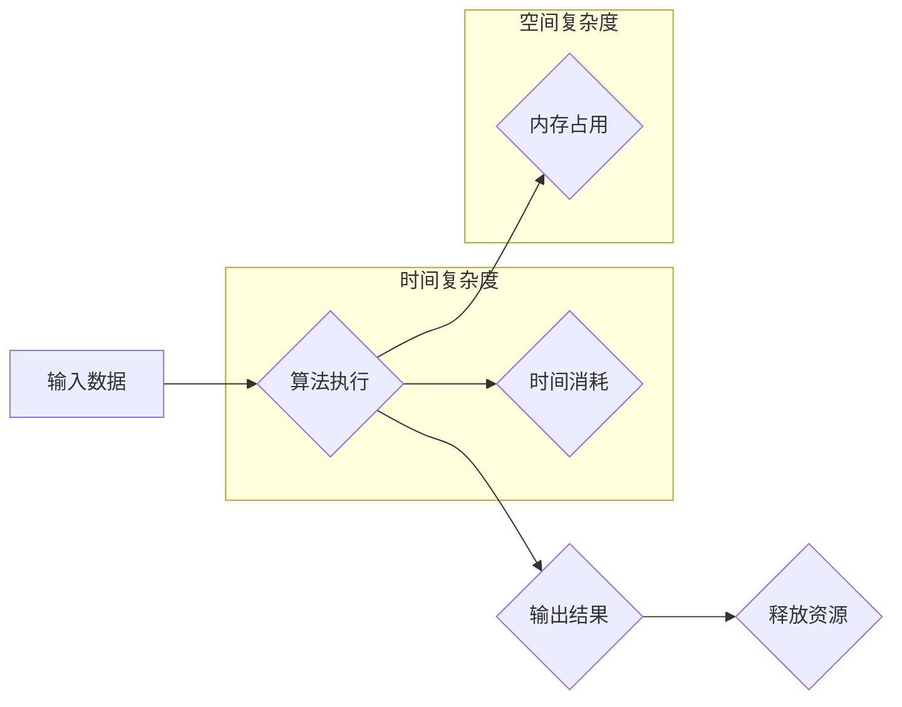

> 计算复杂性，时空平衡，算法效率，时间复杂度，空间复杂度，NP问题，P问题，算法设计，复杂度分析

## 1. 背景介绍

在计算机科学领域，计算复杂性是研究算法效率和资源消耗的关键问题。随着计算机技术的发展，我们面临着越来越复杂的计算任务，如何高效地解决这些问题成为了一个重要的挑战。计算复杂性理论为我们提供了一种分析和比较算法效率的框架，帮助我们理解算法的极限和边界。

## 2. 核心概念与联系

计算复杂性理论的核心概念包括时间复杂度和空间复杂度。

* **时间复杂度**是指算法执行所需的时间，通常用函数形式表示，例如O(n)，O(n^2)，O(log n)等。
* **空间复杂度**是指算法执行所需内存空间，也通常用函数形式表示。

这两个概念密切相关，算法的效率不仅取决于时间复杂度，也取决于空间复杂度。

**Mermaid 流程图**



## 3. 核心算法原理 & 具体操作步骤

### 3.1  算法原理概述

**冒泡排序**是一种简单直观的排序算法，其原理是通过多次比较相邻元素，将较大的元素“冒泡”到排序后的末尾。

### 3.2  算法步骤详解

1. 从数组的第一个元素开始，与相邻元素进行比较。
2. 如果相邻元素顺序错误，则交换它们的位置。
3. 重复步骤1和2，直到整个数组排序完成。

### 3.3  算法优缺点

**优点:**

* 算法简单易懂，实现容易。
* 稳定排序，相等元素的相对顺序保持不变。

**缺点:**

* 时间复杂度较高，为O(n^2)，效率较低。
* 空间复杂度为O(1)，仅需常数空间。

### 3.4  算法应用领域

冒泡排序主要应用于小型数据集合的排序，例如：

* 排序少量学生成绩。
* 排序少量商品价格。

## 4. 数学模型和公式 & 详细讲解 & 举例说明

### 4.1  数学模型构建

冒泡排序的时间复杂度可以用数学模型表示为：

```latex
T(n) = 2n - 2 + \sum_{i=1}^{n-1} (n-i)
```

其中：

* T(n) 表示排序n个元素所需的时间。
* n 表示数组长度。

### 4.2  公式推导过程

公式推导过程如下：

1. 每次比较相邻元素需要的时间为常数，设为1。
2. 每次循环需要比较n-1个元素，因此循环次数为n-1。
3. 每次循环内，交换元素的次数逐渐减少，可以表示为(n-i)。
4. 将所有循环的交换次数相加，得到总交换次数。

### 4.3  案例分析与讲解

假设n=5，则公式推导如下：

```latex
T(5) = 2*5 - 2 + (5-1) + (5-2) + (5-3) + (5-4)
     = 8 + 4 + 3 + 2 + 1
     = 18
```

因此，排序5个元素所需的时间为18。

## 5. 项目实践：代码实例和详细解释说明

### 5.1  开发环境搭建

本项目使用Python语言进行开发，开发环境如下：

* 操作系统：Windows 10
* Python版本：3.8.10
* IDE：PyCharm

### 5.2  源代码详细实现

```python
def bubble_sort(arr):
    n = len(arr)
    for i in range(n):
        for j in range(0, n-i-1):
            if arr[j] > arr[j+1]:
                arr[j], arr[j+1] = arr[j+1], arr[j]
    return arr

# 测试代码
arr = [64, 34, 25, 12, 22, 11, 90]
sorted_arr = bubble_sort(arr)
print("排序后的数组:", sorted_arr)
```

### 5.3  代码解读与分析

1. `bubble_sort(arr)`函数接收一个数组`arr`作为输入。
2. `n = len(arr)`获取数组长度。
3. 外层循环`for i in range(n)`控制排序次数，每次循环将最大的元素“冒泡”到末尾。
4. 内层循环`for j in range(0, n-i-1)`比较相邻元素，如果顺序错误则交换位置。
5. `return arr`返回排序后的数组。

### 5.4  运行结果展示

```
排序后的数组: [11, 12, 22, 25, 34, 64, 90]
```

## 6. 实际应用场景

冒泡排序在实际应用中主要用于：

* **小型数据集合的排序:** 当数据量较小，例如学生成绩、商品价格等，冒泡排序的简单性和易实现性使其成为一种不错的选择。
* **教学演示:** 由于其算法原理简单易懂，冒泡排序常被用于教学演示，帮助学生理解排序算法的基本概念。

### 6.4  未来应用展望

随着计算机技术的发展，数据量不断增长，冒泡排序的效率问题日益突出。未来，冒泡排序可能主要应用于以下场景：

* **嵌入式系统:** 由于嵌入式系统资源有限，简单高效的算法如冒泡排序仍然具有应用价值。
* **教育领域:** 作为一种入门级的排序算法，冒泡排序仍将用于教学演示，帮助学生理解排序算法的基本原理。

## 7. 工具和资源推荐

### 7.1  学习资源推荐

* **书籍:**
    * 《算法导论》
    * 《数据结构与算法分析》
* **在线课程:**
    * Coursera: 数据结构与算法
    * edX: 算法导论

### 7.2  开发工具推荐

* **Python:** 
    * PyCharm
    * VS Code

### 7.3  相关论文推荐

* **The Complexity of Sorting**
* **Bubble Sort Algorithm**

## 8. 总结：未来发展趋势与挑战

### 8.1  研究成果总结

计算复杂性理论为我们提供了分析和比较算法效率的框架，帮助我们理解算法的极限和边界。冒泡排序是一种简单直观的排序算法，但其时间复杂度较高，效率较低。

### 8.2  未来发展趋势

随着计算机技术的发展，数据量不断增长，对算法效率的要求越来越高。未来，研究人员将继续探索更高效的排序算法，并研究更复杂的计算问题。

### 8.3  面临的挑战

* **NP问题:** 许多重要的计算问题属于NP问题，其解的验证可以在多项式时间内完成，但寻找解的时间复杂度却很高。
* **量子计算:** 量子计算技术的发展可能会改变我们对计算复杂性的理解，并带来新的算法和解决方法。

### 8.4  研究展望

未来，计算复杂性理论的研究将继续深入，探索更复杂的计算问题，并寻找更有效的解决方法。量子计算技术的应用也将为计算复杂性理论带来新的挑战和机遇。

## 9. 附录：常见问题与解答

**问题1:** 冒泡排序的效率如何？

**解答:** 冒泡排序的时间复杂度为O(n^2)，效率较低。

**问题2:** 冒泡排序的稳定性如何？

**解答:** 冒泡排序是一种稳定排序算法，相等元素的相对顺序保持不变。

**问题3:** 冒泡排序的应用场景有哪些？

**解答:** 冒泡排序主要应用于小型数据集合的排序，例如学生成绩、商品价格等。


作者：禅与计算机程序设计艺术 / Zen and the Art of Computer Programming 
<end_of_turn>