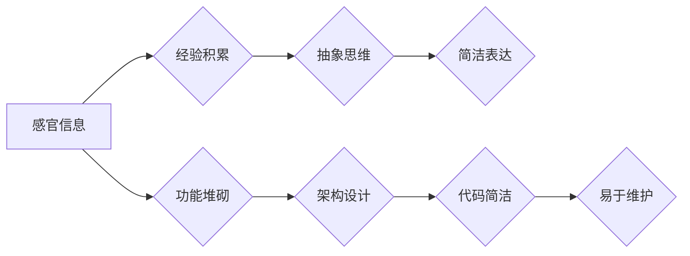

> 深刻简洁阶段，认知发展，人工智能，算法设计，软件架构，代码简洁性，可读性，可维护性

## 1. 背景介绍

在人工智能领域，我们不断追求更智能、更强大的模型，但同时，我们也意识到，模型的复杂性往往伴随着可理解性、可维护性和可扩展性的下降。就像人类的认知发展一样，从混沌的婴儿期走向理性的成年阶段，我们需要找到一种平衡点，既能实现强大的功能，又能保持简洁明了的结构。

“深刻简洁阶段”的概念源于对人类认知发展规律的观察。人类的认知发展并非简单的线性增长，而是经历了不同的阶段，每个阶段都有其独特的特征和挑战。在早期阶段，我们依赖于大量的感官信息和经验积累，但随着认知能力的提升，我们开始寻求更深刻的理解和更简洁的表达方式。

在软件开发领域，我们也面临着类似的挑战。早期软件往往是庞大而复杂的，难以理解和维护。随着软件工程的发展，我们逐渐认识到，简洁明了的代码不仅更易于理解和维护，而且更能体现软件的设计思想和架构原则。

## 2. 核心概念与联系

**2.1 深刻简洁阶段的定义**

“深刻简洁阶段”是指在软件开发过程中，我们从追求功能的复杂性转向追求代码的简洁性和可读性，同时保持功能的完整性和性能的优越性。

**2.2 深刻简洁阶段与认知发展的关系**

* **认知发展：** 从感官信息积累到抽象思维，从复杂结构到简洁表达。
* **软件开发：** 从功能堆砌到架构设计，从代码冗余到代码简洁，从难以理解到易于维护。

**2.3 深刻简洁阶段的实现路径**

* **算法设计：** 追求高效、简洁的算法，避免冗余操作和复杂的逻辑。
* **代码风格：** 遵循代码规范，使用清晰的命名和注释，提高代码的可读性。
* **架构设计：** 将软件分解成独立的模块，实现模块化设计，提高代码的可维护性和可扩展性。

**Mermaid 流程图**



## 3. 核心算法原理 & 具体操作步骤

**3.1 算法原理概述**

在“深刻简洁阶段”，我们追求高效、简洁的算法，例如：

* **动态规划：** 将复杂问题分解成子问题，并利用子问题的解来解决原问题，避免重复计算。
* **贪心算法：** 在每次决策时，选择最优的局部解，期望最终得到全局最优解。
* **分治算法：** 将问题分解成若干个子问题，递归地解决子问题，最后合并子问题的解得到原问题的解。

**3.2 算法步骤详解**

以动态规划为例，其基本步骤如下：

1. **定义状态：** 确定问题的状态空间，并用变量表示每个状态。
2. **定义状态转移方程：** 描述如何从一个状态转移到另一个状态，并计算转移的代价。
3. **初始化状态：** 设置初始状态的价值。
4. **迭代计算：** 从初始状态开始，依次计算每个状态的价值，直到达到目标状态。
5. **回溯解：** 根据状态转移方程，从目标状态回溯到初始状态，得到问题的解。

**3.3 算法优缺点**

* **优点：** 
    * 效率高，避免重复计算。
    * 适用于许多具有重叠子问题的优化问题。
* **缺点：** 
    * 需要仔细分析问题，设计状态转移方程。
    * 对于某些问题，可能需要大量的存储空间。

**3.4 算法应用领域**

* **路径规划：** 寻找最短路径或最优路径。
* **序列比对：** 比较两个序列的相似性。
* **文本编辑：** 实现文本的插入、删除和替换操作。
* **机器翻译：** 将文本从一种语言翻译成另一种语言。

## 4. 数学模型和公式 & 详细讲解 & 举例说明

**4.1 数学模型构建**

动态规划问题通常可以用状态转移方程来描述。状态转移方程是一个数学公式，描述了如何从一个状态转移到另一个状态，并计算转移的代价。

**4.2 公式推导过程**

假设我们有一个动态规划问题，状态空间为 S，每个状态 s ∈ S 都有一个价值值 f(s)。状态转移方程可以表示为：

```latex
f(s) = min_{s' ∈ predecessors(s)} {f(s') + cost(s', s)}
```

其中：

* predecessors(s) 是状态 s 的前驱状态集合。
* cost(s', s) 是从状态 s' 到状态 s 的转移代价。

**4.3 案例分析与讲解**

**例子：** 爬楼梯问题

假设有一栋楼有 n 层，每次可以爬 1 或 2 层楼梯。请问有多少种不同的爬楼梯方法？

**状态转移方程：**

```latex
f(i) = f(i - 1) + f(i - 2)
```

其中：

* f(i) 是爬到第 i 层楼梯的方法数。
* f(i - 1) 是爬到第 i - 1 层楼梯的方法数。
* f(i - 2) 是爬到第 i - 2 层楼梯的方法数。

**初始条件：**

* f(0) = 1
* f(1) = 1

**解法：**

我们可以使用动态规划算法，从 f(0) 和 f(1) 开始，依次计算 f(2), f(3), ..., f(n)。最终，f(n) 就是爬到第 n 层楼梯的方法数。

## 5. 项目实践：代码实例和详细解释说明

**5.1 开发环境搭建**

* 操作系统：Linux/macOS/Windows
* 编程语言：Python
* 开发工具：VS Code/Atom/Sublime Text

**5.2 源代码详细实现**

```python
def climb_stairs(n):
    """
    计算爬楼梯的方法数。

    Args:
        n: 楼梯层数。

    Returns:
        爬楼梯的方法数。
    """
    if n <= 1:
        return 1
    dp = [0] * (n + 1)
    dp[0] = 1
    dp[1] = 1
    for i in range(2, n + 1):
        dp[i] = dp[i - 1] + dp[i - 2]
    return dp[n]

# 测试
n = 5
result = climb_stairs(n)
print(f"爬 {n} 层楼梯的方法数：{result}")
```

**5.3 代码解读与分析**

* 函数 `climb_stairs(n)` 计算爬楼梯的方法数。
* `dp` 数组存储每个层数的爬楼梯方法数。
* 初始条件：爬到 0 层和 1 层的方法数都是 1。
* 循环计算从第 2 层到第 n 层的爬楼梯方法数。
* 返回 `dp[n]`，即爬到第 n 层楼梯的方法数。

**5.4 运行结果展示**

```
爬 5 层楼梯的方法数：8
```

## 6. 实际应用场景

**6.1 软件架构设计**

* 模块化设计：将软件分解成独立的模块，提高代码的可维护性和可扩展性。
* 责任链模式：将请求传递给多个处理者，实现请求的路由和处理。
* 命令模式：将请求封装成对象，实现请求的延迟执行和撤销。

**6.2 算法优化**

* 使用动态规划算法解决重复计算问题，提高算法效率。
* 使用贪心算法解决局部最优解问题，简化算法设计。
* 使用分治算法解决大规模问题，提高算法可扩展性。

**6.3 数据结构设计**

* 使用树形结构存储层次数据，实现数据组织和查询。
* 使用图结构表示关系数据，实现数据关联和分析。
* 使用哈希表实现快速数据查找，提高数据访问效率。

**6.4 未来应用展望**

* 深刻简洁阶段将推动人工智能模型的更有效率、更可解释的开发。
* 代码简洁性将成为软件开发的重要评估指标，推动软件质量的提升。
* 深刻简洁的思维方式将应用于更多领域，例如科学研究、艺术创作等。

## 7. 工具和资源推荐

**7.1 学习资源推荐**

* 书籍：
    * 《算法导论》
    * 《设计模式》
    * 《深入理解计算机系统》
* 在线课程：
    * Coursera: Algorithms, Part I
    * edX: Introduction to Computer Science and Programming Using Python
* 博客和网站：
    * Hacker News
    * Stack Overflow
    * Medium

**7.2 开发工具推荐**

* 编程语言：Python, Java, C++
* 代码编辑器：VS Code, Atom, Sublime Text
* 版本控制系统：Git
* 测试框架：JUnit, pytest

**7.3 相关论文推荐**

* 《The Art of Computer Programming》
* 《Design Patterns: Elements of Reusable Object-Oriented Software》
* 《Introduction to Algorithms》

## 8. 总结：未来发展趋势与挑战

**8.1 研究成果总结**

* 深刻简洁阶段的概念为软件开发提供了新的思路和方向。
* 算法设计、代码风格和架构设计等方面取得了显著进展。
* 深刻简洁的思维方式将应用于更多领域，推动科技进步。

**8.2 未来发展趋势**

* 人工智能模型将更加简洁、高效和可解释。
* 代码生成和自动测试技术将更加成熟。
* 深刻简洁的思维方式将成为未来软件开发的基石。

**8.3 面临的挑战**

* 如何平衡功能的完整性和代码的简洁性。
* 如何提高代码的可读性和可维护性。
* 如何应对不断变化的技术环境。

**8.4 研究展望**

* 深入研究人工智能模型的简洁性设计方法。
* 开发更加智能的代码生成和自动测试工具。
* 推广深刻简洁的思维方式，促进软件开发的创新发展。

## 9. 附录：常见问题与解答

**9.1 什么是深刻简洁阶段？**

深刻简洁阶段是指在软件开发过程中，我们从追求功能的复杂性转向追求代码的简洁性和可读性，同时保持功能的完整性和性能的优越性。

**9.2 深刻简洁阶段有什么好处？**

* 代码更易于理解和维护。
* 软件架构更清晰和稳定。
* 开发效率更高。

**9.3 如何实现深刻简洁阶段？**

* 追求高效、简洁的算法。
* 遵循代码规范，使用清晰的命名和注释。
* 进行模块化设计，实现代码的独立性和可扩展性。


作者：禅与计算机程序设计艺术 / Zen and the Art of Computer Programming 
<end_of_turn>