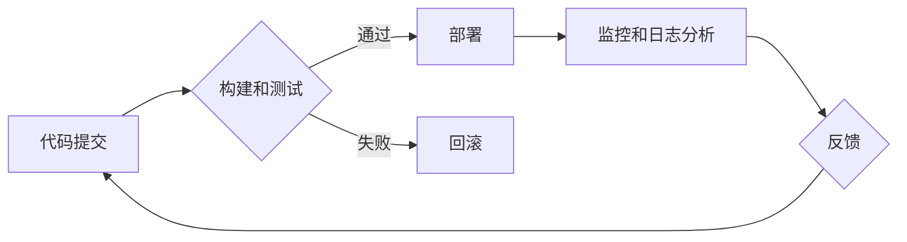

> 软件发布流程, DevOps, 自动化, 持续集成, 持续交付, 质量保证, 监控, 性能优化

## 1. 背景介绍

软件行业正经历着前所未有的变革，用户对软件的需求越来越高，对新功能和更新的期望也越来越快。传统的软件发布流程往往冗长、复杂，难以满足快速迭代的需求。为了应对这一挑战，DevOps理念应运而生，它强调开发和运维团队的协作，以及自动化和持续交付的实践。

软件2.0的发布管理流程是基于DevOps理念，旨在实现快速、高效、可靠的软件发布。它强调自动化、持续集成、持续交付、质量保证和监控，以满足现代软件开发的快速迭代和持续改进的需求。

## 2. 核心概念与联系

**2.1 DevOps理念**

DevOps是一种文化、实践和工具的集合，旨在打破开发和运维之间的壁垒，实现团队协作、自动化流程和持续交付。

**2.2 持续集成 (CI)**

持续集成是指将代码频繁地集成到主分支，并通过自动化构建和测试来确保代码质量。

**2.3 持续交付 (CD)**

持续交付是指将经过测试的代码自动部署到生产环境，实现快速、可靠的软件发布。

**2.4 自动化测试**

自动化测试是指使用脚本或工具自动执行测试用例，提高测试效率和覆盖率。

**2.5 监控和日志分析**

监控和日志分析是指对软件运行状态进行实时监控，收集日志信息，以便及时发现和解决问题。

**2.6 质量保证**

质量保证是指在整个软件开发生命周期中，确保软件满足用户需求和质量标准。

**2.7 流程图**



## 3. 核心算法原理 & 具体操作步骤

**3.1 算法原理概述**

软件2.0的发布管理流程的核心算法是基于自动化、持续集成和持续交付的原则，通过一系列的步骤和工具，实现快速、高效、可靠的软件发布。

**3.2 算法步骤详解**

1. **代码提交:** 开发人员将代码提交到版本控制系统，例如Git。

2. **构建和测试:** 构建系统自动构建代码，并执行自动化测试用例，例如单元测试、集成测试和系统测试。

3. **部署:** 如果测试通过，则自动部署代码到测试环境或生产环境。

4. **监控和日志分析:** 监控系统实时监控软件运行状态，收集日志信息，以便及时发现和解决问题。

5. **反馈:** 用户反馈和监控数据将反馈到开发团队，用于改进软件质量和功能。

**3.3 算法优缺点**

**优点:**

* **快速迭代:** 自动化流程和持续交付可以显著缩短软件发布周期。
* **提高软件质量:** 自动化测试可以提高测试覆盖率，降低软件缺陷率。
* **提高开发效率:** 自动化流程可以解放开发人员的时间，让他们专注于核心功能开发。
* **降低风险:** 持续集成和持续交付可以降低软件发布风险，确保软件稳定运行。

**缺点:**

* **需要投入:** 建立和维护自动化流程需要一定的投入，包括人员、工具和时间。
* **需要团队协作:** DevOps理念需要开发和运维团队的紧密协作，需要良好的沟通和信任关系。
* **需要技术支持:** 需要具备一定的自动化、持续集成和持续交付的工具和技术支持。

**3.4 算法应用领域**

软件2.0的发布管理流程适用于各种类型的软件开发项目，例如：

* Web应用程序
* 移动应用程序
* 云计算平台
* 大数据平台
* 物联网平台

## 4. 数学模型和公式 & 详细讲解 & 举例说明

**4.1 数学模型构建**

软件发布管理流程可以抽象为一个数学模型，其中涉及到时间、资源、质量和风险等因素。

**4.2 公式推导过程**

可以利用概率论和统计学等数学工具，推导软件发布成功率、缺陷率、发布周期等指标的公式。

**4.3 案例分析与讲解**

例如，可以利用蒙特卡罗模拟法，模拟不同软件发布策略下的发布成功率，并分析不同策略的优劣。

## 5. 项目实践：代码实例和详细解释说明

**5.1 开发环境搭建**

* 操作系统: Ubuntu 20.04 LTS
* 编程语言: Python 3.8
* 工具: Git, Docker, Jenkins, Kubernetes

**5.2 源代码详细实现**

```python
# 这是一个简单的自动化测试脚本
import unittest

class TestAddition(unittest.TestCase):
    def test_add(self):
        self.assertEqual(2 + 2, 4)

if __name__ == '__main__':
    unittest.main()
```

**5.3 代码解读与分析**

* 该脚本定义了一个测试类 `TestAddition`，包含一个测试方法 `test_add`。
* `test_add` 方法使用 `assertEqual` 方法进行断言，验证 2 + 2 等于 4。
* `if __name__ == '__main__':` 语句确保脚本在直接执行时运行测试用例。

**5.4 运行结果展示**

```
..
----------------------------------------------------------------------
Ran 1 test in 0.001s

OK
```

## 6. 实际应用场景

**6.1 案例分析**

例如，一家电商平台可以使用软件2.0的发布管理流程，快速迭代新功能，例如商品推荐、促销活动、用户画像等，以满足用户不断变化的需求。

**6.2 未来应用展望**

随着人工智能、云计算和物联网等技术的快速发展，软件2.0的发布管理流程将更加智能化、自动化和敏捷化。

## 7. 工具和资源推荐

**7.1 学习资源推荐**

* DevOps Handbook
* The Phoenix Project
* Continuous Delivery

**7.2 开发工具推荐**

* Git
* Docker
* Jenkins
* Kubernetes

**7.3 相关论文推荐**

* The Phoenix Project: A Novel About IT, DevOps, and Helping Your Business Win
* Continuous Delivery: Reliable Software Releases through Build, Test, and Deployment Automation

## 8. 总结：未来发展趋势与挑战

**8.1 研究成果总结**

软件2.0的发布管理流程已经取得了显著的成果，提高了软件开发效率和质量，降低了软件发布风险。

**8.2 未来发展趋势**

* 更智能化、自动化和敏捷化的发布流程
* 更广泛的应用场景，例如物联网、边缘计算等
* 更强的安全性和可靠性

**8.3 面临的挑战**

* 团队文化和组织结构的转变
* 技术复杂性和人才短缺
* 安全性和隐私保护

**8.4 研究展望**

未来研究将重点关注以下方面：

* 更智能的自动化策略
* 更安全的发布流程
* 更有效的团队协作机制

## 9. 附录：常见问题与解答

**9.1 Q: 如何实现持续集成和持续交付？**

**A:** 可以使用工具链，例如Git、Jenkins、Docker、Kubernetes等，实现自动化构建、测试、部署和监控。

**9.2 Q: 如何提高软件发布的可靠性？**

**A:** 可以通过自动化测试、监控和日志分析等手段，确保软件在发布前和发布后都能够稳定运行。

**9.3 Q: 如何应对团队文化和组织结构的转变？**

**A:** 需要加强沟通和培训，建立良好的团队协作机制，并逐步推动DevOps理念的落地。


作者：禅与计算机程序设计艺术 / Zen and the Art of Computer Programming 
<end_of_turn>