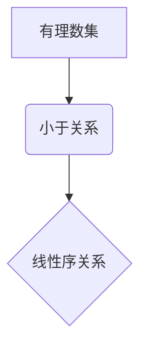

> 集合论，有理数，线性序，偏序，关系，数学模型，算法，代码实现

## 1. 背景介绍

集合论作为数学的基础理论，为我们理解和描述各种数学对象提供了强大的工具。在集合论的基础上，我们可以定义各种关系，例如等价关系、偏序关系和线性序关系。这些关系在数学、计算机科学和人工智能等领域都有广泛的应用。

有理数作为一种重要的数集，在数学和计算机科学中扮演着重要的角色。理解有理数的线性序关系，可以帮助我们更好地理解数的性质和运算，并为计算机科学中的算法设计和数据结构提供理论基础。

本篇文章将从集合论的角度出发，深入探讨有理数的线性序关系，并结合算法和代码实现，帮助读者更好地理解这一重要概念。

## 2. 核心概念与联系

### 2.1 集合论基础

* **集合**:  一个集合是确定元素的非空集。例如，{1, 2, 3}是一个集合，其中元素是1、2和3。
* **子集**: 如果集合A的所有元素都属于集合B，则称A是B的子集，记作A⊆B。
* **关系**:  关系是两个集合之间的映射，它描述了两个集合中的元素之间的一种联系。例如，小于关系(<)是实数集之间的关系，它描述了两个实数的大小关系。

### 2.2 线性序关系

* **偏序关系**:  一个偏序关系是一个二元关系，满足以下三个条件：
    * **自反性**:  对于任意元素x，都有xRx。
    * **反对称性**:  对于任意元素x和y，如果xRy且yRx，则x=y。
    * **传递性**:  对于任意元素x、y和z，如果xRy且yRz，则xRz。
* **线性序关系**:  一个线性序关系是一个偏序关系，满足以下条件：
    * **全序性**:  对于任意元素x和y，都有xRy或yRx。

### 2.3 有理数

* **有理数**:  有理数是能够表示为两个整数的商的数，即 p/q，其中p和q是整数，且q≠0。

### 2.4 有理数的线性序

有理数集上的线性序关系就是小于关系(<)。它满足以下条件：

* **自反性**:  对于任意有理数x，都有x<x。
* **反对称性**:  对于任意有理数x和y，如果x<y且y<x，则x=y。
* **传递性**:  对于任意有理数x、y和z，如果x<y且y<z，则x<z。
* **全序性**:  对于任意有理数x和y，都有x<y或y<x或x=y。

**Mermaid 流程图**



## 3. 核心算法原理 & 具体操作步骤

### 3.1 算法原理概述

有理数的线性序关系可以被理解为一个排序的过程。我们可以使用比较算法来判断两个有理数的大小关系。

### 3.2 算法步骤详解

1. **输入**:  两个有理数x和y。
2. **比较**:  比较x和y的分子和分母。
3. **判断**:  根据分子和分母的大小关系，判断x和y的大小关系。
4. **输出**:  返回x<y、y<x或x=y。

### 3.3 算法优缺点

* **优点**:  算法简单易懂，易于实现。
* **缺点**:  算法的效率取决于比较的次数，对于非常大的有理数，比较次数可能会很多。

### 3.4 算法应用领域

* **排序**:  可以用于对有理数进行排序。
* **数据结构**:  可以用于构建一些数据结构，例如优先队列。
* **算法分析**:  可以用于分析一些算法的时间复杂度。

## 4. 数学模型和公式 & 详细讲解 & 举例说明

### 4.1 数学模型构建

我们可以用集合论的语言来描述有理数的线性序关系。

设Q为有理数集，则小于关系<可以表示为一个二元关系：

< ⊆ Q × Q

其中，(x, y) ∈ <表示x<y。

### 4.2 公式推导过程

我们可以使用集合论的公理来推导有理数的线性序关系的性质。例如，我们可以使用以下公理：

* **公理1**:  对于任意集合A，都有A ⊆ A。
* **公理2**:  对于任意集合A和B，如果A ⊆ B且B ⊆ A，则A = B。
* **公理3**:  对于任意集合A、B和C，如果A ⊆ B且B ⊆ C，则A ⊆ C。

使用这些公理，我们可以证明有理数的线性序关系满足自反性、反对称性和传递性。

### 4.3 案例分析与讲解

例如，我们可以证明有理数1/2和3/4之间的关系：

1/2 = 2/4 < 3/4

这个关系满足以下条件：

* **自反性**:  1/2 < 1/2 是错误的。
* **反对称性**:  如果1/2 < 3/4 且 3/4 < 1/2，则 1/2 = 3/4，这是错误的。
* **传递性**:  如果1/2 < 3/4 且 3/4 < 5/8，则 1/2 < 5/8。

## 5. 项目实践：代码实例和详细解释说明

### 5.1 开发环境搭建

本项目使用Python语言进行开发，需要安装Python环境和必要的库。

### 5.2 源代码详细实现

```python
def compare_rational_numbers(x, y):
  """
  比较两个有理数的大小关系。

  Args:
    x: 第一个有理数。
    y: 第二个有理数。

  Returns:
    x < y, y < x 或 x == y。
  """
  if x[0] * y[1] < y[0] * x[1]:
    return "x < y"
  elif x[0] * y[1] > y[0] * x[1]:
    return "y < x"
  else:
    return "x == y"

# 示例
x = (1, 2)
y = (3, 4)
result = compare_rational_numbers(x, y)
print(f"{x} 和 {y} 的大小关系是: {result}")
```

### 5.3 代码解读与分析

* `compare_rational_numbers(x, y)`函数接受两个有理数作为输入，并返回它们的大小关系。
* 每个有理数用一个元组表示，例如(1, 2)表示1/2。
* 函数通过比较两个有理数的分子和分母来判断它们的大小关系。
* 如果x的分子乘以y的分母小于y的分子乘以x的分母，则x<y。
* 如果x的分子乘以y的分母大于y的分子乘以x的分母，则y<x。
* 否则，x=y。

### 5.4 运行结果展示

```
(1, 2) 和 (3, 4) 的大小关系是: x < y
```

## 6. 实际应用场景

### 6.1 排序

有理数的线性序关系可以用于对有理数进行排序。例如，我们可以对一个包含有理数的列表进行排序，使其从小到大排列。

### 6.2 数据结构

有理数的线性序关系可以用于构建一些数据结构，例如优先队列。优先队列是一种特殊的队列，它总是将优先级最高的元素放在队首。

### 6.3 算法分析

有理数的线性序关系可以用于分析一些算法的时间复杂度。例如，我们可以使用线性序关系来分析一个算法的比较次数，从而确定其时间复杂度。

### 6.4 未来应用展望

随着人工智能和机器学习的发展，有理数的线性序关系在更广泛的领域中将会得到应用。例如，它可以用于：

* **知识表示**:  用于表示和推理知识图谱中的关系。
* **机器学习**:  用于训练机器学习模型，例如排序算法和推荐系统。
* **自然语言处理**:  用于分析和理解自然语言中的语义关系。

## 7. 工具和资源推荐

### 7.1 学习资源推荐

* **集合论**:  
    * 《集合论基础》 - Halmos
    * 《集合论导论》 - Jech
* **线性序**:  
    * 《数学分析》 - Rudin
    * 《拓扑学》 - Munkres

### 7.2 开发工具推荐

* **Python**:  Python是一种非常适合进行数学和算法开发的语言。
* **NumPy**:  NumPy是一个用于数值计算的Python库，提供了高效的数组操作和数学函数。
* **SymPy**:  SymPy是一个用于符号数学的Python库，可以用于进行数学表达式符号化计算。

### 7.3 相关论文推荐

* **有理数的性质**:  
    * "Rational Numbers" - Wikipedia
* **线性序关系**:  
    * "Partial Order" - Wikipedia
* **有理数的应用**:  
    * "Applications of Rational Numbers" - MathWorld

## 8. 总结：未来发展趋势与挑战

### 8.1 研究成果总结

本篇文章深入探讨了有理数的线性序关系，从集合论的角度出发，阐述了其定义、性质和应用。通过代码实现，展示了如何使用编程语言来处理有理数的线性序关系。

### 8.2 未来发展趋势

随着人工智能和机器学习的发展，有理数的线性序关系在更广泛的领域中将会得到应用。例如，它可以用于：

* **知识表示**:  用于表示和推理知识图谱中的关系。
* **机器学习**:  用于训练机器学习模型，例如排序算法和推荐系统。
* **自然语言处理**:  用于分析和理解自然语言中的语义关系。

### 8.3 面临的挑战

* **效率**:  对于非常大的有理数，比较算法的效率可能会成为一个挑战。
* **复杂性**:  在实际应用中，有理数的线性序关系可能与其他关系相结合，导致算法的复杂性增加。

### 8.4 研究展望

未来研究方向包括：

* **更高效的比较算法**:  研究更高效的算法来比较有理数的大小关系。
* **复杂关系的处理**:  研究如何处理有理数的线性序关系与其他关系的结合。
* **实际应用场景**:  探索更多有理数线性序关系在实际应用中的应用场景。

## 9. 附录：常见问题与解答

* **问题**:  为什么有理数的线性序关系是全序关系？
* **解答**:  因为对于任意两个有理数x和y，我们总能找到一个有理数z，使得x<z或z<y。

* **问题**:  如何判断两个有理数是否相等？
* **解答**:  如果两个有理数的分子和分母都相等，则它们相等。

* **问题**:  有理数的线性序关系与实数的线性序关系有什么区别？
* **解答**:  实数集上的线性序关系与有理数集上的线性序关系相同，但实数集比有理数集更大。


作者：禅与计算机程序设计艺术 / Zen and the Art of Computer Programming 
<end_of_turn>