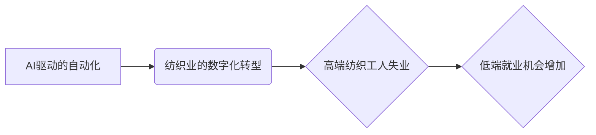

>人工智能，自动化，纺织业，失业，就业机会，低端工作，技术替代，社会影响

## 1. 背景介绍

随着人工智能（AI）技术的飞速发展，自动化技术在各个行业得到广泛应用，纺织业也不例外。从传统的纺织生产线到现代智能工厂，AI和自动化技术正在深刻地改变着纺织行业的生产模式和工作环境。然而，这种技术进步也带来了新的挑战，即高端纺织工人的失业和低端就业机会的增加。

纺织业一直是劳动密集型行业，需要大量的人工参与生产过程。高端纺织工人，例如设计师、技术工程师、质量控制人员等，需要具备专业技能和丰富的经验，他们负责设计、研发、生产和质量控制等关键环节。然而，随着AI技术的进步，许多传统纺织工作正在被自动化替代。例如，AI驱动的机器可以自动完成织布、缝纫、裁剪等操作，大大提高了生产效率，同时也减少了对人工的需求。

## 2. 核心概念与联系

**2.1 AI驱动的自动化**

AI驱动的自动化是指利用人工智能技术，例如机器学习、深度学习等，实现生产过程的自动化控制和优化。在纺织业中，AI驱动的自动化主要体现在以下几个方面：

* **智能织布机：** 利用机器学习算法，智能织布机可以根据不同的设计图纸和材料特性，自动调整织布参数，提高织物的质量和生产效率。
* **自动裁剪系统：** 通过计算机视觉技术，自动裁剪系统可以识别布料的形状和尺寸，自动进行裁剪，减少人工操作，提高裁剪精度。
* **智能缝纫机器人：** 智能缝纫机器人可以根据设计图纸，自动完成缝纫操作，提高缝纫速度和质量。

**2.2 纺织业的数字化转型**

纺织业的数字化转型是指利用信息技术，例如云计算、大数据、物联网等，对纺织生产过程进行数字化管理和优化。数字化转型可以帮助纺织企业提高生产效率、降低成本、提升产品质量和服务水平。

**2.3 核心概念关系图**



## 3. 核心算法原理 & 具体操作步骤

**3.1 算法原理概述**

AI驱动的自动化在纺织业中主要依赖于以下核心算法：

* **机器学习算法：** 用于训练机器模型，使其能够从数据中学习，并根据学习到的知识进行预测和决策。例如，在智能织布机中，机器学习算法可以根据历史数据，预测最佳织布参数，提高织物的质量和生产效率。
* **深度学习算法：** 是一种更高级的机器学习算法，能够处理更复杂的数据，例如图像、语音等。在纺织业中，深度学习算法可以用于图像识别、缺陷检测等应用。
* **自然语言处理算法：** 用于处理和理解自然语言，例如文本和语音。在纺织业中，自然语言处理算法可以用于智能客服、订单处理等应用。

**3.2 算法步骤详解**

以智能织布机为例，其工作流程如下：

1. **数据采集：** 收集织布过程中的各种数据，例如布料类型、织布参数、织物质量等。
2. **数据预处理：** 对采集到的数据进行清洗、转换和格式化，使其能够被机器学习算法处理。
3. **模型训练：** 利用机器学习算法，训练一个织布参数预测模型。
4. **模型评估：** 对训练好的模型进行评估，验证其预测精度。
5. **模型部署：** 将训练好的模型部署到智能织布机中，用于实时预测最佳织布参数。

**3.3 算法优缺点**

**优点：**

* **提高生产效率：** 自动化可以减少人工操作，提高生产速度和效率。
* **降低生产成本：** 自动化可以减少人工成本，降低生产成本。
* **提高产品质量：** 自动化可以减少人为错误，提高产品质量。

**缺点：**

* **初期投资成本高：** 自动化设备的采购和安装成本较高。
* **技术维护成本高：** 自动化设备需要专业的技术人员进行维护和保养。
* **失业风险：** 自动化可能会导致部分人工岗位被替代，增加失业风险。

**3.4 算法应用领域**

AI驱动的自动化技术在纺织业的应用领域非常广泛，例如：

* **智能织布机**
* **自动裁剪系统**
* **智能缝纫机器人**
* **纺织品质量检测系统**
* **智能库存管理系统**

## 4. 数学模型和公式 & 详细讲解 & 举例说明

**4.1 数学模型构建**

在智能织布机中，可以构建一个数学模型来预测最佳织布参数。该模型可以基于以下因素进行预测：

* 布料类型
* 织物密度
* 织物强度
* 织物外观

**4.2 公式推导过程**

假设我们想要预测织物强度的最佳织布参数，我们可以使用以下公式：

```latex
Strength = f(YarnType, Density, Tension)
```

其中：

* Strength：织物强度
* YarnType：布料类型
* Density：织物密度
* Tension：织物张力

我们可以使用机器学习算法，例如线性回归或神经网络，来训练这个模型，并学习到 f( ) 函数的具体形式。

**4.3 案例分析与讲解**

假设我们有一批棉布，需要织成不同密度的织物。我们可以使用上述模型，根据不同的密度需求，预测最佳的织物张力。例如，如果需要织成高密度的织物，则需要更高的织物张力。

## 5. 项目实践：代码实例和详细解释说明

**5.1 开发环境搭建**

* Python 3.x
* TensorFlow 或 PyTorch
* Jupyter Notebook

**5.2 源代码详细实现**

```python
import tensorflow as tf

# 定义模型结构
model = tf.keras.models.Sequential([
    tf.keras.layers.Dense(64, activation='relu', input_shape=(3,)),
    tf.keras.layers.Dense(32, activation='relu'),
    tf.keras.layers.Dense(1)
])

# 编译模型
model.compile(optimizer='adam', loss='mse')

# 训练模型
model.fit(X_train, y_train, epochs=10)

# 预测织物强度
predicted_strength = model.predict(X_test)
```

**5.3 代码解读与分析**

* 我们使用 TensorFlow 库构建了一个简单的深度学习模型。
* 模型输入三个特征：布料类型、织物密度和织物张力。
* 模型输出织物强度的预测值。
* 我们使用 Adam 优化器和均方误差损失函数来训练模型。

**5.4 运行结果展示**

训练完成后，我们可以使用测试数据来评估模型的预测精度。

## 6. 实际应用场景

**6.1 智能织布机**

智能织布机可以根据不同的设计图纸和材料特性，自动调整织布参数，提高织物的质量和生产效率。

**6.2 自动裁剪系统**

自动裁剪系统可以识别布料的形状和尺寸，自动进行裁剪，减少人工操作，提高裁剪精度。

**6.3 智能缝纫机器人**

智能缝纫机器人可以根据设计图纸，自动完成缝纫操作，提高缝纫速度和质量。

**6.4 未来应用展望**

随着人工智能技术的不断发展，AI驱动的自动化技术将在纺织业得到更广泛的应用，例如：

* **个性化定制：** AI可以帮助纺织企业实现个性化定制，根据客户的需求，设计和生产独特的纺织品。
* **可持续发展：** AI可以帮助纺织企业优化生产流程，减少资源消耗和环境污染，实现可持续发展。
* **智能供应链：** AI可以帮助纺织企业建立智能供应链，提高供应链效率和透明度。

## 7. 工具和资源推荐

**7.1 学习资源推荐**

* TensorFlow 官方文档：https://www.tensorflow.org/
* PyTorch 官方文档：https://pytorch.org/
* Coursera 上的机器学习课程：https://www.coursera.org/learn/machine-learning

**7.2 开发工具推荐**

* Jupyter Notebook：https://jupyter.org/
* VS Code：https://code.visualstudio.com/

**7.3 相关论文推荐**

* Deep Learning for Textile Manufacturing: A Review
* Artificial Intelligence in Textile Industry: Applications and Future Trends

## 8. 总结：未来发展趋势与挑战

**8.1 研究成果总结**

AI驱动的自动化技术在纺织业的应用取得了显著成果，提高了生产效率、降低了生产成本，并为纺织行业带来了新的发展机遇。

**8.2 未来发展趋势**

未来，AI驱动的自动化技术将在纺织业得到更广泛的应用，例如个性化定制、可持续发展和智能供应链。

**8.3 面临的挑战**

* **技术壁垒：** AI技术的应用需要专业的技术人员和知识，这对于一些中小纺织企业来说是一个挑战。
* **数据安全：** AI技术的应用需要大量的生产数据，数据安全问题需要得到重视。
* **社会影响：** AI驱动的自动化可能会导致部分人工岗位被替代，需要制定相应的政策和措施，应对失业风险。

**8.4 研究展望**

未来，我们需要继续研究和开发更先进的AI算法和应用场景，推动AI技术在纺织业的更广泛应用，同时也要关注AI技术的社会影响，确保其健康可持续发展。

## 9. 附录：常见问题与解答

**9.1 如何选择合适的AI算法？**

选择合适的AI算法需要根据具体应用场景和数据特点进行选择。例如，对于预测织物强度的应用，可以使用线性回归或神经网络算法。

**9.2 如何解决数据安全问题？**

数据安全问题需要采取多种措施来解决，例如数据加密、访问控制和数据备份。

**9.3 如何应对AI驱动的自动化带来的失业风险？**

政府和企业需要共同努力，制定相应的政策和措施，例如提供职业培训和再就业服务，帮助失业人员适应新的工作环境。


作者：禅与计算机程序设计艺术 / Zen and the Art of Computer Programming 
<end_of_turn>