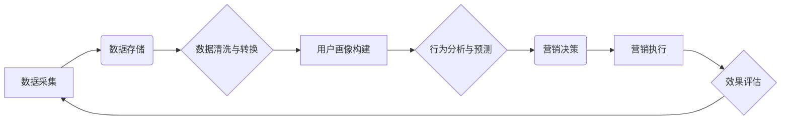

> AI DMP, 数据基建, 数据驱动营销, 人工智能, 营销自动化, 个性化推荐, 数据分析, 预测模型

## 1. 背景介绍

在当今数据爆炸的时代，数据已成为企业最重要的资产。数据驱动营销 (Data-Driven Marketing) 正逐渐成为企业营销策略的核心。传统的营销模式依赖于经验和直觉，而数据驱动营销则通过数据分析和预测模型，为营销决策提供科学依据，提升营销效率和效果。

数据管理平台 (DMP) 作为数据驱动营销的重要基础设施，负责收集、存储、整合和分析用户数据，为营销人员提供洞察和决策支持。然而，传统的 DMP 往往局限于简单的用户画像和行为分析，难以满足日益复杂的营销需求。

随着人工智能 (AI) 技术的快速发展，AI DMP (Artificial Intelligence Data Management Platform) 应运而生。AI DMP 通过人工智能算法，对用户数据进行更深入的分析和挖掘，能够自动识别用户需求和行为模式，提供更精准的个性化营销服务。

## 2. 核心概念与联系

**2.1 AI DMP 的核心概念**

AI DMP 是基于人工智能技术的下一代数据管理平台，其核心概念包括：

* **数据整合:** AI DMP 可以从各种数据源，如网站、APP、社交媒体等，收集和整合用户数据，构建全面的用户画像。
* **智能分析:** AI DMP 利用机器学习、深度学习等人工智能算法，对用户数据进行分析和挖掘，识别用户需求、行为模式和潜在兴趣。
* **个性化营销:** AI DMP 根据用户画像和行为分析结果，为用户提供个性化的营销服务，例如精准广告投放、个性化推荐、定制化内容等。
* **自动化决策:** AI DMP 可以根据预设规则和机器学习模型，自动执行营销决策，例如广告投放优化、用户分群、营销活动策划等。

**2.2 AI DMP 与传统 DMP 的关系**

AI DMP 可以看作是传统 DMP 的升级版，其核心区别在于：

* **数据分析能力:** AI DMP 利用人工智能算法，对用户数据进行更深入的分析和挖掘，能够识别用户需求和行为模式，而传统 DMP 往往局限于简单的用户画像和行为分析。
* **自动化程度:** AI DMP 可以自动执行营销决策，而传统 DMP 则需要人工干预。
* **个性化程度:** AI DMP 可以为用户提供更精准的个性化营销服务，而传统 DMP 的个性化程度相对较低。

**2.3 AI DMP 架构**



## 3. 核心算法原理 & 具体操作步骤

**3.1 算法原理概述**

AI DMP 中常用的算法包括：

* **机器学习:** 用于从数据中学习模式和规律，例如用户画像构建、行为预测等。
* **深度学习:** 用于处理复杂的数据结构，例如文本、图像、视频等，例如用户兴趣识别、内容推荐等。
* **自然语言处理 (NLP):** 用于理解和处理自然语言文本，例如用户评论分析、客服机器人等。

**3.2 算法步骤详解**

以用户画像构建为例，其算法步骤如下：

1. **数据收集:** 从各种数据源收集用户数据，例如用户基本信息、浏览记录、购买记录、社交行为等。
2. **数据清洗与转换:** 对收集到的数据进行清洗和转换，例如去除重复数据、格式化数据、标准化数据等。
3. **特征提取:** 从用户数据中提取特征，例如用户年龄、性别、职业、兴趣爱好、购买偏好等。
4. **模型训练:** 利用机器学习算法，对提取的特征进行训练，构建用户画像模型。
5. **用户画像生成:** 将新用户的数据输入到训练好的模型中，生成用户的画像。

**3.3 算法优缺点**

* **优点:**

    * 能够自动识别用户需求和行为模式，提供更精准的个性化营销服务。
    * 自动化程度高，可以提高营销效率和降低成本。
    * 能够不断学习和优化，随着数据量的增加，模型精度会不断提高。

* **缺点:**

    * 需要大量的用户数据进行训练，否则模型精度会较低。
    * 算法模型的构建和维护需要专业技术人员。
    * 存在数据隐私和安全问题。

**3.4 算法应用领域**

AI DMP 的算法应用领域广泛，例如：

* **精准广告投放:** 根据用户的兴趣爱好和行为模式，精准投放广告，提高广告转化率。
* **个性化推荐:** 根据用户的历史购买记录和浏览记录，推荐用户可能感兴趣的产品或服务。
* **定制化内容:** 根据用户的兴趣爱好和行为模式，定制化内容，例如新闻、文章、视频等。
* **用户分群:** 根据用户的特征和行为模式，将用户进行分群，针对不同群体的用户进行个性化营销。

## 4. 数学模型和公式 & 详细讲解 & 举例说明

**4.1 数学模型构建**

用户画像构建可以采用聚类算法，例如 K-Means 聚类算法。K-Means 聚类算法的目标是将数据点划分为 K 个簇，使得每个簇内的数据点彼此相似，而不同簇之间的数据点差异较大。

**4.2 公式推导过程**

K-Means 聚类算法的步骤如下：

1. **随机选择 K 个数据点作为初始聚类中心。**
2. **计算每个数据点到每个聚类中心的距离。**
3. **将每个数据点分配到距离最近的聚类中心。**
4. **重新计算每个聚类中心的坐标，作为新的聚类中心。**
5. **重复步骤 2-4，直到聚类中心不再变化，或者达到最大迭代次数。**

**4.3 案例分析与讲解**

假设我们有 10 个用户数据，我们想要将用户划分为 3 个簇。我们可以使用 K-Means 聚类算法，将用户数据进行聚类。

**4.3.1 数据示例**

| 用户ID | 年龄 | 性别 | 收入 |
|---|---|---|---|
| 1 | 25 | 男 | 50000 |
| 2 | 30 | 女 | 60000 |
| 3 | 28 | 男 | 45000 |
| 4 | 35 | 女 | 70000 |
| 5 | 22 | 男 | 35000 |
| 6 | 32 | 女 | 55000 |
| 7 | 40 | 男 | 80000 |
| 8 | 38 | 女 | 65000 |
| 9 | 26 | 男 | 40000 |
| 10 | 31 | 女 | 58000 |

**4.3.2 聚类结果**

经过 K-Means 聚类算法的计算，我们可以得到以下聚类结果：

* **簇 1:** 用户 ID: 1, 3, 5, 9
* **簇 2:** 用户 ID: 2, 6, 8
* **簇 3:** 用户 ID: 4, 7, 10

**4.3.3 结果分析**

我们可以看到，每个簇的用户在年龄、性别、收入等方面都有一定的相似性。例如，簇 1 中的用户年龄相对较小，收入相对较低，而簇 3 中的用户年龄相对较大，收入相对较高。

## 5. 项目实践：代码实例和详细解释说明

**5.1 开发环境搭建**

* 操作系统: Ubuntu 20.04
* Python 版本: 3.8
* 必要的库: pandas, scikit-learn, matplotlib

**5.2 源代码详细实现**

```python
import pandas as pd
from sklearn.cluster import KMeans

# 加载用户数据
data = pd.read_csv('user_data.csv')

# 选择特征列
features = ['年龄', '性别', '收入']
X = data[features]

# 确定聚类数
k = 3

# 创建 KMeans 模型
kmeans = KMeans(n_clusters=k, random_state=42)

# 训练模型
kmeans.fit(X)

# 获取聚类标签
labels = kmeans.labels_

# 将聚类标签添加到数据中
data['聚类'] = labels

# 查看聚类结果
print(data)

# 可视化聚类结果
import matplotlib.pyplot as plt
plt.scatter(data['年龄'], data['收入'], c=data['聚类'])
plt.xlabel('年龄')
plt.ylabel('收入')
plt.title('用户聚类结果')
plt.show()
```

**5.3 代码解读与分析**

* 首先，我们加载用户数据，并选择需要进行聚类的特征列。
* 然后，我们创建 KMeans 模型，并指定聚类数 k。
* 接着，我们训练模型，并获取聚类标签。
* 最后，我们将聚类标签添加到数据中，并使用 matplotlib 库可视化聚类结果。

**5.4 运行结果展示**

运行上述代码后，会生成一个用户聚类结果的图表，图表中每个点代表一个用户，颜色代表用户的聚类标签。

## 6. 实际应用场景

**6.1 精准广告投放**

AI DMP 可以根据用户的兴趣爱好和行为模式，精准投放广告，提高广告转化率。例如，如果用户经常浏览旅游网站，AI DMP 可以将旅游相关的广告精准投放给该用户。

**6.2 个性化推荐**

AI DMP 可以根据用户的历史购买记录和浏览记录，推荐用户可能感兴趣的产品或服务。例如，如果用户购买过运动鞋，AI DMP 可以推荐用户其他运动品牌或运动服饰。

**6.3 定制化内容**

AI DMP 可以根据用户的兴趣爱好和行为模式，定制化内容，例如新闻、文章、视频等。例如，如果用户喜欢阅读科技新闻，AI DMP 可以推荐用户最新的科技新闻。

**6.4 用户分群**

AI DMP 可以根据用户的特征和行为模式，将用户进行分群，针对不同群体的用户进行个性化营销。例如，可以将用户分为高价值用户、中价值用户和低价值用户，针对不同用户群体的需求进行差异化营销。

**6.5 未来应用展望**

随着人工智能技术的不断发展，AI DMP 的应用场景将会更加广泛，例如：

* **智能客服:** AI DMP 可以帮助企业构建智能客服系统，自动回答用户常见问题，提高客户服务效率。
* **精准营销:** AI DMP 可以帮助企业进行更精准的营销，例如根据用户的行为模式，预测用户的购买意愿，并进行精准的营销推送。
* **个性化体验:** AI DMP 可以帮助企业提供更个性化的用户体验，例如根据用户的喜好，推荐个性化的产品或服务。

## 7. 工具和资源推荐

**7.1 学习资源推荐**

* **书籍:**
    * 《深度学习》
    * 《机器学习实战》
    * 《Python数据科学手册》
* **在线课程:**
    * Coursera: 深度学习
    * edX: 机器学习
    * Udacity: 数据科学

**7.2 开发工具推荐**

* **Python:** 作为数据科学和机器学习的常用语言，Python 提供了丰富的库和框架，例如 pandas, scikit-learn, TensorFlow 等。
* **Jupyter Notebook:** 用于交互式编程和数据可视化，方便进行数据分析和模型开发。
* **Spark:** 用于大规模数据处理，可以处理海量用户数据。

**7.3 相关论文推荐**

* **K-Means 聚类