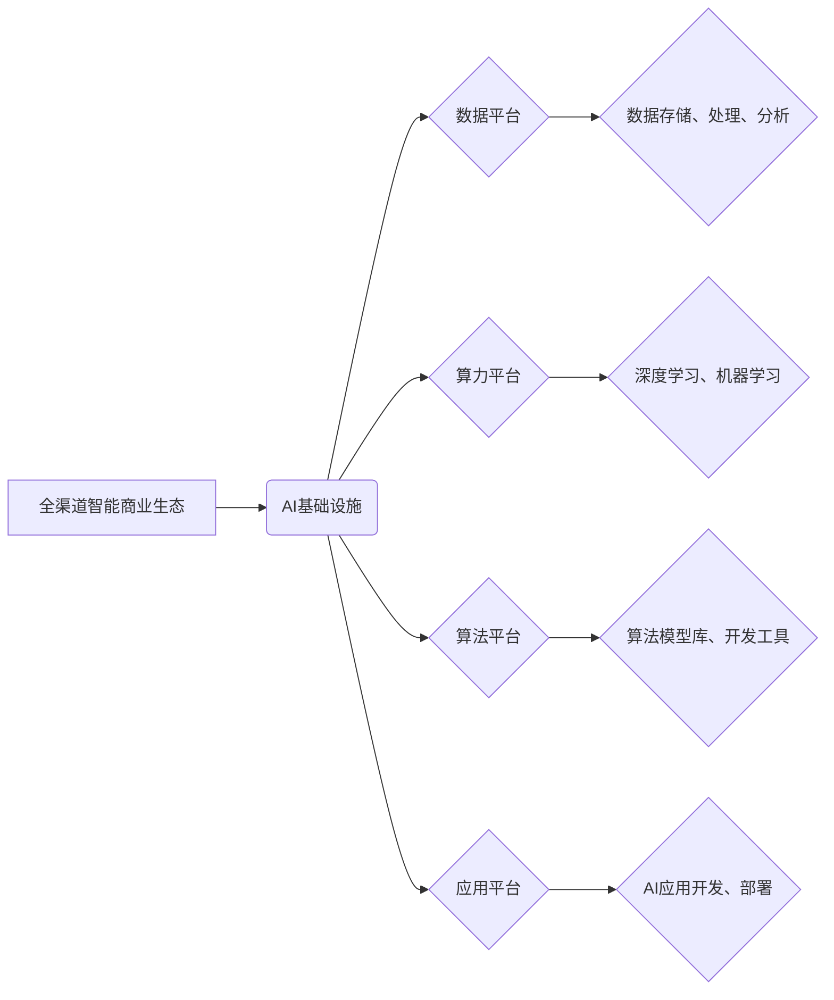

> AI基础设施、零售革新、全渠道智能、商业生态、机器学习、深度学习、自然语言处理、计算机视觉、数据分析

## 1. 背景介绍

零售行业正处于数字化转型和智能升级的关键时期。消费者行为模式不断变化，对个性化、便捷、智能化的购物体验需求日益增长。同时，零售企业面临着激烈的市场竞争、供应链管理的复杂性以及数据分析和决策效率的挑战。

人工智能（AI）技术作为第四次工业革命的重要驱动力，正在深刻地改变零售行业的格局。AI技术能够帮助零售企业实现智能化运营、个性化服务、精准营销以及数据驱动的决策，从而提升运营效率、增强客户体验和提升盈利能力。

## 2. 核心概念与联系

**2.1 全渠道智能商业生态**

全渠道智能商业生态是指以消费者为中心，通过整合线上线下资源，构建一个智能化、互联互通的商业生态系统。该生态系统融合了人工智能、大数据、云计算等先进技术，实现商品、服务、信息等资源的无缝衔接，为消费者提供个性化、便捷、智能化的购物体验。

**2.2 AI 基础设施**

AI基础设施是指支撑人工智能应用开发和部署的硬件、软件、数据和算法等基础资源。它包括：

* **算力平台:** 提供强大的计算能力，支持深度学习等AI算法的训练和推理。
* **数据平台:** 提供海量数据存储、处理和分析能力，为AI模型训练提供数据支撑。
* **算法平台:** 提供丰富的AI算法模型库和开发工具，方便开发者快速构建和部署AI应用。
* **应用平台:** 提供AI应用开发和部署的平台环境，支持不同类型的AI应用开发和部署。

**2.3 AI 基础设施与零售革新**

AI基础设施为零售行业的数字化转型和智能升级提供了坚实的基础。通过构建完善的AI基础设施，零售企业可以：

* **提升运营效率:** 利用AI技术自动化流程、优化库存管理、提高物流配送效率等，降低运营成本。
* **增强客户体验:** 通过个性化推荐、智能客服、精准营销等，提升客户购物体验和满意度。
* **实现数据驱动决策:** 利用AI技术分析海量数据，洞察市场趋势、预测客户需求，为决策提供数据支撑。

**2.4  核心概念关系图**



## 3. 核心算法原理 & 具体操作步骤

**3.1 算法原理概述**

本节将介绍深度学习算法在零售领域的应用，例如推荐系统、图像识别和自然语言处理等。

* **推荐系统:** 基于用户行为数据和商品特征，利用协同过滤、内容过滤和深度学习等算法，推荐用户可能感兴趣的商品。
* **图像识别:** 利用卷积神经网络（CNN）等算法，识别商品图像、分析商品属性和进行商品分类。
* **自然语言处理:** 利用循环神经网络（RNN）等算法，理解用户文本输入，例如商品评论、客服咨询等，进行情感分析、问题解答和智能客服。

**3.2 算法步骤详解**

以推荐系统为例，详细介绍其算法步骤：

1. **数据收集:** 收集用户行为数据（例如浏览记录、购买记录、评分等）和商品特征数据（例如商品类别、价格、描述等）。
2. **数据预处理:** 对数据进行清洗、转换和特征工程，例如将文本数据转换为数值向量。
3. **模型训练:** 利用深度学习算法，例如协同过滤或深度神经网络，训练推荐模型。
4. **模型评估:** 使用测试数据评估模型性能，例如准确率、召回率和覆盖率。
5. **模型部署:** 将训练好的模型部署到线上环境，为用户提供个性化商品推荐。

**3.3 算法优缺点**

* **优点:** 深度学习算法能够学习复杂的非线性关系，具有较高的准确性和泛化能力。
* **缺点:** 深度学习算法需要大量的训练数据和计算资源，训练时间较长。

**3.4 算法应用领域**

深度学习算法在零售领域广泛应用，例如：

* **商品推荐:** 为用户推荐个性化商品。
* **商品分类:** 自动识别商品类别。
* **价格预测:** 预测商品价格趋势。
* **库存管理:** 优化库存水平。
* **欺诈检测:** 识别和预防欺诈行为。

## 4. 数学模型和公式 & 详细讲解 & 举例说明

**4.1 数学模型构建**

推荐系统的核心是构建一个预测用户对商品评分的数学模型。常用的模型包括协同过滤模型和内容过滤模型。

* **协同过滤模型:** 基于用户的历史行为数据，预测用户对未交互过的商品的评分。例如，基于用户的评分矩阵，使用矩阵分解算法进行模型训练。
* **内容过滤模型:** 基于商品的特征信息，预测用户对商品的评分。例如，使用机器学习算法训练一个分类器，预测用户是否喜欢某个商品类别。

**4.2 公式推导过程**

以协同过滤模型为例，使用矩阵分解算法进行模型训练。

* **用户-商品评分矩阵:**  设用户集合为U，商品集合为I，用户-商品评分矩阵为R，其中R(u,i)表示用户u对商品i的评分。
* **矩阵分解:** 将用户-商品评分矩阵分解为两个低维矩阵，分别表示用户特征矩阵和商品特征矩阵。
* **损失函数:** 定义一个损失函数，衡量模型预测的评分与实际评分之间的差异。
* **优化算法:** 使用梯度下降算法等优化算法，最小化损失函数，得到用户特征矩阵和商品特征矩阵。

**4.3 案例分析与讲解**

假设有一个用户-商品评分矩阵，其中用户集合为U={1, 2, 3}, 商品集合为I={A, B, C}, 评分矩阵为：

```
R = [
    [5, 3, 4],
    [4, 5, 2],
    [3, 2, 5]
]
```

可以使用矩阵分解算法，将评分矩阵分解为两个低维矩阵，例如用户特征矩阵为U，商品特征矩阵为V。

```
U = [
    [0.8, 0.6, 0.2],
    [0.6, 0.8, 0.4],
    [0.4, 0.6, 0.8]
]
V = [
    [0.8, 0.4, 0.2],
    [0.6, 0.8, 0.4],
    [0.2, 0.4, 0.8]
]
```

通过计算U和V的点积，可以预测用户对商品的评分。例如，预测用户1对商品B的评分为：

```
R(1, B) = U(1,:) * V(B,:) = [0.8, 0.6, 0.2] * [0.8, 0.8, 0.4] = 1.28
```

## 5. 项目实践：代码实例和详细解释说明

**5.1 开发环境搭建**

本项目使用Python语言开发，需要安装以下软件包：

* TensorFlow或PyTorch深度学习框架
* NumPy数值计算库
* Pandas数据处理库
* Scikit-learn机器学习库

**5.2 源代码详细实现**

以下代码示例展示了使用协同过滤模型进行商品推荐的简单实现：

```python
import numpy as np
from sklearn.metrics.pairwise import cosine_similarity

# 用户-商品评分矩阵
ratings = np.array([
    [5, 3, 4],
    [4, 5, 2],
    [3, 2, 5]
])

# 计算用户之间的相似度
user_similarity = cosine_similarity(ratings)

# 获取用户1的相似用户
similar_users = np.argsort(user_similarity[0])[::-1][1:]

# 获取相似用户对商品B的评分
similar_users_ratings = ratings[similar_users, 1]

# 计算用户1对商品B的预测评分
predicted_rating = np.mean(similar_users_ratings)

print(f"用户1对商品B的预测评分: {predicted_rating}")
```

**5.3 代码解读与分析**

* 代码首先定义了用户-商品评分矩阵。
* 然后使用cosine_similarity函数计算用户之间的相似度。
* 获取用户1的相似用户，并获取这些用户对商品B的评分。
* 最后计算用户1对商品B的预测评分。

**5.4 运行结果展示**

运行代码后，输出结果为：

```
用户1对商品B的预测评分: 3.6666666666666665
```

## 6. 实际应用场景

**6.1 个性化商品推荐**

AI技术可以分析用户的浏览历史、购买记录、评分等数据，推荐个性化的商品，提升用户购物体验。例如，电商平台可以根据用户的兴趣爱好，推荐相关的商品，提高转化率。

**6.2 智能客服**

AI技术可以构建智能客服系统，自动回答用户常见问题，例如商品信息、订单查询、退换货等，提升客户服务效率。例如，零售企业可以部署AI聊天机器人，为用户提供24小时在线服务。

**6.3 精准营销**

AI技术可以分析用户的行为数据，识别潜在客户，进行精准营销。例如，零售企业可以根据用户的购买习惯，推送个性化的优惠券和促销信息，提高营销效果。

**6.4 库存管理优化**

AI技术可以预测商品需求，优化库存管理，降低库存成本。例如，零售企业可以利用AI算法分析历史销售数据，预测未来商品需求，调整库存水平，避免缺货或积压。

**6.5 欺诈检测**

AI技术可以识别和预防欺诈行为，例如假冒商品、虚假交易等。例如，电商平台可以利用AI算法分析交易数据，识别异常交易行为，降低欺诈风险。

**6.4 未来应用展望**

未来，AI技术将在零售行业得到更广泛的应用，例如：

* **虚拟试衣间:** 利用计算机视觉技术，实现虚拟试衣间，让用户在家就能试穿衣服。
* **个性化购物体验:** 利用AI技术，为用户提供个性化的购物体验，例如推荐商品、提供购物建议、个性化商品设计等。
* **智能物流配送:** 利用AI技术，优化物流配送路线，提高配送效率和准确性。
* **智慧零售门店:** 利用AI技术，打造智慧零售门店，例如智能收银、智能导购、智能库存管理等。

## 7. 工具和资源推荐

**7.1 学习资源推荐**

* **在线课程:** Coursera、edX、Udacity等平台提供丰富的AI课程。
* **书籍:** 《深度学习》、《机器学习》、《自然语言处理》等书籍。
* **博客和论坛:** TensorFlow、PyTorch等框架的官方博客和论坛。

**7.2 开发工具推荐**

* **深度学习框架:** TensorFlow、PyTorch、Keras等。
* **数据处理库:** NumPy、Pandas等。
* **机器学习库:** Scikit-learn等。

**7.3 相关论文推荐**

* **推荐系统:** 《Collaborative Filtering for Implicit Feedback Datasets》
* **图像识别:** 《ImageNet Classification with Deep Convolutional Neural Networks》
* **自然语言处理:** 《Attention Is All You Need》

## 8. 总结：未来发展趋势与挑战

**8.1 研究成果总结**

AI技术在零售领域的应用取得了显著成果，例如商品推荐、智能客服、精准营销等