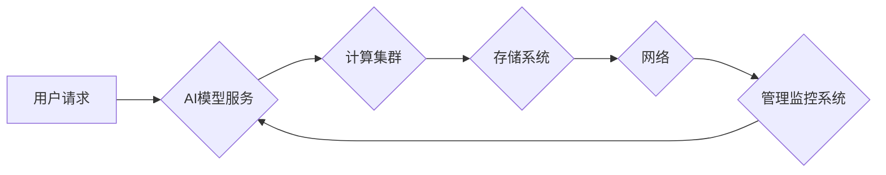

> AI大模型、数据中心、可靠性、高可用性、容错机制、灾难恢复、安全保障

## 1. 背景介绍

近年来，人工智能（AI）技术蓬勃发展，大规模语言模型（LLM）的出现更是推动了AI应用的快速普及。这些模型在自然语言处理、图像识别、代码生成等领域展现出强大的能力，为各行各业带来了革命性的变革。然而，随着AI应用的规模化部署，其对数据中心的可靠性提出了更高的要求。

传统的IT基础设施架构难以满足AI大模型的计算需求和数据处理能力。AI大模型通常需要海量数据进行训练和推理，对存储、计算资源和网络带宽提出了极高的要求。同时，AI应用场景通常要求高可用性和低延迟，任何系统故障都可能导致服务中断，带来巨大的经济损失和用户体验下降。

因此，构建可靠、高可用、安全且可扩展的AI大模型应用数据中心成为当务之急。

## 2. 核心概念与联系

**2.1  AI大模型应用数据中心**

AI大模型应用数据中心是指专门为部署和运行AI大模型而构建的专用数据中心。它通常包含以下核心组件：

* **高性能计算集群:** 用于训练和推理AI大模型的强大计算资源，通常采用GPU或TPU等加速器。
* **海量存储系统:** 用于存储海量训练数据和模型参数，需要具备高吞吐量、低延迟和高可靠性的特点。
* **高速网络:** 用于连接计算节点和存储系统，保证数据传输的快速和可靠。
* **管理和监控系统:** 用于监控数据中心的运行状态、资源利用率和模型性能，并进行故障诊断和恢复。

**2.2  可靠性、高可用性和容错机制**

* **可靠性:** 指系统在预期条件下持续正常运行的能力。
* **高可用性:** 指系统在发生故障时，能够快速恢复服务，保证业务连续性。
* **容错机制:** 指系统能够识别和处理故障，并采取措施避免或最小化故障的影响。

**2.3  灾难恢复**

灾难恢复是指在发生重大灾害事件时，能够快速恢复系统正常运行的能力。

**2.4  安全保障**

AI大模型应用数据中心需要具备完善的安全保障措施，防止数据泄露、恶意攻击和系统入侵。

**2.5  架构图**

## 3. 核心算法原理 & 具体操作步骤

### 3.1  算法原理概述

...

### 3.2  算法步骤详解 

...

### 3.3  算法优缺点

...

### 3.4  算法应用领域

...

## 4. 数学模型和公式 & 详细讲解 & 举例说明

### 4.1  数学模型构建

...

### 4.2  公式推导过程

...

### 4.3  案例分析与讲解

...

## 5. 项目实践：代码实例和详细解释说明

### 5.1  开发环境搭建

...

### 5.2  源代码详细实现

...

### 5.3  代码解读与分析

...

### 5.4  运行结果展示

...

## 6. 实际应用场景

...

### 6.4  未来应用展望

...

## 7. 工具和资源推荐

### 7.1  学习资源推荐

...

### 7.2  开发工具推荐

...

### 7.3  相关论文推荐

...

## 8. 总结：未来发展趋势与挑战

### 8.1  研究成果总结

...

### 8.2  未来发展趋势

...

### 8.3  面临的挑战

...

### 8.4  研究展望

...

## 9. 附录：常见问题与解答

...

作者：禅与计算机程序设计艺术 / Zen and the Art of Computer Programming

<end_of_turn>