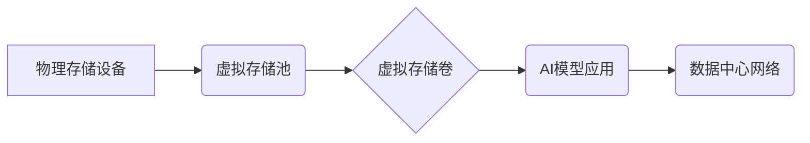

> AI大模型、数据中心、存储虚拟化、数据管理、性能优化、成本控制

## 1. 背景介绍

近年来，人工智能（AI）技术蓬勃发展，大规模人工智能模型（AI模型）的应用日益广泛，涵盖自然语言处理、计算机视觉、语音识别等多个领域。这些AI模型通常具有庞大的参数量和数据需求，对存储资源提出了极高的要求。传统的存储架构难以满足AI模型训练和推理的性能和容量需求，因此，存储虚拟化技术成为AI大模型应用数据中心的重要解决方案。

**1.1 AI模型对存储资源的需求**

AI模型的训练和推理过程都需要大量的读写操作，对存储系统的性能和容量提出了挑战：

* **海量数据存储:** AI模型的训练需要海量数据，例如图像、文本、音频等，这些数据需要存储在高效的存储系统中。
* **高性能读写:** AI模型的训练和推理过程需要频繁的读写操作，对存储系统的读写速度和吞吐量提出了高要求。
* **数据并行处理:** 许多AI模型采用并行训练的方式，需要对数据进行高效的并行访问和处理。
* **数据安全和隐私:** AI模型训练和推理过程中涉及大量敏感数据，需要保障数据的安全和隐私。

**1.2 存储虚拟化技术概述**

存储虚拟化技术通过将物理存储资源抽象成逻辑存储资源，并提供统一的管理和访问接口，从而实现存储资源的灵活配置、高效利用和安全管理。

**1.3 存储虚拟化在AI大模型应用中的优势**

存储虚拟化技术为AI大模型应用数据中心带来了诸多优势：

* **提高存储资源利用率:** 通过虚拟化技术，可以将物理存储资源灵活分配给不同的AI模型应用，提高存储资源的利用率。
* **简化存储管理:** 存储虚拟化提供统一的管理平台，可以简化存储资源的管理和维护工作。
* **增强存储弹性:** 存储虚拟化可以实现存储资源的动态伸缩，满足AI模型应用的弹性需求。
* **降低存储成本:** 通过提高存储资源利用率和简化管理工作，存储虚拟化可以降低存储成本。

## 2. 核心概念与联系

**2.1 核心概念**

* **虚拟存储池:** 虚拟存储池是存储虚拟化技术的核心概念之一，它将多个物理存储设备聚合在一起，形成一个逻辑存储池，提供统一的存储空间和管理接口。
* **虚拟存储卷:** 虚拟存储卷是虚拟存储池中的逻辑存储单元，可以根据需要创建、删除和调整大小。
* **存储虚拟化平台:** 存储虚拟化平台是管理和控制虚拟存储资源的软件系统，它提供虚拟存储池、虚拟存储卷、存储资源分配等功能。

**2.2 架构图**



**2.3 联系分析**

存储虚拟化技术将物理存储资源抽象成逻辑存储资源，为AI模型应用提供灵活、高效、安全的存储服务。虚拟存储池将多个物理存储设备聚合在一起，形成一个逻辑存储空间，可以根据需要动态分配存储资源给不同的AI模型应用。虚拟存储卷是虚拟存储池中的逻辑存储单元，可以根据需要创建、删除和调整大小，满足AI模型应用的存储需求。

## 3. 核心算法原理 & 具体操作步骤

**3.1 算法原理概述**

存储虚拟化技术的核心算法包括存储资源分配算法、数据迁移算法和存储性能优化算法等。

* **存储资源分配算法:** 用于根据AI模型应用的存储需求，动态分配虚拟存储卷和存储资源。常见的分配算法包括优先级算法、轮询算法和动态分配算法等。
* **数据迁移算法:** 用于将数据从物理存储设备迁移到虚拟存储池，以及在虚拟存储池中进行数据迁移和复制。常见的迁移算法包括块级迁移、文件级迁移和镜像迁移等。
* **存储性能优化算法:** 用于优化存储系统的性能，例如缓存策略、数据压缩和数据分片等。

**3.2 算法步骤详解**

**3.2.1 存储资源分配算法**

1. 收集AI模型应用的存储需求信息，包括存储容量、读写速度和数据访问模式等。
2. 根据存储需求信息，选择合适的存储资源分配算法。
3. 动态分配虚拟存储卷和存储资源给不同的AI模型应用。
4. 监控存储资源的使用情况，并根据需要调整存储资源分配策略。

**3.2.2 数据迁移算法**

1. 确定需要迁移的数据和目标存储位置。
2. 选择合适的迁移算法，例如块级迁移、文件级迁移或镜像迁移。
3. 执行数据迁移操作，并将数据从源存储设备迁移到目标存储位置。
4. 验证数据迁移结果，确保数据完整性和一致性。

**3.2.3 存储性能优化算法**

1. 分析存储系统的性能瓶颈，例如磁盘I/O速度、网络带宽和缓存命中率等。
2. 选择合适的性能优化算法，例如缓存策略、数据压缩和数据分片等。
3. 配置和优化存储系统参数，提高存储性能。
4. 监控存储系统性能，并根据需要调整优化策略。

**3.3 算法优缺点**

**3.3.1 存储资源分配算法**

* **优点:** 可以根据AI模型应用的存储需求，动态分配存储资源，提高存储资源利用率。
* **缺点:** 需要复杂的算法和逻辑，以及对AI模型应用存储需求的准确预测。

**3.3.2 数据迁移算法**

* **优点:** 可以将数据从物理存储设备迁移到虚拟存储池，以及在虚拟存储池中进行数据迁移和复制。
* **缺点:** 数据迁移过程可能需要较长时间，并且需要确保数据完整性和一致性。

**3.3.3 存储性能优化算法**

* **优点:** 可以优化存储系统的性能，提高读写速度和吞吐量。
* **缺点:** 需要对存储系统进行深入了解，以及对算法参数进行精细调整。

**3.4 算法应用领域**

存储虚拟化技术广泛应用于各种领域，例如云计算、大数据、人工智能等。

* **云计算:** 存储虚拟化技术可以帮助云服务提供商提高存储资源利用率，简化存储管理，并提供弹性存储服务。
* **大数据:** 存储虚拟化技术可以帮助大数据平台处理海量数据，提高数据处理效率。
* **人工智能:** 存储虚拟化技术可以为AI模型训练和推理提供高效、安全的存储服务。

## 4. 数学模型和公式 & 详细讲解 & 举例说明

**4.1 数学模型构建**

存储虚拟化系统的性能可以采用以下数学模型进行评估：

* **吞吐量:** 单位时间内处理的数据量，通常以MB/s或GB/s表示。
* **延迟:** 从请求发出到响应返回所需要的时间，通常以毫秒或微秒表示。
* **利用率:** 存储资源的使用率，例如存储池的容量利用率或存储卷的读写利用率。

**4.2 公式推导过程**

* **吞吐量计算公式:**

```latex
吞吐量 = 数据量 / 时间
```

* **延迟计算公式:**

```latex
延迟 = 响应时间 - 请求时间
```

* **利用率计算公式:**

```latex
利用率 = 已使用资源 / 总资源
```

**4.3 案例分析与讲解**

假设一个虚拟存储池的容量为100GB，其中已使用空间为50GB，则该存储池的容量利用率为50%。

**4.3.1 吞吐量分析**

如果一个AI模型应用在1秒内读取了1GB的数据，则该应用的吞吐量为1GB/s。

**4.3.2 延迟分析**

如果一个AI模型应用从存储池中读取数据需要10毫秒，则该应用的延迟为10毫秒。

**4.3.3 利用率分析**

通过计算存储池的容量利用率，可以了解存储资源的使用情况，并根据需要调整存储资源分配策略。

## 5. 项目实践：代码实例和详细解释说明

**5.1 开发环境搭建**

* 操作系统: Ubuntu 20.04 LTS
* 虚拟化软件: KVM
* 存储虚拟化平台: Ceph

**5.2 源代码详细实现**

```python
# 存储虚拟化平台API调用示例

# 导入必要的库
import ceph_client

# 连接到存储虚拟化平台
client = ceph_client.CephClient("ceph://<ceph_cluster_ip>")

# 创建虚拟存储卷
client.create_volume(
    name="ai_model_data",
    size=100,  # GB
    type="block",
)

# 绑定虚拟存储卷到AI模型应用
client.attach_volume(
    volume_name="ai_model_data",
    target_node="ai_model_server",
)

# 数据迁移操作
client.migrate_data(
    source_volume="source_volume",
    target_volume="ai_model_data",
)
```

**5.3 代码解读与分析**

* 该代码示例演示了如何使用存储虚拟化平台API创建虚拟存储卷、绑定虚拟存储卷到AI模型应用和执行数据迁移操作。
* 具体实现细节需要根据实际的存储虚拟化平台和AI模型应用环境进行调整。

**5.4 运行结果展示**

* 运行该代码后，将创建一个名为"ai_model_data"的虚拟存储卷，并将其绑定到名为"ai_model_server"的节点。
* 然后，将数据从名为"source_volume"的源存储卷迁移到"ai_model_data"的虚拟存储卷。

## 6. 实际应用场景

**6.1 AI模型训练场景**

在AI模型训练场景中，存储虚拟化技术可以为训练过程提供高效、安全的存储服务。例如，可以将训练数据存储在虚拟存储池中，并根据模型的训练需求动态分配存储资源。

**6.2 AI模型推理场景**

在AI模型推理场景中，存储虚拟化技术可以提高推理速度和效率。例如，可以将模型参数和推理数据存储在虚拟存储池中，并通过缓存策略优化数据访问速度。

**6.3 其他应用场景**

* **数据备份和恢复:** 存储虚拟化技术可以简化数据备份和恢复过程，提高数据安全性和可靠性。
* **数据归档:** 存储虚拟化技术可以将长期不使用的数据归档到低成本存储设备中，降低存储成本。

**6.4 未来应用展望**

随着AI技术的不断发展，存储虚拟化技术将在AI大模型应用中发挥越来越重要的作用。未来，存储虚拟化技术将朝着以下方向发展：

* **更智能的存储管理:** 利用人工智能技术，实现更智能的存储资源分配、数据迁移和性能优化。
* **更安全的存储服务:** 加强数据加密、访问控制和安全审计，保障数据安全和隐私。
* **更可扩展的存储架构:** 支持更灵活的存储扩展和弹性伸缩，满足AI模型应用的不断增长需求。

## 7. 工具和资源推荐

**7.1 学习资源推荐**

* **书籍:**
    * 《存储虚拟化技术》
    * 《云计算存储技术》
* **在线课程:**
    * Coursera: Cloud Computing
    * Udemy: Storage Virtualization

**7.2 开发工具推荐**

* **存储虚拟化平台:** Ceph, GlusterFS, VMware vSAN
* **编程语言:** Python, Go

**7.3 相关论文推荐**

* **论文标题:** A Survey of Storage Virtualization Technologies for Cloud Computing
* **论文作者:** [作者姓名]
* **期刊:** [期刊名称]

## 8. 总结：未来发展趋势与挑战

**8.1 研究成果总结**

存储虚拟化技术为AI大模型应用数据中心提供了高效