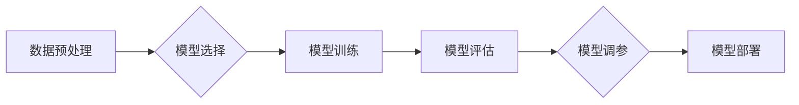

> AI,人工智能,机器学习,模型选择,算法原理,代码实例,深度学习,分类,回归

## 1. 背景介绍

人工智能（AI）正以惊人的速度发展，其核心是构建能够学习、推理和决策的智能系统。在AI领域，模型选择是至关重要的环节，它直接影响着模型的性能和应用效果。

传统的机器学习算法，如线性回归、逻辑回归、决策树等，在处理简单问题时表现良好。然而，随着数据规模和复杂度的增加，这些算法的性能逐渐下降。深度学习的出现为解决复杂问题提供了新的思路，其强大的学习能力和泛化能力使其在图像识别、自然语言处理、语音识别等领域取得了突破性进展。

然而，深度学习模型的选择并非简单粗暴，需要根据具体任务和数据特点进行综合考虑。本文将深入探讨AI模型选择的基本原理、核心算法、数学模型、代码实例以及实际应用场景，帮助读者更好地理解和掌握模型选择这一关键环节。

## 2. 核心概念与联系

**2.1 模型选择概述**

模型选择是指在多个候选模型中选择最适合特定任务的模型。模型的选择是一个优化问题，目标是找到能够在给定数据上获得最佳性能的模型。

**2.2 模型类型**

常见的AI模型类型包括：

* **监督学习模型:**  利用标记数据训练模型，预测未知数据标签。例如，分类模型（如逻辑回归、支持向量机、决策树、神经网络）和回归模型（如线性回归、支持向量回归、神经网络）。
* **无监督学习模型:**  利用未标记数据训练模型，发现数据中的潜在结构或模式。例如，聚类模型（如k-means聚类、层次聚类）和降维模型（如主成分分析、奇异值分解）。
* **强化学习模型:**  通过与环境交互学习，获得最大奖励。例如，游戏AI、机器人控制。

**2.3 模型评估指标**

模型评估指标用于衡量模型的性能。常见的评估指标包括：

* **分类模型:** 准确率、精确率、召回率、F1-score、ROC曲线、AUC。
* **回归模型:** 均方误差（MSE）、平均绝对误差（MAE）、R-squared。

**2.4 模型选择流程**

模型选择流程通常包括以下步骤：

1. **数据预处理:** 清洗、转换和特征工程。
2. **模型选择:** 根据任务和数据特点选择合适的模型类型。
3. **模型训练:** 使用训练数据训练模型。
4. **模型评估:** 使用测试数据评估模型性能。
5. **模型调参:** 调整模型参数以优化性能。
6. **模型部署:** 将训练好的模型部署到实际应用场景。

**2.5 Mermaid 流程图**



## 3. 核心算法原理 & 具体操作步骤

### 3.1  算法原理概述

模型选择算法旨在根据给定的数据和任务目标，从候选模型集合中选择最优模型。常见的模型选择算法包括：

* **交叉验证:** 将数据划分为多个子集，使用不同的子集进行训练和测试，最终选择在所有子集上表现最佳的模型。
* **留一法:** 将数据划分为n个子集，每次使用n-1个子集进行训练，剩余一个子集进行测试，重复n次，最终平均所有测试结果。
* **贝叶斯优化:** 使用贝叶斯理论和概率模型，智能地搜索模型参数空间，找到最优模型。

### 3.2  算法步骤详解

**3.2.1 交叉验证**

1. 将数据划分为k个子集，每个子集大小相等。
2. 循环k次，每次将其中一个子集作为测试集，其余k-1个子集作为训练集。
3. 在每个训练集上训练模型，并使用测试集评估模型性能。
4. 计算所有测试结果的平均值作为模型的最终性能指标。

**3.2.2 留一法**

1. 将数据划分为n个子集，每个子集包含一个数据点。
2. 循环n次，每次使用n-1个子集进行训练，剩余一个子集作为测试集。
3. 在每个训练集上训练模型，并使用测试集评估模型性能。
4. 计算所有测试结果的平均值作为模型的最终性能指标。

**3.2.3 贝叶斯优化**

1. 定义目标函数，该函数衡量模型性能。
2. 使用贝叶斯理论构建概率模型，描述模型参数空间的分布。
3. 根据概率模型，选择最有可能获得最佳性能的模型参数组合。
4. 训练模型并评估性能，更新概率模型。
5. 重复步骤3-4，直到找到最优模型参数组合。

### 3.3  算法优缺点

| 算法 | 优点 | 缺点 |
|---|---|---|
| 交叉验证 | 较全面地评估模型性能 | 计算量较大 |
| 留一法 | 充分利用所有数据 | 计算量最大 |
| 贝叶斯优化 | 能够高效地搜索参数空间 | 需要一定的数学基础 |

### 3.4  算法应用领域

模型选择算法广泛应用于各种AI领域，例如：

* **图像识别:** 选择最适合图像分类或目标检测的模型。
* **自然语言处理:** 选择最适合文本分类、情感分析或机器翻译的模型。
* **推荐系统:** 选择最适合用户个性化推荐的模型。
* **金融预测:** 选择最适合股票价格预测或信用风险评估的模型。

## 4. 数学模型和公式 & 详细讲解 & 举例说明

### 4.1  数学模型构建

模型选择问题可以抽象为一个优化问题，目标是找到最优模型参数，使得模型在给定数据上达到最佳性能。

假设我们有一个数据集D，包含n个样本，每个样本包含d个特征和一个标签y。模型参数为θ，模型预测结果为f(x;θ)。

模型选择的目标函数通常是模型性能指标，例如准确率、均方误差等。

### 4.2  公式推导过程

假设我们使用交叉验证作为模型选择算法，目标函数为模型在验证集上的准确率。

则模型选择过程可以表示为：

```
θ* = argmax_θ Accuracy(D_val, f(x;θ))
```

其中：

* θ* 是最优模型参数
* D_val 是验证集
* Accuracy(D_val, f(x;θ)) 是模型在验证集上的准确率

### 4.3  案例分析与讲解

**4.3.1 线性回归模型选择**

假设我们想要预测房屋价格，数据包含房屋面积、房间数等特征。我们可以使用线性回归模型进行预测。

模型选择过程可以如下：

1. 将数据划分为训练集和验证集。
2. 在训练集上训练多个线性回归模型，每个模型使用不同的正则化参数。
3. 使用验证集评估每个模型的均方误差。
4. 选择均方误差最小的模型作为最优模型。

**4.3.2 深度学习模型选择**

假设我们想要进行图像分类任务，可以使用卷积神经网络（CNN）进行模型构建。

模型选择过程可以如下：

1. 选择不同的CNN架构，例如AlexNet、VGGNet、ResNet等。
2. 在训练集上训练每个模型，使用不同的学习率、批处理大小等超参数。
3. 使用验证集评估每个模型的准确率。
4. 选择准确率最高的模型作为最优模型。

## 5. 项目实践：代码实例和详细解释说明

### 5.1  开发环境搭建

* Python 3.x
* TensorFlow 或 PyTorch
* Jupyter Notebook

### 5.2  源代码详细实现

```python
# 使用Scikit-learn库进行模型选择
from sklearn.datasets import load_iris
from sklearn.model_selection import train_test_split, cross_val_score
from sklearn.linear_model import LogisticRegression
from sklearn.tree import DecisionTreeClassifier
from sklearn.neighbors import KNeighborsClassifier

# 加载iris数据集
iris = load_iris()
X = iris.data
y = iris.target

# 将数据划分为训练集和测试集
X_train, X_test, y_train, y_test = train_test_split(X, y, test_size=0.2, random_state=42)

# 定义模型列表
models = [
    LogisticRegression(),
    DecisionTreeClassifier(),
    KNeighborsClassifier()
]

# 使用交叉验证评估模型性能
for model in models:
    scores = cross_val_score(model, X_train, y_train, cv=5)
    print(f"{model.__class__.__name__} 的平均准确率: {scores.mean():.4f}")
```

### 5.3  代码解读与分析

* 代码首先加载iris数据集，并将其划分为训练集和测试集。
* 然后定义了一个模型列表，包含了逻辑回归、决策树和k近邻三种模型。
* 使用循环遍历模型列表，并使用交叉验证评估每个模型的性能。
* 最后打印每个模型的平均准确率。

### 5.4  运行结果展示

运行上述代码，可以得到每个模型在交叉验证上的平均准确率。

## 6. 实际应用场景

### 6.1  图像分类

在图像分类任务中，模型选择可以帮助我们选择最适合特定图像数据集的模型，例如：

* **AlexNet:** 适用于大型图像数据集，例如ImageNet。
* **VGGNet:** 适用于中等规模图像数据集，具有较高的准确率。
* **ResNet:** 适用于非常大型图像数据集，能够训练更深的网络。

### 6.2  自然语言处理

在自然语言处理任务中，模型选择可以帮助我们选择最适合特定文本数据集的模型，例如：

* **BERT:** 适用于文本分类、情感分析和问答等任务。
* **GPT-3:** 适用于文本生成、机器翻译和代码生成等任务。
* **T5:** 适用于多种自然语言处理任务，具有良好的泛化能力。

### 6.3  推荐系统

在推荐系统中，模型选择可以帮助我们选择最适合特定用户行为数据的模型，例如：

* **协同过滤:** 基于用户之间的相似性进行推荐。
* **内容过滤:** 基于物品的特征进行推荐。
* **深度学习推荐:** 使用深度学习模型学习用户偏好，进行个性化推荐。

### 6.4  未来应用展望

随着人工智能技术的不断发展，模型选择将变得更加重要。未来，模型选择领域的研究方向包括：

* **自动化模型选择:** 使用机器学习算法自动选择最优模型。
* **多目标优化:** 同时考虑多个性能指标，选择兼顾所有指标的最佳模型。
* **动态模型选择:** 根据数据变化动态调整模型选择策略。

## 7. 工具和资源推荐

### 7.1  学习资源推荐

* **书籍:**
    * 《Hands-On Machine Learning with Scikit-Learn, Keras & TensorFlow》
    * 《Deep Learning》
* **在线课程:**
    * Coursera: Machine Learning
    * Udacity: Deep Learning Nanodegree
* **博客:**
    * Towards Data Science
    * Machine Learning Mastery

### 7.2  开发工具推荐

* **Python:** 
    * Scikit-learn
    * TensorFlow
    * PyTorch
* **Jupyter Notebook:** 用于代码编写和可视化
* **Git:** 用于代码版本控制

### 7.3  相关论文推荐

* **《ImageNet Classification with Deep Convolutional Neural Networks》**
* **《Attention Is All You Need》**
* **《BERT: Pre-training of Deep Bidirectional Transformers for Language Understanding》**

## 8. 总结：未来发展趋势与挑战

### 8