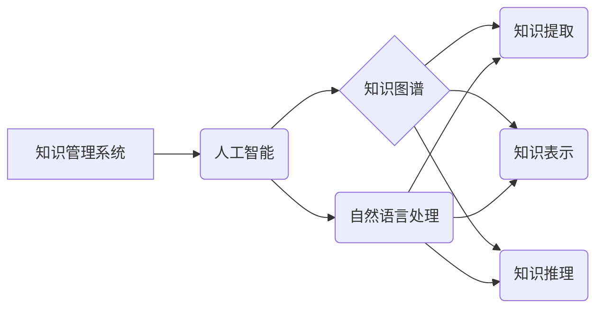

>  人工智能、知识管理系统、自然语言处理、机器学习、知识图谱、知识提取、知识表示、知识推理

## 1. 背景介绍

随着信息爆炸时代的到来，人类面临着海量数据的处理和知识获取的挑战。传统知识管理系统往往依赖于人工标注和结构化数据，难以有效地处理半结构化和非结构化数据，且知识的发现和利用效率低下。人工智能（AI）技术的快速发展为知识管理领域带来了新的机遇。

AI技术，特别是深度学习和自然语言处理（NLP）技术，能够自动从海量数据中提取知识、构建知识图谱、进行知识推理和推荐，从而提升知识管理系统的智能化水平。

## 2. 核心概念与联系

**2.1 知识管理系统 (KMS)**

知识管理系统 (KMS) 是指用于收集、存储、组织、共享和利用组织知识的系统。KMS 的目标是帮助组织成员更容易地获取和利用知识，从而提高组织的效率和竞争力。

**2.2 人工智能 (AI)**

人工智能 (AI) 是指模拟人类智能行为的计算机系统。AI技术涵盖了多个领域，包括机器学习、深度学习、自然语言处理、计算机视觉等。

**2.3 知识图谱 (KG)**

知识图谱 (KG) 是以实体和关系为节点的图结构，用于表示和组织知识。KG 可以存储和推理各种类型的知识，例如事实、概念、规则等。

**2.4 自然语言处理 (NLP)**

自然语言处理 (NLP) 是指使计算机能够理解、处理和生成人类语言的技术。NLP技术可以用于文本分析、信息提取、机器翻译等任务。

**2.5 核心概念关系图**



## 3. 核心算法原理 & 具体操作步骤

**3.1 算法原理概述**

AI在知识管理系统中的应用主要依赖于以下核心算法：

* **知识提取算法:** 用于从文本数据中提取关键信息，例如实体、关系、事件等。常见的知识提取算法包括规则匹配、机器学习和深度学习方法。
* **知识表示算法:** 用于将提取的知识表示为机器可理解的形式，例如知识图谱、逻辑形式等。
* **知识推理算法:** 用于根据已有的知识进行逻辑推理，推导出新的知识或结论。常见的知识推理算法包括规则推理、逻辑推理和基于神经网络的推理。

**3.2 算法步骤详解**

**3.2.1 知识提取**

1. **数据预处理:** 对文本数据进行清洗、分词、词性标注等预处理操作。
2. **特征提取:** 从预处理后的文本数据中提取特征，例如词语、短语、句子的语义信息等。
3. **模型训练:** 使用机器学习或深度学习算法训练知识提取模型，例如命名实体识别模型、关系抽取模型等。
4. **知识抽取:** 将训练好的模型应用于新的文本数据，进行知识抽取。

**3.2.2 知识表示**

1. **实体识别:** 从文本数据中识别出实体，例如人名、地名、机构名等。
2. **关系识别:** 从文本数据中识别出实体之间的关系，例如“工作于”、“居住在”等。
3. **知识图谱构建:** 将实体和关系表示为知识图谱，例如使用RDF或OWL等标准语言。

**3.2.3 知识推理**

1. **规则定义:** 定义一些规则，用于描述知识之间的逻辑关系。
2. **推理引擎:** 使用推理引擎根据规则和已有的知识进行推理，推导出新的知识或结论。

**3.3 算法优缺点**

* **优点:** AI算法能够自动处理海量数据，提高知识提取、表示和推理的效率。
* **缺点:** AI算法需要大量的训练数据，且在处理复杂知识和开放世界问题时仍然存在挑战。

**3.4 算法应用领域**

* **企业知识管理:** 自动提取和组织企业内部的知识，提高知识共享和利用效率。
* **医疗保健:** 从医学文献中提取知识，辅助医生诊断和治疗。
* **金融服务:** 从金融数据中提取知识，进行风险评估和投资决策。
* **教育:** 个性化学习推荐，辅助学生学习。

## 4. 数学模型和公式 & 详细讲解 & 举例说明

**4.1 数学模型构建**

知识图谱可以表示为一个三元组的集合，其中每个三元组由一个实体、一个关系和另一个实体组成。

```
(实体1, 关系, 实体2)
```

例如，一个关于人物的知识图谱可以包含以下三元组：

```
(张三, 工作于, 公司A)
(李四, 居住于, 北京)
```

**4.2 公式推导过程**

知识推理可以使用逻辑规则进行推导。例如，如果我们知道“所有员工都必须拥有身份证”，并且知道“张三是员工”，那么我们可以推导出“张三拥有身份证”。

**4.3 案例分析与讲解**

假设我们有一个知识图谱，其中包含以下三元组：

```
(张三, 工作于, 公司A)
(公司A, 位于, 北京)
```

我们可以使用知识推理规则推导出以下结论：

```
(张三, 位于, 北京)
```

## 5. 项目实践：代码实例和详细解释说明

**5.1 开发环境搭建**

* Python 3.x
* TensorFlow 或 PyTorch
* SpaCy 或 NLTK

**5.2 源代码详细实现**

```python
# 知识提取示例代码
import spacy

nlp = spacy.load("en_core_web_sm")

text = "张三是公司A的员工，他住在北京。"

doc = nlp(text)

entities = [(ent.text, ent.label_) for ent in doc.ents]
print(entities)

# 知识表示示例代码
from rdflib import Graph, Literal, URIRef

g = Graph()

g.add((URIRef("http://example.org/person/zhangsan"), "name", Literal("张三")))
g.add((URIRef("http://example.org/company/companyA"), "name", Literal("公司A")))
g.add((URIRef("http://example.org/person/zhangsan"), "worksAt", URIRef("http://example.org/company/companyA")))

print(g.serialize(format="turtle"))

# 知识推理示例代码
# 使用规则引擎进行推理
```

**5.3 代码解读与分析**

* 知识提取代码使用SpaCy库进行实体识别和关系抽取。
* 知识表示代码使用RDF库构建知识图谱。
* 知识推理代码使用规则引擎进行逻辑推理。

**5.4 运行结果展示**

* 知识提取代码输出实体和关系的列表。
* 知识表示代码输出知识图谱的Turtle格式表示。
* 知识推理代码输出推理结果。

## 6. 实际应用场景

**6.1 企业知识管理**

AI可以帮助企业自动提取和组织员工的知识，例如文档、邮件、会议记录等，并将其存储在知识库中，方便员工查找和利用。

**6.2 医疗保健**

AI可以帮助医生从医学文献中提取知识，例如疾病症状、治疗方案等，并辅助医生进行诊断和治疗。

**6.3 金融服务**

AI可以帮助金融机构从金融数据中提取知识，例如客户行为、市场趋势等，并进行风险评估和投资决策。

**6.4 未来应用展望**

随着AI技术的不断发展，AI在知识管理系统中的应用将更加广泛和深入，例如：

* **个性化知识推荐:** 根据用户的兴趣和需求，推荐相关的知识。
* **知识问答系统:** 使用AI技术构建知识问答系统，帮助用户快速获取知识。
* **知识生成:** 使用AI技术自动生成新的知识，例如总结会议记录、撰写报告等。

## 7. 工具和资源推荐

**7.1 学习资源推荐**

* **书籍:**
    * 《深度学习》
    * 《自然语言处理》
    * 《知识图谱》
* **在线课程:**
    * Coursera
    * edX
    * Udacity

**7.2 开发工具推荐**

* **Python:**
    * TensorFlow
    * PyTorch
    * SpaCy
    * NLTK
* **知识图谱工具:**
    * Neo4j
    * RDFlib
    * Apache Jena

**7.3 相关论文推荐**

* **知识提取:**
    * "A Survey on Relation Extraction"
    * "Deep Learning for Relation Extraction"
* **知识表示:**
    * "Knowledge Representation and Reasoning"
    * "Semantic Web Technologies"
* **知识推理:**
    * "A Survey of Knowledge Representation and Reasoning"
    * "Logic Programming for Knowledge Representation"

## 8. 总结：未来发展趋势与挑战

**8.1 研究成果总结**

AI在知识管理系统中的应用取得了显著的进展，例如知识提取、知识表示和知识推理的效率得到了提高。

**8.2 未来发展趋势**

* **更强大的AI模型:** 随着深度学习技术的不断发展，将会有更强大的AI模型用于知识管理系统。
* **更丰富的知识表示:** 将会开发更丰富的知识表示形式，例如多模态知识图谱、动态知识图谱等。
* **更智能的知识推理:** 将会开发更智能的知识推理算法，能够处理更复杂和开放世界的知识。

**8.3 面临的挑战**

* **数据质量:** AI算法依赖于高质量的数据，而现实世界的数据往往存在噪声、不完整等问题。
* **知识的复杂性:** 知识往往是复杂的、多层次的，难以用简单的模型表示。
* **解释性:** AI算法的决策过程往往难以解释，这可能会导致用户对AI系统的信任度降低。

**8.4 研究展望**

未来研究将重点关注以下几个方面:

* **提高AI算法对噪声数据和不完整数据的鲁棒性。**
* **开发更有效的知识表示和推理方法，能够处理更复杂的知识。**
* **提高AI算法的解释性，增强用户对AI系统的信任度。**

## 9. 附录：常见问题与解答

**9.1 如何选择合适的AI算法？**

选择合适的AI算法取决于具体的应用场景和数据特点。例如，对于文本数据，可以使用自然语言处理算法进行知识提取；对于结构化数据，可以使用机器学习算法进行知识表示和推理。

**9.2 如何评估AI算法的性能？**

可以使用准确率、召回率、F1-score等指标评估AI算法的性能。

**9.3 如何解决AI算法的解释性问题？**

可以使用可解释机器学习（XAI）技术来提高AI算法的解释性。


作者：禅与计算机程序设计艺术 / Zen and the Art of Computer Programming 
<end_of_turn>