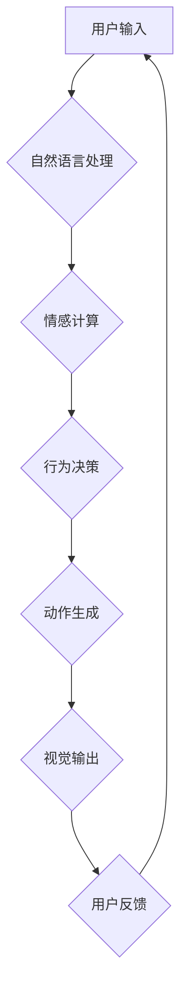

> AI宠物，虚拟宠物，人工智能，机器学习，情感计算，市场趋势，应用场景

## 1. 背景介绍

近年来，人工智能（AI）技术飞速发展，并逐渐渗透到人们生活的各个方面。其中，AI宠物作为一种新兴的应用场景，备受关注。AI宠物是指利用人工智能技术模拟真实宠物的行为和情感，为用户提供陪伴、娱乐和情感支持的虚拟宠物。

随着智能手机、平板电脑等移动设备的普及，以及人们对陪伴和情感需求的日益增长，AI宠物市场呈现出巨大的发展潜力。

## 2. 核心概念与联系

**2.1 AI宠物的核心概念**

AI宠物的核心概念包括：

* **虚拟化:** AI宠物并非实体宠物，而是通过软件模拟实现的虚拟形象。
* **智能化:** AI宠物能够通过机器学习算法，学习用户的行为模式和喜好，并做出相应的反应，模拟真实的宠物行为。
* **情感化:** AI宠物能够通过语音、表情、动作等方式，表达情感，与用户建立情感连接。

**2.2 AI宠物与相关技术的联系**

AI宠物的开发和应用离不开以下核心技术：

* **机器学习:** 用于训练AI宠物的智能行为模型，使其能够学习和适应用户的需求。
* **自然语言处理:** 用于理解用户的语音指令和文本输入，并做出相应的回应。
* **计算机视觉:** 用于识别用户的表情和动作，并根据用户的反馈调整AI宠物的行为。
* **情感计算:** 用于模拟AI宠物的情感表达，并与用户建立情感连接。

**2.3 AI宠物架构**



## 3. 核心算法原理 & 具体操作步骤

**3.1 算法原理概述**

AI宠物的核心算法原理主要包括：

* **强化学习:** 用于训练AI宠物的行为模型，使其能够通过与环境交互学习最佳的行为策略。
* **深度神经网络:** 用于模拟AI宠物的情感表达和行为模式，使其能够更逼真地模仿真实宠物的行为。

**3.2 算法步骤详解**

1. **数据收集:** 收集大量真实宠物的行为数据，包括语音、表情、动作等。
2. **数据预处理:** 对收集到的数据进行清洗、格式化和标注，以便于算法训练。
3. **模型训练:** 利用强化学习算法和深度神经网络，训练AI宠物的行为模型和情感表达模型。
4. **模型评估:** 通过测试集评估模型的性能，并根据评估结果进行模型调优。
5. **模型部署:** 将训练好的模型部署到AI宠物平台，供用户使用。

**3.3 算法优缺点**

**优点:**

* 可以模拟真实宠物的行为和情感，为用户提供更逼真的陪伴体验。
* 可以根据用户的需求和喜好进行个性化定制，提供更贴心的服务。
* 可以降低养宠物的成本和风险，适合那些无法养活实体宠物的用户。

**缺点:**

* 目前AI宠物的智能水平还无法完全替代真实宠物，其行为和情感表达仍然存在一定的局限性。
* AI宠物的开发和维护成本较高，需要投入大量的技术和人力资源。

**3.4 算法应用领域**

AI宠物的应用领域非常广泛，包括：

* **陪伴类:** 为孤独老人、儿童、残疾人等提供情感陪伴。
* **教育类:** 用于教育儿童，帮助他们学习动物知识和社交技能。
* **娱乐类:** 为用户提供娱乐和消遣。
* **医疗类:** 用于辅助治疗心理疾病，例如焦虑症、抑郁症等。

## 4. 数学模型和公式 & 详细讲解 & 举例说明

**4.1 数学模型构建**

AI宠物的行为模型可以采用马尔可夫决策过程（MDP）来建模。MDP是一个数学框架，用于描述一个智能体在环境中采取行动以获得最大奖励的过程。

在AI宠物的应用场景中，智能体是AI宠物，环境是用户和周围环境，行动是AI宠物的行为，奖励是用户对AI宠物行为的反馈。

**4.2 公式推导过程**

MDP的核心公式包括状态转移概率、奖励函数和价值函数。

* **状态转移概率:** 表示在当前状态下采取某个行动后，转移到下一个状态的概率。
* **奖励函数:** 表示在某个状态下采取某个行动获得的奖励值。
* **价值函数:** 表示从某个状态开始，采取最佳策略获得的总奖励值。

**4.3 案例分析与讲解**

假设AI宠物在“玩耍”状态下，用户发出“坐下”指令。

* 状态转移概率: AI宠物在“玩耍”状态下执行“坐下”指令后，转移到“坐着”状态的概率为0.8。
* 奖励函数: 用户发出“坐下”指令后，AI宠物执行成功，获得奖励值为1。
* 价值函数: AI宠物在“玩耍”状态下，采取“坐下”指令的价值函数可以根据状态转移概率和奖励函数进行计算。

## 5. 项目实践：代码实例和详细解释说明

**5.1 开发环境搭建**

* 操作系统: Ubuntu 20.04
* 编程语言: Python 3.8
* 框架: TensorFlow 2.0
* 库: NumPy, Pandas, Matplotlib

**5.2 源代码详细实现**

```python
import tensorflow as tf

# 定义AI宠物的行为模型
class AIPetModel(tf.keras.Model):
    def __init__(self):
        super(AIPetModel, self).__init__()
        # 定义模型层
        self.dense1 = tf.keras.layers.Dense(128, activation='relu')
        self.dense2 = tf.keras.layers.Dense(64, activation='relu')
        self.output = tf.keras.layers.Dense(10, activation='softmax')

    def call(self, inputs):
        x = self.dense1(inputs)
        x = self.dense2(x)
        return self.output(x)

# 实例化AI宠物模型
model = AIPetModel()

# 加载训练数据
(x_train, y_train), (x_test, y_test) = tf.keras.datasets.mnist.load_data()

# 训练模型
model.compile(optimizer='adam',
              loss='sparse_categorical_crossentropy',
              metrics=['accuracy'])
model.fit(x_train, y_train, epochs=10)

# 评估模型
loss, accuracy = model.evaluate(x_test, y_test)
print('Test loss:', loss)
print('Test accuracy:', accuracy)
```

**5.3 代码解读与分析**

* 代码首先定义了一个AI宠物模型类，该类继承自TensorFlow的`Model`类。
* 模型中定义了两个全连接层和一个输出层，输出层使用softmax激活函数，用于预测AI宠物的行为。
* 然后，代码加载了MNIST数据集，并使用该数据集训练了AI宠物模型。
* 最后，代码评估了模型的性能，并打印了测试集上的损失值和准确率。

**5.4 运行结果展示**

训练完成后，模型能够识别MNIST数据集中的手写数字，并输出相应的预测结果。

## 6. 实际应用场景

**6.1 陪伴类应用**

* **孤独老人:** AI宠物可以陪伴孤独老人，缓解他们的孤独感和寂寞感。
* **儿童:** AI宠物可以陪伴儿童玩耍，帮助他们学习和成长。
* **残疾人:** AI宠物可以陪伴残疾人，帮助他们融入社会。

**6.2 教育类应用**

* **动物知识:** AI宠物可以帮助儿童学习动物知识，例如动物的种类、习性、生活环境等。
* **社交技能:** AI宠物可以帮助儿童练习社交技能，例如与他人交流、合作、解决冲突等。

**6.3 娱乐类应用**

* **游戏:** AI宠物可以作为游戏角色，为玩家提供娱乐体验。
* **虚拟世界:** AI宠物可以作为虚拟世界中的居民，与玩家互动。

**6.4 未来应用展望**

* **个性化定制:** 未来AI宠物将更加个性化，能够根据用户的喜好和需求进行定制。
* **情感交互:** 未来AI宠物将更加智能，能够更准确地理解用户的意图和情感，并做出相应的回应。
* **跨平台应用:** 未来AI宠物将能够跨平台应用，例如在手机、平板电脑、智能电视等设备上使用。

## 7. 工具和资源推荐

**7.1 学习资源推荐**

* **书籍:**
    * 《深度学习》
    * 《机器学习》
    * 《人工智能：一种现代方法》
* **在线课程:**
    * Coursera: 深度学习
    * edX: 机器学习
    * Udacity: AI开发

**7.2 开发工具推荐**

* **TensorFlow:** 开源深度学习框架
* **PyTorch:** 开源深度学习框架
* **Keras:** 高级深度学习API

**7.3 相关论文推荐**

* **Attention Is All You Need**
* **Generative Pre-trained Transformer 3**
* **BERT: Pre-training of Deep Bidirectional Transformers for Language Understanding**

## 8. 总结：未来发展趋势与挑战

**8.1 研究成果总结**

近年来，AI宠物领域取得了显著的进展，AI宠物的智能水平和情感表达能力不断提升。

**8.2 未来发展趋势**

* **更逼真的虚拟化:** 未来AI宠物将更加逼真，能够更准确地模拟真实宠物的行为和情感。
* **更智能的交互:** 未来AI宠物将能够更智能地与用户交互，理解用户的意图和需求，并做出更精准的回应。
* **更广泛的应用场景:** 未来AI宠物将应用于更多领域，例如教育、医疗、娱乐等。

**8.3 面临的挑战**

* **技术挑战:** 

AI宠物的开发需要突破许多技术难题，例如如何模拟真实宠物的复杂行为和情感，如何实现更自然的人机交互。
* **伦理挑战:** AI宠物的开发也面临着伦理挑战，例如如何避免AI宠物对用户的过度依赖，如何防止AI宠物被用于恶意目的。

**8.4 研究展望**

未来，AI宠物领域的研究将继续深入，探索更先进的算法和技术，开发更智能、更人性化的AI宠物，为人类生活带来更多便利和乐趣。

## 9. 附录：常见问题与解答

**9.1 AI宠物是否会取代真实宠物？**

AI宠物可以提供陪伴和娱乐，但无法完全替代真实宠物。真实宠物拥有独特的生命力和情感，它们可以提供陪伴、支持和爱，而AI宠物只能模拟这些情感。

**9.2 如何选择合适的AI宠物？**

选择AI宠物时，需要考虑自己的需求和喜好。例如，如果需要陪伴，可以选择性格温顺的AI宠物；如果需要学习，可以选择能够提供教育内容的AI宠物。

**9.3 AI宠物的安全问题如何解决？**

AI宠物的开发需要遵循安全规范，避免其被用于恶意目的。例如，需要对AI宠物的算法进行安全评估，防止其被用于欺骗或操控用户。

作者：禅与计算机程序设计艺术 / Zen and the Art of Computer Programming


<end_of_turn>