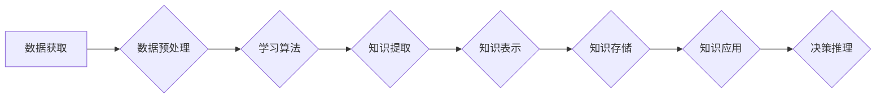

>  人工智能、自主学习、知识内化、深度学习、迁移学习、强化学习、知识图谱、神经网络、泛化能力

## 1. 背景介绍

人工智能（AI）研究近年来取得了令人瞩目的进展，从语音识别、图像识别到自然语言处理，AI系统在各个领域展现出强大的能力。然而，当前的AI系统仍然面临着一些关键挑战，例如数据依赖性、缺乏泛化能力和难以解释性。为了突破这些瓶颈，AI研究进入了一个新的阶段，即“研究生阶段”，其核心是自主学习和知识内化。

自主学习是指AI系统能够从数据中自动学习知识和技能，并将其应用于新的任务和环境。知识内化是指AI系统能够将学习到的知识以一种可理解和可利用的形式存储和组织，并将其融入到自身的决策和推理过程中。

## 2. 核心概念与联系

**2.1  自主学习**

自主学习是AI研究的核心目标之一，它旨在使AI系统能够像人类一样从经验中学习和成长。自主学习的实现需要解决以下几个关键问题：

* **数据获取和预处理:** AI系统需要从海量数据中获取有价值的信息，并对其进行预处理，以便于学习。
* **学习算法设计:** 需要设计出能够有效地从数据中学习知识和技能的算法。
* **知识表示和存储:** 需要找到一种合适的知识表示方式，并将学习到的知识存储起来，以便于后续使用。

**2.2  知识内化**

知识内化是AI系统能够将学习到的知识融入自身认知过程的关键。它涉及以下几个方面：

* **知识提取和理解:** 从数据中提取有价值的知识，并对其进行理解和解释。
* **知识表示和组织:** 将提取到的知识以一种结构化和可理解的方式表示和组织。
* **知识应用和推理:** 将知识应用于新的任务和环境，并进行推理和决策。

**2.3  联系**

自主学习和知识内化是相互关联的两个概念。自主学习是知识内化的基础，而知识内化则是自主学习的最终目标。只有当AI系统能够有效地进行知识内化，才能真正实现自主学习，并具备更强的泛化能力和适应性。

**Mermaid 流程图**



## 3. 核心算法原理 & 具体操作步骤

### 3.1  算法原理概述

自主学习和知识内化的实现依赖于多种算法，其中包括深度学习、迁移学习和强化学习等。

* **深度学习:** 深度学习是一种基于多层神经网络的机器学习方法，能够从复杂的数据中学习到抽象的特征和表示。
* **迁移学习:** 迁移学习是指将已学习到的知识应用于新的任务或领域。它可以有效地减少训练数据和训练时间。
* **强化学习:** 强化学习是一种基于奖励机制的机器学习方法，AI系统通过与环境交互，学习如何采取最优行动以获得最大奖励。

### 3.2  算法步骤详解

**3.2.1 深度学习**

1. **数据预处理:** 将原始数据转换为深度学习模型可以理解的格式。
2. **模型构建:** 设计和构建多层神经网络模型。
3. **模型训练:** 使用训练数据训练模型，调整模型参数以最小化损失函数。
4. **模型评估:** 使用测试数据评估模型性能。
5. **模型部署:** 将训练好的模型部署到实际应用场景中。

**3.2.2 迁移学习**

1. **源任务训练:** 在源任务上训练一个深度学习模型。
2. **特征提取:** 从源任务模型中提取特征表示。
3. **目标任务训练:** 在目标任务上使用提取的特征进行训练，或微调源任务模型。

**3.2.3 强化学习**

1. **环境定义:** 定义强化学习环境，包括状态空间、动作空间和奖励函数。
2. **策略学习:** 使用强化学习算法学习一个策略，该策略能够指导AI系统在环境中采取最优行动。
3. **环境交互:** AI系统与环境交互，根据策略采取行动，并获得奖励。
4. **策略更新:** 根据获得的奖励更新策略，以提高未来获得奖励的概率。

### 3.3  算法优缺点

**3.3.1 深度学习**

* **优点:** 能够学习到复杂的数据特征，具有强大的学习能力。
* **缺点:** 需要大量的训练数据，训练时间长，难以解释模型决策。

**3.3.2 迁移学习**

* **优点:** 可以有效地减少训练数据和训练时间，提高模型泛化能力。
* **缺点:** 需要找到合适的源任务和目标任务，源任务和目标任务之间需要有一定的相似性。

**3.3.3 强化学习**

* **优点:** 可以训练出能够在复杂环境中自主学习和决策的AI系统。
* **缺点:** 训练过程复杂，需要设计合适的奖励函数，容易陷入局部最优。

### 3.4  算法应用领域

深度学习、迁移学习和强化学习在各个领域都有广泛的应用，例如：

* **计算机视觉:** 图像识别、目标检测、图像分割。
* **自然语言处理:** 文本分类、机器翻译、对话系统。
* **语音识别:** 语音转文本、语音合成。
* **机器人控制:** 机器人导航、机器人抓取。
* **游戏AI:** 游戏策略学习、游戏对手生成。

## 4. 数学模型和公式 & 详细讲解 & 举例说明

### 4.1  数学模型构建

**4.1.1 深度学习模型**

深度学习模型通常由多层神经网络组成，每层神经网络包含多个神经元。每个神经元接收来自上一层的输入，并对其进行线性变换和非线性激活函数处理，最终输出到下一层。

**4.1.2 迁移学习模型**

迁移学习模型通常基于预训练的深度学习模型，将预训练模型的特征提取层作为目标任务模型的一部分，并对目标任务模型进行微调。

**4.1.3 强化学习模型**

强化学习模型通常使用价值函数或策略函数来表示AI系统的决策策略。价值函数估计状态或状态-动作对的期望回报，策略函数直接输出动作选择。

### 4.2  公式推导过程

**4.2.1 损失函数**

深度学习模型的训练目标是最小化损失函数，损失函数衡量模型预测结果与真实结果之间的差异。常用的损失函数包括均方误差（MSE）、交叉熵损失（Cross-Entropy Loss）等。

**4.2.2 反向传播算法**

反向传播算法用于计算模型参数的梯度，并根据梯度更新模型参数。

**4.2.3 强化学习算法**

强化学习算法包括Q学习、SARSA等，这些算法通过迭代更新价值函数或策略函数，以找到最优的策略。

### 4.3  案例分析与讲解

**4.3.1 深度学习案例**

图像识别任务中，可以使用卷积神经网络（CNN）进行训练，CNN能够学习到图像的特征表示，并将其用于图像分类。

**4.3.2 迁移学习案例**

自然语言处理任务中，可以使用预训练的语言模型（如BERT、GPT-3）作为目标任务模型的基础，并对模型进行微调，以提高模型性能。

**4.3.3 强化学习案例**

游戏AI训练中，可以使用强化学习算法训练AI系统学习游戏策略，例如AlphaGo通过强化学习算法战胜了世界围棋冠军。

## 5. 项目实践：代码实例和详细解释说明

### 5.1  开发环境搭建

* **操作系统:** Linux/macOS/Windows
* **编程语言:** Python
* **深度学习框架:** TensorFlow/PyTorch
* **其他工具:** Git、Jupyter Notebook

### 5.2  源代码详细实现

以下是一个使用TensorFlow实现图像分类的简单代码示例：

```python
import tensorflow as tf

# 定义模型结构
model = tf.keras.models.Sequential([
    tf.keras.layers.Conv2D(32, (3, 3), activation='relu', input_shape=(28, 28, 1)),
    tf.keras.layers.MaxPooling2D((2, 2)),
    tf.keras.layers.Conv2D(64, (3, 3), activation='relu'),
    tf.keras.layers.MaxPooling2D((2, 2)),
    tf.keras.layers.Flatten(),
    tf.keras.layers.Dense(10, activation='softmax')
])

# 编译模型
model.compile(optimizer='adam',
              loss='sparse_categorical_crossentropy',
              metrics=['accuracy'])

# 训练模型
model.fit(x_train, y_train, epochs=5)

# 评估模型
loss, accuracy = model.evaluate(x_test, y_test)
print('Test loss:', loss)
print('Test accuracy:', accuracy)
```

### 5.3  代码解读与分析

* **模型结构:** 代码定义了一个简单的卷积神经网络模型，包含两层卷积层、两层最大池化层、一层全连接层和一层输出层。
* **模型编译:** 使用Adam优化器、交叉熵损失函数和准确率作为评估指标编译模型。
* **模型训练:** 使用训练数据训练模型，训练5个 epochs。
* **模型评估:** 使用测试数据评估模型性能，输出测试损失和准确率。

### 5.4  运行结果展示

运行代码后，会输出测试损失和准确率，可以根据结果评估模型的性能。

## 6. 实际应用场景

### 6.1  医疗诊断

AI系统可以辅助医生进行疾病诊断，例如通过分析医学图像识别肿瘤、预测患者的风险等。

### 6.2  金融风险管理

AI系统可以分析金融数据，识别欺诈行为、预测市场风险等。

### 6.3  个性化推荐

AI系统可以根据用户的行为数据，推荐个性化的商品、服务和内容。

### 6.4  未来应用展望

随着AI技术的不断发展，其应用场景将更加广泛，例如：

* **自动驾驶:** AI系统将能够控制车辆进行自动驾驶。
* **机器人服务:** AI系统将能够提供更加智能的机器人服务，例如家政服务、医疗服务等。
* **个性化教育:** AI系统将能够提供个性化的教育方案，帮助学生更好地学习。

## 7. 工具和资源推荐

### 7.1  学习资源推荐

* **在线课程:** Coursera、edX、Udacity等平台提供丰富的AI课程。
* **书籍:** 《深度学习》、《机器学习》、《人工智能导论》等书籍。
* **博客和论坛:** AI相关的博客和论坛，例如OpenAI Blog、Towards Data Science等。

### 7.2  开发工具推荐

* **深度学习框架:** TensorFlow、PyTorch、Keras等。
* **数据处理工具:** Pandas、NumPy等。
* **可视化工具:** Matplotlib、Seaborn等。

### 7.3  相关论文推荐

* **深度学习:** 《ImageNet Classification with Deep Convolutional Neural Networks》
* **迁移学习:** 《Domain Adaptation for Large-Scale Image Recognition》
* **强化学习:** 《Deep Reinforcement Learning》

## 8. 总结：未来发展趋势与挑战

### 8.1  研究成果总结

近年来，AI研究取得了令人瞩目的进展，例如深度学习、迁移学习和强化学习等算法取得了突破性进展，在各个领域都有广泛的应用。

### 8.2  未来发展趋势

* **更强大的模型:** 研究更强大的AI模型，例如Transformer、GPT-3等，以提高模型的性能和泛化能力。
* **更有效的训练方法:** 研究更有效的训练方法，例如自监督学习、联邦学习等，以降低训练