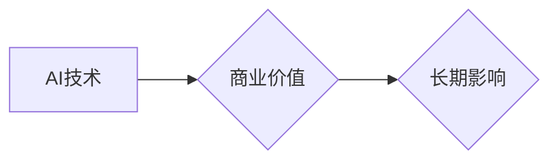

>  人工智能，商业价值，长期影响，算法，模型，应用场景，未来趋势

## 1. 背景介绍

人工智能（AI）技术近年来发展迅速，从语音识别、图像识别到自然语言处理等领域取得了突破性进展。AI技术的应用已经渗透到各个行业，为人们的生活带来了便利，也为企业带来了新的机遇。然而，随着AI技术的快速发展，也引发了一些新的问题和挑战。

**1.1 AI技术发展现状**

近年来，深度学习算法的兴起，推动了AI技术的快速发展。深度学习算法能够从海量数据中自动学习特征，从而实现更精准的预测和决策。同时，计算能力的提升和数据量的爆炸式增长也为深度学习算法的应用提供了强有力的支撑。

**1.2 AI技术面临的挑战**

尽管AI技术取得了显著的进展，但仍然面临着一些挑战：

* **数据依赖性:** AI算法的性能很大程度上依赖于数据的质量和数量。然而，高质量的数据往往难以获取，并且数据隐私和安全问题也需要得到妥善解决。
* **算法可解释性:** 许多AI算法是黑箱模型，其决策过程难以理解和解释。这使得AI技术的应用在一些关键领域，如医疗诊断和金融风险评估，面临着伦理和监管的挑战。
* **模型泛化能力:** AI模型在训练数据上表现良好，但在实际应用中可能难以泛化到新的数据和场景。

**1.3 回到商业价值**

在AI技术发展迅速的背景下，如何将AI技术转化为商业价值，并创造长期影响，成为一个重要的课题。

## 2. 核心概念与联系

**2.1 商业价值与AI技术**

商业价值是指AI技术能够为企业带来经济效益、提升效率、创造新的商业模式等方面的价值。

**2.2 AI技术与长期影响**

长期影响是指AI技术能够持续地为企业带来价值，并推动行业发展和社会进步。

**2.3 AI技术与商业价值的联系**

AI技术能够帮助企业实现以下方面的商业价值：

* **提高效率:** AI算法能够自动化完成许多重复性任务，从而提高企业运营效率。
* **优化决策:** AI模型能够分析海量数据，为企业决策提供更精准的建议。
* **创造新产品和服务:** AI技术能够帮助企业开发新的产品和服务，满足客户不断变化的需求。
* **提升客户体验:** AI技术能够提供个性化的客户服务，提升客户体验。

**2.4 AI技术与长期影响的联系**

AI技术能够推动以下方面的长期影响：

* **推动产业升级:** AI技术能够帮助企业提高生产效率、降低成本，从而推动产业升级。
* **创造新的就业机会:** AI技术的发展也将会创造新的就业机会，例如AI工程师、数据科学家等。
* **改善社会生活:** AI技术能够应用于医疗、教育、交通等领域，改善人们的生活质量。

**2.5 Mermaid 流程图**



## 3. 核心算法原理 & 具体操作步骤

**3.1 算法原理概述**

深度学习算法是一种基于人工神经网络的机器学习算法。它能够从海量数据中自动学习特征，从而实现更精准的预测和决策。深度学习算法的优势在于其强大的学习能力和泛化能力。

**3.2 算法步骤详解**

深度学习算法的训练过程通常包括以下步骤：

1. **数据预处理:** 将原始数据进行清洗、转换和格式化，使其能够被深度学习算法所接受。
2. **模型构建:** 根据具体的应用场景，选择合适的深度学习模型架构，例如卷积神经网络（CNN）、循环神经网络（RNN）等。
3. **模型训练:** 使用训练数据对深度学习模型进行训练，调整模型参数，使其能够准确地预测或分类数据。
4. **模型评估:** 使用测试数据对训练好的模型进行评估，评估模型的准确率、召回率等指标。
5. **模型部署:** 将训练好的模型部署到实际应用场景中，用于预测或分类新的数据。

**3.3 算法优缺点**

**优点:**

* 学习能力强，能够从海量数据中自动学习特征。
* 泛化能力强，能够应用于不同的数据和场景。
* 性能优异，能够实现更精准的预测和决策。

**缺点:**

* 数据依赖性强，需要大量的训练数据。
* 计算资源消耗大，训练时间长。
* 算法可解释性差，难以理解模型的决策过程。

**3.4 算法应用领域**

深度学习算法已广泛应用于以下领域：

* **图像识别:** 人脸识别、物体检测、图像分类等。
* **自然语言处理:** 语音识别、机器翻译、文本摘要等。
* **推荐系统:** 商品推荐、内容推荐等。
* **医疗诊断:** 疾病诊断、影像分析等。
* **金融风险评估:** 欺诈检测、信用评分等。

## 4. 数学模型和公式 & 详细讲解 & 举例说明

**4.1 数学模型构建**

深度学习算法的核心是神经网络模型。神经网络模型由多个层组成，每一层包含多个神经元。神经元之间通过连接权重进行信息传递。

**4.2 公式推导过程**

深度学习算法的训练过程是通过优化模型参数来实现的。常用的优化算法包括梯度下降法、动量法、Adam算法等。这些算法通过计算模型参数的梯度，并根据梯度进行参数更新，从而逐渐逼近模型最优解。

**4.3 案例分析与讲解**

以卷积神经网络（CNN）为例，其核心思想是通过卷积操作提取图像特征。卷积操作可以看作是将一个滤波器滑动在图像上，并计算滤波器与图像像素之间的乘积和。通过多个卷积层和池化层，CNN能够学习到图像的层次化特征，从而实现图像识别等任务。

## 5. 项目实践：代码实例和详细解释说明

**5.1 开发环境搭建**

深度学习算法的开发通常需要使用Python语言和相关的深度学习框架，例如TensorFlow、PyTorch等。

**5.2 源代码详细实现**

以下是一个简单的CNN模型的代码实现示例：

```python
import tensorflow as tf

# 定义模型结构
model = tf.keras.models.Sequential([
    tf.keras.layers.Conv2D(32, (3, 3), activation='relu', input_shape=(28, 28, 1)),
    tf.keras.layers.MaxPooling2D((2, 2)),
    tf.keras.layers.Conv2D(64, (3, 3), activation='relu'),
    tf.keras.layers.MaxPooling2D((2, 2)),
    tf.keras.layers.Flatten(),
    tf.keras.layers.Dense(10, activation='softmax')
])

# 编译模型
model.compile(optimizer='adam',
              loss='sparse_categorical_crossentropy',
              metrics=['accuracy'])

# 训练模型
model.fit(x_train, y_train, epochs=5)

# 评估模型
loss, accuracy = model.evaluate(x_test, y_test)
print('Test loss:', loss)
print('Test accuracy:', accuracy)
```

**5.3 代码解读与分析**

这段代码定义了一个简单的CNN模型，并使用MNIST数据集进行训练。模型结构包括两个卷积层、两个池化层、一个全连接层和一个输出层。

**5.4 运行结果展示**

训练完成后，模型能够达到一定的准确率，并能够识别MNIST数据集中的手写数字。

## 6. 实际应用场景

**6.1 医疗诊断**

AI技术可以帮助医生进行疾病诊断，例如通过分析医学影像数据识别肿瘤、肺炎等疾病。

**6.2 金融风险评估**

AI技术可以帮助金融机构评估客户的信用风险、识别欺诈交易等。

**6.3 自动驾驶**

AI技术是自动驾驶汽车的核心技术之一，可以帮助汽车感知周围环境、做出决策、控制车辆行驶。

**6.4 未来应用展望**

AI技术将在未来更加广泛地应用于各个领域，例如教育、娱乐、制造业等。

## 7. 工具和资源推荐

**7.1 学习资源推荐**

* **在线课程:** Coursera、edX、Udacity等平台提供丰富的AI课程。
* **书籍:** 《深度学习》、《机器学习实战》等书籍是学习AI技术的经典教材。
* **开源项目:** TensorFlow、PyTorch等开源项目提供了丰富的代码示例和学习资源。

**7.2 开发工具推荐**

* **Python:** Python是深度学习开发的主要编程语言。
* **TensorFlow:** TensorFlow是一个开源的深度学习框架。
* **PyTorch:** PyTorch是一个开源的深度学习框架。

**7.3 相关论文推荐**

* **《ImageNet Classification with Deep Convolutional Neural Networks》**
* **《Attention Is All You Need》**
* **《BERT: Pre-training of Deep Bidirectional Transformers for Language Understanding》**

## 8. 总结：未来发展趋势与挑战

**8.1 研究成果总结**

近年来，AI技术取得了显著的进展，在图像识别、自然语言处理等领域取得了突破性成果。

**8.2 未来发展趋势**

* **模型规模化:** 模型规模将继续扩大，从而提升模型性能。
* **算法创新:** 新的AI算法将不断涌现，例如强化学习、联邦学习等。
* **边缘计算:** AI模型将部署到边缘设备，实现更低延迟和更高效率的计算。

**8.3 面临的挑战**

* **数据安全和隐私:** 如何保护AI训练数据安全和隐私是一个重要的挑战。
* **算法可解释性:** 如何提高AI算法的可解释性，使其决策过程更加透明，是一个重要的研究方向。
* **伦理问题:** AI技术的应用可能会带来一些伦理问题，例如算法偏见、就业替代等，需要得到妥善解决。

**8.4 研究展望**

未来，AI技术将继续发展，并对社会产生更深远的影响。我们需要加强对AI技术的研究和应用，并积极应对AI技术带来的挑战，确保AI技术能够造福人类。

## 9. 附录：常见问题与解答

**9.1 如何选择合适的深度学习框架？**

选择深度学习框架需要根据具体的应用场景和个人喜好进行选择。TensorFlow和PyTorch是目前最流行的深度学习框架，各有优缺点。

**9.2 如何处理不平衡数据集？**

不平衡数据集是指类别分布不均匀的数据集。处理不平衡数据集的方法包括数据采样、模型调整等。

**9.3 如何评估深度学习模型的性能？**

常用的深度学习模型性能评估指标包括准确率、召回率、F1-score等。

作者：禅与计算机程序设计艺术 / Zen and the Art of Computer Programming


<end_of_turn>